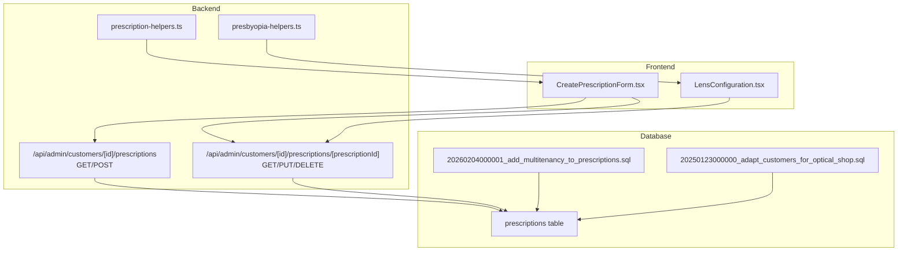
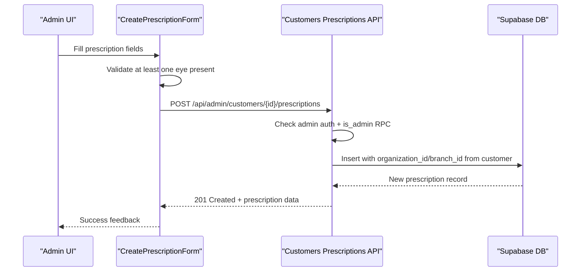
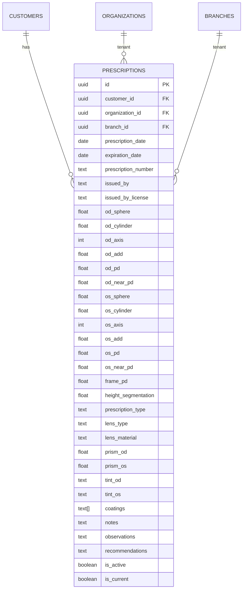
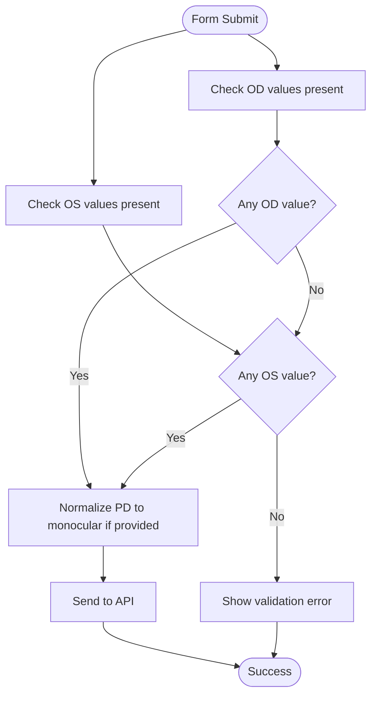
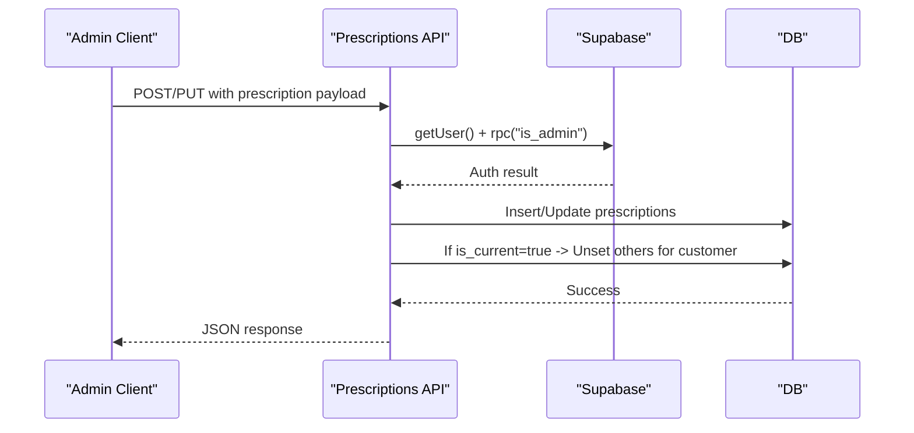
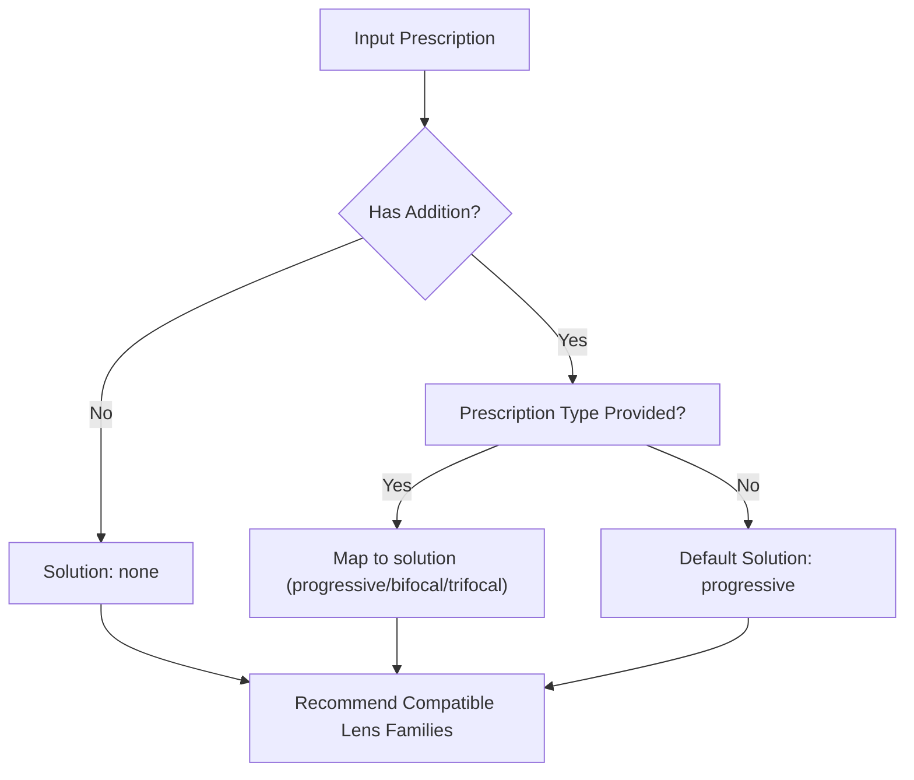
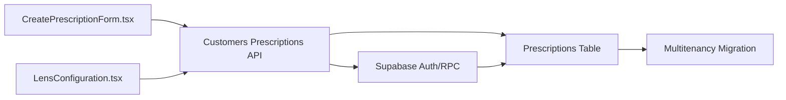

# Prescription Integration

<cite>
**Referenced Files in This Document**
- [prescription-helpers.ts](file://src/lib/prescription-helpers.ts)
- [presbyopia-helpers.ts](file://src/lib/presbyopia-helpers.ts)
- [CreatePrescriptionForm.tsx](file://src/components/admin/CreatePrescriptionForm.tsx)
- [LensConfiguration.tsx](file://src/components/admin/CreateWorkOrderForm/LensConfiguration.tsx)
- [customers.prescriptions.route.ts](file://src/app/api/admin/customers/[id]/prescriptions/route.ts)
- [prescriptions.prescriptionId.route.ts](file://src/app/api/admin/customers/[id]/prescriptions/[prescriptionId]/route.ts)
- [debug-prescriptions.js](file://debug-prescriptions.js)
- [20260204000001_add_multitenancy_to_prescriptions.sql](file://supabase/migrations/20260204000001_add_multitenancy_to_prescriptions.sql)
- [20250123000000_adapt_customers_for_optical_shop.sql](file://supabase/migrations/20250123000000_adapt_customers_for_optical_shop.sql)
</cite>

## Table of Contents

1. [Introduction](#introduction)
2. [Project Structure](#project-structure)
3. [Core Components](#core-components)
4. [Architecture Overview](#architecture-overview)
5. [Detailed Component Analysis](#detailed-component-analysis)
6. [Dependency Analysis](#dependency-analysis)
7. [Performance Considerations](#performance-considerations)
8. [Troubleshooting Guide](#troubleshooting-guide)
9. [Conclusion](#conclusion)

## Introduction

This document describes the prescription integration system in Opttius, focusing on how patient prescriptions are captured, validated, stored, and integrated into quote and work order creation. It covers the prescription data model (spherical, cylindrical, axis, addition, pupillary distance, and related parameters), validation rules, compatibility checks with lens families, automated lens parameter calculations, and integration with customer profiles and optical recommendations. It also documents the contact lens system, expiration handling, and multitenancy alignment with organization and branch contexts.

## Project Structure

The prescription integration spans frontend forms, backend APIs, shared helpers, and database schema/migrations:

- Frontend:
  - CreatePrescriptionForm captures and validates prescription inputs
  - LensConfiguration integrates lens selection and pricing for work order creation
- Backend:
  - API routes for CRUD operations on prescriptions per customer
  - Helpers for translation and presbyopia logic
- Database:
  - prescriptions table with comprehensive optical parameters
  - Migrations adding multitenancy and indexes
  - Comments documenting field semantics

**Diagram sources**

- [CreatePrescriptionForm.tsx](file://src/components/admin/CreatePrescriptionForm.tsx#L1-L770)
- [LensConfiguration.tsx](file://src/components/admin/CreateWorkOrderForm/LensConfiguration.tsx#L1-L260)
- [customers.prescriptions.route.ts](file://src/app/api/admin/customers/[id]/prescriptions/route.ts#L1-L167)
- [prescriptions.prescriptionId.route.ts](file://src/app/api/admin/customers/[id]/prescriptions/[prescriptionId]/route.ts#L1-L231)
- [prescription-helpers.ts](file://src/lib/prescription-helpers.ts#L1-L38)
- [presbyopia-helpers.ts](file://src/lib/presbyopia-helpers.ts#L1-L169)
- [20260204000001_add_multitenancy_to_prescriptions.sql](file://supabase/migrations/20260204000001_add_multitenancy_to_prescriptions.sql#L1-L59)
- [20250123000000_adapt_customers_for_optical_shop.sql](file://supabase/migrations/20250123000000_adapt_customers_for_optical_shop.sql#L153-L454)

**Section sources**

- [CreatePrescriptionForm.tsx](file://src/components/admin/CreatePrescriptionForm.tsx#L1-L770)
- [LensConfiguration.tsx](file://src/components/admin/CreateWorkOrderForm/LensConfiguration.tsx#L1-L260)
- [customers.prescriptions.route.ts](file://src/app/api/admin/customers/[id]/prescriptions/route.ts#L1-L167)
- [prescriptions.prescriptionId.route.ts](file://src/app/api/admin/customers/[id]/prescriptions/[prescriptionId]/route.ts#L1-L231)
- [prescription-helpers.ts](file://src/lib/prescription-helpers.ts#L1-L38)
- [presbyopia-helpers.ts](file://src/lib/presbyopia-helpers.ts#L1-L169)
- [20260204000001_add_multitenancy_to_prescriptions.sql](file://supabase/migrations/20260204000001_add_multitenancy_to_prescriptions.sql#L1-L59)
- [20250123000000_adapt_customers_for_optical_shop.sql](file://supabase/migrations/20250123000000_adapt_customers_for_optical_shop.sql#L153-L454)

## Core Components

- Prescription capture and validation:
  - CreatePrescriptionForm enforces at least one eye having values and normalizes PD inputs to monocular values.
- Backend API:
  - GET/POST/PUT/DELETE endpoints for prescriptions under a customer, with admin authorization and tenant-aware inserts/updates.
- Helpers:
  - Translation of prescription types for display.
  - Presbyopia logic for addition detection, near/far sphere computation, and lens family compatibility.
- Lens configuration:
  - LensConfiguration supports lens type/material/index and treatment selection with cost aggregation.

**Section sources**

- [CreatePrescriptionForm.tsx](file://src/components/admin/CreatePrescriptionForm.tsx#L146-L230)
- [customers.prescriptions.route.ts](file://src/app/api/admin/customers/[id]/prescriptions/route.ts#L58-L167)
- [prescriptions.prescriptionId.route.ts](file://src/app/api/admin/customers/[id]/prescriptions/[prescriptionId]/route.ts#L68-L172)
- [prescription-helpers.ts](file://src/lib/prescription-helpers.ts#L15-L37)
- [presbyopia-helpers.ts](file://src/lib/presbyopia-helpers.ts#L22-L168)
- [LensConfiguration.tsx](file://src/components/admin/CreateWorkOrderForm/LensConfiguration.tsx#L75-L132)

## Architecture Overview

The system follows a layered architecture:

- UI layer captures prescriptions and lens preferences.
- API layer validates requests, enforces admin permissions, and manages tenant scoping via organization_id and branch_id.
- Database layer stores prescriptions with rich optical metadata and enforces row-level security policies.

**Diagram sources**

- [CreatePrescriptionForm.tsx](file://src/components/admin/CreatePrescriptionForm.tsx#L143-L230)
- [customers.prescriptions.route.ts](file://src/app/api/admin/customers/[id]/prescriptions/route.ts#L58-L167)
- [20260204000001_add_multitenancy_to_prescriptions.sql](file://supabase/migrations/20260204000001_add_multitenancy_to_prescriptions.sql#L16-L23)

## Detailed Component Analysis

### Prescription Data Model

The prescriptions table includes:

- Subject identifiers: customer_id, organization_id, branch_id
- Issuance metadata: prescription_date, expiration_date, prescription_number, issued_by, issued_by_license
- Right/left eye parameters: od_sphere, od_cylinder, od_axis, od_add, od_pd, od_near_pd
- Left eye parameters: os_sphere, os_cylinder, os_axis, os_add, os_pd, os_near_pd
- Frame-related: frame_pd, height_segmentation
- Prescription classification: prescription_type, lens_type, lens_material
- Optical enhancements: prism_od/prism_os, tint_od/tint_os, coatings[]
- Notes and status: notes, observations, recommendations, is_active, is_current

**Diagram sources**

- [20250123000000_adapt_customers_for_optical_shop.sql](file://supabase/migrations/20250123000000_adapt_customers_for_optical_shop.sql#L153-L454)
- [20260204000001_add_multitenancy_to_prescriptions.sql](file://supabase/migrations/20260204000001_add_multitenancy_to_prescriptions.sql#L4-L14)

**Section sources**

- [20250123000000_adapt_customers_for_optical_shop.sql](file://supabase/migrations/20250123000000_adapt_customers_for_optical_shop.sql#L153-L454)
- [20260204000001_add_multitenancy_to_prescriptions.sql](file://supabase/migrations/20260204000001_add_multitenancy_to_prescriptions.sql#L16-L23)

### Prescription Capture and Validation

- Validation ensures at least one eye has data (sphere/cylinder/addition).
- PD inputs are normalized to monocular values by dividing binocular PDs.
- Current flag handling:
  - On creation/update, if marking as current, previous current prescriptions for the same customer are unset.

**Diagram sources**

- [CreatePrescriptionForm.tsx](file://src/components/admin/CreatePrescriptionForm.tsx#L146-L230)

**Section sources**

- [CreatePrescriptionForm.tsx](file://src/components/admin/CreatePrescriptionForm.tsx#L146-L230)

### Backend API: Prescriptions

- Authentication and authorization:
  - Requires authenticated user and admin role via RPC.
- Tenant scoping:
  - On insert, organization_id and branch_id are populated from the customer record.
- Current prescription logic:
  - Setting is_current automatically unsets other current prescriptions for the same customer.

**Diagram sources**

- [customers.prescriptions.route.ts](file://src/app/api/admin/customers/[id]/prescriptions/route.ts#L67-L97)
- [prescriptions.prescriptionId.route.ts](file://src/app/api/admin/customers/[id]/prescriptions/[prescriptionId]/route.ts#L98-L105)

**Section sources**

- [customers.prescriptions.route.ts](file://src/app/api/admin/customers/[id]/prescriptions/route.ts#L67-L97)
- [prescriptions.prescriptionId.route.ts](file://src/app/api/admin/customers/[id]/prescriptions/[prescriptionId]/route.ts#L98-L105)
- [20260204000001_add_multitenancy_to_prescriptions.sql](file://supabase/migrations/20260204000001_add_multitenancy_to_prescriptions.sql#L16-L23)

### Prescription Types and Translation

- Prescription types supported include single vision, bifocal, trifocal, progressive, reading, computer, and sports.
- Translation helper provides localized labels for display.

**Section sources**

- [CreatePrescriptionForm.tsx](file://src/components/admin/CreatePrescriptionForm.tsx#L99-L107)
- [prescription-helpers.ts](file://src/lib/prescription-helpers.ts#L5-L37)

### Presbyopia and Lens Family Compatibility

- Addition detection and averaging:
  - hasAddition, getMaxAddition, getAverageAddition compute addition characteristics.
- Near/far sphere calculation:
  - getNearSphere derives near sphere from far sphere and addition.
- Default solution and compatibility:
  - getDefaultPresbyopiaSolution selects a solution based on prescription_type or defaults to progressive.
  - isLensFamilyCompatible validates lens family types against the computed solution.
  - getRecommendedLensTypes lists compatible lens families.

**Diagram sources**

- [presbyopia-helpers.ts](file://src/lib/presbyopia-helpers.ts#L25-L116)

**Section sources**

- [presbyopia-helpers.ts](file://src/lib/presbyopia-helpers.ts#L25-L168)

### Lens Parameter Calculation and Pricing

- LensConfiguration supports:
  - Lens type selection aligned with presbyopia solutions.
  - Material selection affecting cost.
  - Index specification.
  - Treatment toggles with cost accumulation.
  - Tint customization when selected.
- Pricing logic aggregates base costs and treatment surcharges; material multipliers and index adjustments are intended to be handled by parent components.

**Section sources**

- [LensConfiguration.tsx](file://src/components/admin/CreateWorkOrderForm/LensConfiguration.tsx#L75-L132)
- [presbyopia-helpers.ts](file://src/lib/presbyopia-helpers.ts#L99-L116)

### Contact Lens System

- The system includes dedicated contact lens families and matrices, with calculation endpoints and administrative pages.
- While this document focuses on spectacle prescriptions, the contact lens components integrate similarly with multitenancy and pricing logic.

**Section sources**

- [20260131000005_create_contact_lenses_system.sql](file://supabase/migrations/20260131000005_create_contact_lenses_system.sql)
- [contact-lens-families page](file://src/app/admin/contact-lens-families/page.tsx)
- [contact-lens-matrices page](file://src/app/admin/contact-lens-matrices/page.tsx)

### Prescription Expiration Handling

- The prescriptions table includes expiration_date, enabling downstream systems to enforce validity windows during quote/work order creation.

**Section sources**

- [20250123000000_adapt_customers_for_optical_shop.sql](file://supabase/migrations/20250123000000_adapt_customers_for_optical_shop.sql#L153-L454)

### Medical History Tracking and Regulatory Compliance

- The schema includes issuance metadata (issued_by, issued_by_license) and structured notes/observations/recommendations to support audit trails and regulatory documentation.
- Row-level security policies restrict access to organization-scoped records.

**Section sources**

- [20260204000001_add_multitenancy_to_prescriptions.sql](file://supabase/migrations/20260204000001_add_multitenancy_to_prescriptions.sql#L36-L54)

## Dependency Analysis

- Frontend depends on:
  - CreatePrescriptionForm for input capture and validation
  - LensConfiguration for lens selection and pricing
- Backend depends on:
  - Supabase auth/RPC for admin verification
  - Service role client for tenant-aware writes
- Database depends on:
  - Migrations for schema, indexes, and RLS policies

**Diagram sources**

- [CreatePrescriptionForm.tsx](file://src/components/admin/CreatePrescriptionForm.tsx#L1-L770)
- [LensConfiguration.tsx](file://src/components/admin/CreateWorkOrderForm/LensConfiguration.tsx#L1-L260)
- [customers.prescriptions.route.ts](file://src/app/api/admin/customers/[id]/prescriptions/route.ts#L1-L167)
- [20260204000001_add_multitenancy_to_prescriptions.sql](file://supabase/migrations/20260204000001_add_multitenancy_to_prescriptions.sql#L1-L59)

**Section sources**

- [customers.prescriptions.route.ts](file://src/app/api/admin/customers/[id]/prescriptions/route.ts#L1-L167)
- [20260204000001_add_multitenancy_to_prescriptions.sql](file://supabase/migrations/20260204000001_add_multitenancy_to_prescriptions.sql#L1-L59)

## Performance Considerations

- Indexes on prescriptions:
  - customer_id, prescription_date, is_current, is_active improve query performance for listing and filtering.
- RLS policies:
  - Enforce tenant isolation; ensure queries leverage organization-scoped filters.
- API batch operations:
  - Prefer bulk reads/writes when listing multiple prescriptions to minimize round-trips.

**Section sources**

- [20250123000000_adapt_customers_for_optical_shop.sql](file://supabase/migrations/20250123000000_adapt_customers_for_optical_shop.sql#L199-L204)

## Troubleshooting Guide

- Unauthorized access:
  - Ensure admin authentication and is_admin RPC pass; otherwise API returns 401/403.
- Missing or invalid fields:
  - At least one eye must have values; otherwise the form prevents submission.
- Current prescription conflicts:
  - Setting is_current automatically clears other current prescriptions for the same customer.
- Schema inspection:
  - Use the provided debug script to verify column presence and types.

**Section sources**

- [customers.prescriptions.route.ts](file://src/app/api/admin/customers/[id]/prescriptions/route.ts#L15-L32)
- [CreatePrescriptionForm.tsx](file://src/components/admin/CreatePrescriptionForm.tsx#L146-L153)
- [prescriptions.prescriptionId.route.ts](file://src/app/api/admin/customers/[id]/prescriptions/[prescriptionId]/route.ts#L98-L105)
- [debug-prescriptions.js](file://debug-prescriptions.js#L10-L19)

## Conclusion

Opttius implements a robust prescription integration system that captures comprehensive optical data, validates inputs, scopes records by organization/branch, and supports downstream quote and work order creation. The system leverages helper libraries for presbyopia logic and lens family compatibility, while backend APIs enforce admin authorization and tenant-aware persistence. The schema and migrations provide strong foundations for auditability, compliance, and performance.
