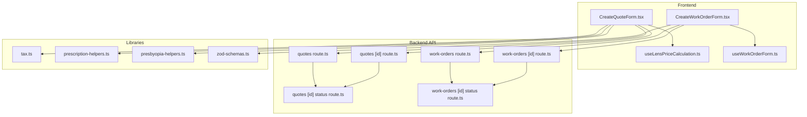
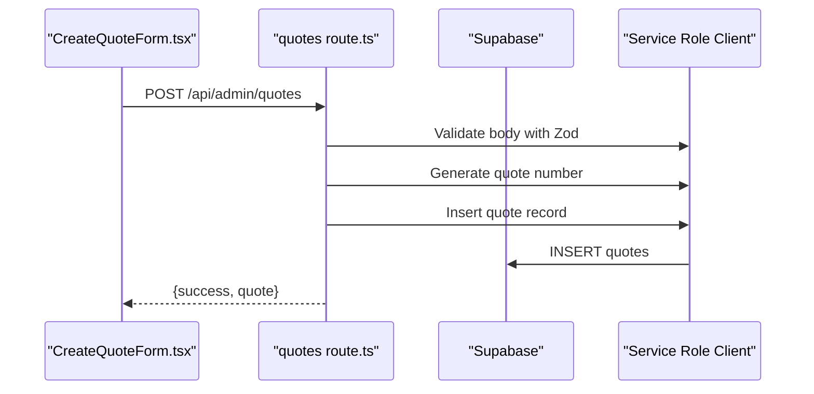
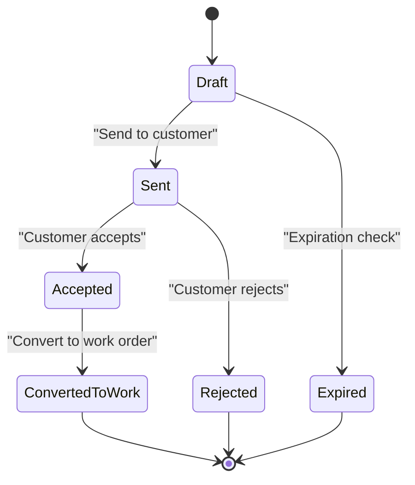
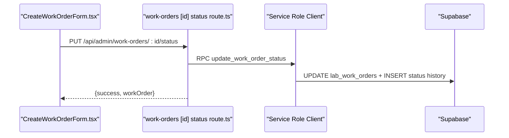
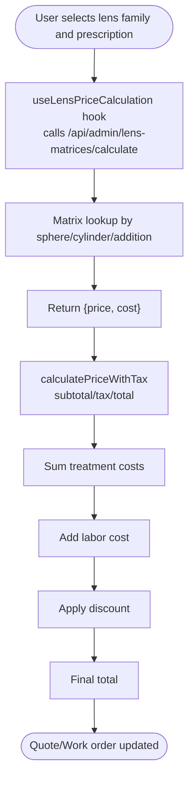
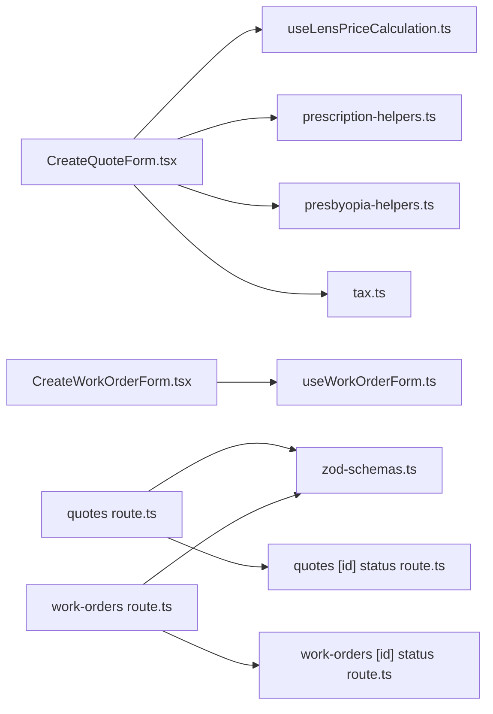

# Quote & Work Order System

<cite>
**Referenced Files in This Document**
- [CreateQuoteForm.tsx](file://src/components/admin/CreateQuoteForm.tsx)
- [CreateWorkOrderForm.tsx](file://src/components/admin/CreateWorkOrderForm.tsx)
- [quotes route.ts](file://src/app/api/admin/quotes/route.ts)
- [work-orders route.ts](file://src/app/api/admin/work-orders/route.ts)
- [quotes [id] route.ts](file://src/app/api/admin/quotes/[id]/route.ts)
- [work-orders [id] route.ts](file://src/app/api/admin/work-orders/[id]/route.ts)
- [quotes [id] status route.ts](file://src/app/api/admin/quotes/[id]/status/route.ts)
- [work-orders [id] status route.ts](file://src/app/api/admin/work-orders/[id]/status/route.ts)
- [tax.ts](file://src/lib/utils/tax.ts)
- [prescription-helpers.ts](file://src/lib/prescription-helpers.ts)
- [presbyopia-helpers.ts](file://src/lib/presbyopia-helpers.ts)
- [useLensPriceCalculation.ts](file://src/hooks/useLensPriceCalculation.ts)
- [useWorkOrderForm.ts](file://src/components/admin/CreateWorkOrderForm/hooks/useWorkOrderForm.ts)
- [zod-schemas.ts](file://src/lib/api/validation/zod-schemas.ts)
</cite>

## Table of Contents

1. [Introduction](#introduction)
2. [Project Structure](#project-structure)
3. [Core Components](#core-components)
4. [Architecture Overview](#architecture-overview)
5. [Detailed Component Analysis](#detailed-component-analysis)
6. [Dependency Analysis](#dependency-analysis)
7. [Performance Considerations](#performance-considerations)
8. [Troubleshooting Guide](#troubleshooting-guide)
9. [Conclusion](#conclusion)

## Introduction

This document describes the quote and work order system in Opttius, focusing on the complete optical production workflow. It explains the quote lifecycle from creation through acceptance, conversion to work orders, and laboratory processing. It documents detailed work order states, integration between quotes, prescriptions, customer preferences, and pricing calculations, and provides implementation examples for quote generation, work order assignment, status tracking, and timeline visualization. It also covers supplier and laboratory partner relationships, customer communications, workflow automation, approval processes, and quality assurance checkpoints for complex optical orders.

## Project Structure

The quote and work order system spans React components for user interfaces, Next.js API routes for backend operations, and shared libraries for business logic and validation.

**Diagram sources**

- [CreateQuoteForm.tsx](file://src/components/admin/CreateQuoteForm.tsx#L1-L800)
- [CreateWorkOrderForm.tsx](file://src/components/admin/CreateWorkOrderForm.tsx#L1-L378)
- [useLensPriceCalculation.ts](file://src/hooks/useLensPriceCalculation.ts#L1-L75)
- [useWorkOrderForm.ts](file://src/components/admin/CreateWorkOrderForm/hooks/useWorkOrderForm.ts#L1-L190)
- [quotes route.ts](file://src/app/api/admin/quotes/route.ts#L1-L552)
- [work-orders route.ts](file://src/app/api/admin/work-orders/route.ts#L1-L438)
- [quotes [id] route.ts](file://src/app/api/admin/quotes/[id]/route.ts#L1-L617)
- [work-orders [id] route.ts](file://src/app/api/admin/work-orders/[id]/route.ts#L1-L423)
- [quotes [id] status route.ts](file://src/app/api/admin/quotes/[id]/status/route.ts#L1-L150)
- [work-orders [id] status route.ts](file://src/app/api/admin/work-orders/[id]/status/route.ts#L1-L238)
- [tax.ts](file://src/lib/utils/tax.ts#L1-L95)
- [prescription-helpers.ts](file://src/lib/prescription-helpers.ts#L1-L38)
- [presbyopia-helpers.ts](file://src/lib/presbyopia-helpers.ts#L1-L169)
- [zod-schemas.ts](file://src/lib/api/validation/zod-schemas.ts#L1-L800)

**Section sources**

- [CreateQuoteForm.tsx](file://src/components/admin/CreateQuoteForm.tsx#L1-L800)
- [CreateWorkOrderForm.tsx](file://src/components/admin/CreateWorkOrderForm.tsx#L1-L378)
- [quotes route.ts](file://src/app/api/admin/quotes/route.ts#L1-L552)
- [work-orders route.ts](file://src/app/api/admin/work-orders/route.ts#L1-L438)

## Core Components

- Quote creation and management: UI form with automatic pricing, tax calculation, and presbyopia-aware lens selection; backend API for CRUD and status transitions.
- Work order creation and lifecycle: UI form for converting quotes to work orders, assigning staff, tracking status, and communicating with laboratories.
- Pricing engine: Lens price calculation via matrix lookup, tax handling, and treatment cost computation.
- Prescription integration: Translation of lens types, presbyopia detection, and recommendation of compatible lens families.
- Validation and safety: Zod schemas for request validation, branch-scoped access controls, and protection against invalid deletions.

**Section sources**

- [CreateQuoteForm.tsx](file://src/components/admin/CreateQuoteForm.tsx#L1-L800)
- [CreateWorkOrderForm.tsx](file://src/components/admin/CreateWorkOrderForm.tsx#L1-L378)
- [tax.ts](file://src/lib/utils/tax.ts#L1-L95)
- [prescription-helpers.ts](file://src/lib/prescription-helpers.ts#L1-L38)
- [presbyopia-helpers.ts](file://src/lib/presbyopia-helpers.ts#L1-L169)
- [useLensPriceCalculation.ts](file://src/hooks/useLensPriceCalculation.ts#L1-L75)
- [zod-schemas.ts](file://src/lib/api/validation/zod-schemas.ts#L1-L800)

## Architecture Overview

The system follows a layered architecture:

- Presentation layer: React components for quote and work order creation/editing.
- API layer: Next.js routes handling authentication, authorization, validation, and persistence.
- Business logic: Shared utilities for tax, prescriptions, and lens pricing.
- Persistence: Supabase-backed tables for quotes, work orders, and related entities.

**Diagram sources**

- [CreateQuoteForm.tsx](file://src/components/admin/CreateQuoteForm.tsx#L1-L800)
- [quotes route.ts](file://src/app/api/admin/quotes/route.ts#L275-L551)
- [zod-schemas.ts](file://src/lib/api/validation/zod-schemas.ts#L1-L800)

**Section sources**

- [quotes route.ts](file://src/app/api/admin/quotes/route.ts#L1-L552)
- [work-orders route.ts](file://src/app/api/admin/work-orders/route.ts#L1-L438)

## Detailed Component Analysis

### Quote Lifecycle Management

The quote lifecycle includes creation, editing, sending, acceptance, rejection, expiration, and conversion to a work order. The system prevents status changes on quotes already converted to work orders and supports expiration checks.

**Diagram sources**

- [quotes [id] status route.ts](file://src/app/api/admin/quotes/[id]/status/route.ts#L96-L100)
- [quotes [id] route.ts](file://src/app/api/admin/quotes/[id]/route.ts#L84-L94)

Implementation highlights:

- Status validation prevents changing status of converted quotes.
- Expiration logic runs before fetches and updates.
- Email notifications triggered on status changes.

**Section sources**

- [quotes [id] status route.ts](file://src/app/api/admin/quotes/[id]/status/route.ts#L1-L150)
- [quotes [id] route.ts](file://src/app/api/admin/quotes/[id]/route.ts#L61-L62)
- [quotes route.ts](file://src/app/api/admin/quotes/route.ts#L115-L117)

### Work Order States and Laboratory Processing

Work orders track progression through ordered, sent to lab, processing, completion, quality control, and delivery phases. Status updates are handled via a stored procedure and can include notes and lab-specific fields.

**Diagram sources**

- [work-orders [id] status route.ts](file://src/app/api/admin/work-orders/[id]/status/route.ts#L79-L89)
- [work-orders [id] route.ts](file://src/app/api/admin/work-orders/[id]/route.ts#L1-L423)

Key capabilities:

- Additional fields for lab info, quality notes, and internal notes.
- Notifications for status changes and completion.
- Conditional email on "ready for pickup".

**Section sources**

- [work-orders [id] status route.ts](file://src/app/api/admin/work-orders/[id]/status/route.ts#L1-L238)
- [work-orders [id] route.ts](file://src/app/api/admin/work-orders/[id]/route.ts#L1-L423)

### Pricing Engine and Lens Selection

The system integrates lens pricing via matrix lookup, supports tax-inclusive/exclusive pricing, and computes totals with treatments and labor costs.

**Diagram sources**

- [useLensPriceCalculation.ts](file://src/hooks/useLensPriceCalculation.ts#L22-L67)
- [tax.ts](file://src/lib/utils/tax.ts#L13-L38)
- [CreateQuoteForm.tsx](file://src/components/admin/CreateQuoteForm.tsx#L337-L406)

Integration points:

- Lens family selection influences material index and default treatments.
- Two-lens configurations (presbyopia) compute far/near lens costs separately.
- Contact lens pricing computed from dedicated matrix API.

**Section sources**

- [CreateQuoteForm.tsx](file://src/components/admin/CreateQuoteForm.tsx#L337-L475)
- [tax.ts](file://src/lib/utils/tax.ts#L1-L95)
- [presbyopia-helpers.ts](file://src/lib/presbyopia-helpers.ts#L1-L169)

### Prescription and Customer Preferences

Prescription helpers translate lens types and detect presbyopia to recommend compatible lens families and solutions. Customer preferences influence frame selection and pricing behavior.

- Translation of lens types for display and selection.
- Detection of addition and calculation of near/far spheres.
- Recommendations for lens family types based on solution type.

**Section sources**

- [prescription-helpers.ts](file://src/lib/prescription-helpers.ts#L1-L38)
- [presbyopia-helpers.ts](file://src/lib/presbyopia-helpers.ts#L1-L169)
- [CreateQuoteForm.tsx](file://src/components/admin/CreateQuoteForm.tsx#L477-L501)

### Implementation Examples

#### Example: Quote Generation

Steps:

1. Select customer and prescription.
2. Choose frame and lens family.
3. Automatic lens price calculation via matrix.
4. Tax calculation and treatment costs.
5. Submit quote with status "sent" or "draft".

Reference paths:

- [CreateQuoteForm.tsx](file://src/components/admin/CreateQuoteForm.tsx#L1-L800)
- [quotes route.ts](file://src/app/api/admin/quotes/route.ts#L275-L551)

#### Example: Work Order Assignment and Status Tracking

Steps:

1. Load quote data into work order form.
2. Assign staff and lab info.
3. Update status via status API.
4. Track status history and notifications.

Reference paths:

- [useWorkOrderForm.ts](file://src/components/admin/CreateWorkOrderForm/hooks/useWorkOrderForm.ts#L89-L164)
- [work-orders [id] status route.ts](file://src/app/api/admin/work-orders/[id]/status/route.ts#L79-L89)

#### Example: Timeline Visualization

Approach:

- Use status history entries to render a timeline of state transitions.
- Display timestamps, responsible users, and notes for each status.

Reference paths:

- [work-orders [id] route.ts](file://src/app/api/admin/work-orders/[id]/route.ts#L80-L85)

#### Example: Managing Complex Orders (Multiple Lenses, Frames, Treatments)

- Two separate lenses for presbyopia: compute far/near lens costs independently.
- Contact lenses: use dedicated matrix API and quantity-based pricing.
- Treatments: enable/disable and compute costs from settings.

Reference paths:

- [CreateQuoteForm.tsx](file://src/components/admin/CreateQuoteForm.tsx#L563-L625)
- [CreateQuoteForm.tsx](file://src/components/admin/CreateQuoteForm.tsx#L408-L475)

## Dependency Analysis

The system exhibits clear separation of concerns:

- UI components depend on shared hooks and helpers.
- API routes depend on validation schemas and branch middleware.
- Business logic is encapsulated in utilities for tax, prescriptions, and lens pricing.

**Diagram sources**

- [CreateQuoteForm.tsx](file://src/components/admin/CreateQuoteForm.tsx#L1-L800)
- [CreateWorkOrderForm.tsx](file://src/components/admin/CreateWorkOrderForm.tsx#L1-L378)
- [useLensPriceCalculation.ts](file://src/hooks/useLensPriceCalculation.ts#L1-L75)
- [useWorkOrderForm.ts](file://src/components/admin/CreateWorkOrderForm/hooks/useWorkOrderForm.ts#L1-L190)
- [prescription-helpers.ts](file://src/lib/prescription-helpers.ts#L1-L38)
- [presbyopia-helpers.ts](file://src/lib/presbyopia-helpers.ts#L1-L169)
- [tax.ts](file://src/lib/utils/tax.ts#L1-L95)
- [quotes route.ts](file://src/app/api/admin/quotes/route.ts#L1-L552)
- [work-orders route.ts](file://src/app/api/admin/work-orders/route.ts#L1-L438)
- [quotes [id] status route.ts](file://src/app/api/admin/quotes/[id]/status/route.ts#L1-L150)
- [work-orders [id] status route.ts](file://src/app/api/admin/work-orders/[id]/status/route.ts#L1-L238)
- [zod-schemas.ts](file://src/lib/api/validation/zod-schemas.ts#L1-L800)

**Section sources**

- [quotes route.ts](file://src/app/api/admin/quotes/route.ts#L1-L552)
- [work-orders route.ts](file://src/app/api/admin/work-orders/route.ts#L1-L438)

## Performance Considerations

- Batch relation loading: API routes fetch related entities (customers, prescriptions, products) in separate queries to avoid N+1 issues.
- Expiration checks: Background expiration logic runs before queries to keep data consistent.
- Debounced calculations: Frontend uses timeouts to avoid recalculating prices on rapid input changes.
- Tax computations: Centralized utilities minimize duplication and ensure consistent rounding.

[No sources needed since this section provides general guidance]

## Troubleshooting Guide

Common issues and resolutions:

- Unauthorized access: Ensure admin authentication and branch access validation pass.
- Converted quotes cannot be deleted: Prevents data inconsistency when work orders exist.
- Work order deletion restrictions: Prevents deletion of delivered or paid work orders unless explicitly allowed.
- Matrix pricing errors: Hook suppresses noisy errors for missing matrices; user can manually enter price.

**Section sources**

- [quotes [id] route.ts](file://src/app/api/admin/quotes/[id]/route.ts#L577-L589)
- [work-orders [id] route.ts](file://src/app/api/admin/work-orders/[id]/route.ts#L357-L379)
- [useLensPriceCalculation.ts](file://src/hooks/useLensPriceCalculation.ts#L53-L61)

## Conclusion

Opttius provides a robust, modular quote and work order system tailored for optical production workflows. It integrates customer and prescription data, automates pricing and tax calculations, and supports complex scenarios like presbyopia and contact lenses. The system’s API layer enforces validation and access control, while the UI components streamline quote creation, conversion to work orders, and status tracking with notifications and email triggers.
