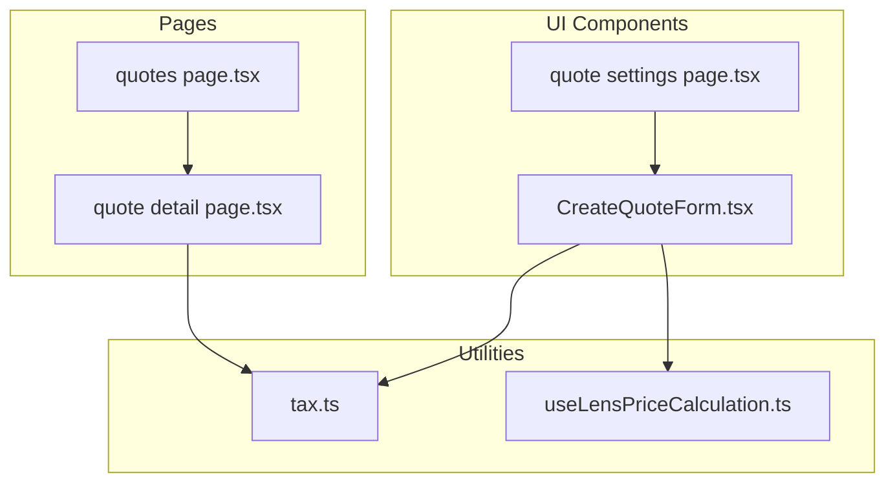
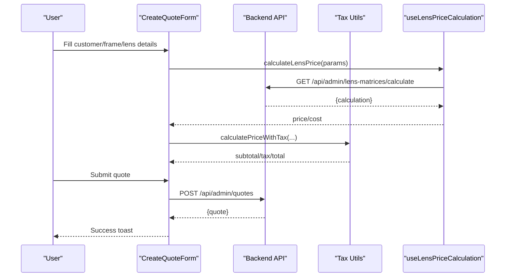
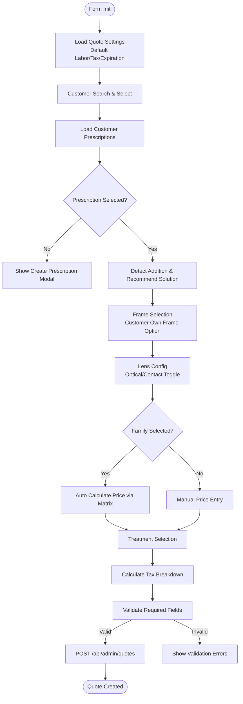
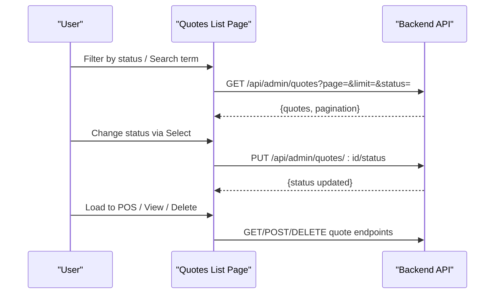
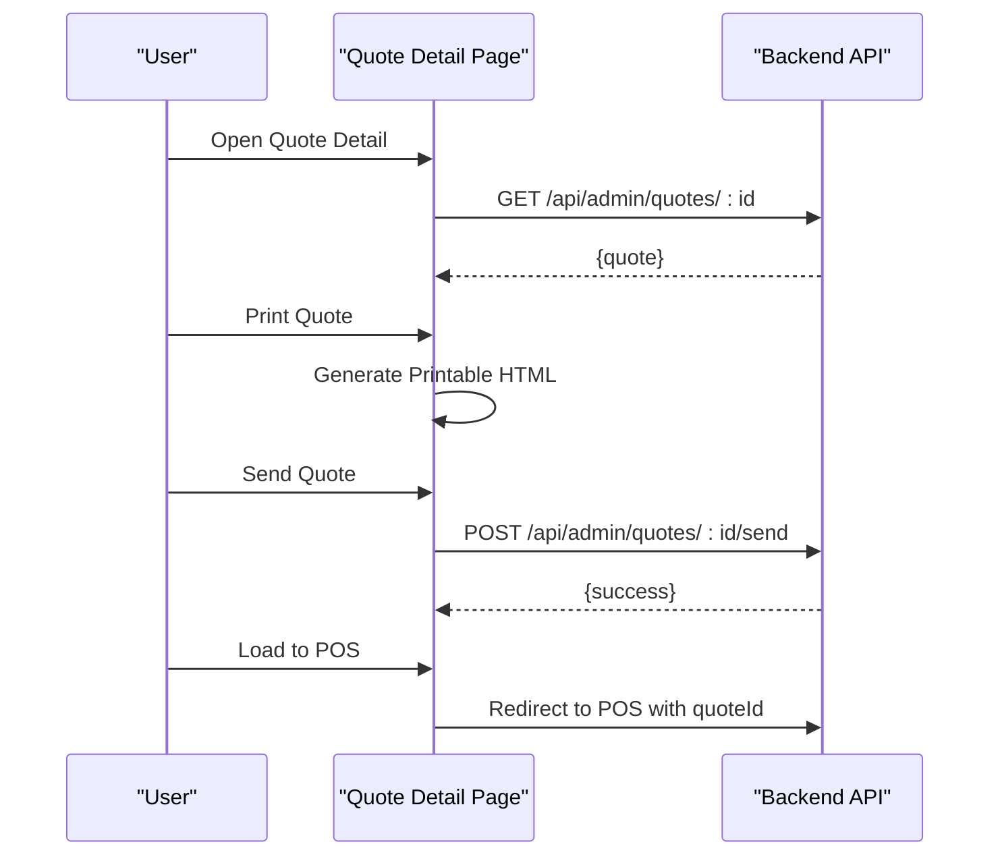
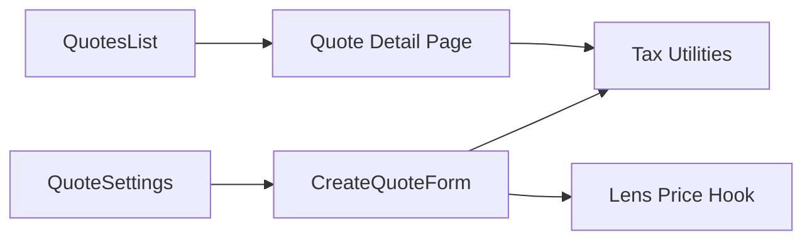

# Quote Management

<cite>
**Referenced Files in This Document**
- [CreateQuoteForm.tsx](file://src/components/admin/CreateQuoteForm.tsx)
- [quotes page.tsx](file://src/app/admin/quotes/page.tsx)
- [quote detail page.tsx](file://src/app/admin/quotes/[id]/page.tsx)
- [quote settings page.tsx](file://src/app/admin/quotes/settings/page.tsx)
- [tax.ts](file://src/lib/utils/tax.ts)
- [useLensPriceCalculation.ts](file://src/hooks/useLensPriceCalculation.ts)
</cite>

## Table of Contents

1. [Introduction](#introduction)
2. [Project Structure](#project-structure)
3. [Core Components](#core-components)
4. [Architecture Overview](#architecture-overview)
5. [Detailed Component Analysis](#detailed-component-analysis)
6. [Dependency Analysis](#dependency-analysis)
7. [Performance Considerations](#performance-considerations)
8. [Troubleshooting Guide](#troubleshooting-guide)
9. [Conclusion](#conclusion)

## Introduction

This document describes the quote management system in Opttius, covering the complete lifecycle from creation to conversion. It explains how quotes are generated, configured, priced, and tracked through various states, along with the user interfaces for creating, viewing, and managing quotes. It also documents the integration points with customer records, prescriptions, frame selection, lens configuration (including presbyopia solutions), pricing calculations, and POS loading.

## Project Structure

The quote management system spans several key areas:

- UI components for quote creation and management
- Next.js pages for listing, viewing, and configuring quotes
- Utility functions for tax calculations and lens pricing
- Settings page for quote defaults and policies

**Diagram sources**

- [CreateQuoteForm.tsx](file://src/components/admin/CreateQuoteForm.tsx#L1-L3033)
- [quotes page.tsx](file://src/app/admin/quotes/page.tsx#L1-L655)
- [quote detail page.tsx](file://src/app/admin/quotes/[id]/page.tsx#L1-L1703)
- [quote settings page.tsx](file://src/app/admin/quotes/settings/page.tsx#L1-L830)
- [tax.ts](file://src/lib/utils/tax.ts#L1-L95)
- [useLensPriceCalculation.ts](file://src/hooks/useLensPriceCalculation.ts#L1-L75)

**Section sources**

- [CreateQuoteForm.tsx](file://src/components/admin/CreateQuoteForm.tsx#L1-L3033)
- [quotes page.tsx](file://src/app/admin/quotes/page.tsx#L1-L655)
- [quote detail page.tsx](file://src/app/admin/quotes/[id]/page.tsx#L1-L1703)
- [quote settings page.tsx](file://src/app/admin/quotes/settings/page.tsx#L1-L830)
- [tax.ts](file://src/lib/utils/tax.ts#L1-L95)
- [useLensPriceCalculation.ts](file://src/hooks/useLensPriceCalculation.ts#L1-L75)

## Core Components

- CreateQuoteForm: Full-featured form for quote creation, including customer lookup, frame selection, lens configuration (optical and contact), presbyopia solutions, treatment options, and pricing calculations.
- Quotes List Page: Displays quotes with filtering, searching, pagination, and batch-like status updates via inline selects.
- Quote Detail Page: Shows quote details, allows sending quotes via email, printing, loading into POS, and converting to work orders.
- Quote Settings Page: Centralizes default values and policies for quotes (labor cost, tax, expiration days, treatment prices, terms).
- Tax Utilities: Provides robust tax calculation helpers for inclusive/exclusive pricing scenarios.
- Lens Price Hook: Encapsulates lens matrix-based pricing queries and caching behavior.

**Section sources**

- [CreateQuoteForm.tsx](file://src/components/admin/CreateQuoteForm.tsx#L1-L3033)
- [quotes page.tsx](file://src/app/admin/quotes/page.tsx#L1-L655)
- [quote detail page.tsx](file://src/app/admin/quotes/[id]/page.tsx#L1-L1703)
- [quote settings page.tsx](file://src/app/admin/quotes/settings/page.tsx#L1-L830)
- [tax.ts](file://src/lib/utils/tax.ts#L1-L95)
- [useLensPriceCalculation.ts](file://src/hooks/useLensPriceCalculation.ts#L1-L75)

## Architecture Overview

The quote lifecycle is driven by client-side components communicating with backend APIs. The CreateQuoteForm orchestrates data collection and submission, while the list/detail pages provide viewing and status management. Settings influence defaults and policies applied during creation and pricing.

**Diagram sources**

- [CreateQuoteForm.tsx](file://src/components/admin/CreateQuoteForm.tsx#L1225-L1489)
- [useLensPriceCalculation.ts](file://src/hooks/useLensPriceCalculation.ts#L22-L67)
- [tax.ts](file://src/lib/utils/tax.ts#L13-L38)

## Detailed Component Analysis

### CreateQuoteForm Component

The CreateQuoteForm is the central UI for quote creation. It manages:

- Customer lookup and selection
- Prescription selection and summary
- Frame selection (including customer-owned frames)
- Two separate lens configuration for presbyopia
- Lens family selection and contact lens configuration
- Treatment options and tint customization
- Pricing breakdown with tax calculations
- Submission to create a draft quote

Key behaviors:

- Customer search with debounced requests
- Prescription-based lens recommendation detection
- Presbyopia solution selector with automatic lens type updates
- Lens family selection with inherited material/type and automatic price calculation
- Contact lens family selection with quantity and price calculation
- Tax-aware pricing computation across frame, lens, treatments, and labor
- Validation ensuring required selections before submission

**Diagram sources**

- [CreateQuoteForm.tsx](file://src/components/admin/CreateQuoteForm.tsx#L829-L1489)
- [useLensPriceCalculation.ts](file://src/hooks/useLensPriceCalculation.ts#L22-L67)
- [tax.ts](file://src/lib/utils/tax.ts#L13-L38)

**Section sources**

- [CreateQuoteForm.tsx](file://src/components/admin/CreateQuoteForm.tsx#L1-L3033)
- [useLensPriceCalculation.ts](file://src/hooks/useLensPriceCalculation.ts#L1-L75)
- [tax.ts](file://src/lib/utils/tax.ts#L1-L95)

### Quotes Listing Interface

The quotes listing page provides:

- Filtering by status (draft, sent, accepted, rejected, expired, converted_to_work)
- Searching by quote number, customer name/email, or frame name
- Pagination with configurable page size
- Inline status updates via dropdown selectors
- Batch-like actions (delete, load to POS, view details)
- Global/super admin branch scoping

**Diagram sources**

- [quotes page.tsx](file://src/app/admin/quotes/page.tsx#L119-L446)

**Section sources**

- [quotes page.tsx](file://src/app/admin/quotes/page.tsx#L1-L655)

### Quote Detail and Communication

The quote detail page supports:

- Viewing customer and prescription details
- Printing a formatted quote
- Sending quotes via email with customer or custom email
- Loading quotes into POS for immediate order creation
- Converting accepted quotes to work orders

**Diagram sources**

- [quote detail page.tsx](file://src/app/admin/quotes/[id]/page.tsx#L134-L466)

**Section sources**

- [quote detail page.tsx](file://src/app/admin/quotes/[id]/page.tsx#L1-L1703)

### Quote Settings and Policies

The quote settings page controls:

- Default labor cost, tax percentage, expiration days
- Tax inclusion flags for lens, treatments, and labor costs
- Treatment prices and visibility
- Volume discounts tiers
- Default terms and conditions and notes template

These settings are fetched and saved per branch or globally (super admin), and automatically propagate to new quotes.

**Section sources**

- [quote settings page.tsx](file://src/app/admin/quotes/settings/page.tsx#L1-L830)

### Tax Calculation Utilities

The tax utilities provide:

- Price extraction when tax is included
- Tax addition when tax is exclusive
- Aggregated calculations for multiple items

These utilities are used extensively in the pricing breakdown within the form and detail pages.

**Section sources**

- [tax.ts](file://src/lib/utils/tax.ts#L1-L95)

### Lens Price Calculation Hook

The hook encapsulates lens matrix-based pricing:

- Builds query parameters from lens family, sphere, cylinder, addition, and sourcing type
- Calls the lens matrix endpoint
- Returns calculation result or handles errors gracefully

**Section sources**

- [useLensPriceCalculation.ts](file://src/hooks/useLensPriceCalculation.ts#L1-L75)

## Dependency Analysis

The quote management system exhibits clear separation of concerns:

- UI components depend on utilities for tax and lens pricing
- Pages depend on components and API endpoints
- Settings influence UI defaults and validation
- Branch context is propagated via headers for multi-branch support

**Diagram sources**

- [CreateQuoteForm.tsx](file://src/components/admin/CreateQuoteForm.tsx#L1-L3033)
- [quotes page.tsx](file://src/app/admin/quotes/page.tsx#L1-L655)
- [quote detail page.tsx](file://src/app/admin/quotes/[id]/page.tsx#L1-L1703)
- [quote settings page.tsx](file://src/app/admin/quotes/settings/page.tsx#L1-L830)
- [tax.ts](file://src/lib/utils/tax.ts#L1-L95)
- [useLensPriceCalculation.ts](file://src/hooks/useLensPriceCalculation.ts#L1-L75)

**Section sources**

- [CreateQuoteForm.tsx](file://src/components/admin/CreateQuoteForm.tsx#L1-L3033)
- [quotes page.tsx](file://src/app/admin/quotes/page.tsx#L1-L655)
- [quote detail page.tsx](file://src/app/admin/quotes/[id]/page.tsx#L1-L1703)
- [quote settings page.tsx](file://src/app/admin/quotes/settings/page.tsx#L1-L830)
- [tax.ts](file://src/lib/utils/tax.ts#L1-L95)
- [useLensPriceCalculation.ts](file://src/hooks/useLensPriceCalculation.ts#L1-L75)

## Performance Considerations

- Debounced customer and frame searches reduce unnecessary API calls.
- Lazy loading of the CreateQuoteForm reduces initial bundle size.
- Pricing calculations are computed client-side with useEffect dependencies to minimize re-computation.
- Tax calculations leverage precise rounding to avoid floating-point discrepancies.
- Settings are cached and updated via events/localStorage to avoid redundant fetches.

## Troubleshooting Guide

Common issues and resolutions:

- Lens matrix not found: The system falls back to manual price entry; verify lens family selection or enable manual mode.
- Tax calculation anomalies: Ensure tax inclusion flags are set correctly in settings; verify item prices include/exclude tax consistently.
- Missing customer or prescription: Validate that the customer exists and has at least one prescription; use the create prescription modal if needed.
- Status update failures: Confirm network connectivity and permissions; verify the quote is not already converted to a work order.
- POS loading problems: Ensure the quote is in a suitable state (not accepted or converted) and that the POS module is configured.

**Section sources**

- [CreateQuoteForm.tsx](file://src/components/admin/CreateQuoteForm.tsx#L1225-L1489)
- [quotes page.tsx](file://src/app/admin/quotes/page.tsx#L391-L446)
- [quote detail page.tsx](file://src/app/admin/quotes/[id]/page.tsx#L181-L194)

## Conclusion

The Opttius quote management system provides a comprehensive, user-friendly workflow for creating, reviewing, and converting quotes into work orders. Its modular design, robust pricing engine, and flexible configuration options support efficient optical practice operations while maintaining compliance with tax and branch-specific policies.
