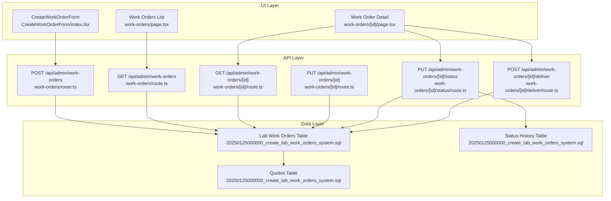
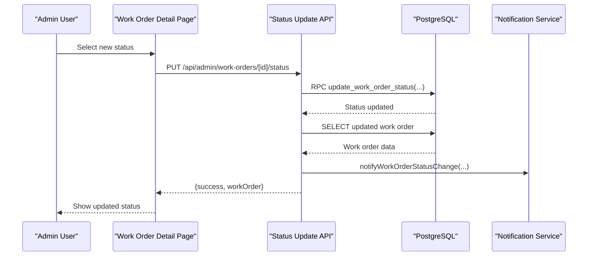
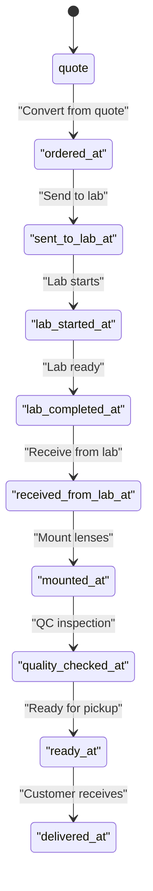
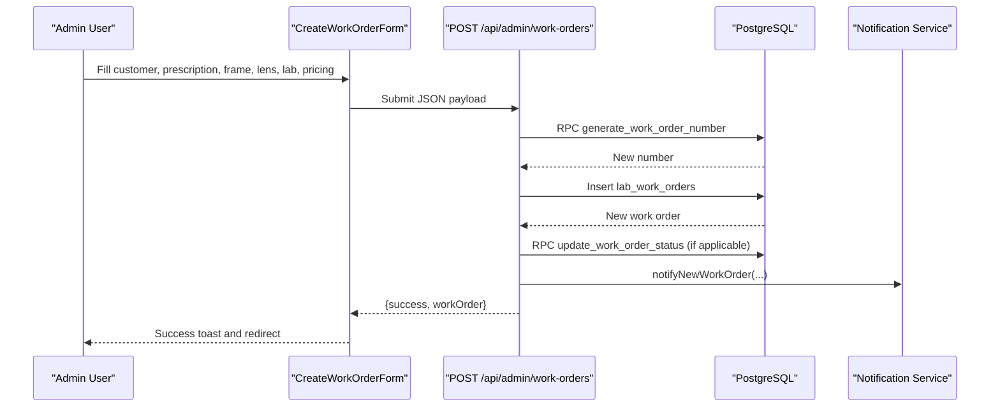
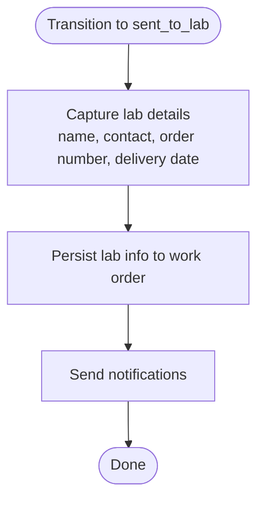
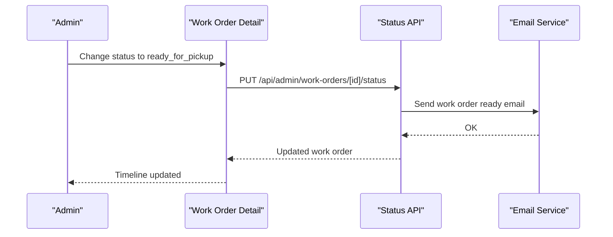
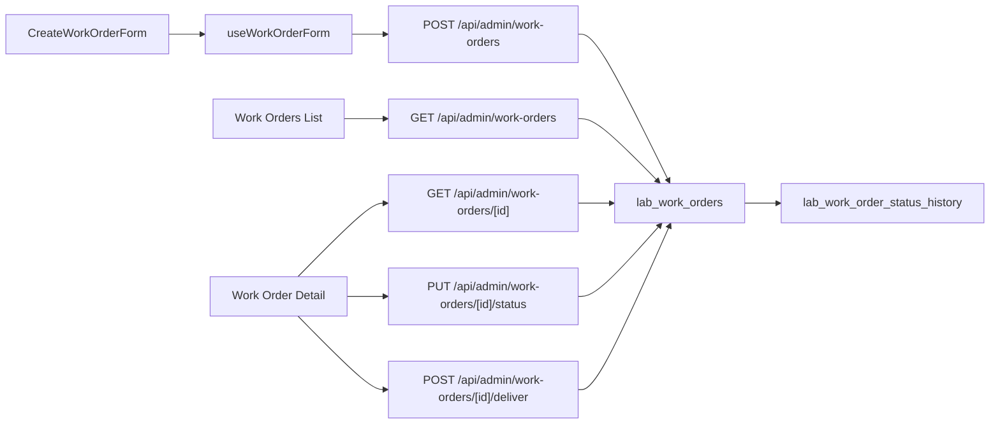

# Work Order Processing

<cite>
**Referenced Files in This Document**
- [CreateWorkOrderForm/index.tsx](file://src/components/admin/CreateWorkOrderForm/index.tsx)
- [useWorkOrderForm.ts](file://src/components/admin/CreateWorkOrderForm/hooks/useWorkOrderForm.ts)
- [work-orders/page.tsx](file://src/app/admin/work-orders/page.tsx)
- [work-orders/[id]/page.tsx](file://src/app/admin/work-orders/[id]/page.tsx)
- [work-orders/route.ts](file://src/app/api/admin/work-orders/route.ts)
- [work-orders/[id]/route.ts](file://src/app/api/admin/work-orders/[id]/route.ts)
- [work-orders/[id]/status/route.ts](file://src/app/api/admin/work-orders/[id]/status/route.ts)
- [work-orders/[id]/deliver/route.ts](file://src/app/api/admin/work-orders/[id]/deliver/route.ts)
- [20250125000000_create_lab_work_orders_system.sql](file://supabase/migrations/20250125000000_create_lab_work_orders_system.sql)
</cite>

## Table of Contents

1. [Introduction](#introduction)
2. [Project Structure](#project-structure)
3. [Core Components](#core-components)
4. [Architecture Overview](#architecture-overview)
5. [Detailed Component Analysis](#detailed-component-analysis)
6. [Dependency Analysis](#dependency-analysis)
7. [Performance Considerations](#performance-considerations)
8. [Troubleshooting Guide](#troubleshooting-guide)
9. [Conclusion](#conclusion)

## Introduction

This document describes the work order processing system in Opttius, covering the complete lifecycle from creation to delivery. It explains work order states, the creation process via CreateWorkOrderForm, integration with external laboratories, supplier management, quality control, tracking, status updates, timeline management, and communication workflows. It also documents the API endpoints for work order management, status changes, delivery confirmation, and work order-to-quote conversion, along with modification, cancellation, and dispute resolution processes.

## Project Structure

The work order system spans UI components, pages, and backend APIs:

- UI components for creating and editing work orders
- Admin pages for listing, viewing, and managing work orders
- API routes for CRUD operations, status updates, and delivery
- Database schema with dedicated tables for quotes and lab work orders, plus status history

**Diagram sources**

- [CreateWorkOrderForm/index.tsx](file://src/components/admin/CreateWorkOrderForm/index.tsx#L173-L245)
- [work-orders/page.tsx](file://src/app/admin/work-orders/page.tsx#L125-L155)
- [work-orders/[id]/page.tsx](file://src/app/admin/work-orders/[id]/page.tsx#L170-L198)
- [work-orders/route.ts](file://src/app/api/admin/work-orders/route.ts#L15-L198)
- [work-orders/[id]/route.ts](file://src/app/api/admin/work-orders/[id]/route.ts#L11-L98)
- [work-orders/[id]/status/route.ts](file://src/app/api/admin/work-orders/[id]/status/route.ts#L10-L238)
- [work-orders/[id]/deliver/route.ts](file://src/app/api/admin/work-orders/[id]/deliver/route.ts#L156-L204)
- [20250125000000_create_lab_work_orders_system.sql](file://supabase/migrations/20250125000000_create_lab_work_orders_system.sql#L71-L184)

**Section sources**

- [work-orders/page.tsx](file://src/app/admin/work-orders/page.tsx#L90-L155)
- [work-orders/[id]/page.tsx](file://src/app/admin/work-orders/[id]/page.tsx#L135-L198)
- [work-orders/route.ts](file://src/app/api/admin/work-orders/route.ts#L15-L198)
- [20250125000000_create_lab_work_orders_system.sql](file://supabase/migrations/20250125000000_create_lab_work_orders_system.sql#L71-L184)

## Core Components

- CreateWorkOrderForm: Client-side form for creating work orders with customer, prescription, frame, lens configuration, treatments, lab info, pricing, status, and notes.
- Work Orders List Page: Admin UI to list, filter, paginate, and manage work orders; supports payment status updates and deletion controls.
- Work Order Detail Page: Full-view page with status timeline, status transitions, delivery flow, and deletion controls.
- API Endpoints: REST endpoints for listing, creating, retrieving, updating, status transitions, and delivery confirmation.
- Database Schema: Dedicated tables for quotes and lab work orders, with a status history table and stored procedures/functions for numbering and status updates.

Key capabilities:

- Work order creation from quotes
- Multi-state workflow with timestamps per state
- Payment status tracking and balance calculations
- Delivery validation against outstanding balances
- Notifications and email triggers for key events

**Section sources**

- [CreateWorkOrderForm/index.tsx](file://src/components/admin/CreateWorkOrderForm/index.tsx#L32-L378)
- [useWorkOrderForm.ts](file://src/components/admin/CreateWorkOrderForm/hooks/useWorkOrderForm.ts#L81-L190)
- [work-orders/page.tsx](file://src/app/admin/work-orders/page.tsx#L90-L350)
- [work-orders/[id]/page.tsx](file://src/app/admin/work-orders/[id]/page.tsx#L135-L333)
- [work-orders/route.ts](file://src/app/api/admin/work-orders/route.ts#L200-L438)
- [work-orders/[id]/status/route.ts](file://src/app/api/admin/work-orders/[id]/status/route.ts#L10-L238)
- [work-orders/[id]/deliver/route.ts](file://src/app/api/admin/work-orders/[id]/deliver/route.ts#L156-L204)
- [20250125000000_create_lab_work_orders_system.sql](file://supabase/migrations/20250125000000_create_lab_work_orders_system.sql#L71-L184)

## Architecture Overview

The system follows a layered architecture:

- UI Layer: Next.js client components and pages
- API Layer: Next.js API routes with Supabase client and service role access
- Data Layer: PostgreSQL tables with row-level security and stored procedures

**Diagram sources**

- [work-orders/[id]/page.tsx](file://src/app/admin/work-orders/[id]/page.tsx#L200-L251)
- [work-orders/[id]/status/route.ts](file://src/app/api/admin/work-orders/[id]/status/route.ts#L79-L139)
- [20250125000000_create_lab_work_orders_system.sql](file://supabase/migrations/20250125000000_create_lab_work_orders_system.sql#L274-L323)

## Detailed Component Analysis

### Work Order States and Lifecycle

The system defines a comprehensive set of states for work order progression:

- Initial: quote
- Workflow states: ordered, sent_to_lab, in_progress_lab, ready_at_lab, received_from_lab, mounted, quality_check, ready_for_pickup
- Final states: delivered, cancelled, returned

Each state transition updates the corresponding timestamp fields and maintains a status history table for auditability.

**Diagram sources**

- [20250125000000_create_lab_work_orders_system.sql](file://supabase/migrations/20250125000000_create_lab_work_orders_system.sql#L116-L141)

**Section sources**

- [20250125000000_create_lab_work_orders_system.sql](file://supabase/migrations/20250125000000_create_lab_work_orders_system.sql#L116-L141)
- [work-orders/[id]/page.tsx](file://src/app/admin/work-orders/[id]/page.tsx#L723-L778)

### Work Order Creation Process (CreateWorkOrderForm)

The form captures:

- Customer and prescription details
- Frame information (product or manual entry)
- Lens configuration (type, material, index, treatments, tint)
- Lab information (name, contact, order number, estimated delivery)
- Pricing (frame, lens, treatments, labor, subtotal, tax, discount, total, payment status/method, deposit, balance)
- Status and notes (internal and customer-visible)

Creation flow:

- Validates required fields
- Posts to POST /api/admin/work-orders
- Generates work order number via stored procedure
- Optionally snapshots prescription data
- Updates status dates if initial status is not "quote"
- Sends notifications

**Diagram sources**

- [CreateWorkOrderForm/index.tsx](file://src/components/admin/CreateWorkOrderForm/index.tsx#L173-L245)
- [work-orders/route.ts](file://src/app/api/admin/work-orders/route.ts#L251-L407)
- [20250125000000_create_lab_work_orders_system.sql](file://supabase/migrations/20250125000000_create_lab_work_orders_system.sql#L251-L272)

**Section sources**

- [CreateWorkOrderForm/index.tsx](file://src/components/admin/CreateWorkOrderForm/index.tsx#L32-L378)
- [useWorkOrderForm.ts](file://src/components/admin/CreateWorkOrderForm/hooks/useWorkOrderForm.ts#L81-L190)
- [work-orders/route.ts](file://src/app/api/admin/work-orders/route.ts#L200-L438)

### Integration with External Laboratories

- Lab information captured during creation and status transitions
- When transitioning to "sent_to_lab", lab details are persisted
- Status updates trigger notifications and optional email to customer when ready for pickup

**Diagram sources**

- [work-orders/[id]/page.tsx](file://src/app/admin/work-orders/[id]/page.tsx#L217-L224)
- [work-orders/[id]/status/route.ts](file://src/app/api/admin/work-orders/[id]/status/route.ts#L101-L139)

**Section sources**

- [work-orders/[id]/page.tsx](file://src/app/admin/work-orders/[id]/page.tsx#L612-L667)
- [work-orders/[id]/status/route.ts](file://src/app/api/admin/work-orders/[id]/status/route.ts#L191-L224)

### Supplier Management and Quality Control

- Supplier/lab contact and order number maintained in work order records
- Quality control state ("quality_check") with optional quality notes
- Warranty fields available for tracking

**Section sources**

- [20250125000000_create_lab_work_orders_system.sql](file://supabase/migrations/20250125000000_create_lab_work_orders_system.sql#L143-L179)
- [work-orders/[id]/page.tsx](file://src/app/admin/work-orders/[id]/page.tsx#L430-L444)

### Work Order Tracking, Status Updates, Timeline, and Communication

- Timeline visualization shows all workflow steps with completion markers
- Status badges and icons provide quick visual cues
- Ready-for-pickup state triggers customer email notification
- Status history table records who changed status and when

**Diagram sources**

- [work-orders/[id]/page.tsx](file://src/app/admin/work-orders/[id]/page.tsx#L723-L778)
- [work-orders/[id]/status/route.ts](file://src/app/api/admin/work-orders/[id]/status/route.ts#L191-L224)

**Section sources**

- [work-orders/[id]/page.tsx](file://src/app/admin/work-orders/[id]/page.tsx#L335-L428)
- [work-orders/[id]/status/route.ts](file://src/app/api/admin/work-orders/[id]/status/route.ts#L165-L224)

### API Endpoints for Work Order Management

- GET /api/admin/work-orders
  - Purpose: List work orders with pagination and filters
  - Query params: status, customer_id, page, limit
  - Returns: workOrders array and pagination metadata
- POST /api/admin/work-orders
  - Purpose: Create a new work order
  - Body: customer_id, prescription_id, quote_id, frame/lens/lab/pricing fields, status, notes
  - Returns: new work order with generated number
- GET /api/admin/work-orders/[id]
  - Purpose: Retrieve a work order with related data and status history
- PUT /api/admin/work-orders/[id]
  - Purpose: Update work order fields (pricing, notes, assignments, etc.)
- PUT /api/admin/work-orders/[id]/status
  - Purpose: Transition work order status and record history
- POST /api/admin/work-orders/[id]/deliver
  - Purpose: Mark work order as delivered after validating zero balance

**Section sources**

- [work-orders/route.ts](file://src/app/api/admin/work-orders/route.ts#L15-L198)
- [work-orders/route.ts](file://src/app/api/admin/work-orders/route.ts#L200-L438)
- [work-orders/[id]/route.ts](file://src/app/api/admin/work-orders/[id]/route.ts#L11-L98)
- [work-orders/[id]/route.ts](file://src/app/api/admin/work-orders/[id]/route.ts#L100-L289)
- [work-orders/[id]/status/route.ts](file://src/app/api/admin/work-orders/[id]/status/route.ts#L10-L238)
- [work-orders/[id]/deliver/route.ts](file://src/app/api/admin/work-orders/[id]/deliver/route.ts#L156-L204)

### Work Order Modifications, Cancellations, and Dispute Resolution

- Modifications: Update endpoints allow changing frame/lens details, pricing, notes, and assignments
- Cancellations: Use status transitions to "cancelled"; backend prevents deletion of delivered/paid work orders unless explicitly allowed
- Disputes: Internal notes and quality notes capture dispute-related information; warranty fields track coverage periods

**Section sources**

- [work-orders/[id]/route.ts](file://src/app/api/admin/work-orders/[id]/route.ts#L291-L422)
- [work-orders/[id]/page.tsx](file://src/app/admin/work-orders/[id]/page.tsx#L308-L333)
- [20250125000000_create_lab_work_orders_system.sql](file://supabase/migrations/20250125000000_create_lab_work_orders_system.sql#L176-L179)

## Dependency Analysis

The system exhibits clear separation of concerns:

- UI components depend on shared hooks for form state and calculations
- Pages orchestrate data fetching and user interactions
- API routes encapsulate business logic and database operations
- Database schema enforces data integrity and auditability

**Diagram sources**

- [CreateWorkOrderForm/index.tsx](file://src/components/admin/CreateWorkOrderForm/index.tsx#L46-L51)
- [useWorkOrderForm.ts](file://src/components/admin/CreateWorkOrderForm/hooks/useWorkOrderForm.ts#L81-L94)
- [work-orders/page.tsx](file://src/app/admin/work-orders/page.tsx#L125-L155)
- [work-orders/[id]/page.tsx](file://src/app/admin/work-orders/[id]/page.tsx#L170-L198)
- [work-orders/route.ts](file://src/app/api/admin/work-orders/route.ts#L15-L198)
- [work-orders/[id]/status/route.ts](file://src/app/api/admin/work-orders/[id]/status/route.ts#L10-L238)
- [work-orders/[id]/deliver/route.ts](file://src/app/api/admin/work-orders/[id]/deliver/route.ts#L156-L204)
- [20250125000000_create_lab_work_orders_system.sql](file://supabase/migrations/20250125000000_create_lab_work_orders_system.sql#L186-L226)

**Section sources**

- [work-orders/page.tsx](file://src/app/admin/work-orders/page.tsx#L90-L155)
- [work-orders/[id]/page.tsx](file://src/app/admin/work-orders/[id]/page.tsx#L135-L198)
- [work-orders/route.ts](file://src/app/api/admin/work-orders/route.ts#L15-L198)
- [work-orders/[id]/status/route.ts](file://src/app/api/admin/work-orders/[id]/status/route.ts#L10-L238)
- [work-orders/[id]/deliver/route.ts](file://src/app/api/admin/work-orders/[id]/deliver/route.ts#L156-L204)
- [20250125000000_create_lab_work_orders_system.sql](file://supabase/migrations/20250125000000_create_lab_work_orders_system.sql#L186-L226)

## Performance Considerations

- Batch relation fetching: API routes fetch related data (customers, prescriptions, quotes, products, staff) in batches to avoid N+1 queries
- Pagination: List endpoint supports pagination and filtering to reduce payload sizes
- Indexes: Database includes strategic indexes on frequently queried columns (status, customer_id, created_at)
- Stored procedures: Number generation and status updates executed via RPCs to maintain consistency

[No sources needed since this section provides general guidance]

## Troubleshooting Guide

Common issues and resolutions:

- Unauthorized access: Ensure admin authentication and proper branch context
- Validation errors: Verify required fields and numeric values conform to schema
- Status update failures: Confirm branch access and that target status is valid
- Delivery blocked by balance: Resolve outstanding payments before marking delivered
- Missing related data: Check batch fetch logic for customers, prescriptions, quotes, and products

**Section sources**

- [work-orders/route.ts](file://src/app/api/admin/work-orders/route.ts#L15-L90)
- [work-orders/[id]/status/route.ts](file://src/app/api/admin/work-orders/[id]/status/route.ts#L10-L99)
- [work-orders/[id]/deliver/route.ts](file://src/app/api/admin/work-orders/[id]/deliver/route.ts#L156-L204)

## Conclusion

The Opttius work order processing system provides a robust, auditable, and user-friendly workflow for managing lab-based eyewear production. It integrates customer and prescription data, supports detailed lens and frame configurations, tracks multi-stage production with precise timestamps, and ensures compliance through status history and notifications. The API layer offers comprehensive endpoints for lifecycle management, while the database schema enforces data integrity and scalability.
