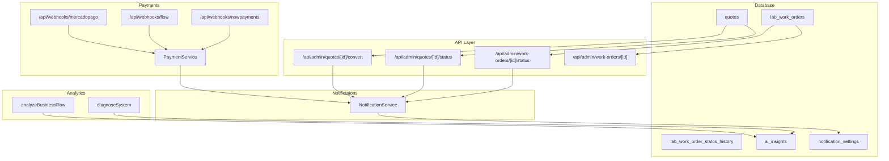
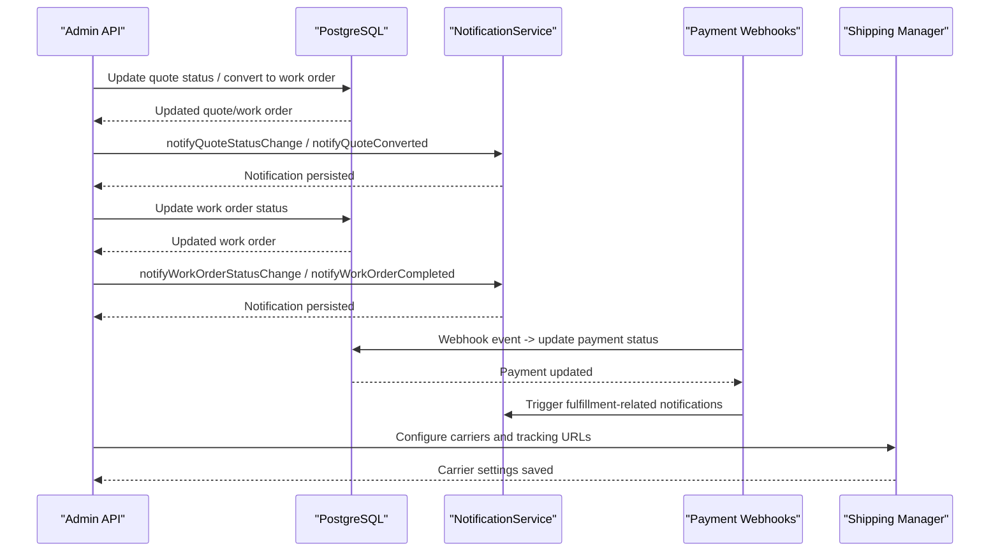
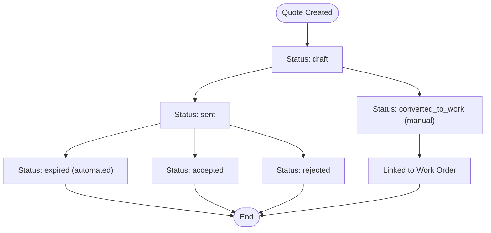
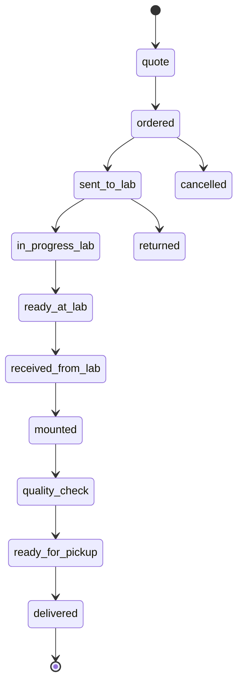
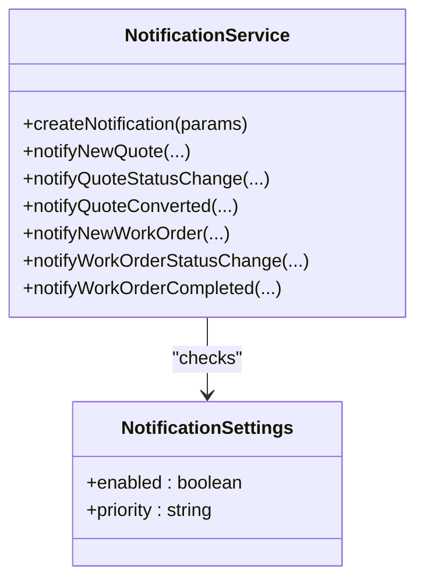
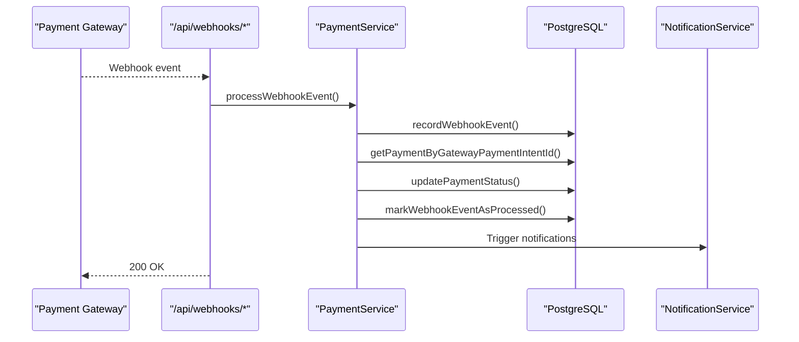
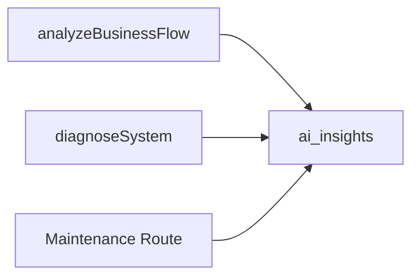
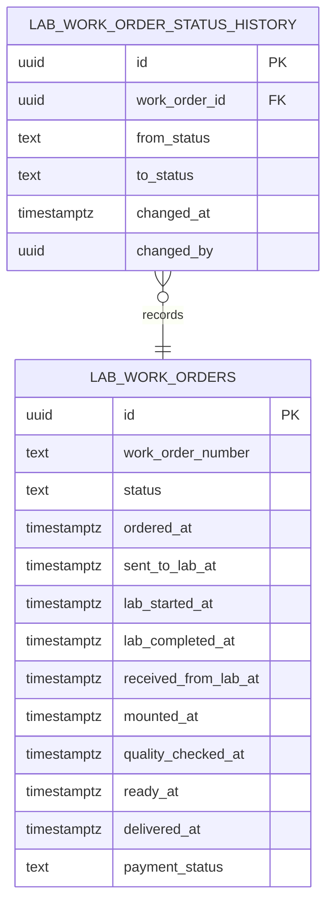
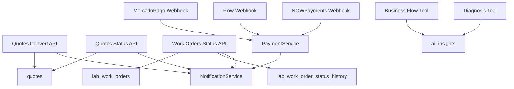

# Workflow Automation & State Management

<cite>
**Referenced Files in This Document**
- [20250125000000_create_lab_work_orders_system.sql](file://supabase/migrations/20250125000000_create_lab_work_orders_system.sql)
- [20250128000001_add_quote_expiration_automation.sql](file://supabase/migrations/20250128000001_add_quote_expiration_automation.sql)
- [20250128000002_add_quote_original_status.sql](file://supabase/migrations/20250128000002_add_quote_original_status.sql)
- [20260131000004_create_ai_insights.sql](file://supabase/migrations/20260131000004_create_ai_insights.sql)
- [route.ts](file://src/app/api/admin/quotes/[id]/convert/route.ts)
- [route.ts](file://src/app/api/admin/quotes/[id]/status/route.ts)
- [route.ts](file://src/app/api/admin/work-orders/[id]/status/route.ts)
- [route.ts](file://src/app/api/admin/work-orders/[id]/route.ts)
- [notification-service.ts](file://src/lib/notifications/notification-service.ts)
- [index.ts](file://src/lib/logger/index.ts)
- [route.ts](file://src/app/api/webhooks/mercadopago/route.ts)
- [route.ts](file://src/app/api/webhooks/flow/route.ts)
- [route.ts](file://src/app/api/webhooks/nowpayments/route.ts)
- [payment-service.ts](file://src/lib/payments/services/payment-service.ts)
- [analyzeBusinessFlow.ts](file://src/lib/ai/tools/analyzeBusinessFlow.ts)
- [diagnoseSystem.ts](file://src/lib/ai/tools/diagnoseSystem.ts)
- [EmailTemplateEditor.tsx](file://src/components/admin/EmailTemplateEditor.tsx)
- [ShippingManager.tsx](file://src/components/admin/ShippingManager.tsx)
- [route.ts](file://src/app/api/admin/system/shipping/carriers/route.ts)
- [route.ts](file://src/app/api/admin/system/maintenance/route.ts)
</cite>

## Table of Contents

1. [Introduction](#introduction)
2. [Project Structure](#project-structure)
3. [Core Components](#core-components)
4. [Architecture Overview](#architecture-overview)
5. [Detailed Component Analysis](#detailed-component-analysis)
6. [Dependency Analysis](#dependency-analysis)
7. [Performance Considerations](#performance-considerations)
8. [Troubleshooting Guide](#troubleshooting-guide)
9. [Conclusion](#conclusion)
10. [Appendices](#appendices)

## Introduction

This document describes the workflow automation and state management system in Opttius, focusing on how quotes and work orders move through their lifecycle, automated triggers for notifications and status updates, validations and business rules, integrations with external systems (laboratories, shipping, payments), audit and compliance logging, and analytics-driven optimization. It consolidates backend database migrations, API routes, notification services, payment webhooks, and frontend components that collectively enforce state transitions and operational workflows.

## Project Structure

The workflow system spans:

- Database schema and triggers for quotes and work orders
- Admin API endpoints for state changes and conversions
- Notification service for internal and cross-system alerts
- Payment webhooks for payment lifecycle alignment
- Analytics tools for performance monitoring and optimization
- Frontend components for shipping and email template configuration

**Diagram sources**

- [20250125000000_create_lab_work_orders_system.sql](file://supabase/migrations/20250125000000_create_lab_work_orders_system.sql#L1-L200)
- [route.ts](file://src/app/api/admin/quotes/[id]/convert/route.ts#L141-L199)
- [route.ts](file://src/app/api/admin/quotes/[id]/status/route.ts#L96-L149)
- [route.ts](file://src/app/api/admin/work-orders/[id]/status/route.ts#L107-L181)
- [route.ts](file://src/app/api/admin/work-orders/[id]/route.ts#L1-L423)
- [notification-service.ts](file://src/lib/notifications/notification-service.ts#L1-L531)
- [route.ts](file://src/app/api/webhooks/mercadopago/route.ts#L270-L314)
- [route.ts](file://src/app/api/webhooks/flow/route.ts#L76-L115)
- [route.ts](file://src/app/api/webhooks/nowpayments/route.ts#L37-L69)
- [payment-service.ts](file://src/lib/payments/services/payment-service.ts#L187-L228)
- [analyzeBusinessFlow.ts](file://src/lib/ai/tools/analyzeBusinessFlow.ts#L1-L331)
- [diagnoseSystem.ts](file://src/lib/ai/tools/diagnoseSystem.ts#L49-L383)

**Section sources**

- [20250125000000_create_lab_work_orders_system.sql](file://supabase/migrations/20250125000000_create_lab_work_orders_system.sql#L1-L200)
- [notification-service.ts](file://src/lib/notifications/notification-service.ts#L1-L531)

## Core Components

- Quotes lifecycle with expiration automation and conversion to work orders
- Work orders lifecycle with lab integration, status history, and payment linkage
- Notification service for internal alerts and cross-system triggers
- Payment webhooks for payment status alignment and order fulfillment
- Analytics tools for workflow performance monitoring and system diagnostics
- Audit and compliance logging via structured logs and status history

**Section sources**

- [20250128000001_add_quote_expiration_automation.sql](file://supabase/migrations/20250128000001_add_quote_expiration_automation.sql#L1-L64)
- [20250128000002_add_quote_original_status.sql](file://supabase/migrations/20250128000002_add_quote_original_status.sql#L1-L54)
- [20250125000000_create_lab_work_orders_system.sql](file://supabase/migrations/20250125000000_create_lab_work_orders_system.sql#L1-L200)
- [notification-service.ts](file://src/lib/notifications/notification-service.ts#L1-L531)
- [payment-service.ts](file://src/lib/payments/services/payment-service.ts#L187-L228)
- [index.ts](file://src/lib/logger/index.ts#L1-L111)

## Architecture Overview

The system orchestrates state transitions across quotes and work orders, triggering notifications and integrating with external systems. Key flows:

- Quote expiration and acceptance triggers notifications
- Quote conversion to work order updates status and links entities
- Work order status changes trigger notifications and optional customer email
- Payment webhooks update payment status and can fulfill orders
- Analytics tools analyze workflow performance and system health

**Diagram sources**

- [route.ts](file://src/app/api/admin/quotes/[id]/status/route.ts#L96-L149)
- [route.ts](file://src/app/api/admin/quotes/[id]/convert/route.ts#L141-L199)
- [route.ts](file://src/app/api/admin/work-orders/[id]/status/route.ts#L107-L181)
- [notification-service.ts](file://src/lib/notifications/notification-service.ts#L193-L350)
- [route.ts](file://src/app/api/webhooks/mercadopago/route.ts#L270-L314)
- [route.ts](file://src/app/api/admin/system/shipping/carriers/route.ts#L79-L113)

## Detailed Component Analysis

### Quotes: Lifecycle, Expiration, and Conversion

- Schema supports quote statuses, pricing snapshots, and conversion tracking.
- Expiration automation marks quotes as expired based on expiration_date.
- Conversion to work order preserves original status and links entities.

**Diagram sources**

- [20250125000000_create_lab_work_orders_system.sql](file://supabase/migrations/20250125000000_create_lab_work_orders_system.sql#L50-L69)
- [20250128000001_add_quote_expiration_automation.sql](file://supabase/migrations/20250128000001_add_quote_expiration_automation.sql#L5-L25)
- [20250128000002_add_quote_original_status.sql](file://supabase/migrations/20250128000002_add_quote_original_status.sql#L28-L50)

Key validations and business logic:

- Expiration trigger prevents non-expired updates when expiration_date passes.
- Conversion endpoint sets status to accepted, preserves original status, and links work order.
- Status API validates allowed statuses and notifies on change.

**Section sources**

- [20250128000001_add_quote_expiration_automation.sql](file://supabase/migrations/20250128000001_add_quote_expiration_automation.sql#L1-L64)
- [20250128000002_add_quote_original_status.sql](file://supabase/migrations/20250128000002_add_quote_original_status.sql#L1-L54)
- [route.ts](file://src/app/api/admin/quotes/[id]/convert/route.ts#L141-L199)
- [route.ts](file://src/app/api/admin/quotes/[id]/status/route.ts#L96-L149)

### Work Orders: Lab Integration, Status History, Payments

- Schema defines comprehensive statuses, timestamps per stage, payment fields, and notes.
- Status history table records changes with who changed and when.
- Status update endpoint persists notes and lab fields when applicable.

**Diagram sources**

- [20250125000000_create_lab_work_orders_system.sql](file://supabase/migrations/20250125000000_create_lab_work_orders_system.sql#L115-L129)
- [20250125000000_create_lab_work_orders_system.sql](file://supabase/migrations/20250125000000_create_lab_work_orders_system.sql#L186-L200)

Operational flows:

- Status updates create notifications and can trigger customer email on readiness.
- Deletion logic cascades and optionally deletes the linked quote.

**Section sources**

- [route.ts](file://src/app/api/admin/work-orders/[id]/status/route.ts#L107-L181)
- [route.ts](file://src/app/api/admin/work-orders/[id]/route.ts#L1-L423)

### Notifications: Internal Alerts and Cross-System Triggers

- NotificationService centralizes creation with scoping by branch/organization and priority.
- Types include quote/new, quote status change, conversion to work order, and work order events.
- Non-blocking notifications are created after state changes.

**Diagram sources**

- [notification-service.ts](file://src/lib/notifications/notification-service.ts#L1-L531)

**Section sources**

- [notification-service.ts](file://src/lib/notifications/notification-service.ts#L193-L350)

### Payment Integrations: Webhooks and Fulfillment

- Payment webhooks normalize events from multiple gateways and update payment status.
- Idempotency is enforced via webhook event records.
- On successful payment, fulfillment logic can be triggered.

**Diagram sources**

- [route.ts](file://src/app/api/webhooks/mercadopago/route.ts#L270-L314)
- [route.ts](file://src/app/api/webhooks/flow/route.ts#L76-L115)
- [route.ts](file://src/app/api/webhooks/nowpayments/route.ts#L37-L69)
- [payment-service.ts](file://src/lib/payments/services/payment-service.ts#L187-L228)

**Section sources**

- [route.ts](file://src/app/api/webhooks/mercadopago/route.ts#L270-L314)
- [route.ts](file://src/app/api/webhooks/flow/route.ts#L76-L115)
- [route.ts](file://src/app/api/webhooks/nowpayments/route.ts#L37-L69)
- [payment-service.ts](file://src/lib/payments/services/payment-service.ts#L187-L228)

### Analytics and Reporting: Performance Monitoring and Optimization

- AI tools analyze business flows and diagnose system health.
- Insights are stored for visibility and feedback collection.
- Maintenance endpoints support database optimization and audits.

**Diagram sources**

- [analyzeBusinessFlow.ts](file://src/lib/ai/tools/analyzeBusinessFlow.ts#L1-L331)
- [diagnoseSystem.ts](file://src/lib/ai/tools/diagnoseSystem.ts#L49-L383)
- [20260131000004_create_ai_insights.sql](file://supabase/migrations/20260131000004_create_ai_insights.sql#L1-L130)
- [route.ts](file://src/app/api/admin/system/maintenance/route.ts#L211-L245)

**Section sources**

- [analyzeBusinessFlow.ts](file://src/lib/ai/tools/analyzeBusinessFlow.ts#L1-L331)
- [diagnoseSystem.ts](file://src/lib/ai/tools/diagnoseSystem.ts#L49-L383)
- [20260131000004_create_ai_insights.sql](file://supabase/migrations/20260131000004_create_ai_insights.sql#L1-L130)
- [route.ts](file://src/app/api/admin/system/maintenance/route.ts#L211-L245)

### Audit Trail, Change Tracking, and Compliance Logging

- Work order status history captures from/to status, timestamp, and actor.
- Structured logging with pino provides consistent audit trails across services.
- Compliance-ready fields include timestamps per status stage and notes.

**Diagram sources**

- [20250125000000_create_lab_work_orders_system.sql](file://supabase/migrations/20250125000000_create_lab_work_orders_system.sql#L186-L200)
- [20250125000000_create_lab_work_orders_system.sql](file://supabase/migrations/20250125000000_create_lab_work_orders_system.sql#L115-L141)

**Section sources**

- [20250125000000_create_lab_work_orders_system.sql](file://supabase/migrations/20250125000000_create_lab_work_orders_system.sql#L186-L200)
- [index.ts](file://src/lib/logger/index.ts#L1-L111)

### Shipping Integration

- Shipping carriers can be configured with tracking URL templates and API keys.
- Supports integration with external shipping providers for tracking.

**Section sources**

- [ShippingManager.tsx](file://src/components/admin/ShippingManager.tsx#L969-L1035)
- [route.ts](file://src/app/api/admin/system/shipping/carriers/route.ts#L79-L113)

### Email Templates and Customer Communications

- Email template editor exposes dynamic variables for personalized customer communications.
- Useful for customer notifications around readiness and order updates.

**Section sources**

- [EmailTemplateEditor.tsx](file://src/components/admin/EmailTemplateEditor.tsx#L241-L297)

## Dependency Analysis

- API routes depend on Supabase service role clients to bypass RLS and enforce admin checks.
- NotificationService depends on notification_settings and entity metadata to scope alerts.
- Payment webhooks depend on PaymentService for idempotent processing and payment updates.
- Analytics tools depend on organization-scoped data for insights generation.

**Diagram sources**

- [route.ts](file://src/app/api/admin/quotes/[id]/convert/route.ts#L141-L199)
- [route.ts](file://src/app/api/admin/quotes/[id]/status/route.ts#L96-L149)
- [route.ts](file://src/app/api/admin/work-orders/[id]/status/route.ts#L107-L181)
- [notification-service.ts](file://src/lib/notifications/notification-service.ts#L1-L531)
- [route.ts](file://src/app/api/webhooks/mercadopago/route.ts#L270-L314)
- [route.ts](file://src/app/api/webhooks/flow/route.ts#L76-L115)
- [route.ts](file://src/app/api/webhooks/nowpayments/route.ts#L37-L69)
- [payment-service.ts](file://src/lib/payments/services/payment-service.ts#L187-L228)
- [analyzeBusinessFlow.ts](file://src/lib/ai/tools/analyzeBusinessFlow.ts#L1-L331)
- [diagnoseSystem.ts](file://src/lib/ai/tools/diagnoseSystem.ts#L49-L383)

**Section sources**

- [route.ts](file://src/app/api/admin/quotes/[id]/convert/route.ts#L141-L199)
- [route.ts](file://src/app/api/admin/quotes/[id]/status/route.ts#L96-L149)
- [route.ts](file://src/app/api/admin/work-orders/[id]/status/route.ts#L107-L181)
- [notification-service.ts](file://src/lib/notifications/notification-service.ts#L1-L531)
- [payment-service.ts](file://src/lib/payments/services/payment-service.ts#L187-L228)
- [analyzeBusinessFlow.ts](file://src/lib/ai/tools/analyzeBusinessFlow.ts#L1-L331)
- [diagnoseSystem.ts](file://src/lib/ai/tools/diagnoseSystem.ts#L49-L383)

## Performance Considerations

- Use service role clients judiciously to minimize RLS overhead while maintaining security.
- Batch notifications where possible to reduce database writes.
- Index frequently queried fields (e.g., status, timestamps) to improve query performance.
- Monitor webhook processing latency and scale webhook consumers horizontally if needed.
- Use maintenance routines to optimize database performance periodically.

## Troubleshooting Guide

Common issues and resolutions:

- Quote conversion blocked: Ensure the quote is not already converted; conversion prevents further status changes.
- Expiration not applied: Verify expiration_date and that the quote status is eligible for expiration.
- Work order deletion restrictions: Cannot delete delivered or paid work orders unless explicitly allowed.
- Payment webhook duplicates: Idempotency checks prevent duplicate processing; investigate gateway retries.
- Notification not appearing: Confirm notification type is enabled and scoped to the correct branch/organization.

**Section sources**

- [20250128000002_add_quote_original_status.sql](file://supabase/migrations/20250128000002_add_quote_original_status.sql#L36-L40)
- [20250128000001_add_quote_expiration_automation.sql](file://supabase/migrations/20250128000001_add_quote_expiration_automation.sql#L39-L51)
- [route.ts](file://src/app/api/admin/work-orders/[id]/route.ts#L357-L379)
- [payment-service.ts](file://src/lib/payments/services/payment-service.ts#L206-L228)
- [notification-service.ts](file://src/lib/notifications/notification-service.ts#L53-L82)

## Conclusion

Opttius implements a robust workflow automation and state management system centered on quotes and work orders, with strong safeguards, notifications, and integrations. The system’s triggers, validations, and audit mechanisms ensure compliance and traceability, while analytics and maintenance routines support continuous improvement and operational excellence.

## Appendices

- Exception handling and escalation:
  - Payment webhooks return 500 for internal failures to prompt retries; otherwise return 200 to prevent infinite retries.
  - Maintenance routines log administrative actions for auditability.
- Manual overrides:
  - Conversion and status updates are admin-authorized; ensure proper authorization checks and branch access validation.
- Compliance logging:
  - Structured logs capture all significant operations; status history provides immutable audit trails.

**Section sources**

- [route.ts](file://src/app/api/webhooks/mercadopago/route.ts#L270-L314)
- [route.ts](file://src/app/api/webhooks/flow/route.ts#L76-L115)
- [route.ts](file://src/app/api/webhooks/nowpayments/route.ts#L37-L69)
- [route.ts](file://src/app/api/admin/system/maintenance/route.ts#L211-L245)
- [index.ts](file://src/lib/logger/index.ts#L1-L111)
