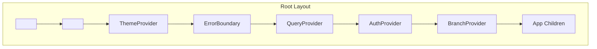
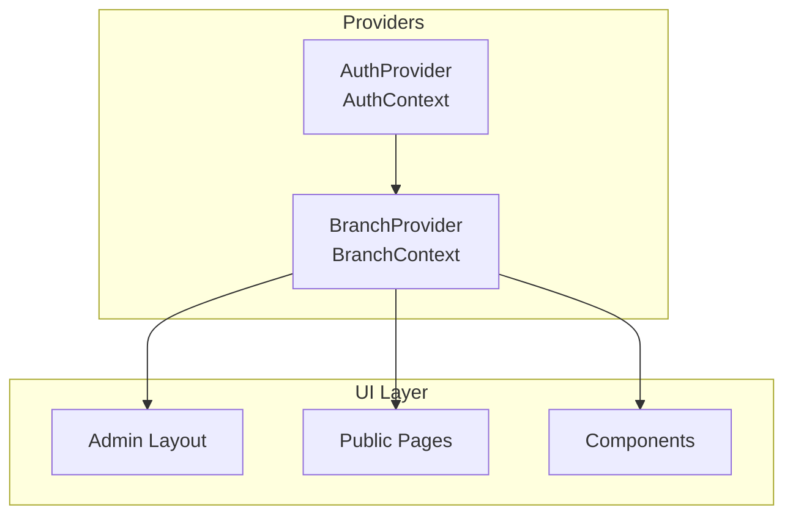
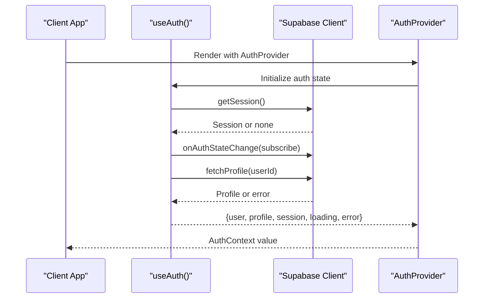
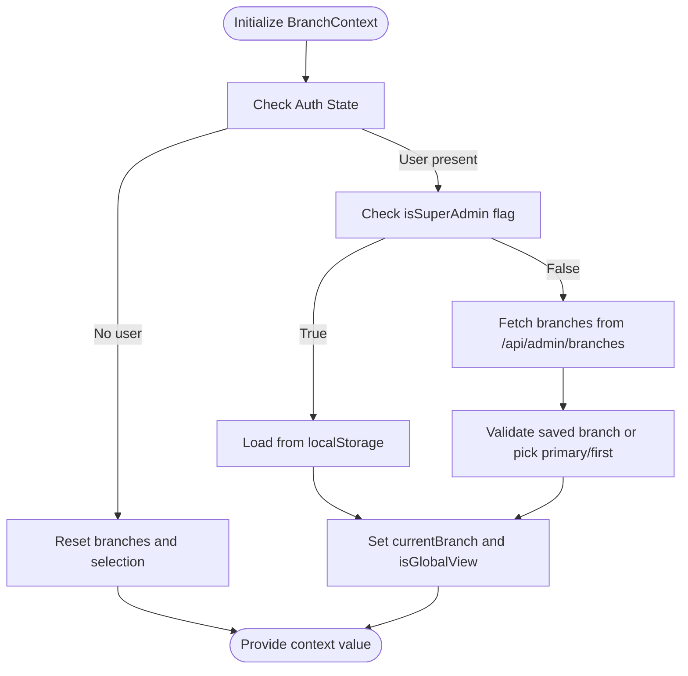
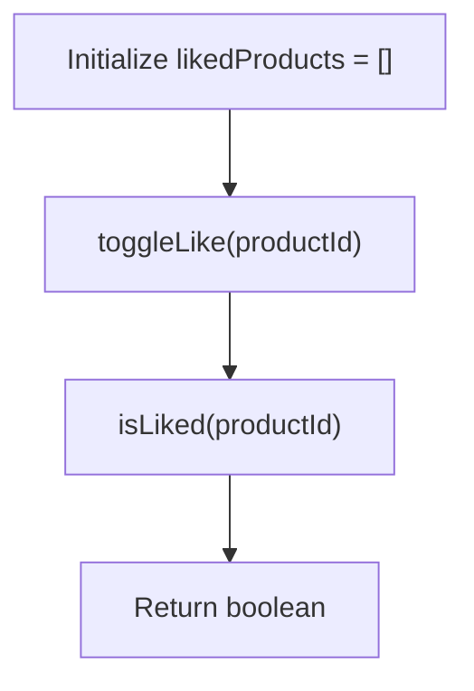
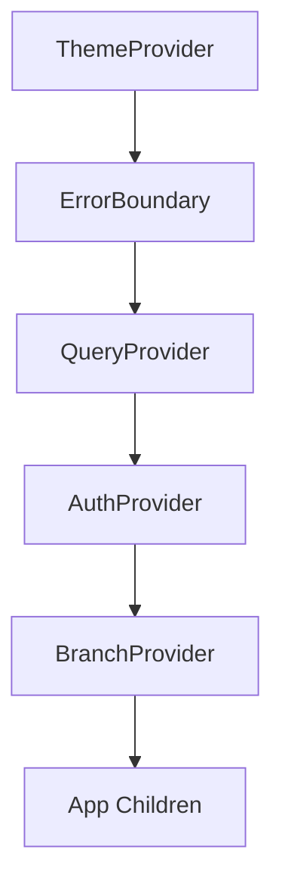
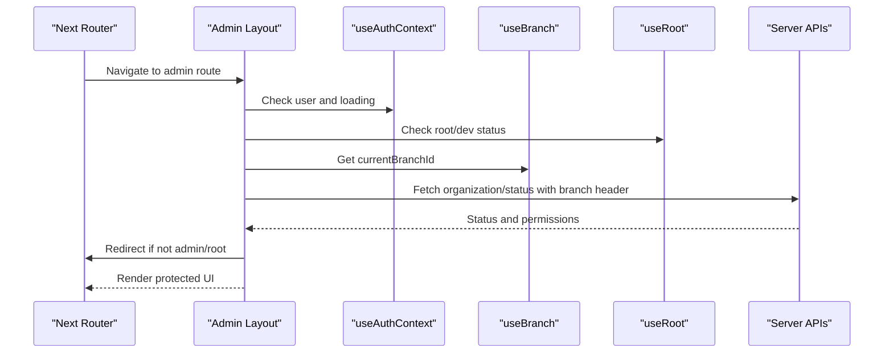
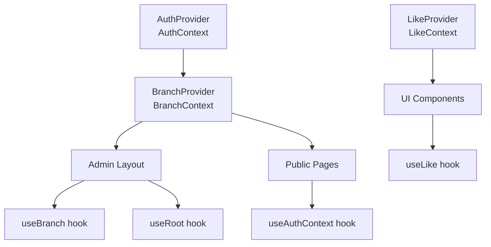

# Context Providers

<cite>
**Referenced Files in This Document**
- [AuthContext.tsx](file://src/contexts/AuthContext.tsx)
- [BranchContext.tsx](file://src/contexts/BranchContext.tsx)
- [LikeContext.tsx](file://src/contexts/LikeContext.tsx)
- [useAuth.ts](file://src/hooks/useAuth.ts)
- [useBranch.ts](file://src/hooks/useBranch.ts)
- [useRoot.ts](file://src/hooks/useRoot.ts)
- [layout.tsx](file://src/app/layout.tsx)
- [admin/layout.tsx](file://src/app/admin/layout.tsx)
- [ErrorBoundary.tsx](file://src/components/ErrorBoundary.tsx)
- [ProductCard.tsx](file://src/components/ui/brand/ProductCard.tsx)
</cite>

## Table of Contents

1. [Introduction](#introduction)
2. [Project Structure](#project-structure)
3. [Core Components](#core-components)
4. [Architecture Overview](#architecture-overview)
5. [Detailed Component Analysis](#detailed-component-analysis)
6. [Dependency Analysis](#dependency-analysis)
7. [Performance Considerations](#performance-considerations)
8. [Troubleshooting Guide](#troubleshooting-guide)
9. [Conclusion](#conclusion)

## Introduction

This document explains the Opttius context providers architecture and how React Context is used to manage global state across the application. It focuses on three core contexts:

- AuthContext: Authentication and profile state management integrated with Supabase.
- BranchContext: Multi-tenant organization switching and branch scoping.
- LikeContext: User preferences for product likes.

It documents provider composition in the root layout, error boundary handling, context value structures, integration with Supabase authentication and real-time updates, route protection, performance considerations, and troubleshooting guidance.

## Project Structure

The context providers are composed at the root of the Next.js app and consumed throughout the application. Providers wrap the UI tree to make state globally available.

**Diagram sources**

- [layout.tsx](file://src/app/layout.tsx#L30-L55)

**Section sources**

- [layout.tsx](file://src/app/layout.tsx#L30-L55)

## Core Components

This section describes each context provider, its responsibilities, and how it integrates with Supabase and the rest of the system.

- AuthContext
  - Purpose: Centralizes authentication state and exposes sign-up, sign-in, sign-out, profile updates, and password reset actions.
  - Integration: Built on top of the useAuth hook, which manages Supabase session lifecycle, real-time auth state changes, and profile fetching/upsert.
  - Exposes: user, profile, session, loading, error, plus action methods.
  - Consumption: Used widely across admin and public pages for authentication checks and actions.

- BranchContext
  - Purpose: Manages multi-branch selection for multi-tenant environments, supports global view for super admins, and persists selections in localStorage.
  - Integration: Fetches available branches from a server endpoint, determines super admin vs. regular admin behavior, and maintains current branch state.
  - Exposes: branches, currentBranch, isGlobalView, isSuperAdmin, isLoading, setCurrentBranch, refreshBranches.
  - Consumption: Used in admin layouts and pages to scope queries and UI to the selected branch.

- LikeContext
  - Purpose: Tracks user preferences for product likes.
  - Integration: Provides stubbed functionality for toggling and checking liked products.
  - Exposes: likedProducts, toggleLike, isLiked, isLoading.
  - Consumption: Used in UI components like ProductCard to reflect user preferences.

**Section sources**

- [AuthContext.tsx](file://src/contexts/AuthContext.tsx#L28-L46)
- [BranchContext.tsx](file://src/contexts/BranchContext.tsx#L38-L206)
- [LikeContext.tsx](file://src/contexts/LikeContext.tsx#L14-L39)
- [useAuth.ts](file://src/hooks/useAuth.ts#L18-L376)
- [useBranch.ts](file://src/hooks/useBranch.ts#L40-L52)

## Architecture Overview

The provider stack is structured to ensure authentication precedes branch selection, which in turn enables tenant-scoped UI and data access. Error boundaries wrap the entire tree to provide resilient error handling.

**Diagram sources**

- [layout.tsx](file://src/app/layout.tsx#L43-L49)
- [AuthContext.tsx](file://src/contexts/AuthContext.tsx#L28-L36)
- [BranchContext.tsx](file://src/contexts/BranchContext.tsx#L38-L206)

## Detailed Component Analysis

### AuthContext and useAuth

AuthContext wraps the app with authentication state and actions. The underlying useAuth hook handles:

- Initial session retrieval with timeouts.
- Real-time auth state changes via Supabase auth listeners.
- Profile fetching with robust error handling and timeouts.
- Sign-up, sign-in, sign-out, profile updates, and password reset.

**Diagram sources**

- [useAuth.ts](file://src/hooks/useAuth.ts#L27-L129)
- [AuthContext.tsx](file://src/contexts/AuthContext.tsx#L28-L36)

Key behaviors:

- Loading and error states are managed centrally.
- Profile fetch uses timeouts and gracefully handles missing profiles.
- Auth state changes trigger updates to user, session, and profile.

**Section sources**

- [AuthContext.tsx](file://src/contexts/AuthContext.tsx#L9-L20)
- [AuthContext.tsx](file://src/contexts/AuthContext.tsx#L28-L46)
- [useAuth.ts](file://src/hooks/useAuth.ts#L18-L376)

### BranchContext

BranchContext manages multi-branch selection and tenant scoping:

- Fetches branches from a server endpoint.
- Distinguishes super admin (global view) vs. regular admin (assigned branches).
- Persists selection in localStorage and validates against available branches.
- Exposes helpers to switch branches and refresh lists.

**Diagram sources**

- [BranchContext.tsx](file://src/contexts/BranchContext.tsx#L73-L155)
- [BranchContext.tsx](file://src/contexts/BranchContext.tsx#L157-L176)

Important notes:

- Super admins can use a "global" view and selections persist across reloads.
- Regular admins rely on server-provided assignments and fallbacks.
- Selection changes are persisted locally and do not require server notifications.

**Section sources**

- [BranchContext.tsx](file://src/contexts/BranchContext.tsx#L38-L206)
- [useBranch.ts](file://src/hooks/useBranch.ts#L40-L52)

### LikeContext

LikeContext provides a minimal preference store for product likes:

- Exposes likedProducts array, toggleLike, isLiked, and isLoading.
- Current implementation is stubbed; production would persist and sync preferences.

**Diagram sources**

- [LikeContext.tsx](file://src/contexts/LikeContext.tsx#L14-L31)

**Section sources**

- [LikeContext.tsx](file://src/contexts/LikeContext.tsx#L14-L39)
- [ProductCard.tsx](file://src/components/ui/brand/ProductCard.tsx#L19-L120)

### Provider Composition in Root Layout

Providers are composed in a specific order to ensure proper initialization:

- ThemeProvider wraps everything for consistent theming.
- ErrorBoundary wraps the app to catch rendering errors.
- QueryProvider provides caching and data fetching utilities.
- AuthProvider initializes authentication state.
- BranchProvider depends on AuthContext to fetch and manage branches.

**Diagram sources**

- [layout.tsx](file://src/app/layout.tsx#L38-L50)

**Section sources**

- [layout.tsx](file://src/app/layout.tsx#L30-L55)

### Route Protection and Integration with Supabase

Route protection in the admin layout demonstrates integration with AuthContext and BranchContext:

- Uses useAuthContext to guard access and redirect non-admins.
- Uses useRoot to detect root/dev users for SaaS features.
- Uses useBranch to scope data and UI to the current branch.
- Calls server endpoints with branch-aware headers.

**Diagram sources**

- [admin/layout.tsx](file://src/app/admin/layout.tsx#L165-L168)
- [admin/layout.tsx](file://src/app/admin/layout.tsx#L296-L318)
- [admin/layout.tsx](file://src/app/admin/layout.tsx#L431-L499)
- [useRoot.ts](file://src/hooks/useRoot.ts#L14-L46)

**Section sources**

- [admin/layout.tsx](file://src/app/admin/layout.tsx#L165-L168)
- [admin/layout.tsx](file://src/app/admin/layout.tsx#L296-L318)
- [admin/layout.tsx](file://src/app/admin/layout.tsx#L431-L499)
- [useRoot.ts](file://src/hooks/useRoot.ts#L9-L49)

## Dependency Analysis

The following diagram shows provider dependencies and how components consume contexts.

**Diagram sources**

- [layout.tsx](file://src/app/layout.tsx#L43-L49)
- [AuthContext.tsx](file://src/contexts/AuthContext.tsx#L28-L36)
- [BranchContext.tsx](file://src/contexts/BranchContext.tsx#L38-L206)
- [LikeContext.tsx](file://src/contexts/LikeContext.tsx#L14-L39)
- [useBranch.ts](file://src/hooks/useBranch.ts#L40-L52)
- [useRoot.ts](file://src/hooks/useRoot.ts#L9-L49)
- [ProductCard.tsx](file://src/components/ui/brand/ProductCard.tsx#L19-L120)

**Section sources**

- [layout.tsx](file://src/app/layout.tsx#L30-L55)
- [useBranch.ts](file://src/hooks/useBranch.ts#L40-L52)
- [useRoot.ts](file://src/hooks/useRoot.ts#L9-L49)
- [ProductCard.tsx](file://src/components/ui/brand/ProductCard.tsx#L19-L120)

## Performance Considerations

- Minimize re-renders by keeping context values stable:
  - Keep the context value object shallow and avoid frequent object recreations inside providers.
  - Memoize derived values exposed by hooks like useBranch to prevent unnecessary prop updates.
- Avoid heavy synchronous work in providers:
  - BranchContext defers server fetches until user is authenticated and avoids redundant requests by checking initialization flags.
- Debounce or throttle network-bound operations:
  - BranchContext uses a force-refresh mechanism for explicit refreshes rather than polling.
- Leverage QueryProvider for caching:
  - Use react-query to cache and invalidate data efficiently, reducing repeated fetches.
- Error boundaries reduce crash scope:
  - ErrorBoundary isolates rendering errors and provides recovery actions.

[No sources needed since this section provides general guidance]

## Troubleshooting Guide

Common issues and debugging techniques:

- Context not wrapped or used outside provider
  - Symptom: Error indicating the context must be used within a provider.
  - Fix: Ensure the provider is rendered above the consuming component in the tree.
  - Example references:
    - [AuthContext.tsx](file://src/contexts/AuthContext.tsx#L39-L45)
    - [BranchContext.tsx](file://src/contexts/BranchContext.tsx#L210-L214)
    - [LikeContext.tsx](file://src/contexts/LikeContext.tsx#L33-L38)

- Authentication state not initializing
  - Symptom: Loading remains true indefinitely or errors appear.
  - Actions:
    - Verify Supabase client initialization and environment variables.
    - Check for session fetch timeouts and network connectivity.
    - Review auth state change listener behavior.
  - Example references:
    - [useAuth.ts](file://src/hooks/useAuth.ts#L27-L91)
    - [useAuth.ts](file://src/hooks/useAuth.ts#L132-L192)

- Branch selection not persisting or incorrect
  - Symptom: Selection resets after reload or switches unexpectedly.
  - Actions:
    - Confirm localStorage key and values for selected branch.
    - Verify server-provided branch list and user role.
    - Check for invalid saved branch IDs and fallback logic.
  - Example references:
    - [BranchContext.tsx](file://src/contexts/BranchContext.tsx#L48-L71)
    - [BranchContext.tsx](file://src/contexts/BranchContext.tsx#L111-L147)

- Admin route protection not working
  - Symptom: Non-admin users can access admin routes.
  - Actions:
    - Ensure useAuthContext confirms admin status via RPC.
    - Verify organization check and root/dev detection.
    - Check redirect logic and loading states.
  - Example references:
    - [admin/layout.tsx](file://src/app/admin/layout.tsx#L501-L652)
    - [admin/layout.tsx](file://src/app/admin/layout.tsx#L664-L732)
    - [useRoot.ts](file://src/hooks/useRoot.ts#L14-L46)

- Error boundaries not catching errors
  - Symptom: Crashes cause full page reloads.
  - Actions:
    - Verify ErrorBoundary wraps the provider stack.
    - Check for client-side-only usage and hydration mismatches.
  - Example references:
    - [ErrorBoundary.tsx](file://src/components/ErrorBoundary.tsx#L89-L110)
    - [layout.tsx](file://src/app/layout.tsx#L43-L50)

**Section sources**

- [AuthContext.tsx](file://src/contexts/AuthContext.tsx#L39-L45)
- [BranchContext.tsx](file://src/contexts/BranchContext.tsx#L48-L71)
- [BranchContext.tsx](file://src/contexts/BranchContext.tsx#L111-L147)
- [admin/layout.tsx](file://src/app/admin/layout.tsx#L501-L652)
- [admin/layout.tsx](file://src/app/admin/layout.tsx#L664-L732)
- [useRoot.ts](file://src/hooks/useRoot.ts#L14-L46)
- [ErrorBoundary.tsx](file://src/components/ErrorBoundary.tsx#L89-L110)
- [layout.tsx](file://src/app/layout.tsx#L43-L50)

## Conclusion

Opttius leverages React Context to centralize authentication, branch scoping, and user preferences. AuthContext integrates tightly with Supabase for secure, real-time authentication. BranchContext provides robust multi-tenant support with persistence and validation. LikeContext offers a foundation for user preferences. The root layout composes providers in the right order, and ErrorBoundary ensures resilient rendering. Following the performance and troubleshooting guidance helps maintain a scalable and maintainable context architecture.
