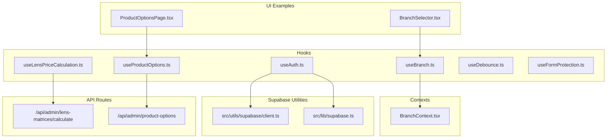
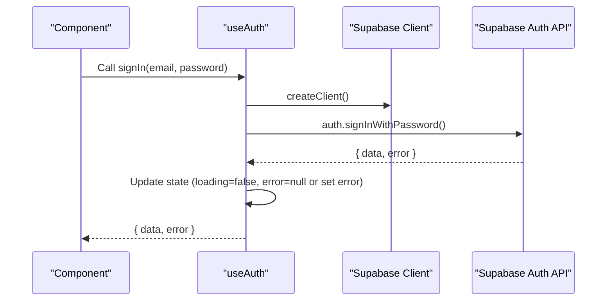
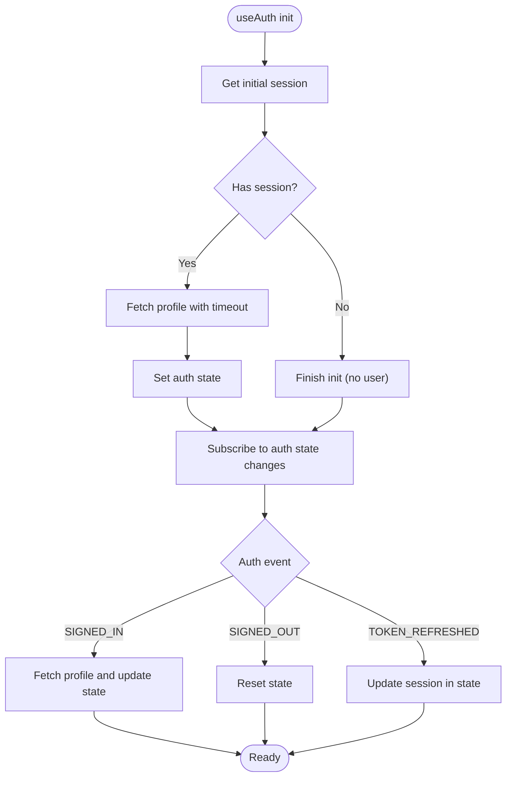
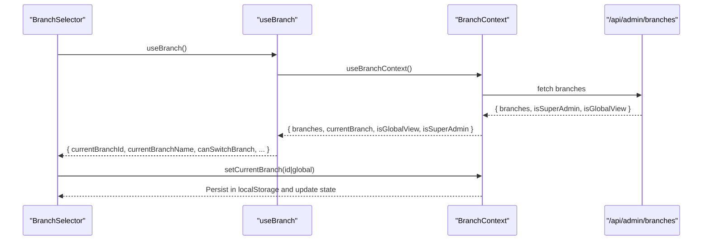
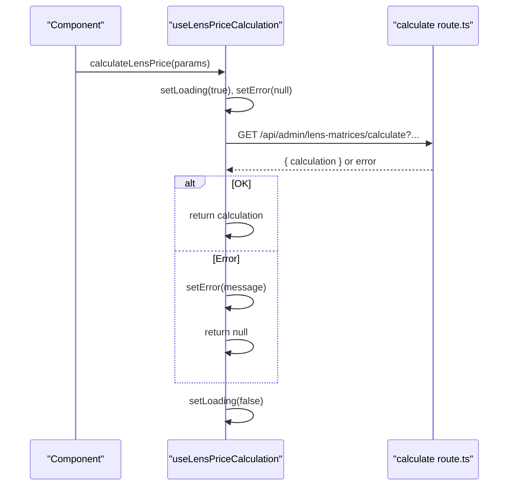
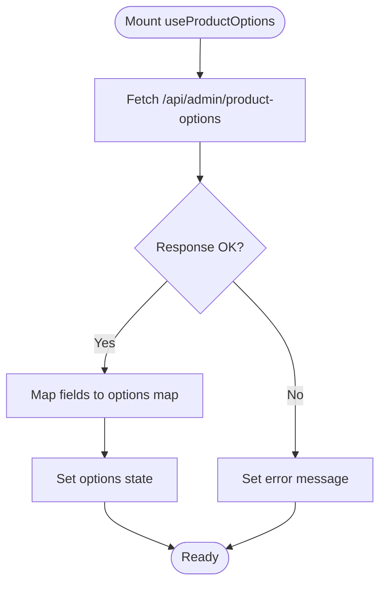
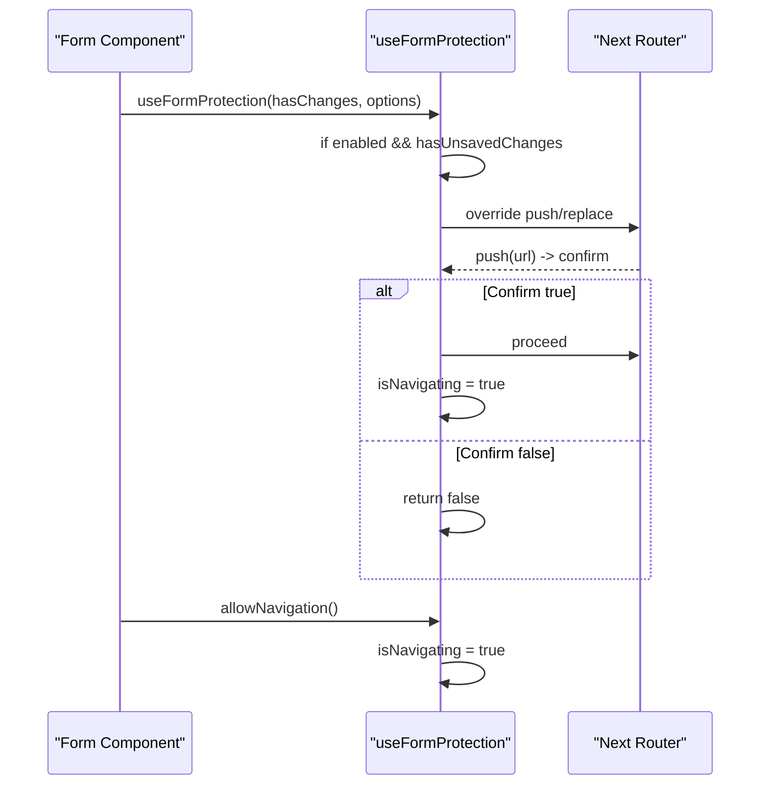
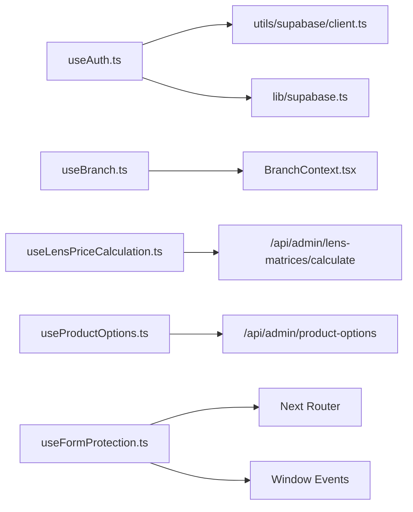

# Custom Hooks

<cite>
**Referenced Files in This Document**
- [useAuth.ts](file://src/hooks/useAuth.ts)
- [useBranch.ts](file://src/hooks/useBranch.ts)
- [useLensPriceCalculation.ts](file://src/hooks/useLensPriceCalculation.ts)
- [useProductOptions.ts](file://src/hooks/useProductOptions.ts)
- [useDebounce.ts](file://src/hooks/useDebounce.ts)
- [useFormProtection.ts](file://src/hooks/useFormProtection.ts)
- [BranchContext.tsx](file://src/contexts/BranchContext.tsx)
- [client.ts](file://src/utils/supabase/client.ts)
- [supabase.ts](file://src/lib/supabase.ts)
- [BranchSelector.tsx](file://src/components/admin/BranchSelector.tsx)
- [calculate route.ts](file://src/app/api/admin/lens-matrices/calculate/route.ts)
- [ProductOptionsPage.tsx](file://src/app/admin/products/options/page.tsx)
</cite>

## Table of Contents

1. [Introduction](#introduction)
2. [Project Structure](#project-structure)
3. [Core Components](#core-components)
4. [Architecture Overview](#architecture-overview)
5. [Detailed Component Analysis](#detailed-component-analysis)
6. [Dependency Analysis](#dependency-analysis)
7. [Performance Considerations](#performance-considerations)
8. [Troubleshooting Guide](#troubleshooting-guide)
9. [Conclusion](#conclusion)
10. [Appendices](#appendices)

## Introduction

This document explains the Opttius custom hook ecosystem and how the application uses a composable, encapsulated architecture to share cross-cutting logic across components. It focuses on:

- Authentication hooks (useAuth)
- Branch management hooks (useBranch and BranchContext)
- Business logic hooks (useLensPriceCalculation, useProductOptions)
- Utility hooks (useDebounce, useFormProtection)
- Integration with Supabase and internal APIs
- Error handling, loading states, caching, and performance optimization
- Guidelines for creating new hooks consistently

## Project Structure

The hooks live under src/hooks and integrate with contexts, utilities, and API routes. The Supabase client utilities are under src/utils/supabase and src/lib/supabase. Example components and pages demonstrate usage patterns.

**Diagram sources**

- [useAuth.ts](file://src/hooks/useAuth.ts#L1-L377)
- [useBranch.ts](file://src/hooks/useBranch.ts#L1-L53)
- [useLensPriceCalculation.ts](file://src/hooks/useLensPriceCalculation.ts#L1-L75)
- [useProductOptions.ts](file://src/hooks/useProductOptions.ts#L1-L73)
- [useDebounce.ts](file://src/hooks/useDebounce.ts#L1-L25)
- [useFormProtection.ts](file://src/hooks/useFormProtection.ts#L1-L198)
- [BranchContext.tsx](file://src/contexts/BranchContext.tsx#L1-L216)
- [client.ts](file://src/utils/supabase/client.ts#L1-L8)
- [supabase.ts](file://src/lib/supabase.ts#L1-L36)
- [calculate route.ts](file://src/app/api/admin/lens-matrices/calculate/route.ts#L107-L158)
- [ProductOptionsPage.tsx](file://src/app/admin/products/options/page.tsx#L1-L96)
- [BranchSelector.tsx](file://src/components/admin/BranchSelector.tsx#L1-L55)

**Section sources**

- [useAuth.ts](file://src/hooks/useAuth.ts#L1-L377)
- [useBranch.ts](file://src/hooks/useBranch.ts#L1-L53)
- [useLensPriceCalculation.ts](file://src/hooks/useLensPriceCalculation.ts#L1-L75)
- [useProductOptions.ts](file://src/hooks/useProductOptions.ts#L1-L73)
- [useDebounce.ts](file://src/hooks/useDebounce.ts#L1-L25)
- [useFormProtection.ts](file://src/hooks/useFormProtection.ts#L1-L198)
- [BranchContext.tsx](file://src/contexts/BranchContext.tsx#L1-L216)
- [client.ts](file://src/utils/supabase/client.ts#L1-L8)
- [supabase.ts](file://src/lib/supabase.ts#L1-L36)
- [calculate route.ts](file://src/app/api/admin/lens-matrices/calculate/route.ts#L107-L158)
- [ProductOptionsPage.tsx](file://src/app/admin/products/options/page.tsx#L1-L96)
- [BranchSelector.tsx](file://src/components/admin/BranchSelector.tsx#L1-L55)

## Core Components

- useAuth: Centralized authentication state, lifecycle, and actions (sign up, sign in, sign out, profile updates, password reset). Integrates with Supabase client utilities and handles timeouts and error scenarios gracefully.
- useBranch: Thin wrapper around BranchContext that exposes computed values and convenience flags for branch-aware UIs.
- BranchContext: Manages branch lists, current selection, global view mode, and persistence via localStorage for super admins. Provides refresh and selection APIs.
- useLensPriceCalculation: Encapsulates lens pricing calculations via an internal API route, returning loading/error states and memoized callbacks.
- useProductOptions: Loads and caches product option fields and values from the backend, exposing a refresh mechanism.
- useDebounce: Generic debouncing utility for search/filter inputs and similar UI events.
- useFormProtection: Guards forms against accidental navigation or refresh while unsaved changes exist, with programmatic allow/block controls.

**Section sources**

- [useAuth.ts](file://src/hooks/useAuth.ts#L10-L377)
- [useBranch.ts](file://src/hooks/useBranch.ts#L40-L53)
- [BranchContext.tsx](file://src/contexts/BranchContext.tsx#L20-L207)
- [useLensPriceCalculation.ts](file://src/hooks/useLensPriceCalculation.ts#L18-L75)
- [useProductOptions.ts](file://src/hooks/useProductOptions.ts#L30-L73)
- [useDebounce.ts](file://src/hooks/useDebounce.ts#L10-L25)
- [useFormProtection.ts](file://src/hooks/useFormProtection.ts#L48-L140)

## Architecture Overview

The hooks follow a layered pattern:

- Low-level utilities: Supabase client creation and shared Supabase client instances
- Domain contexts: BranchContext manages branch state and persistence
- Feature hooks: useAuth, useBranch, useLensPriceCalculation, useProductOptions, useDebounce, useFormProtection
- UI integration: Components consume hooks and pass parameters to API routes or contexts

**Diagram sources**

- [useAuth.ts](file://src/hooks/useAuth.ts#L267-L296)
- [client.ts](file://src/utils/supabase/client.ts#L3-L8)

**Section sources**

- [useAuth.ts](file://src/hooks/useAuth.ts#L18-L130)
- [client.ts](file://src/utils/supabase/client.ts#L1-L8)

## Detailed Component Analysis

### Authentication Hook: useAuth

- Purpose: Manage authentication state, session lifecycle, and user actions (sign up, sign in, sign out, profile updates, reset password).
- Key behaviors:
  - Initializes with a session fetch and auth state subscription
  - Applies timeouts to avoid hanging loads
  - Gracefully handles profile fetch failures and missing profiles
  - Exposes actions that update local state and delegate to Supabase
- Return structure: Includes state fields (user, profile, session, loading, error) plus action methods and a refetch helper.
- Integration points:
  - Uses createClient() for browser-side Supabase client
  - Calls Supabase auth RPCs and profile upserts
- Error handling: Distinguishes expected vs unexpected errors (e.g., missing profile rows) and logs appropriately.

**Diagram sources**

- [useAuth.ts](file://src/hooks/useAuth.ts#L27-L130)
- [client.ts](file://src/utils/supabase/client.ts#L3-L8)

**Section sources**

- [useAuth.ts](file://src/hooks/useAuth.ts#L10-L377)
- [client.ts](file://src/utils/supabase/client.ts#L1-L8)
- [supabase.ts](file://src/lib/supabase.ts#L1-L36)

### Branch Management: useBranch and BranchContext

- Purpose: Provide branch-aware state and UI helpers for multi-branch environments.
- useBranch:
  - Wraps BranchContext and adds computed values (currentBranchId, currentBranchName, canSwitchBranch, hasMultipleBranches)
- BranchContext:
  - Loads branches from /api/admin/branches
  - Persists selection in localStorage for super admins
  - Supports global view mode and refresh
  - Handles initialization and cleanup based on auth state

**Diagram sources**

- [useBranch.ts](file://src/hooks/useBranch.ts#L40-L53)
- [BranchContext.tsx](file://src/contexts/BranchContext.tsx#L73-L155)
- [BranchSelector.tsx](file://src/components/admin/BranchSelector.tsx#L15-L55)

**Section sources**

- [useBranch.ts](file://src/hooks/useBranch.ts#L1-L53)
- [BranchContext.tsx](file://src/contexts/BranchContext.tsx#L1-L216)
- [BranchSelector.tsx](file://src/components/admin/BranchSelector.tsx#L1-L55)

### Business Logic Hook: useLensPriceCalculation

- Purpose: Encapsulate lens price calculation via an internal API route (/api/admin/lens-matrices/calculate).
- Parameters: Accepts lens family, sphere, cylinder, optional addition, and sourcing type.
- Returns: Loading flag, error message, and a memoized callback that performs the fetch and returns the calculation result.
- Behavior:
  - Builds query parameters and calls the API
  - Handles non-OK responses and returns null with error messages
  - Suppresses toasts for specific “matrix not found” cases
  - Updates loading state in a finally block

**Diagram sources**

- [useLensPriceCalculation.ts](file://src/hooks/useLensPriceCalculation.ts#L22-L67)
- [calculate route.ts](file://src/app/api/admin/lens-matrices/calculate/route.ts#L107-L158)

**Section sources**

- [useLensPriceCalculation.ts](file://src/hooks/useLensPriceCalculation.ts#L1-L75)
- [calculate route.ts](file://src/app/api/admin/lens-matrices/calculate/route.ts#L107-L158)

### Business Logic Hook: useProductOptions

- Purpose: Load and cache product option fields and values from /api/admin/product-options.
- Returns: options map keyed by field_key, loading flag, error message, and a refresh function.
- Behavior:
  - Fetches on mount
  - Maps raw fields to a normalized options map
  - Handles network errors and displays user-friendly messages
  - Provides refresh to refetch options

**Diagram sources**

- [useProductOptions.ts](file://src/hooks/useProductOptions.ts#L35-L63)
- [ProductOptionsPage.tsx](file://src/app/admin/products/options/page.tsx#L81-L96)

**Section sources**

- [useProductOptions.ts](file://src/hooks/useProductOptions.ts#L1-L73)
- [ProductOptionsPage.tsx](file://src/app/admin/products/options/page.tsx#L1-L96)

### Utility Hook: useDebounce

- Purpose: Debounce a value with a configurable delay.
- Returns: The debounced value and cleans up timers on unmount.
- Usage: Ideal for search inputs, filter updates, and rate-limiting expensive operations.

**Section sources**

- [useDebounce.ts](file://src/hooks/useDebounce.ts#L1-L25)

### Utility Hook: useFormProtection

- Purpose: Protect forms from accidental navigation or refresh when unsaved changes exist.
- Parameters:
  - hasUnsavedChanges: boolean flag
  - options: enabled, message, onBeforeUnload
- Returns: isNavigating flag and allowNavigation/blockNavigation helpers.
- Behavior:
  - Intercepts beforeunload, router.push/replace, and Link navigation
  - Overrides Next.js router methods to prompt confirmation
  - Provides a simple useProtectedForm variant that tracks changes automatically

**Diagram sources**

- [useFormProtection.ts](file://src/hooks/useFormProtection.ts#L48-L140)

**Section sources**

- [useFormProtection.ts](file://src/hooks/useFormProtection.ts#L1-L198)

## Dependency Analysis

- useAuth depends on:
  - Supabase client utilities (createClient)
  - Supabase auth APIs
  - Local loading and error state management
- useBranch depends on:
  - BranchContext for state and persistence
  - /api/admin/branches for branch data
- useLensPriceCalculation depends on:
  - Internal API route for calculation
- useProductOptions depends on:
  - /api/admin/product-options for options
- useDebounce is self-contained
- useFormProtection depends on:
  - Next.js router
  - Window events (beforeunload)
  - Controlled navigation flags

**Diagram sources**

- [useAuth.ts](file://src/hooks/useAuth.ts#L1-L377)
- [client.ts](file://src/utils/supabase/client.ts#L1-L8)
- [supabase.ts](file://src/lib/supabase.ts#L1-L36)
- [useBranch.ts](file://src/hooks/useBranch.ts#L1-L53)
- [BranchContext.tsx](file://src/contexts/BranchContext.tsx#L1-L216)
- [useLensPriceCalculation.ts](file://src/hooks/useLensPriceCalculation.ts#L1-L75)
- [calculate route.ts](file://src/app/api/admin/lens-matrices/calculate/route.ts#L107-L158)
- [useProductOptions.ts](file://src/hooks/useProductOptions.ts#L1-L73)
- [ProductOptionsPage.tsx](file://src/app/admin/products/options/page.tsx#L1-L96)
- [useFormProtection.ts](file://src/hooks/useFormProtection.ts#L1-L198)

**Section sources**

- [useAuth.ts](file://src/hooks/useAuth.ts#L1-L377)
- [useBranch.ts](file://src/hooks/useBranch.ts#L1-L53)
- [useLensPriceCalculation.ts](file://src/hooks/useLensPriceCalculation.ts#L1-L75)
- [useProductOptions.ts](file://src/hooks/useProductOptions.ts#L1-L73)
- [useDebounce.ts](file://src/hooks/useDebounce.ts#L1-L25)
- [useFormProtection.ts](file://src/hooks/useFormProtection.ts#L1-L198)
- [BranchContext.tsx](file://src/contexts/BranchContext.tsx#L1-L216)
- [client.ts](file://src/utils/supabase/client.ts#L1-L8)
- [supabase.ts](file://src/lib/supabase.ts#L1-L36)
- [calculate route.ts](file://src/app/api/admin/lens-matrices/calculate/route.ts#L107-L158)
- [ProductOptionsPage.tsx](file://src/app/admin/products/options/page.tsx#L1-L96)

## Performance Considerations

- Memoization and stable callbacks:
  - useLensPriceCalculation uses useCallback to avoid recreating the calculation function on every render.
  - useDebounce returns a stable debounced value; ensure delay is constant to prevent unnecessary re-renders.
- Dependency arrays:
  - useLensPriceCalculation’s useCallback has an empty dependency array, which is correct for a stable function.
  - useFormProtection’s effect includes all relevant dependencies (enabled, hasUnsavedChanges, message, onBeforeUnload, router, isNavigating) to avoid stale closures.
- Avoiding callback re-creations:
  - Prefer passing memoized callbacks from hooks to child components to prevent prop drift.
- Loading and caching:
  - useProductOptions caches options in state and exposes a refresh function.
  - useBranch persists selections in localStorage for super admins to avoid repeated network requests.
- Timeout strategies:
  - useAuth applies timeouts for session retrieval and profile fetch to prevent indefinite loading.
- Minimizing re-renders:
  - Keep heavy computations outside hooks or memoize with useMemo/useCallback in consumers when needed.

[No sources needed since this section provides general guidance]

## Troubleshooting Guide

- Authentication issues:
  - Verify Supabase environment variables are present and client creation succeeds.
  - Check for auth timeouts and network errors; the hook logs warnings and sets loading to false after a timeout.
  - Profile fetch errors are handled gracefully; missing profiles are treated as non-fatal for admin flows.
- Branch switching:
  - Ensure the user has proper access to the selected branch; BranchContext validates saved selections and falls back to global view if invalid.
  - Super admins’ selections are persisted in localStorage; verify keys and values.
- Lens price calculation:
  - Confirm the API route is reachable and returns a valid calculation object.
  - If no matching matrix is found, the hook returns null without throwing a toast.
- Product options:
  - On network errors, the hook sets an error message; ensure the endpoint returns a proper JSON payload.
- Form protection:
  - If navigation is blocked unexpectedly, verify hasUnsavedChanges and enabled flags.
  - Use allowNavigation() after successful saves to unlock navigation.

**Section sources**

- [useAuth.ts](file://src/hooks/useAuth.ts#L31-L91)
- [BranchContext.tsx](file://src/contexts/BranchContext.tsx#L73-L155)
- [useLensPriceCalculation.ts](file://src/hooks/useLensPriceCalculation.ts#L53-L67)
- [useProductOptions.ts](file://src/hooks/useProductOptions.ts#L53-L59)
- [useFormProtection.ts](file://src/hooks/useFormProtection.ts#L63-L123)

## Conclusion

The Opttius custom hook ecosystem provides a robust, composable foundation for authentication, branch management, business logic, and utility concerns. Hooks encapsulate side effects, integrate cleanly with Supabase and internal APIs, and expose consistent return shapes with loading and error states. Following the patterns documented here ensures predictable behavior, reliable performance, and maintainable code across the application.

[No sources needed since this section summarizes without analyzing specific files]

## Appendices

### Creating New Hooks: Best Practices

- Encapsulation:
  - Keep side effects inside the hook (e.g., fetches, subscriptions).
  - Expose a minimal, stable API surface (state + actions).
- Stability:
  - Use useCallback for functions returned by the hook.
  - Use useMemo for derived values when appropriate.
- Dependencies:
  - Include all dependencies in dependency arrays to avoid stale closures.
- Error and loading:
  - Provide explicit loading and error states.
  - Distinguish expected vs unexpected errors.
- Testing:
  - Mock external dependencies (fetch, router, window).
  - Verify state transitions and side effects.

[No sources needed since this section provides general guidance]
