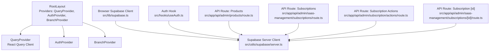
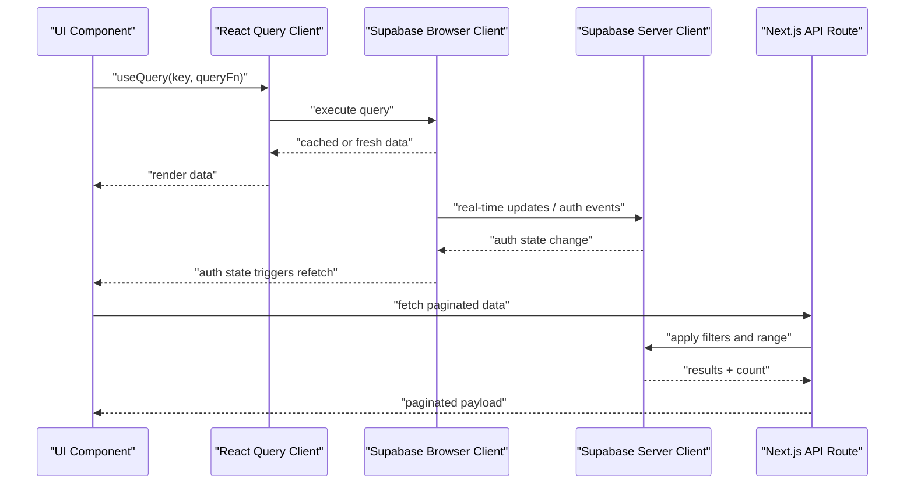
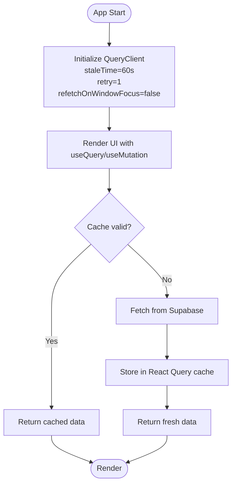
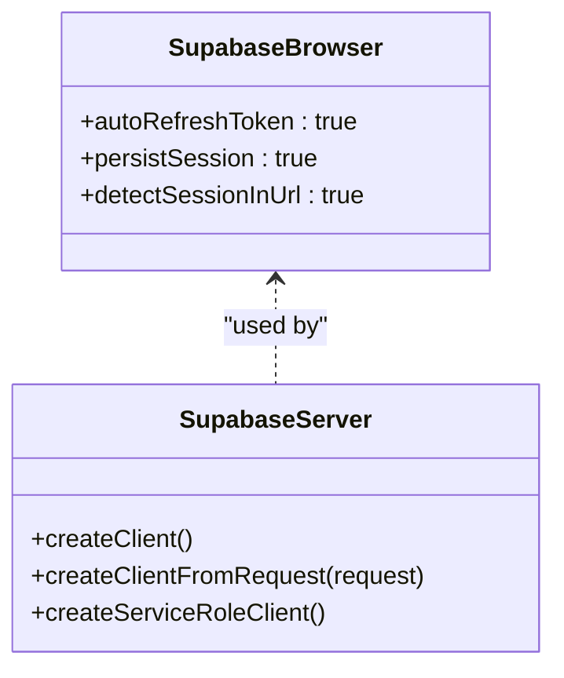
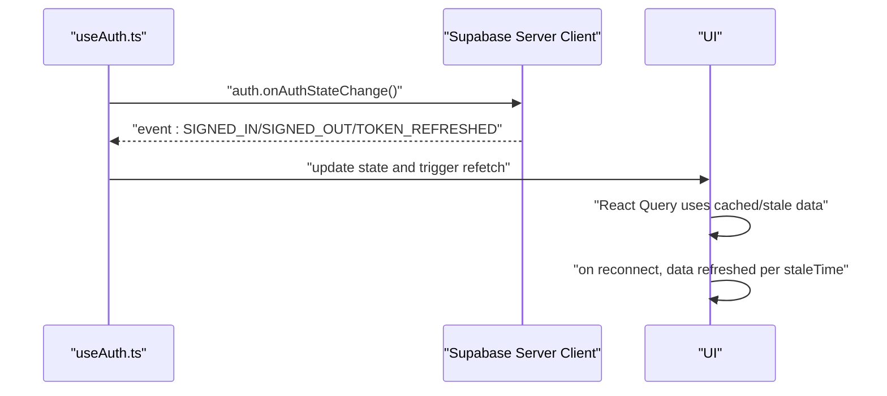
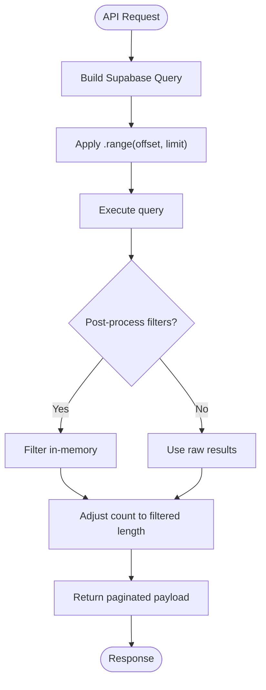
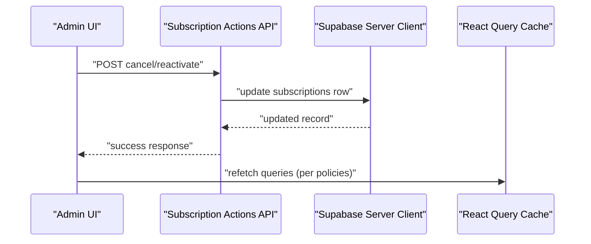
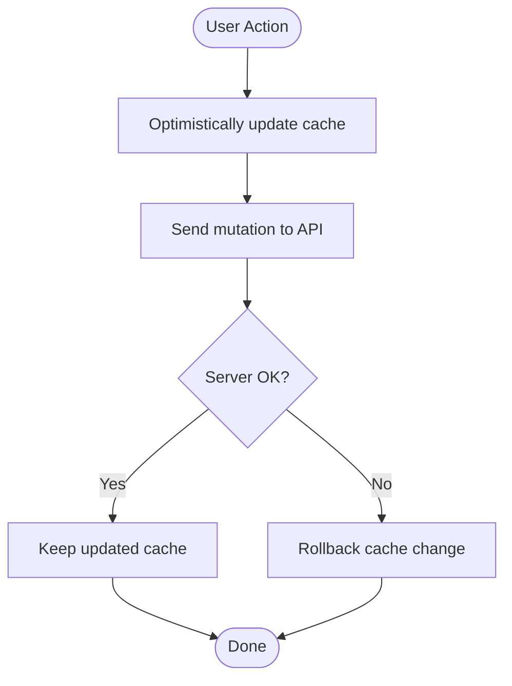
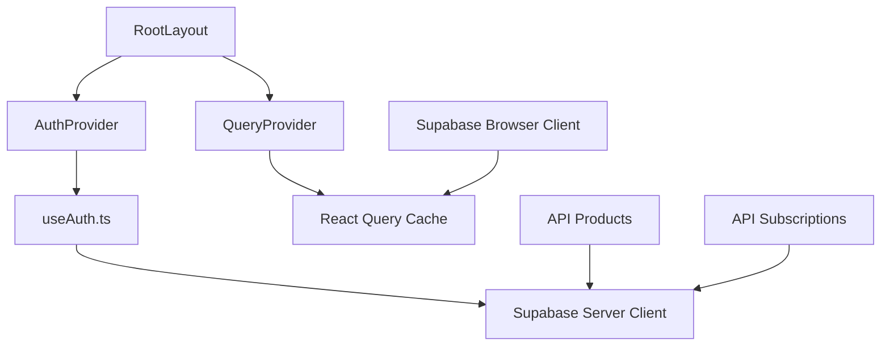

# Data Fetching & Caching

<cite>
**Referenced Files in This Document**
- [QueryProvider.tsx](file://src/lib/react-query/QueryProvider.tsx)
- [layout.tsx](file://src/app/layout.tsx)
- [supabase.ts](file://src/lib/supabase.ts)
- [server.ts](file://src/utils/supabase/server.ts)
- [useAuth.ts](file://src/hooks/useAuth.ts)
- [products route.ts](file://src/app/api/admin/products/route.ts)
- [subscriptions route.ts](file://src/app/api/admin/saas-management/subscriptions/route.ts)
- [subscription actions route.ts](file://src/app/api/admin/subscription/actions/route.ts)
- [subscription [id] route.ts](file://src/app/api/admin/saas-management/subscriptions/[id]/route.ts)
</cite>

## Table of Contents

1. [Introduction](#introduction)
2. [Project Structure](#project-structure)
3. [Core Components](#core-components)
4. [Architecture Overview](#architecture-overview)
5. [Detailed Component Analysis](#detailed-component-analysis)
6. [Dependency Analysis](#dependency-analysis)
7. [Performance Considerations](#performance-considerations)
8. [Troubleshooting Guide](#troubleshooting-guide)
9. [Conclusion](#conclusion)

## Introduction

This document explains Opttius’s data fetching and caching strategies, focusing on:

- React Query integration for server state management, caching policies, and automatic synchronization
- Supabase client configuration and real-time subscription patterns
- Offline-first considerations and background synchronization
- Pagination, infinite queries, and cache invalidation
- Optimistic updates, error retry, and stale-while-revalidate patterns
- Performance optimization and troubleshooting guidance

## Project Structure

Opttius wraps the entire application with a React Query provider and integrates Supabase clients for browser and server environments. Authentication state changes trigger reactive updates, while API routes implement paginated and filtered data retrieval.

**Diagram sources**

- [layout.tsx](file://src/app/layout.tsx#L30-L55)
- [QueryProvider.tsx](file://src/lib/react-query/QueryProvider.tsx#L7-L34)
- [supabase.ts](file://src/lib/supabase.ts#L1-L36)
- [server.ts](file://src/utils/supabase/server.ts#L6-L33)
- [useAuth.ts](file://src/hooks/useAuth.ts#L94-L130)
- [products route.ts](file://src/app/api/admin/products/route.ts#L477-L516)
- [subscriptions route.ts](file://src/app/api/admin/saas-management/subscriptions/route.ts#L83-L122)
- [subscription actions route.ts](file://src/app/api/admin/subscription/actions/route.ts#L80-L128)
- [subscription [id] route.ts](file://src/app/api/admin/saas-management/subscriptions/[id]/route.ts#L103-L159)

**Section sources**

- [layout.tsx](file://src/app/layout.tsx#L30-L55)
- [QueryProvider.tsx](file://src/lib/react-query/QueryProvider.tsx#L7-L34)

## Core Components

- React Query provider with default caching and retry policies
- Supabase browser client configured for session persistence and token refresh
- Supabase server client factory supporting cookie and Bearer-token authentication
- Auth state change listener to keep UI synchronized with backend events
- API routes implementing pagination and post-processing filters

Key behaviors:

- Queries are cached for 1 minute and not refetched on window focus
- Mutations and queries retry once on failure
- Supabase server client supports both cookie-based and Bearer-token authentication for API routes and tests

**Section sources**

- [QueryProvider.tsx](file://src/lib/react-query/QueryProvider.tsx#L10-L24)
- [supabase.ts](file://src/lib/supabase.ts#L11-L17)
- [server.ts](file://src/utils/supabase/server.ts#L43-L92)
- [useAuth.ts](file://src/hooks/useAuth.ts#L94-L130)

## Architecture Overview

The system combines React Query for client-side caching and Supabase for real-time data access. Authentication changes propagate via Supabase auth listeners, while API routes handle server-side filtering and pagination.

**Diagram sources**

- [QueryProvider.tsx](file://src/lib/react-query/QueryProvider.tsx#L10-L24)
- [supabase.ts](file://src/lib/supabase.ts#L11-L17)
- [server.ts](file://src/utils/supabase/server.ts#L43-L92)
- [useAuth.ts](file://src/hooks/useAuth.ts#L94-L130)
- [products route.ts](file://src/app/api/admin/products/route.ts#L477-L516)

## Detailed Component Analysis

### React Query Integration and Caching Policies

- Default staleTime: 1 minute to prevent immediate refetch after SSR hydration
- refetchOnWindowFocus disabled to reduce unnecessary network activity
- Retry: 1 for both queries and mutations
- Devtools enabled in development for diagnostics

**Diagram sources**

- [QueryProvider.tsx](file://src/lib/react-query/QueryProvider.tsx#L10-L24)

**Section sources**

- [QueryProvider.tsx](file://src/lib/react-query/QueryProvider.tsx#L10-L24)

### Supabase Client Configuration

- Browser client: auto-refresh tokens, persist sessions, detect session in URL
- Server client factory:
  - Cookie-based authentication for normal browser flows
  - Bearer-token support for API routes and tests
  - Service role client for admin operations bypassing RLS

**Diagram sources**

- [supabase.ts](file://src/lib/supabase.ts#L11-L17)
- [server.ts](file://src/utils/supabase/server.ts#L6-L33)
- [server.ts](file://src/utils/supabase/server.ts#L43-L92)
- [server.ts](file://src/utils/supabase/server.ts#L95-L109)

**Section sources**

- [supabase.ts](file://src/lib/supabase.ts#L11-L17)
- [server.ts](file://src/utils/supabase/server.ts#L6-L33)
- [server.ts](file://src/utils/supabase/server.ts#L43-L92)
- [server.ts](file://src/utils/supabase/server.ts#L95-L109)

### Real-Time Subscriptions and Offline-First Patterns

- Auth state changes are subscribed to via Supabase auth listeners
- On SIGNED_IN, SIGNED_OUT, and TOKEN_REFRESHED events, the UI reacts accordingly
- Offline-first: React Query caches remain valid per staleTime; on reconnect, data is freshened automatically

**Diagram sources**

- [useAuth.ts](file://src/hooks/useAuth.ts#L94-L130)

**Section sources**

- [useAuth.ts](file://src/hooks/useAuth.ts#L94-L130)

### Pagination and Post-Processing Filters

- API routes implement server-side range-based pagination
- Post-processing filters (e.g., stock availability) applied to fetched arrays
- Count adjusted to approximate pagination correctness after filtering

**Diagram sources**

- [products route.ts](file://src/app/api/admin/products/route.ts#L477-L516)
- [subscriptions route.ts](file://src/app/api/admin/saas-management/subscriptions/route.ts#L83-L122)

**Section sources**

- [products route.ts](file://src/app/api/admin/products/route.ts#L477-L516)
- [subscriptions route.ts](file://src/app/api/admin/saas-management/subscriptions/route.ts#L83-L122)

### Background Synchronization and Cache Invalidation

- Subscription lifecycle actions (cancel/reactivate) update records server-side
- Subscription updates accept status and period fields; cancellation toggles timestamps
- These operations invalidate caches indirectly by triggering refetches via auth/window focus policies

**Diagram sources**

- [subscription actions route.ts](file://src/app/api/admin/subscription/actions/route.ts#L80-L128)
- [subscription [id] route.ts](file://src/app/api/admin/saas-management/subscriptions/[id]/route.ts#L103-L159)

**Section sources**

- [subscription actions route.ts](file://src/app/api/admin/subscription/actions/route.ts#L80-L128)
- [subscription [id] route.ts](file://src/app/api/admin/saas-management/subscriptions/[id]/route.ts#L103-L159)

### Optimistic Updates, Error Retry, and Stale-While-Revalidate

- Optimistic updates: Not explicitly implemented in the referenced files; recommended pattern is to mutate cache locally before server response and roll back on error
- Error retry: Both queries and mutations retry once; adjust retry count based on criticality
- Stale-while-revalidate: staleTime of 1 minute ensures UI remains responsive during network transitions

[No sources needed since this diagram shows conceptual workflow, not actual code structure]

**Section sources**

- [QueryProvider.tsx](file://src/lib/react-query/QueryProvider.tsx#L10-L24)

## Dependency Analysis

React Query provider is initialized at the root layout and shared across the app. Supabase clients are used by hooks and API routes. Authentication changes drive cache refresh behavior.

**Diagram sources**

- [layout.tsx](file://src/app/layout.tsx#L30-L55)
- [QueryProvider.tsx](file://src/lib/react-query/QueryProvider.tsx#L7-L34)
- [useAuth.ts](file://src/hooks/useAuth.ts#L94-L130)
- [supabase.ts](file://src/lib/supabase.ts#L11-L17)
- [server.ts](file://src/utils/supabase/server.ts#L43-L92)
- [products route.ts](file://src/app/api/admin/products/route.ts#L477-L516)
- [subscriptions route.ts](file://src/app/api/admin/saas-management/subscriptions/route.ts#L83-L122)

**Section sources**

- [layout.tsx](file://src/app/layout.tsx#L30-L55)
- [QueryProvider.tsx](file://src/lib/react-query/QueryProvider.tsx#L7-L34)
- [useAuth.ts](file://src/hooks/useAuth.ts#L94-L130)
- [supabase.ts](file://src/lib/supabase.ts#L11-L17)
- [server.ts](file://src/utils/supabase/server.ts#L43-L92)

## Performance Considerations

- Prefer server-side pagination and range queries to limit payload sizes
- Use post-processing filters judiciously; they run in-memory and can increase latency for large datasets
- Keep staleTime tuned to balance responsiveness and freshness
- Limit concurrent queries and batch operations where possible
- Use selective refetching by key to minimize unnecessary reloads
- Monitor cache growth and consider manual cache eviction for large lists

[No sources needed since this section provides general guidance]

## Troubleshooting Guide

Common issues and remedies:

- Network errors: React Query retries once; consider increasing retry for critical mutations
- Cache inconsistencies: Verify staleTime and ensure refetch triggers on auth state changes
- Pagination anomalies: Post-processing filters adjust counts; ensure UI handles approximate counts
- Authentication drift: Confirm Supabase auth listeners are active and session persistence is enabled

**Section sources**

- [QueryProvider.tsx](file://src/lib/react-query/QueryProvider.tsx#L10-L24)
- [useAuth.ts](file://src/hooks/useAuth.ts#L94-L130)
- [products route.ts](file://src/app/api/admin/products/route.ts#L477-L516)

## Conclusion

Opttius leverages React Query for robust client caching and Supabase for reliable real-time data access. The combination provides predictable caching, resilient retries, and straightforward pagination. For large datasets and advanced UX, adopt optimistic updates, refine stale-while-revalidate policies, and implement targeted cache invalidation to maintain consistency and performance.
