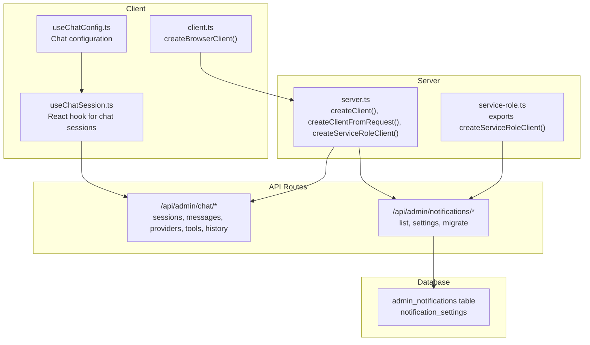
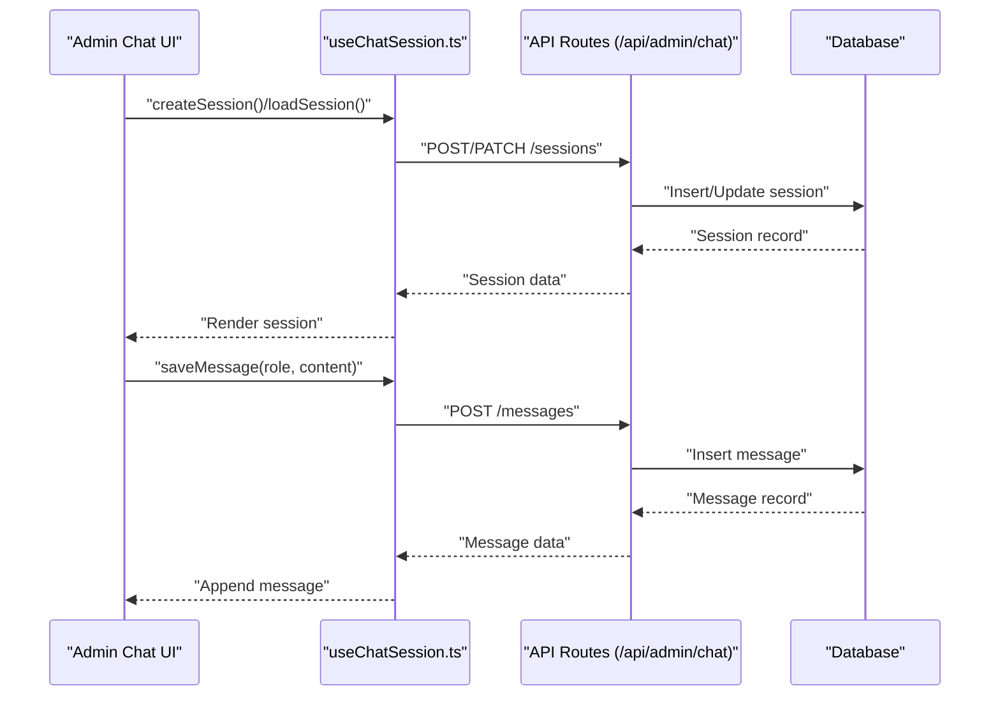
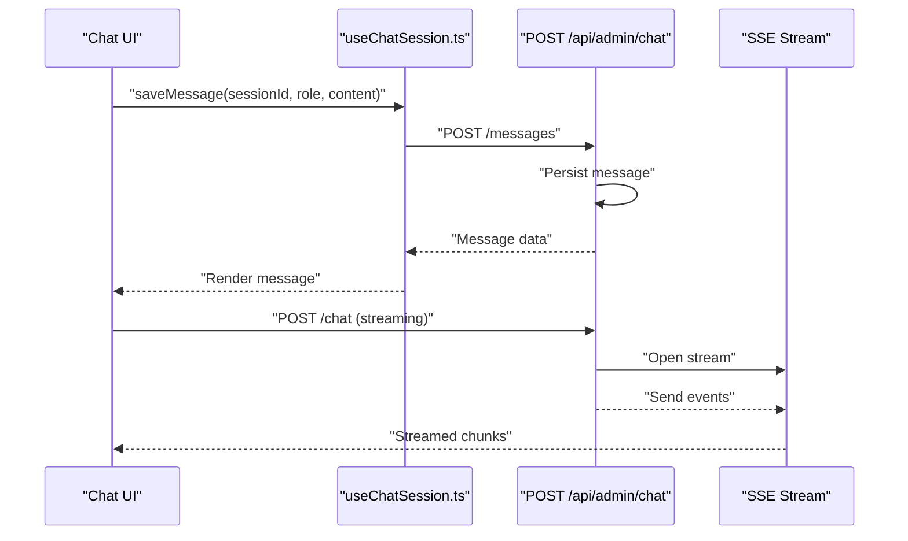
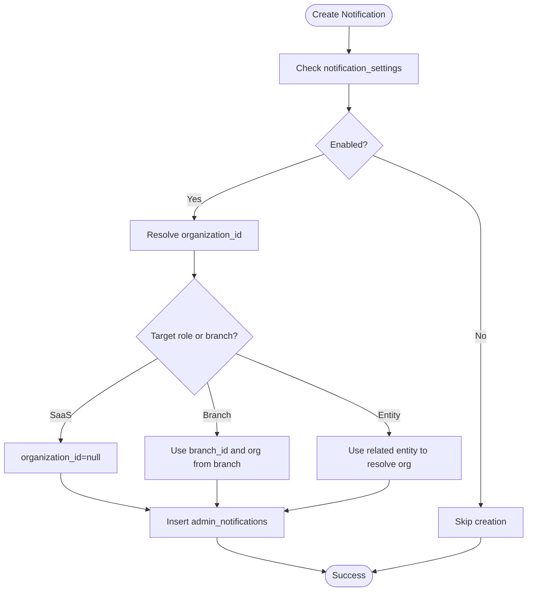
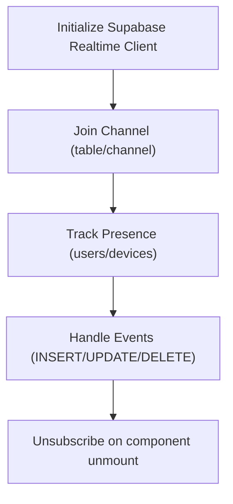
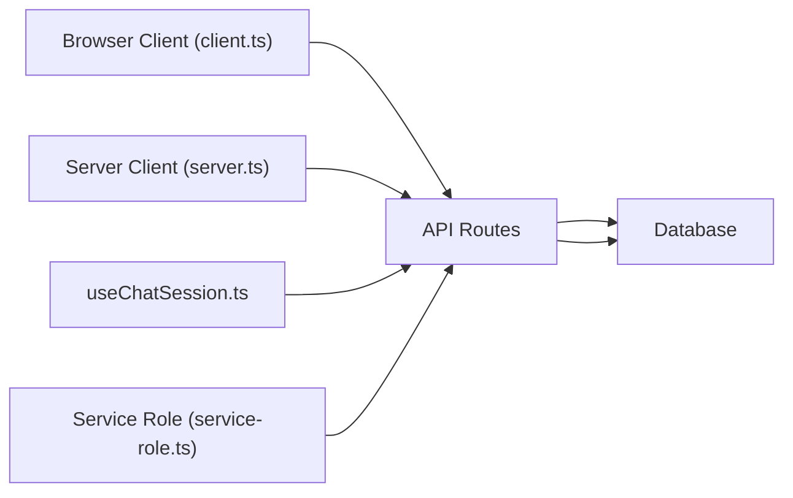

# Real-time Data Synchronization

<cite>
**Referenced Files in This Document**
- [supabase.ts](file://src/lib/supabase.ts)
- [client.ts](file://src/utils/supabase/client.ts)
- [server.ts](file://src/utils/supabase/server.ts)
- [service-role.ts](file://src/utils/supabase/service-role.ts)
- [useChatSession.ts](file://src/hooks/useChatSession.ts)
- [useChatConfig.ts](file://src/hooks/useChatConfig.ts)
- [notification-service.ts](file://src/lib/notifications/notification-service.ts)
- [route.ts](file://src/app/api/admin/chat/route.ts)
- [route.ts](file://src/app/api/admin/chat/sessions/route.ts)
- [route.ts](file://src/app/api/admin/chat/messages/route.ts)
- [route.ts](file://src/app/api/admin/chat/providers/route.ts)
- [route.ts](file://src/app/api/admin/chat/tools/route.ts)
- [route.ts](file://src/app/api/admin/chat/history/route.ts)
- [page.tsx](file://src/app/admin/chat/page.tsx)
- [page.tsx](file://src/app/admin/notifications/page.tsx)
- [route.ts](file://src/app/api/admin/notifications/route.ts)
- [route.ts](file://src/app/api/admin/system/migrate-notifications/route.ts)
- [20250118000000_create_admin_notifications.sql](file://supabase/migrations/20250118000000_create_admin_notifications.sql)
- [20250129000000_add_optical_notification_types.sql](file://supabase/migrations/20250129000000_add_optical_notification_types.sql)
- [20250129000001_insert_optical_notification_settings.sql](file://supabase/migrations/20250129000001_insert_optical_notification_settings.sql)
- [20260201000001_add_organization_id_to_notifications.sql](file://supabase/migrations/20260201000001_add_organization_id_to_notifications.sql)
- [20260201000000_admin_notifications_root_dev_visibility.sql](file://supabase/migrations/20260201000000_admin_notifications_root_dev_visibility.sql)
</cite>

## Table of Contents

1. [Introduction](#introduction)
2. [Project Structure](#project-structure)
3. [Core Components](#core-components)
4. [Architecture Overview](#architecture-overview)
5. [Detailed Component Analysis](#detailed-component-analysis)
6. [Dependency Analysis](#dependency-analysis)
7. [Performance Considerations](#performance-considerations)
8. [Troubleshooting Guide](#troubleshooting-guide)
9. [Conclusion](#conclusion)

## Introduction

This document explains the Opttius real-time data synchronization system with a focus on Supabase Realtime integration for live updates across the application. It documents subscription patterns for tables, channels, and presence tracking, and provides concrete examples from the codebase showing real-time listener setup, event handling, and connection management. It also covers notification systems, chat functionality, and collaborative features that rely on real-time updates, along with conflict resolution strategies, optimistic updates with rollback capabilities, offline queue management, connection reliability, automatic reconnection, graceful degradation, performance considerations, and troubleshooting guidance.

## Project Structure

The real-time system spans client utilities, server utilities, API routes, React hooks, and database migrations:

- Client and server Supabase clients for browser and SSR contexts
- Real-time chat API endpoints and React hooks for session/message management
- Notification service and database migrations for admin notifications

**Diagram sources**

- [useChatSession.ts](file://src/hooks/useChatSession.ts#L63-L252)
- [useChatConfig.ts](file://src/hooks/useChatConfig.ts#L64-L242)
- [client.ts](file://src/utils/supabase/client.ts#L1-L8)
- [server.ts](file://src/utils/supabase/server.ts#L6-L33)
- [service-role.ts](file://src/utils/supabase/service-role.ts#L1-L12)
- [route.ts](file://src/app/api/admin/chat/route.ts#L375-L373)
- [route.ts](file://src/app/api/admin/chat/sessions/route.ts)
- [route.ts](file://src/app/api/admin/chat/messages/route.ts)
- [route.ts](file://src/app/api/admin/chat/providers/route.ts)
- [route.ts](file://src/app/api/admin/chat/tools/route.ts)
- [route.ts](file://src/app/api/admin/chat/history/route.ts)
- [page.tsx](file://src/app/admin/chat/page.tsx)
- [page.tsx](file://src/app/admin/notifications/page.tsx)
- [route.ts](file://src/app/api/admin/notifications/route.ts)
- [route.ts](file://src/app/api/admin/system/migrate-notifications/route.ts)
- [20250118000000_create_admin_notifications.sql](file://supabase/migrations/20250118000000_create_admin_notifications.sql)
- [20250129000000_add_optical_notification_types.sql](file://supabase/migrations/20250129000000_add_optical_notification_types.sql)
- [20250129000001_insert_optical_notification_settings.sql](file://supabase/migrations/20250129000001_insert_optical_notification_settings.sql)
- [20260201000001_add_organization_id_to_notifications.sql](file://supabase/migrations/20260201000001_add_organization_id_to_notifications.sql)
- [20260201000000_admin_notifications_root_dev_visibility.sql](file://supabase/migrations/20260201000000_admin_notifications_root_dev_visibility.sql)

**Section sources**

- [supabase.ts](file://src/lib/supabase.ts#L1-L36)
- [client.ts](file://src/utils/supabase/client.ts#L1-L8)
- [server.ts](file://src/utils/supabase/server.ts#L1-L110)
- [service-role.ts](file://src/utils/supabase/service-role.ts#L1-L12)

## Core Components

- Supabase client initialization and environment validation
- Browser and server client factories for SSR and API routes
- Service role client for admin operations bypassing RLS
- Chat session and message management via React hooks and API routes
- Notification service for creating and scoping admin notifications
- Database schema for notifications and settings

Key implementation references:

- Supabase client creation and environment checks
- Browser client factory
- Server client with cookie handling and bearer token support
- Service role client for admin operations
- Chat session lifecycle and message persistence
- Notification creation with scoping and settings

**Section sources**

- [supabase.ts](file://src/lib/supabase.ts#L1-L36)
- [client.ts](file://src/utils/supabase/client.ts#L1-L8)
- [server.ts](file://src/utils/supabase/server.ts#L6-L33)
- [server.ts](file://src/utils/supabase/server.ts#L43-L91)
- [server.ts](file://src/utils/supabase/server.ts#L94-L110)
- [useChatSession.ts](file://src/hooks/useChatSession.ts#L63-L252)
- [useChatConfig.ts](file://src/hooks/useChatConfig.ts#L64-L242)
- [notification-service.ts](file://src/lib/notifications/notification-service.ts#L49-L160)

## Architecture Overview

The real-time architecture integrates Supabase clients with Next.js API routes and React components. The browser client is used for UI interactions, while server clients handle SSR and API route authentication. Notifications are persisted to the database and scoped to organizations or branches. Chat sessions and messages are managed through dedicated API endpoints.

**Diagram sources**

- [useChatSession.ts](file://src/hooks/useChatSession.ts#L71-L149)
- [useChatSession.ts](file://src/hooks/useChatSession.ts#L151-L173)
- [useChatSession.ts](file://src/hooks/useChatSession.ts#L202-L233)
- [route.ts](file://src/app/api/admin/chat/sessions/route.ts)
- [route.ts](file://src/app/api/admin/chat/messages/route.ts)

## Detailed Component Analysis

### Supabase Client Utilities

- Browser client factory for client-side usage
- Server client with cookie store integration and bearer token fallback
- Service role client for admin operations

Implementation highlights:

- Environment variable validation and client creation
- Cookie-based and bearer-token-based authentication flows
- Service role client for bypassing RLS in admin operations

**Section sources**

- [supabase.ts](file://src/lib/supabase.ts#L1-L36)
- [client.ts](file://src/utils/supabase/client.ts#L1-L8)
- [server.ts](file://src/utils/supabase/server.ts#L6-L33)
- [server.ts](file://src/utils/supabase/server.ts#L43-L91)
- [server.ts](file://src/utils/supabase/server.ts#L94-L110)
- [service-role.ts](file://src/utils/supabase/service-role.ts#L1-L12)

### Chat Session and Message Management

- React hook for managing chat sessions and messages
- API routes for sessions, messages, providers, tools, and history
- Streaming chat endpoint with error handling

Key flows:

- Creating a session with provider, model, and optional config
- Loading a session and retrieving messages
- Saving messages with role and metadata
- Streaming chat responses via Server-Sent Events

**Diagram sources**

- [useChatSession.ts](file://src/hooks/useChatSession.ts#L202-L233)
- [route.ts](file://src/app/api/admin/chat/route.ts#L375-L373)

**Section sources**

- [useChatSession.ts](file://src/hooks/useChatSession.ts#L63-L252)
- [useChatConfig.ts](file://src/hooks/useChatConfig.ts#L64-L242)
- [route.ts](file://src/app/api/admin/chat/route.ts#L375-L373)

### Notification System

- Notification service for creating and scoping notifications
- Database schema for admin notifications and settings
- Migration-driven notification types and visibility controls

Notification creation flow:

- Check notification settings for type enablement and priority
- Resolve organization scope from branch or related entity
- Insert notification with optional target admin role or branch scoping

**Diagram sources**

- [notification-service.ts](file://src/lib/notifications/notification-service.ts#L53-L160)
- [20250118000000_create_admin_notifications.sql](file://supabase/migrations/20250118000000_create_admin_notifications.sql)
- [20250129000000_add_optical_notification_types.sql](file://supabase/migrations/20250129000000_add_optical_notification_types.sql)
- [20250129000001_insert_optical_notification_settings.sql](file://supabase/migrations/20250129000001_insert_optical_notification_settings.sql)
- [20260201000001_add_organization_id_to_notifications.sql](file://supabase/migrations/20260201000001_add_organization_id_to_notifications.sql)
- [20260201000000_admin_notifications_root_dev_visibility.sql](file://supabase/migrations/20260201000000_admin_notifications_root_dev_visibility.sql)

**Section sources**

- [notification-service.ts](file://src/lib/notifications/notification-service.ts#L49-L160)
- [page.tsx](file://src/app/admin/notifications/page.tsx)
- [route.ts](file://src/app/api/admin/notifications/route.ts)
- [route.ts](file://src/app/api/admin/system/migrate-notifications/route.ts)

### Realtime Channels, Presence, and Event Handling

- Supabase Realtime client and channel/presence APIs are available via the installed package
- The codebase demonstrates Supabase client usage for browser and server contexts
- Realtime channels and presence are not explicitly implemented in the examined files; however, the client infrastructure supports building such features

Recommended patterns:

- Initialize Realtime client using the existing browser/server client factories
- Subscribe to tables/channels with appropriate filters and presence tracking
- Handle join/leave events and message updates with proper cleanup

Note: The following diagram illustrates a conceptual pattern for realtime channels and presence. It does not map to specific source files.

[No sources needed since this diagram shows conceptual workflow, not actual code structure]

## Dependency Analysis

The real-time system depends on:

- Supabase client libraries for browser and SSR contexts
- Next.js API routes for chat and notifications
- Database schema for storing sessions, messages, and notifications
- React hooks for state management and lifecycle

**Diagram sources**

- [client.ts](file://src/utils/supabase/client.ts#L1-L8)
- [server.ts](file://src/utils/supabase/server.ts#L6-L33)
- [service-role.ts](file://src/utils/supabase/service-role.ts#L1-L12)
- [useChatSession.ts](file://src/hooks/useChatSession.ts#L63-L252)

**Section sources**

- [client.ts](file://src/utils/supabase/client.ts#L1-L8)
- [server.ts](file://src/utils/supabase/server.ts#L1-L110)
- [service-role.ts](file://src/utils/supabase/service-role.ts#L1-L12)
- [useChatSession.ts](file://src/hooks/useChatSession.ts#L63-L252)

## Performance Considerations

- Manage multiple subscriptions efficiently by grouping related tables and minimizing redundant listeners
- Implement proper cleanup on component unmount to prevent memory leaks
- Use debouncing and batching for frequent updates to reduce render pressure
- Leverage server-side rendering with cookie-based clients to avoid unnecessary client-side re-initialization
- Stream chat responses to avoid blocking the UI during long-running operations
- Cache frequently accessed data locally and invalidate on real-time events

## Troubleshooting Guide

Common issues and resolutions:

- Missing environment variables for Supabase URL/keys cause client initialization errors
- Authentication failures due to missing cookies or invalid bearer tokens
- Realtime connection drops requiring reconnection logic
- Event ordering problems when multiple updates occur rapidly
- Subscription lifecycle mismanagement leading to memory leaks

Concrete references:

- Environment validation and error handling in client initialization
- Cookie handling and bearer token fallback in server client
- Streaming error handling in chat API
- Proper cleanup in React hooks for chat sessions and messages

**Section sources**

- [supabase.ts](file://src/lib/supabase.ts#L7-L9)
- [server.ts](file://src/utils/supabase/server.ts#L16-L28)
- [server.ts](file://src/utils/supabase/server.ts#L54-L81)
- [route.ts](file://src/app/api/admin/chat/route.ts#L333-L351)
- [useChatSession.ts](file://src/hooks/useChatSession.ts#L235-L239)

## Conclusion

Opttius leverages Supabase clients and Next.js API routes to deliver a robust real-time experience for chat and notifications. The system provides modular client utilities, React hooks for session management, and a notification service with scoping and settings. While explicit Supabase Realtime channel/presence usage is not present in the examined files, the underlying client infrastructure enables building such features. By following the recommended patterns for connection management, event handling, and lifecycle cleanup, the application can achieve reliable, scalable real-time updates with strong performance characteristics.
