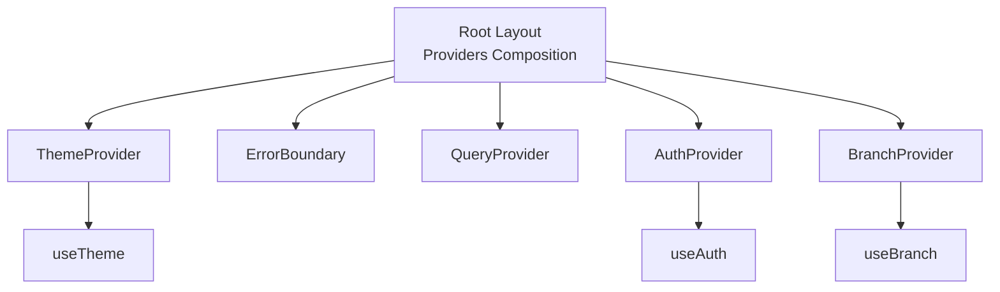
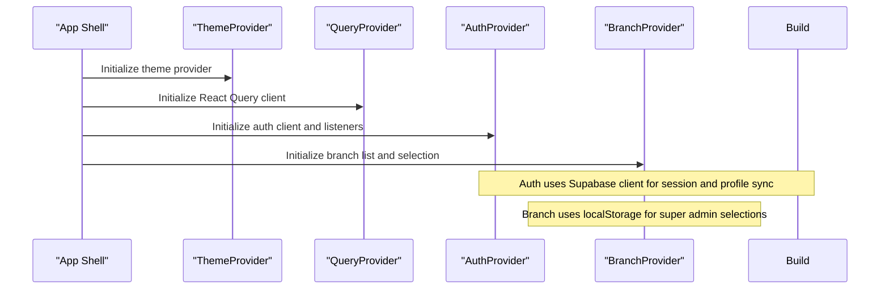
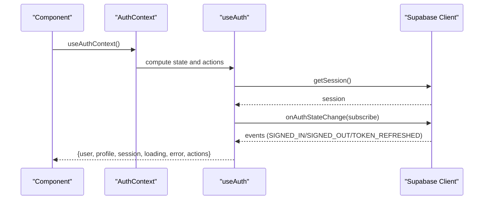
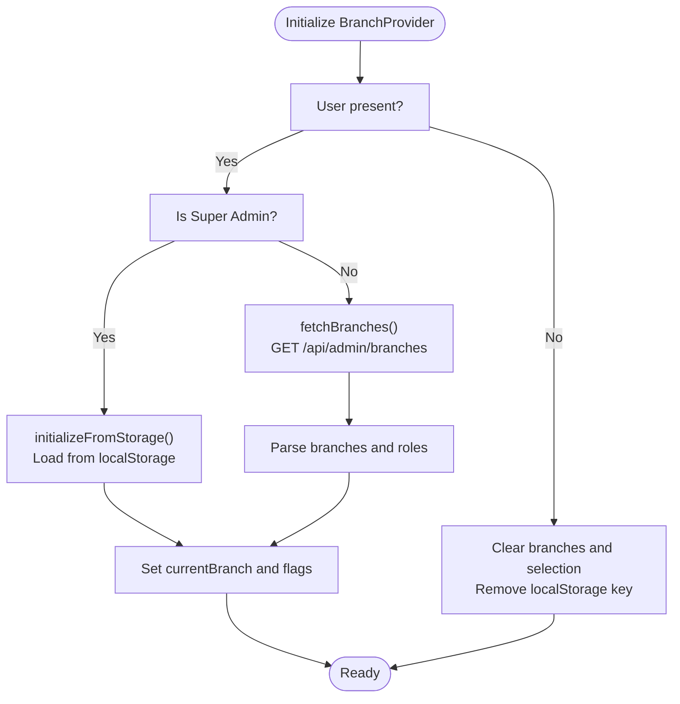
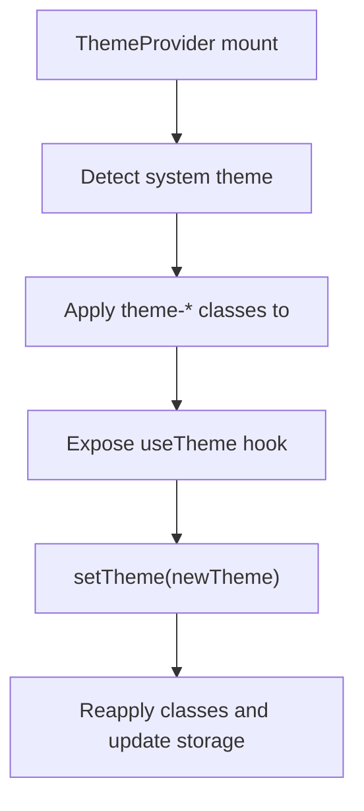
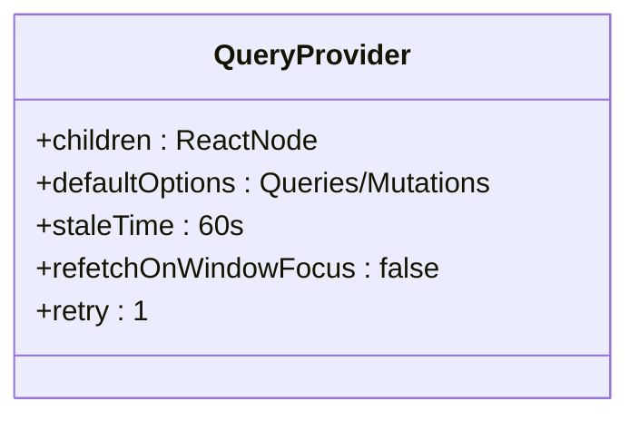
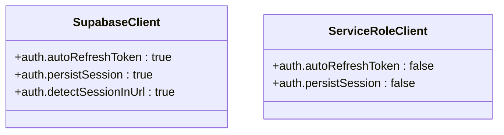
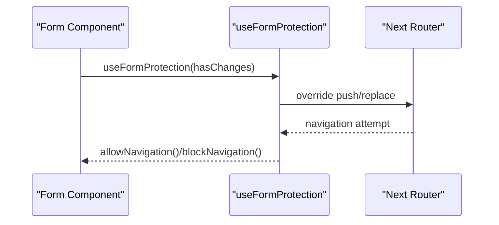
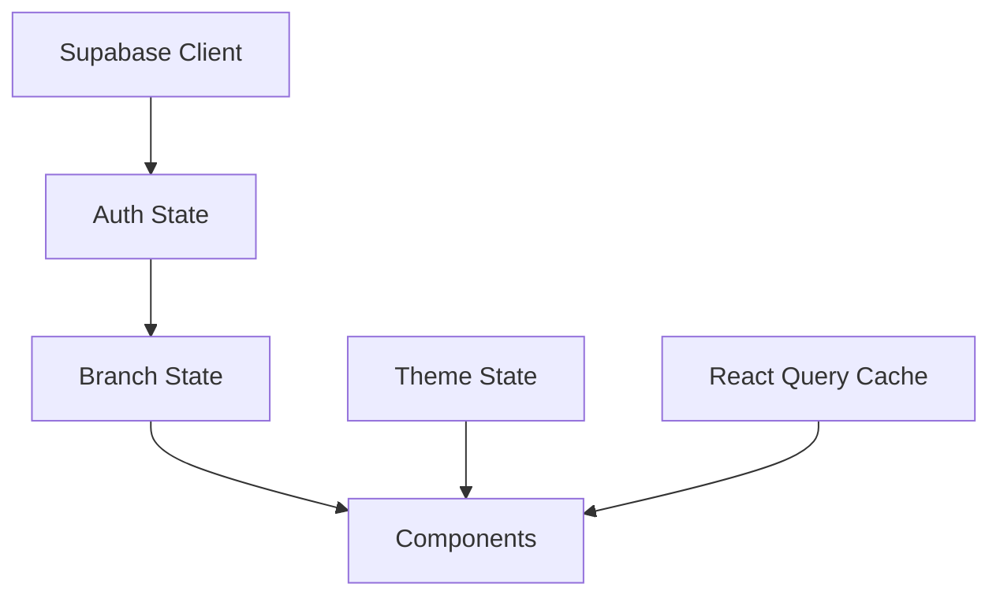
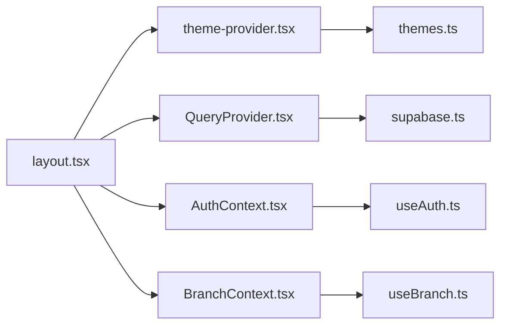

# State Management

<cite>
**Referenced Files in This Document**
- [AuthContext.tsx](file://src/contexts/AuthContext.tsx)
- [BranchContext.tsx](file://src/contexts/BranchContext.tsx)
- [LikeContext.tsx](file://src/contexts/LikeContext.tsx)
- [useAuth.ts](file://src/hooks/useAuth.ts)
- [useBranch.ts](file://src/hooks/useBranch.ts)
- [layout.tsx](file://src/app/layout.tsx)
- [theme-provider.tsx](file://src/components/theme-provider.tsx)
- [themes.ts](file://src/config/themes.ts)
- [QueryProvider.tsx](file://src/lib/react-query/QueryProvider.tsx)
- [supabase.ts](file://src/lib/supabase.ts)
- [useFormProtection.ts](file://src/hooks/useFormProtection.ts)
- [useDebounce.ts](file://src/hooks/useDebounce.ts)
- [useFileUpload.ts](file://src/hooks/useFileUpload.ts)
- [useProductOptions.ts](file://src/hooks/useProductOptions.ts)
</cite>

## Table of Contents

1. [Introduction](#introduction)
2. [Project Structure](#project-structure)
3. [Core Components](#core-components)
4. [Architecture Overview](#architecture-overview)
5. [Detailed Component Analysis](#detailed-component-analysis)
6. [Dependency Analysis](#dependency-analysis)
7. [Performance Considerations](#performance-considerations)
8. [Troubleshooting Guide](#troubleshooting-guide)
9. [Conclusion](#conclusion)

## Introduction

This document explains the state management architecture in Opttius, focusing on the provider pattern with React Context for authentication, branch selection, and theme management. It documents the custom hook system for data fetching, form handling, and business logic, and details configuration options for caching strategies, error handling, and optimistic updates. It also covers relationships with the Supabase client, React Query integration, and real-time synchronization, along with performance optimization techniques, memory management, and state persistence.

## Project Structure

The state management stack is initialized at the root layout and composed of:

- Providers: Theme, Error Boundary, React Query, Auth, Branch
- Contexts: Authentication, Branch, and a placeholder Like context
- Hooks: useAuth, useBranch, useFormProtection, useDebounce, useFileUpload, useProductOptions
- Supabase client configuration and React Query defaults

**Diagram sources**

- [layout.tsx](file://src/app/layout.tsx#L30-L55)
- [theme-provider.tsx](file://src/components/theme-provider.tsx#L11-L25)
- [QueryProvider.tsx](file://src/lib/react-query/QueryProvider.tsx#L7-L34)
- [AuthContext.tsx](file://src/contexts/AuthContext.tsx#L28-L36)
- [BranchContext.tsx](file://src/contexts/BranchContext.tsx#L38-L206)

**Section sources**

- [layout.tsx](file://src/app/layout.tsx#L30-L55)

## Core Components

- Authentication Context and Hook
  - AuthContext wraps useAuth to expose user, profile, session, loading, error, and actions (signUp, signIn, signOut, updateProfile, resetPassword, refetchProfile).
  - AuthProvider passes the computed state to consumers via a typed context.
  - useAuthContext and useRequireAuth provide ergonomic accessors.

- Branch Context and Hook
  - BranchContext manages branches, current branch, global view flag, super admin flag, and loading state.
  - BranchProvider initializes from Supabase, persists selection in localStorage for super admins, and supports switching and refresh.
  - useBranchContext and useBranch provide convenient derived values and utilities.

- Theme Provider and Hook
  - ThemeProvider composes next-themes with custom theme IDs and applies CSS classes to the document root.
  - useTheme exposes theme state and currentTheme metadata from themes.ts.

- React Query Provider
  - QueryProvider sets default staleTime, disables window focus refetch, and retries for queries and mutations.

- Supabase Client
  - supabase.ts exports a configured client with auto-refresh and persisted sessions.

**Section sources**

- [AuthContext.tsx](file://src/contexts/AuthContext.tsx#L28-L71)
- [useAuth.ts](file://src/hooks/useAuth.ts#L18-L377)
- [BranchContext.tsx](file://src/contexts/BranchContext.tsx#L38-L216)
- [useBranch.ts](file://src/hooks/useBranch.ts#L40-L52)
- [theme-provider.tsx](file://src/components/theme-provider.tsx#L11-L105)
- [themes.ts](file://src/config/themes.ts#L1-L167)
- [QueryProvider.tsx](file://src/lib/react-query/QueryProvider.tsx#L7-L34)
- [supabase.ts](file://src/lib/supabase.ts#L11-L17)

## Architecture Overview

The provider chain establishes a layered state model:

- Authentication layer: user session and profile lifecycle managed by Supabase.
- Branch layer: multi-branch selection and persistence with localStorage fallbacks.
- UI layer: theme management and React Query caching.

**Diagram sources**

- [layout.tsx](file://src/app/layout.tsx#L38-L50)
- [QueryProvider.tsx](file://src/lib/react-query/QueryProvider.tsx#L8-L24)
- [AuthContext.tsx](file://src/contexts/AuthContext.tsx#L28-L36)
- [BranchContext.tsx](file://src/contexts/BranchContext.tsx#L38-L206)
- [supabase.ts](file://src/lib/supabase.ts#L11-L17)

## Detailed Component Analysis

### Authentication Context and Hook

- Responsibilities
  - Manage session lifecycle and profile retrieval.
  - Expose sign-up, sign-in, sign-out, profile updates, and password reset.
  - Provide loading/error states and a refetch mechanism.
- Implementation highlights
  - useAuth initializes with getSession, subscribes to onAuthStateChange, and handles TOKEN_REFRESHED events.
  - fetchProfile includes timeouts and graceful handling for missing profiles.
  - AuthProvider delegates to useAuth and exposes a typed context.

**Diagram sources**

- [AuthContext.tsx](file://src/contexts/AuthContext.tsx#L28-L46)
- [useAuth.ts](file://src/hooks/useAuth.ts#L27-L129)
- [supabase.ts](file://src/lib/supabase.ts#L11-L17)

**Section sources**

- [AuthContext.tsx](file://src/contexts/AuthContext.tsx#L9-L71)
- [useAuth.ts](file://src/hooks/useAuth.ts#L18-L377)
- [supabase.ts](file://src/lib/supabase.ts#L11-L17)

### Branch Context and Hook

- Responsibilities
  - Load branches from /api/admin/branches.
  - Persist selected branch in localStorage for super admins; validate against server list.
  - Switch between global view and specific branch; refresh branches.
- Implementation highlights
  - initializeFromStorage restores previous selection or falls back to global view.
  - setCurrentBranch updates state and localStorage; fetchBranches conditionally bypasses network for super admins.
  - useBranch augments context with convenience getters and booleans.

**Diagram sources**

- [BranchContext.tsx](file://src/contexts/BranchContext.tsx#L73-L155)
- [BranchContext.tsx](file://src/contexts/BranchContext.tsx#L47-L71)
- [BranchContext.tsx](file://src/contexts/BranchContext.tsx#L157-L176)

**Section sources**

- [BranchContext.tsx](file://src/contexts/BranchContext.tsx#L12-L216)
- [useBranch.ts](file://src/hooks/useBranch.ts#L40-L52)

### Theme Provider and Hook

- Responsibilities
  - Provide theme switching with next-themes and enforce custom theme IDs.
  - Apply theme classes to the document root and avoid hydration flashes.
- Implementation highlights
  - ThemeProvider configures storageKey, themes list, and attribute mapping.
  - useTheme memoizes currentTheme and exposes mounted state.

**Diagram sources**

- [theme-provider.tsx](file://src/components/theme-provider.tsx#L11-L81)
- [themes.ts](file://src/config/themes.ts#L30-L161)

**Section sources**

- [theme-provider.tsx](file://src/components/theme-provider.tsx#L11-L105)
- [themes.ts](file://src/config/themes.ts#L1-L167)

### React Query Provider and Defaults

- Responsibilities
  - Provide a configured QueryClient with default caching and retry behavior.
  - Enable devtools in development.
- Implementation highlights
  - defaultOptions.queries: staleTime=60s, refetchOnWindowFocus=false, retry=1.
  - defaultOptions.mutations: retry=1.

**Diagram sources**

- [QueryProvider.tsx](file://src/lib/react-query/QueryProvider.tsx#L7-L34)

**Section sources**

- [QueryProvider.tsx](file://src/lib/react-query/QueryProvider.tsx#L7-L34)

### Supabase Client Integration

- Responsibilities
  - Centralized client creation with autoRefreshToken and persistSession.
  - Service role client for server-side operations.
- Implementation highlights
  - Environment variables validated at runtime.
  - Auth configuration enables session persistence and URL detection.

**Diagram sources**

- [supabase.ts](file://src/lib/supabase.ts#L11-L33)

**Section sources**

- [supabase.ts](file://src/lib/supabase.ts#L1-L36)

### Custom Hook System for Forms and Business Logic

- useFormProtection
  - Prevents accidental navigation and browser refresh when unsaved changes exist.
  - Overrides router.push/replace to prompt confirmation and exposes allowNavigation/blockNavigation.
- useDebounce
  - Returns a debounced value with a configurable delay.
- useFileUpload
  - Validates file size/type, uploads via /api/upload, tracks progress, and returns URL.
  - Provides getOptimizedImageUrl for Supabase storage transformations.
- useProductOptions
  - Loads product option fields from /api/admin/product-options and maps to a keyed record.

**Diagram sources**

- [useFormProtection.ts](file://src/hooks/useFormProtection.ts#L48-L140)

**Section sources**

- [useFormProtection.ts](file://src/hooks/useFormProtection.ts#L48-L198)
- [useDebounce.ts](file://src/hooks/useDebounce.ts#L10-L24)
- [useFileUpload.ts](file://src/hooks/useFileUpload.ts#L18-L114)
- [useProductOptions.ts](file://src/hooks/useProductOptions.ts#L30-L71)

### Conceptual Overview

- Provider composition ensures predictable state flow from top to bottom.
- React Query centralizes caching and invalidation around query keys.
- Supabase provides real-time auth state changes and session persistence.
- Theme and branch contexts encapsulate UI and domain-specific state respectively.

[No sources needed since this diagram shows conceptual workflow, not actual code structure]

[No sources needed since this section doesn't analyze specific source files]

## Dependency Analysis

- Provider hierarchy and coupling
  - Root layout composes providers in a strict order to ensure downstream contexts can rely on upstream providers.
  - AuthContext depends on useAuth; BranchContext depends on AuthContext; ThemeProvider is independent.
- External dependencies
  - next-themes for theme management.
  - @tanstack/react-query and @tanstack/react-query-devtools for caching and debugging.
  - @supabase/supabase-js for authentication and real-time session events.

**Diagram sources**

- [layout.tsx](file://src/app/layout.tsx#L38-L50)
- [theme-provider.tsx](file://src/components/theme-provider.tsx#L11-L25)
- [QueryProvider.tsx](file://src/lib/react-query/QueryProvider.tsx#L7-L34)
- [AuthContext.tsx](file://src/contexts/AuthContext.tsx#L28-L36)
- [BranchContext.tsx](file://src/contexts/BranchContext.tsx#L38-L206)
- [useAuth.ts](file://src/hooks/useAuth.ts#L18-L377)
- [useBranch.ts](file://src/hooks/useBranch.ts#L40-L52)
- [themes.ts](file://src/config/themes.ts#L1-L167)
- [supabase.ts](file://src/lib/supabase.ts#L11-L17)

**Section sources**

- [layout.tsx](file://src/app/layout.tsx#L30-L55)

## Performance Considerations

- Caching strategies
  - React Query default staleTime of 60 seconds reduces unnecessary refetches on the client.
  - BranchProvider avoids redundant network calls for super admins by validating localStorage entries in-memory.
- Memory management
  - useAuth unsubscribes Supabase listeners and clears timeouts on cleanup.
  - BranchProvider resets state and removes localStorage keys when user logs out.
- Optimistic updates
  - Not implemented in the current codebase; consider adding optimistic updates for mutations (e.g., profile updates) and deferring invalidation until server confirmation.
- Real-time synchronization
  - Supabase auth onAuthStateChange keeps user/session/profile synchronized without polling.
- Persistence
  - Auth sessions persisted across browser restarts via Supabase configuration.
  - Branch selection persisted in localStorage for super admins; validated on subsequent loads.

[No sources needed since this section provides general guidance]

## Troubleshooting Guide

- Authentication initialization timeout
  - useAuth sets a 10s timeout for session initialization and a separate 8s timeout for profile fetch; logs warnings and continues with partial state.
- Missing environment variables
  - supabase.ts throws if required environment variables are missing.
- Navigation protection
  - useFormProtection overrides router methods and adds a beforeunload listener; ensure to call allowNavigation after successful saves.

**Section sources**

- [useAuth.ts](file://src/hooks/useAuth.ts#L31-L91)
- [useAuth.ts](file://src/hooks/useAuth.ts#L132-L192)
- [supabase.ts](file://src/lib/supabase.ts#L7-L9)
- [useFormProtection.ts](file://src/hooks/useFormProtection.ts#L63-L123)

## Conclusion

Opttius employs a clean provider-first architecture with React Context for authentication, branch selection, and theme management, complemented by robust custom hooks for forms and business logic. Supabase drives real-time authentication state, while React Query provides sensible caching defaults. The design balances developer ergonomics with performance and resilience, offering clear extension points for optimistic updates, advanced caching policies, and enhanced real-time integrations.
