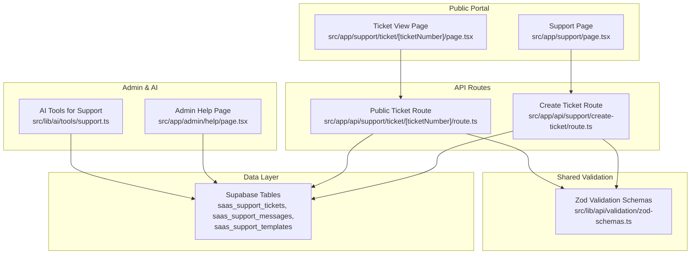
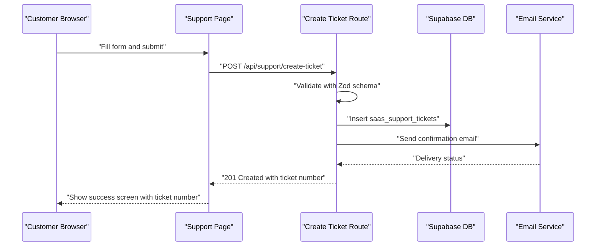
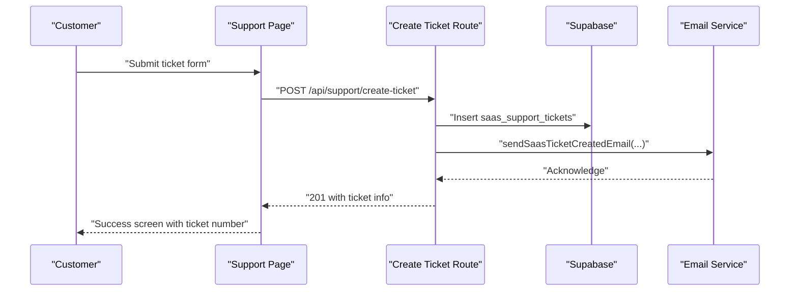
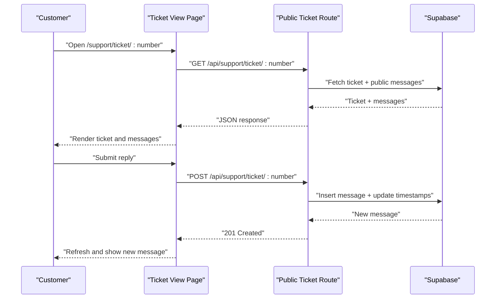
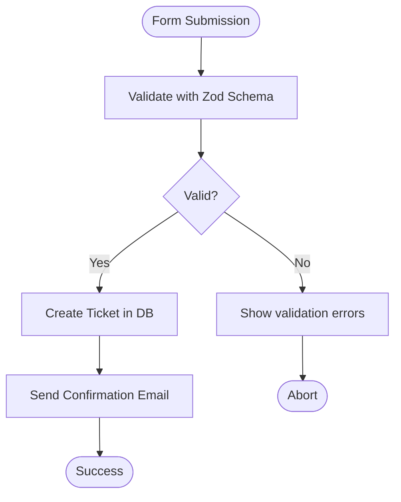
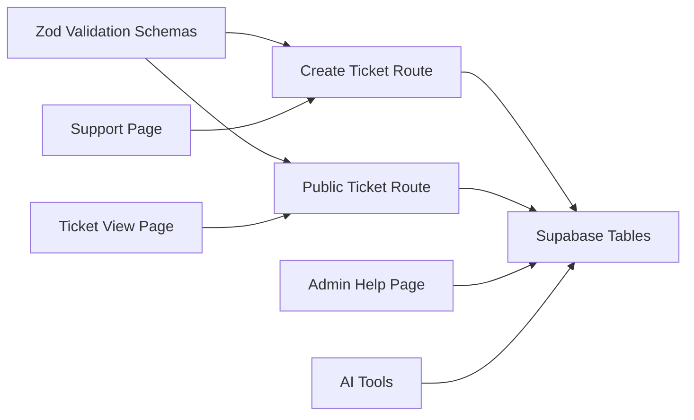

# Customer Support Interface

<cite>
**Referenced Files in This Document**
- [Support Page](file://src/app/support/page.tsx)
- [Ticket View Page](file://src/app/support/ticket/[ticketNumber]/page.tsx)
- [Create Public Ticket Route](file://src/app/api/support/create-ticket/route.ts)
- [Public Ticket Route](file://src/app/api/support/ticket/[ticketNumber]/route.ts)
- [Zod Validation Schemas](file://src/lib/api/validation/zod-schemas.ts)
- [SaaS Support Implementation Complete](file://docs/SAAS_SUPPORT_IMPLEMENTATION_COMPLETE.md)
- [SaaS Support System Plan](file://docs/SAAS_SUPPORT_SYSTEM_PLAN.md)
- [SaaS Support System Migration](file://supabase/migrations/20260131000011_create_saas_support_system.sql)
- [Admin Help Page](file://src/app/admin/help/page.tsx)
- [AI Tools for Support](file://src/lib/ai/tools/support.ts)
</cite>

## Table of Contents

1. [Introduction](#introduction)
2. [Project Structure](#project-structure)
3. [Core Components](#core-components)
4. [Architecture Overview](#architecture-overview)
5. [Detailed Component Analysis](#detailed-component-analysis)
6. [Dependency Analysis](#dependency-analysis)
7. [Performance Considerations](#performance-considerations)
8. [Troubleshooting Guide](#troubleshooting-guide)
9. [Conclusion](#conclusion)

## Introduction

This document describes the customer-facing support interface in Opttius, focusing on self-service options and customer communication channels. It covers the public support portal design, ticket submission forms, knowledge base integration, customer account linking, order-based support access, secure ticket viewing, and automated responses. It also documents configuration options for support hours, response time expectations, and channel preferences, along with relationships to customer profiles, purchase history, and product documentation. Finally, it provides guidance for optimizing customer experience, reducing support costs, and improving satisfaction metrics.

## Project Structure

The support interface consists of:

- A public-facing Next.js app pages for creating tickets and viewing ticket status
- API routes under `/api/support` for public ticket creation and message posting
- Shared validation schemas for consistent data validation
- Admin-facing help pages for organization-level support management
- AI tools for automated support workflows
- Supabase-backed data models for tickets, messages, and templates

**Diagram sources**

- [Support Page](file://src/app/support/page.tsx#L1-L467)
- [Ticket View Page](file://src/app/support/ticket/[ticketNumber]/page.tsx#L1-L511)
- [Create Public Ticket Route](file://src/app/api/support/create-ticket/route.ts#L1-L143)
- [Public Ticket Route](file://src/app/api/support/ticket/[ticketNumber]/route.ts#L1-L197)
- [Zod Validation Schemas](file://src/lib/api/validation/zod-schemas.ts#L1526-L1548)
- [Admin Help Page](file://src/app/admin/help/page.tsx#L116-L158)
- [AI Tools for Support](file://src/lib/ai/tools/support.ts#L133-L264)
- [SaaS Support System Plan](file://docs/SAAS_SUPPORT_SYSTEM_PLAN.md#L73-L148)

**Section sources**

- [Support Page](file://src/app/support/page.tsx#L1-L467)
- [Ticket View Page](file://src/app/support/ticket/[ticketNumber]/page.tsx#L1-L511)
- [Create Public Ticket Route](file://src/app/api/support/create-ticket/route.ts#L1-L143)
- [Public Ticket Route](file://src/app/api/support/ticket/[ticketNumber]/route.ts#L1-L197)
- [Zod Validation Schemas](file://src/lib/api/validation/zod-schemas.ts#L1526-L1548)
- [SaaS Support Implementation Complete](file://docs/SAAS_SUPPORT_IMPLEMENTATION_COMPLETE.md#L77-L133)
- [SaaS Support System Plan](file://docs/SAAS_SUPPORT_SYSTEM_PLAN.md#L73-L148)

## Core Components

- Public Support Portal: A React client-side form for submitting support tickets without authentication, with real-time validation and success feedback.
- Secure Ticket Viewing: A public view that displays ticket details and messages while enforcing email verification for replies.
- API Endpoints:
  - POST `/api/support/create-ticket`: Creates a public SaaS support ticket with validation and sends a confirmation email.
  - GET `/api/support/ticket/[ticketNumber]`: Returns public ticket details and messages.
  - POST `/api/support/ticket/[ticketNumber]`: Adds a customer message to a public ticket after validating the requester email.
- Validation: Zod schemas define strict field requirements for requester information, subject, description, category, priority, and message content.
- Admin Integration: Admin pages allow organizations to manage tickets, view metrics, and respond via templates.
- AI Tools: Automated workflows for ticket retrieval and response creation.

**Section sources**

- [Support Page](file://src/app/support/page.tsx#L60-L114)
- [Ticket View Page](file://src/app/support/ticket/[ticketNumber]/page.tsx#L120-L207)
- [Create Public Ticket Route](file://src/app/api/support/create-ticket/route.ts#L11-L142)
- [Public Ticket Route](file://src/app/api/support/ticket/[ticketNumber]/route.ts#L9-L196)
- [Zod Validation Schemas](file://src/lib/api/validation/zod-schemas.ts#L1526-L1548)
- [Admin Help Page](file://src/app/admin/help/page.tsx#L116-L158)
- [AI Tools for Support](file://src/lib/ai/tools/support.ts#L133-L264)

## Architecture Overview

The support system follows a clean separation of concerns:

- Frontend pages handle user interactions and display data.
- API routes validate inputs, enforce security, and interact with Supabase.
- Validation schemas ensure consistent data quality across frontend and backend.
- Notifications and email services are integrated non-blockingly for reliability.
- Admin dashboards and AI tools extend functionality for internal teams.

**Diagram sources**

- [Support Page](file://src/app/support/page.tsx#L83-L114)
- [Create Public Ticket Route](file://src/app/api/support/create-ticket/route.ts#L11-L142)
- [Zod Validation Schemas](file://src/lib/api/validation/zod-schemas.ts#L1526-L1548)

**Section sources**

- [SaaS Support Implementation Complete](file://docs/SAAS_SUPPORT_IMPLEMENTATION_COMPLETE.md#L117-L131)
- [SaaS Support System Plan](file://docs/SAAS_SUPPORT_SYSTEM_PLAN.md#L73-L148)

## Detailed Component Analysis

### Public Ticket Creation Workflow

The public portal allows customers to create tickets without logging in. The workflow includes:

- Form rendering with validation hints
- Submission to the create-ticket API
- Ticket creation with automatic metadata tagging
- Non-blocking email confirmation
- Success screen with ticket number and next steps

**Diagram sources**

- [Support Page](file://src/app/support/page.tsx#L83-L114)
- [Create Public Ticket Route](file://src/app/api/support/create-ticket/route.ts#L11-L142)

**Section sources**

- [Support Page](file://src/app/support/page.tsx#L60-L114)
- [Create Public Ticket Route](file://src/app/api/support/create-ticket/route.ts#L11-L142)
- [Zod Validation Schemas](file://src/lib/api/validation/zod-schemas.ts#L1526-L1548)

### Secure Public Ticket Viewing and Messaging

Customers can view their ticket status and add messages securely:

- View ticket details and public messages
- Reply with email validation
- Automatic state transitions and timestamps
- Non-blocking notifications for internal teams

**Diagram sources**

- [Ticket View Page](file://src/app/support/ticket/[ticketNumber]/page.tsx#L139-L207)
- [Public Ticket Route](file://src/app/api/support/ticket/[ticketNumber]/route.ts#L9-L196)

**Section sources**

- [Ticket View Page](file://src/app/support/ticket/[ticketNumber]/page.tsx#L120-L207)
- [Public Ticket Route](file://src/app/api/support/ticket/[ticketNumber]/route.ts#L9-L196)

### Validation and Data Integrity

Consistent validation ensures reliable data entry:

- Requester name, email, subject, description, category, priority, and message length are enforced
- Organization name lookup supports customer account linking
- Strict limits prevent oversized inputs

**Diagram sources**

- [Zod Validation Schemas](file://src/lib/api/validation/zod-schemas.ts#L1526-L1548)
- [Create Public Ticket Route](file://src/app/api/support/create-ticket/route.ts#L15-L19)

**Section sources**

- [Zod Validation Schemas](file://src/lib/api/validation/zod-schemas.ts#L1526-L1548)
- [Create Public Ticket Route](file://src/app/api/support/create-ticket/route.ts#L15-L19)

### Admin and Organization Access

Organizations can manage support tickets through admin pages:

- Filter and sort tickets by status, priority, category
- Create tickets on behalf of organizations
- Use templates and metrics for efficient support
- Badge indicators for open tickets

**Section sources**

- [Admin Help Page](file://src/app/admin/help/page.tsx#L116-L158)
- [SaaS Support Implementation Complete](file://docs/SAAS_SUPPORT_IMPLEMENTATION_COMPLETE.md#L522-L530)

### Knowledge Base Integration

While the public portal does not embed a knowledge base directly, the system supports:

- Category-based organization of tickets
- Templates for standardized responses
- Metrics enabling knowledge-driven improvements

**Section sources**

- [SaaS Support Implementation Complete](file://docs/SAAS_SUPPORT_IMPLEMENTATION_COMPLETE.md#L104-L112)

### Multichannel Support Channels

Current implementation focuses on:

- Public web portal for ticket creation and messaging
- Email notifications for ticket creation, assignment, new replies, and resolution
- Admin dashboards for internal team coordination

Future enhancements could include live chat, social media integration, and SMS notifications.

**Section sources**

- [SaaS Support Implementation Complete](file://docs/SAAS_SUPPORT_IMPLEMENTATION_COMPLETE.md#L531-L537)

## Dependency Analysis

The support system exhibits strong cohesion around validation and data models, with clear boundaries between public and admin APIs.

**Diagram sources**

- [Zod Validation Schemas](file://src/lib/api/validation/zod-schemas.ts#L1526-L1548)
- [Create Public Ticket Route](file://src/app/api/support/create-ticket/route.ts#L1-L143)
- [Public Ticket Route](file://src/app/api/support/ticket/[ticketNumber]/route.ts#L1-L197)
- [Support Page](file://src/app/support/page.tsx#L1-L467)
- [Ticket View Page](file://src/app/support/ticket/[ticketNumber]/page.tsx#L1-L511)
- [Admin Help Page](file://src/app/admin/help/page.tsx#L116-L158)
- [AI Tools for Support](file://src/lib/ai/tools/support.ts#L133-L264)

**Section sources**

- [SaaS Support System Plan](file://docs/SAAS_SUPPORT_SYSTEM_PLAN.md#L73-L148)
- [SaaS Support System Migration](file://supabase/migrations/20260131000011_create_saas_support_system.sql#L1-L135)

## Performance Considerations

- Non-blocking notifications and emails improve responsiveness during high traffic.
- Indexes on frequently queried columns (status, priority, created_at, ticket_number) optimize admin queries.
- Client-side validation reduces unnecessary API calls.
- Pagination and filtering in admin views reduce payload sizes.

[No sources needed since this section provides general guidance]

## Troubleshooting Guide

Common issues and resolutions:

- Ticket creation failures: Check validation errors returned by the API and ensure required fields meet schema constraints.
- Email delivery problems: Confirm email service credentials and retry; the system logs warnings but does not block ticket creation.
- Unauthorized replies: Ensure the requester email matches the original ticket requester email.
- Missing messages: Public view filters out internal messages; check admin panel for internal notes.

**Section sources**

- [Create Public Ticket Route](file://src/app/api/support/create-ticket/route.ts#L68-L103)
- [Public Ticket Route](file://src/app/api/support/ticket/[ticketNumber]/route.ts#L115-L120)
- [Ticket View Page](file://src/app/support/ticket/[ticketNumber]/page.tsx#L186-L207)

## Conclusion

The Opttius customer support interface provides a robust, self-service foundation with secure public access, automated notifications, and admin capabilities. By leveraging shared validation schemas, Supabase-backed data models, and non-blocking integrations, the system balances usability with reliability. Future enhancements can expand multichannel support and integrate knowledge base features to further improve customer experience and operational efficiency.
