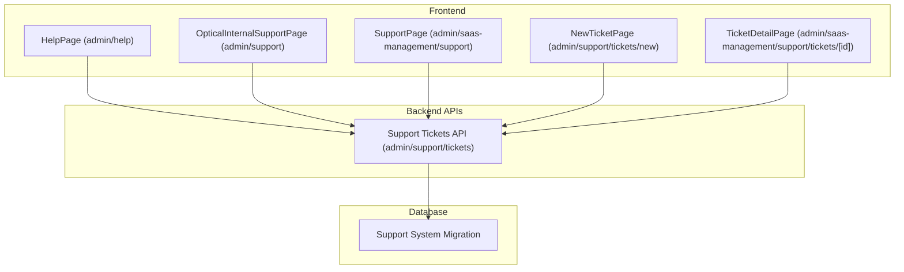
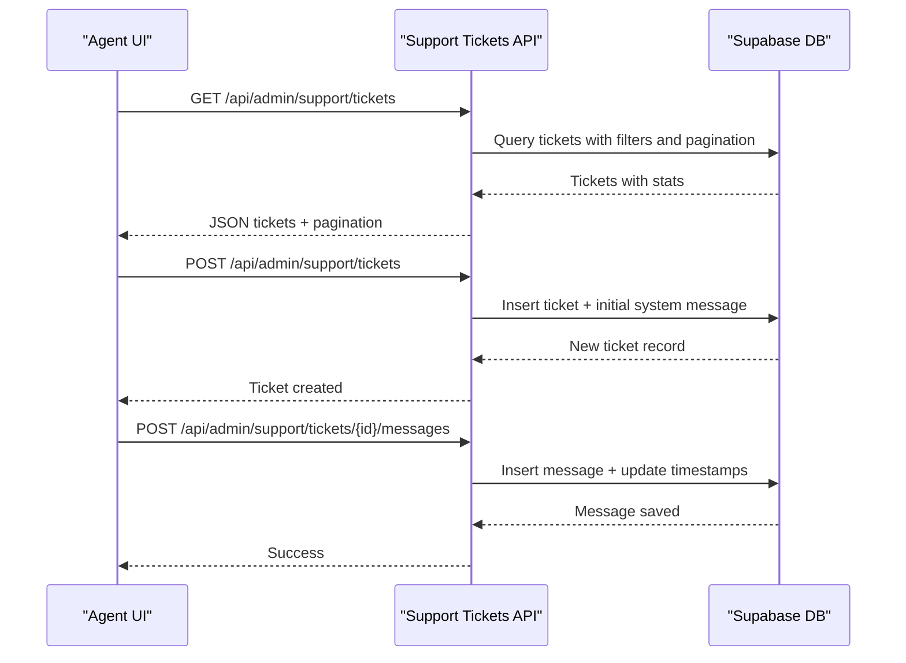
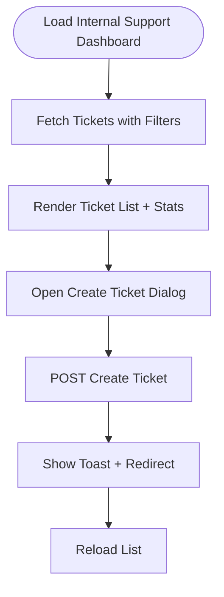
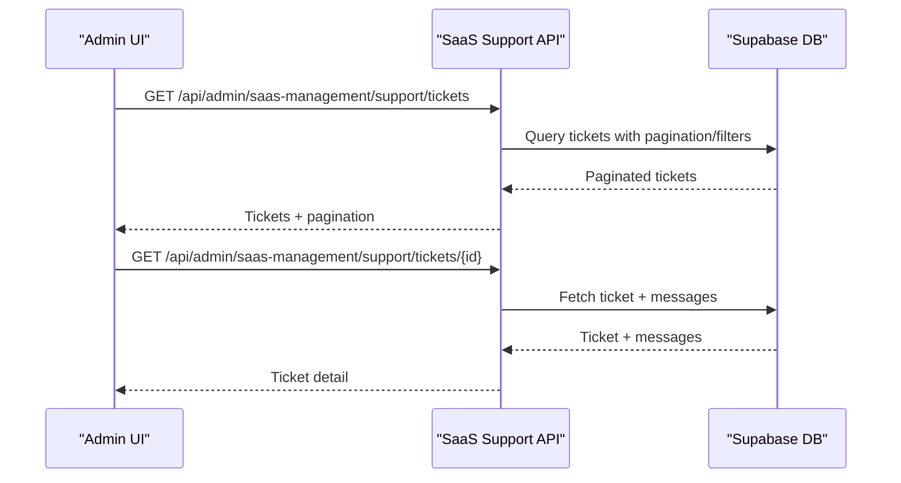
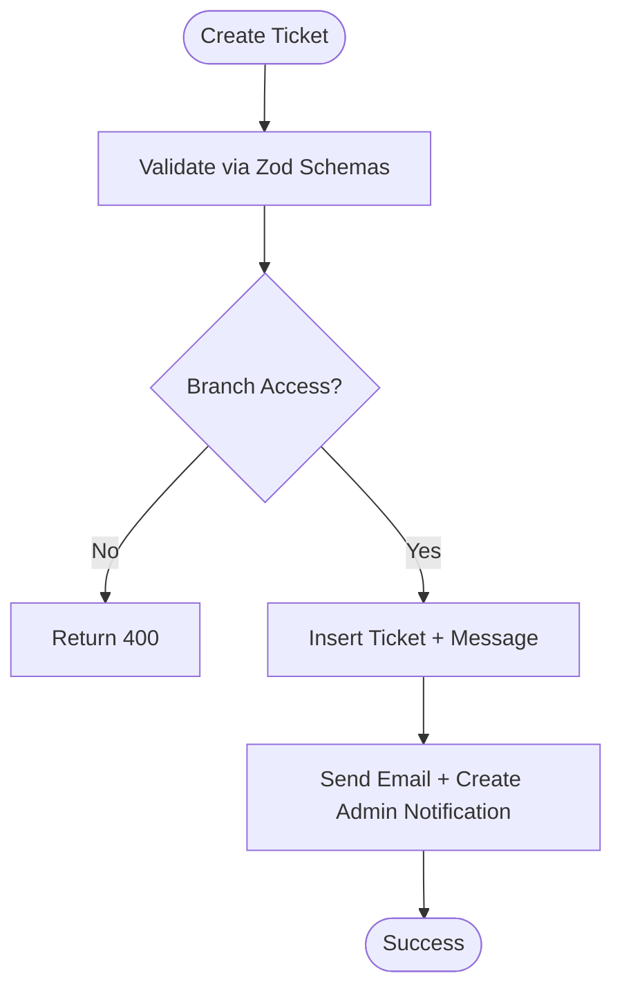
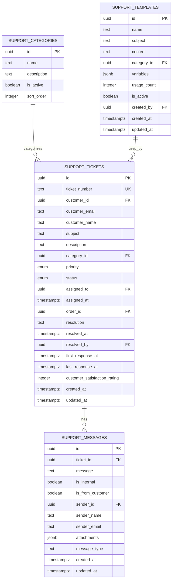
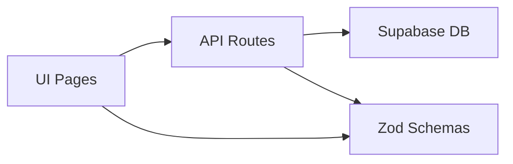

# Internal Help Desk

<cite>
**Referenced Files in This Document**
- [HelpPage (admin/help)](file://src/app/admin/help/page.tsx)
- [HelpTicketDetailPage (admin/help/tickets/[id])] (file://src/app/admin/help/tickets/[id]/page.tsx)
- [OpticalInternalSupportPage (admin/support)](file://src/app/admin/support/page.tsx)
- [NewTicketPage (admin/support/tickets/new)](file://src/app/admin/support/tickets/new/page.tsx)
- [SupportPage (admin/saas-management/support)](file://src/app/admin/saas-management/support/page.tsx)
- [TicketDetailPage (admin/saas-management/support/tickets/[id])] (file://src/app/admin/saas-management/support/tickets/[id]/page.tsx)
- [Support Tickets API (admin/support/tickets)](file://src/app/api/admin/support/tickets/route.ts)
- [Zod Schemas](file://src/lib/api/validation/zod-schemas.ts)
- [Support System Migration](file://supabase/migrations/20250116200000_create_support_system.sql)
</cite>

## Table of Contents

1. [Introduction](#introduction)
2. [Project Structure](#project-structure)
3. [Core Components](#core-components)
4. [Architecture Overview](#architecture-overview)
5. [Detailed Component Analysis](#detailed-component-analysis)
6. [Dependency Analysis](#dependency-analysis)
7. [Performance Considerations](#performance-considerations)
8. [Troubleshooting Guide](#troubleshooting-guide)
9. [Conclusion](#conclusion)

## Introduction

This document describes the internal help desk system in Opttius, focusing on administrative support workflows and team collaboration. It covers the help desk interface for support agents, queue management, team coordination features, agent permissions, skill-based routing, and workload balancing. It also documents configuration options for agent roles, skill requirements, and performance tracking, along with relationships to internal documentation systems, training resources, and escalation procedures. Team collaboration features such as internal messaging, knowledge sharing, and quality assurance processes are explained, alongside practical guidance for managing support staff, optimizing response times, and maintaining service quality standards.

## Project Structure

The help desk system spans frontend pages, backend APIs, and database schemas:

- Frontend pages provide agent dashboards, ticket lists, and detail views for both internal optical support and SaaS support.
- Backend APIs handle ticket CRUD operations, message exchanges, status updates, and search functionality.
- Database migrations define support ticket lifecycles, categories, templates, and row-level security policies.

**Diagram sources**

- [HelpPage (admin/help)](file://src/app/admin/help/page.tsx#L116-L699)
- [OpticalInternalSupportPage (admin/support)](file://src/app/admin/support/page.tsx#L134-L800)
- [SupportPage (admin/saas-management/support)](file://src/app/admin/saas-management/support/page.tsx#L115-L691)
- [NewTicketPage (admin/support/tickets/new)](file://src/app/admin/support/tickets/new/page.tsx#L56-L580)
- [TicketDetailPage (admin/saas-management/support/tickets/[id])] (file://src/app/admin/saas-management/support/tickets/[id]/page.tsx#L158-L791)
- [Support Tickets API (admin/support/tickets)](file://src/app/api/admin/support/tickets/route.ts#L7-L503)
- [Support System Migration](file://supabase/migrations/20250116200000_create_support_system.sql#L1-L387)

**Section sources**

- [HelpPage (admin/help)](file://src/app/admin/help/page.tsx#L116-L699)
- [OpticalInternalSupportPage (admin/support)](file://src/app/admin/support/page.tsx#L134-L800)
- [SupportPage (admin/saas-management/support)](file://src/app/admin/saas-management/support/page.tsx#L115-L691)
- [NewTicketPage (admin/support/tickets/new)](file://src/app/admin/support/tickets/new/page.tsx#L56-L580)
- [TicketDetailPage (admin/saas-management/support/tickets/[id])] (file://src/app/admin/saas-management/support/tickets/[id]/page.tsx#L158-L791)
- [Support Tickets API (admin/support/tickets)](file://src/app/api/admin/support/tickets/route.ts#L7-L503)
- [Support System Migration](file://supabase/migrations/20250116200000_create_support_system.sql#L1-L387)

## Core Components

- Agent Dashboards:
  - Internal optical support dashboard for branch-specific tickets and customer associations.
  - SaaS support dashboard for multi-tenant organization visibility and quick search.
- Queue Management:
  - Filtering by status, priority, category, and search terms.
  - Pagination and real-time statistics for open, in-progress, and resolved counts.
- Team Coordination:
  - Assignments, internal notes, and shared templates for consistent responses.
  - Status transitions and priority adjustments with audit trails.
- Validation and Security:
  - Zod schemas for form validation and API payload sanitization.
  - Row-level security policies ensuring tenant isolation and role-based access.

**Section sources**

- [OpticalInternalSupportPage (admin/support)](file://src/app/admin/support/page.tsx#L134-L800)
- [SupportPage (admin/saas-management/support)](file://src/app/admin/saas-management/support/page.tsx#L115-L691)
- [Support Tickets API (admin/support/tickets)](file://src/app/api/admin/support/tickets/route.ts#L7-L503)
- [Support System Migration](file://supabase/migrations/20250116200000_create_support_system.sql#L1-L387)

## Architecture Overview

The help desk follows a layered architecture:

- Presentation Layer: Next.js client components render dashboards, forms, and detail views.
- Application Layer: API routes validate requests, enforce authorization, and orchestrate database queries.
- Data Layer: Supabase-backed tables for tickets, messages, categories, and templates with RLS policies.

**Diagram sources**

- [Support Tickets API (admin/support/tickets)](file://src/app/api/admin/support/tickets/route.ts#L7-L503)
- [Support System Migration](file://supabase/migrations/20250116200000_create_support_system.sql#L29-L90)

**Section sources**

- [Support Tickets API (admin/support/tickets)](file://src/app/api/admin/support/tickets/route.ts#L7-L503)
- [Support System Migration](file://supabase/migrations/20250116200000_create_support_system.sql#L1-L387)

## Detailed Component Analysis

### Internal Optical Support Dashboard

The internal optical support dashboard enables branch-focused ticket management:

- Filters: status, priority, category, customer association, and free-text search.
- Pagination and statistics for operational visibility.
- Creation of tickets linked to customers and branches.
- Real-time message counters and last-response tracking.

**Diagram sources**

- [OpticalInternalSupportPage (admin/support)](file://src/app/admin/support/page.tsx#L134-L800)
- [Support Tickets API (admin/support/tickets)](file://src/app/api/admin/support/tickets/route.ts#L242-L503)

**Section sources**

- [OpticalInternalSupportPage (admin/support)](file://src/app/admin/support/page.tsx#L134-L800)
- [Support Tickets API (admin/support/tickets)](file://src/app/api/admin/support/tickets/route.ts#L7-L503)

### SaaS Support Dashboard and Detail View

The SaaS support dashboard provides multi-tenant oversight:

- Tabs for tickets, metrics, and quick search across organizations and users.
- Advanced filtering and pagination.
- Ticket detail view with message thread, status/priority controls, and template usage.

**Diagram sources**

- [SupportPage (admin/saas-management/support)](file://src/app/admin/saas-management/support/page.tsx#L115-L691)
- [TicketDetailPage (admin/saas-management/support/tickets/[id])] (file://src/app/admin/saas-management/support/tickets/[id]/page.tsx#L158-L791)

**Section sources**

- [SupportPage (admin/saas-management/support)](file://src/app/admin/saas-management/support/page.tsx#L115-L691)
- [TicketDetailPage (admin/saas-management/support/tickets/[id])] (file://src/app/admin/saas-management/support/tickets/[id]/page.tsx#L158-L791)

### Ticket Creation and Messaging

Ticket creation supports both customer-facing and internal workflows:

- Validation via Zod schemas ensures robust input handling.
- Branch-aware creation with customer lookup and assignment options.
- Initial system message and non-blocking notifications/log entries.

**Diagram sources**

- [Support Tickets API (admin/support/tickets)](file://src/app/api/admin/support/tickets/route.ts#L242-L503)
- [Zod Schemas](file://src/lib/api/validation/zod-schemas.ts#L1-L800)

**Section sources**

- [Support Tickets API (admin/support/tickets)](file://src/app/api/admin/support/tickets/route.ts#L242-L503)
- [Zod Schemas](file://src/lib/api/validation/zod-schemas.ts#L1-L800)

### Database Schema and Policies

The support system defines structured entities with strict access control:

- Enumerations for priority and status.
- Categories, tickets, messages, and templates with foreign keys and indexes.
- Row-level security policies for admin-only access and customer visibility.
- Triggers for timestamp updates and ticket numbering.

**Diagram sources**

- [Support System Migration](file://supabase/migrations/20250116200000_create_support_system.sql#L4-L115)
- [Support System Migration](file://supabase/migrations/20250116200000_create_support_system.sql#L209-L387)

**Section sources**

- [Support System Migration](file://supabase/migrations/20250116200000_create_support_system.sql#L1-L387)

### Agent Permissions and Role-Based Access

- Admin-only endpoints and RLS policies restrict access to support entities.
- Agents can view and manage tickets within their assigned scope.
- Customer visibility limited to their own tickets and non-internal messages.

**Section sources**

- [Support Tickets API (admin/support/tickets)](file://src/app/api/admin/support/tickets/route.ts#L32-L61)
- [Support System Migration](file://supabase/migrations/20250116200000_create_support_system.sql#L133-L207)

### Skill-Based Routing and Workload Balancing

- Current implementation focuses on assignment to specific agents and basic status/priority controls.
- Recommendations for enhancement:
  - Introduce agent skill profiles and routing rules.
  - Implement dynamic assignment based on workload and expertise.
  - Add capacity monitoring and overflow escalation.

[No sources needed since this section provides general guidance]

### Team Collaboration and Quality Assurance

- Internal notes vs. customer-visible messages.
- Shared templates for standardized responses.
- Status transitions and resolution notes for auditability.
- Metrics and statistics for performance tracking.

**Section sources**

- [Support Tickets API (admin/support/tickets)](file://src/app/api/admin/support/tickets/route.ts#L391-L482)
- [Support System Migration](file://supabase/migrations/20250116200000_create_support_system.sql#L366-L387)

## Dependency Analysis

The system exhibits clear separation of concerns:

- UI components depend on API routes for data operations.
- API routes depend on Supabase client and RLS policies for data integrity.
- Validation schemas underpin both UI and API layers.

**Diagram sources**

- [Support Tickets API (admin/support/tickets)](file://src/app/api/admin/support/tickets/route.ts#L1-L503)
- [Zod Schemas](file://src/lib/api/validation/zod-schemas.ts#L1-L800)

**Section sources**

- [Support Tickets API (admin/support/tickets)](file://src/app/api/admin/support/tickets/route.ts#L1-L503)
- [Zod Schemas](file://src/lib/api/validation/zod-schemas.ts#L1-L800)

## Performance Considerations

- Indexes on frequently filtered columns (status, priority, created_at) improve query performance.
- Pagination limits reduce payload sizes and rendering overhead.
- Non-blocking operations (email notifications, admin logs) prevent request latency spikes.

[No sources needed since this section provides general guidance]

## Troubleshooting Guide

Common issues and resolutions:

- Unauthorized access: Verify admin authentication and RLS policy compliance.
- Missing branch context: Ensure branch selection for non-super admins when creating tickets.
- Validation errors: Confirm form inputs meet Zod schema requirements.
- Email notifications failures: Check environment configuration for external providers.

**Section sources**

- [Support Tickets API (admin/support/tickets)](file://src/app/api/admin/support/tickets/route.ts#L32-L61)
- [Support Tickets API (admin/support/tickets)](file://src/app/api/admin/support/tickets/route.ts#L267-L278)
- [Support Tickets API (admin/support/tickets)](file://src/app/api/admin/support/tickets/route.ts#L424-L448)

## Conclusion

Opttius’ help desk system provides a robust foundation for internal and SaaS support workflows, with strong validation, security, and operational visibility. By extending the current architecture with skill-based routing, advanced workload balancing, and integrated knowledge management, teams can further optimize response times and maintain high service quality.
