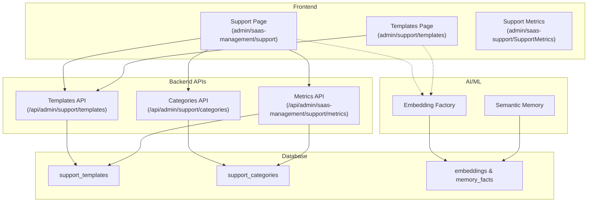
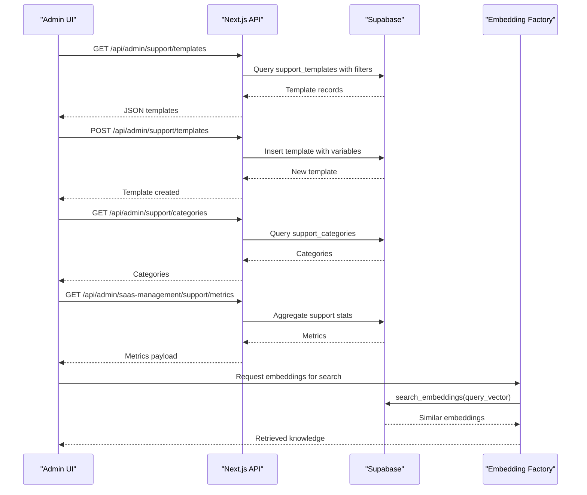
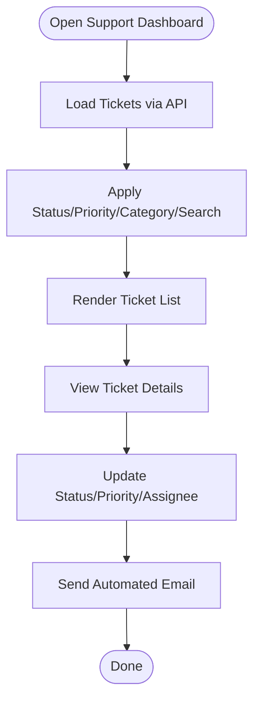
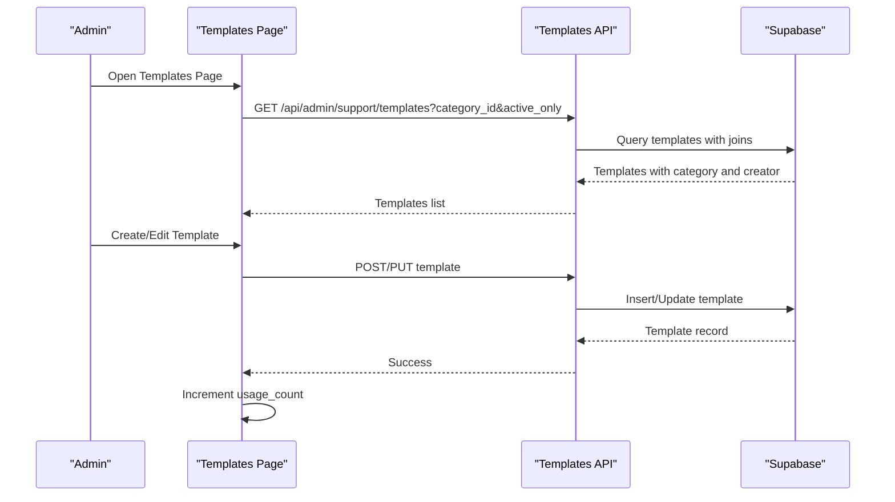
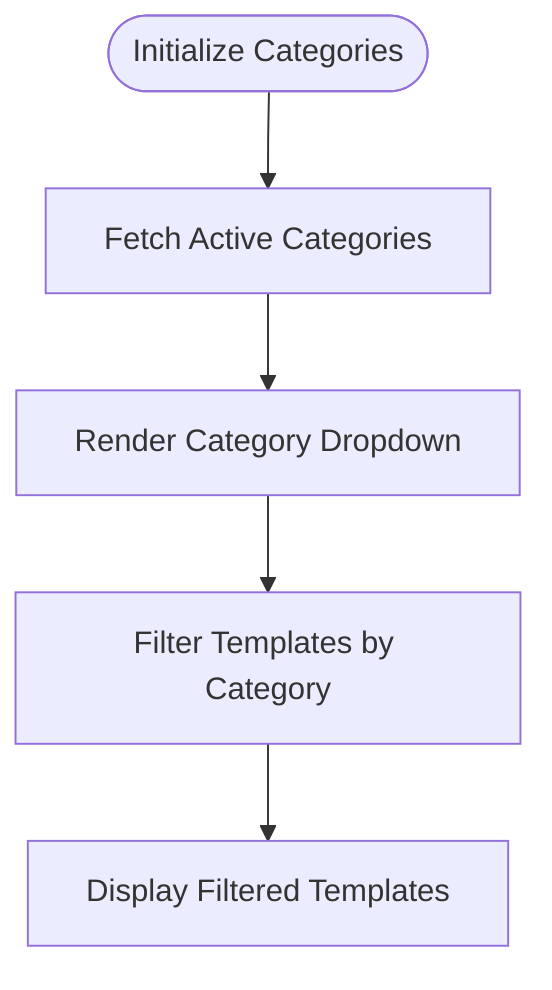
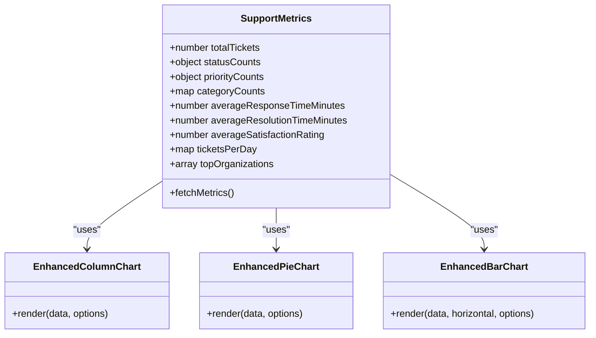
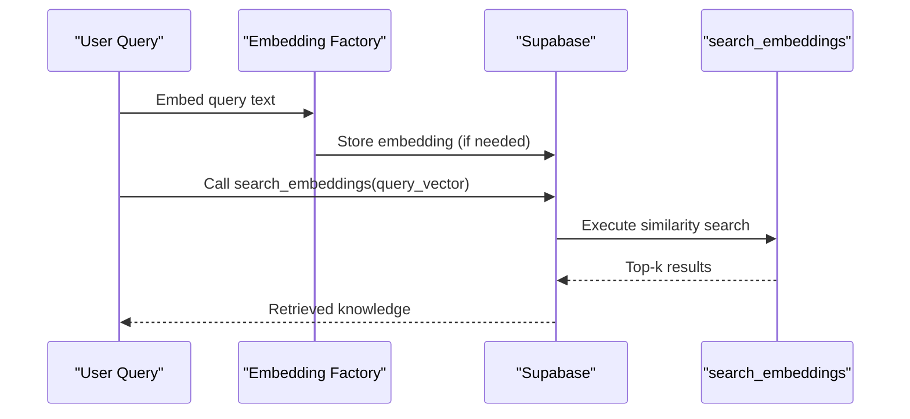
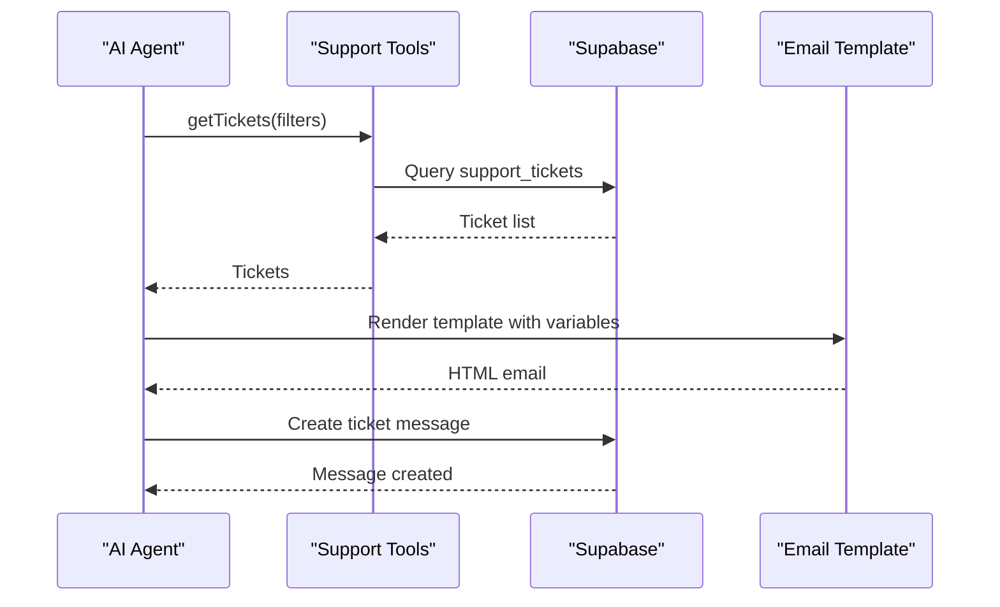
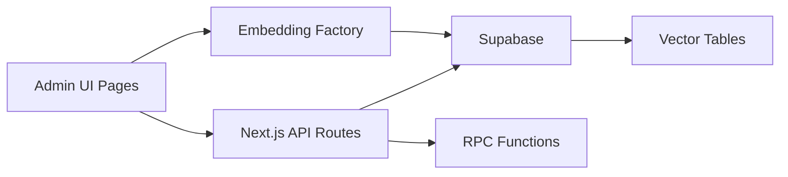

# Knowledge Base System

<cite>
**Referenced Files in This Document**
- [support.tsx](file://src/app/admin/saas-management/support/page.tsx)
- [templates.tsx](file://src/app/admin/support/templates/page.tsx)
- [templates-route.ts](file://src/app/api/admin/support/templates/route.ts)
- [categories-route.ts](file://src/app/api/admin/support/categories/route.ts)
- [metrics.tsx](file://src/components/admin/saas-support/SupportMetrics.tsx)
- [support-tool.ts](file://src/lib/ai/tools/support.ts)
- [embeddings-factory.ts](file://src/lib/ai/embeddings/factory.ts)
- [semantic-memory.ts](file://src/lib/ai/memory/semantic.ts)
- [search-embeddings.sql](file://supabase/migrations/20250615000001_create_embeddings_tables.sql)
- [support-email-template.ts](file://src/lib/email/templates/support.ts)
- [saas-support-plan.md](file://docs/SAAS_SUPPORT_SYSTEM_PLAN.md)
- [saas-support-implementation.md](file://docs/SAAS_SUPPORT_IMPLEMENTATION_COMPLETE.md)
</cite>

## Table of Contents

1. [Introduction](#introduction)
2. [Project Structure](#project-structure)
3. [Core Components](#core-components)
4. [Architecture Overview](#architecture-overview)
5. [Detailed Component Analysis](#detailed-component-analysis)
6. [Dependency Analysis](#dependency-analysis)
7. [Performance Considerations](#performance-considerations)
8. [Troubleshooting Guide](#troubleshooting-guide)
9. [Conclusion](#conclusion)

## Introduction

This document describes the knowledge base system in Opttius, focusing on self-service resources and automated support solutions. It explains the architecture, article organization, search functionality, template management, FAQ systems, and automated response generation. It also documents configuration options for content approval workflows, version control, and multilingual support, along with relationships to support tickets, frequently asked questions, and product documentation. Guidance is provided for content curation, user contributions, performance analytics, maintaining knowledge quality, encouraging community participation, and measuring self-service effectiveness.

## Project Structure

The knowledge base system is implemented across frontend pages, backend APIs, Supabase database schemas, and AI/ML infrastructure for semantic search and embeddings.

**Diagram sources**

- [support.tsx](file://src/app/admin/saas-management/support/page.tsx#L115-L691)
- [templates.tsx](file://src/app/admin/support/templates/page.tsx#L71-L687)
- [templates-route.ts](file://src/app/api/admin/support/templates/route.ts#L1-L235)
- [categories-route.ts](file://src/app/api/admin/support/categories/route.ts#L1-L159)
- [metrics.tsx](file://src/components/admin/saas-support/SupportMetrics.tsx#L48-L463)
- [embeddings-factory.ts](file://src/lib/ai/embeddings/factory.ts#L1-L40)
- [semantic-memory.ts](file://src/lib/ai/memory/semantic.ts#L48-L92)
- [search-embeddings.sql](file://supabase/migrations/20250615000001_create_embeddings_tables.sql#L154-L275)

**Section sources**

- [support.tsx](file://src/app/admin/saas-management/support/page.tsx#L1-L691)
- [templates.tsx](file://src/app/admin/support/templates/page.tsx#L1-L687)
- [templates-route.ts](file://src/app/api/admin/support/templates/route.ts#L1-L235)
- [categories-route.ts](file://src/app/api/admin/support/categories/route.ts#L1-L159)
- [metrics.tsx](file://src/components/admin/saas-support/SupportMetrics.tsx#L1-L463)
- [embeddings-factory.ts](file://src/lib/ai/embeddings/factory.ts#L1-L40)
- [semantic-memory.ts](file://src/lib/ai/memory/semantic.ts#L48-L92)
- [search-embeddings.sql](file://supabase/migrations/20250615000001_create_embeddings_tables.sql#L154-L275)

## Core Components

- Support Management Dashboard: Centralized interface for ticket filtering, search, and metrics.
- Template Management: Creation, editing, activation, and usage tracking of support templates with variable substitution.
- Categories System: Organizational taxonomy for templates and tickets.
- Metrics and Analytics: Real-time dashboards for support performance and trends.
- Semantic Search Infrastructure: Vector embeddings and similarity search for intelligent knowledge discovery.
- Automated Responses: AI-powered tools and email templates for rapid response generation.

**Section sources**

- [support.tsx](file://src/app/admin/saas-management/support/page.tsx#L115-L691)
- [templates.tsx](file://src/app/admin/support/templates/page.tsx#L71-L687)
- [templates-route.ts](file://src/app/api/admin/support/templates/route.ts#L1-L235)
- [categories-route.ts](file://src/app/api/admin/support/categories/route.ts#L1-L159)
- [metrics.tsx](file://src/components/admin/saas-support/SupportMetrics.tsx#L48-L463)
- [support-tool.ts](file://src/lib/ai/tools/support.ts#L33-L86)
- [support-email-template.ts](file://src/lib/email/templates/support.ts#L205-L229)

## Architecture Overview

The system integrates React UI components with Next.js API routes backed by Supabase. AI/ML capabilities leverage vector embeddings for semantic search and retrieval-augmented generation.

**Diagram sources**

- [templates-route.ts](file://src/app/api/admin/support/templates/route.ts#L10-L80)
- [categories-route.ts](file://src/app/api/admin/support/categories/route.ts#L7-L94)
- [metrics.tsx](file://src/components/admin/saas-support/SupportMetrics.tsx#L56-L70)
- [embeddings-factory.ts](file://src/lib/ai/embeddings/factory.ts#L18-L40)
- [search-embeddings.sql](file://supabase/migrations/20250615000001_create_embeddings_tables.sql#L154-L189)

## Detailed Component Analysis

### Support Management Dashboard

The dashboard provides:

- Ticket listing with filtering by status, priority, category, and free text search.
- Pagination and real-time updates.
- Quick search across organizations and users.
- Metrics tab for performance analytics.

**Diagram sources**

- [support.tsx](file://src/app/admin/saas-management/support/page.tsx#L146-L193)
- [support.tsx](file://src/app/admin/saas-management/support/page.tsx#L195-L229)

**Section sources**

- [support.tsx](file://src/app/admin/saas-management/support/page.tsx#L115-L691)

### Template Management System

Template management enables:

- Creating templates with subject, content, category, and variables.
- Previewing rendered content with sample variable substitutions.
- Filtering templates by category and activation status.
- Tracking usage counts and creator attribution.

**Diagram sources**

- [templates.tsx](file://src/app/admin/support/templates/page.tsx#L102-L128)
- [templates.tsx](file://src/app/admin/support/templates/page.tsx#L206-L245)
- [templates-route.ts](file://src/app/api/admin/support/templates/route.ts#L10-L80)
- [templates-route.ts](file://src/app/api/admin/support/templates/route.ts#L156-L234)

**Section sources**

- [templates.tsx](file://src/app/admin/support/templates/page.tsx#L71-L687)
- [templates-route.ts](file://src/app/api/admin/support/templates/route.ts#L1-L235)

### Categories System

Categories organize templates and tickets for improved discoverability and routing.

**Diagram sources**

- [categories-route.ts](file://src/app/api/admin/support/categories/route.ts#L7-L94)
- [templates.tsx](file://src/app/admin/support/templates/page.tsx#L130-L140)

**Section sources**

- [categories-route.ts](file://src/app/api/admin/support/categories/route.ts#L1-L159)
- [templates.tsx](file://src/app/admin/support/templates/page.tsx#L71-L687)

### Metrics and Analytics

The metrics component aggregates support statistics and visualizes trends.

**Diagram sources**

- [metrics.tsx](file://src/components/admin/saas-support/SupportMetrics.tsx#L20-L46)
- [metrics.tsx](file://src/components/admin/saas-support/SupportMetrics.tsx#L48-L463)

**Section sources**

- [metrics.tsx](file://src/components/admin/saas-support/SupportMetrics.tsx#L1-L463)

### Semantic Search Infrastructure

Vector embeddings enable intelligent knowledge discovery and retrieval.

**Diagram sources**

- [embeddings-factory.ts](file://src/lib/ai/embeddings/factory.ts#L18-L40)
- [semantic-memory.ts](file://src/lib/ai/memory/semantic.ts#L48-L92)
- [search-embeddings.sql](file://supabase/migrations/20250615000001_create_embeddings_tables.sql#L154-L189)

**Section sources**

- [embeddings-factory.ts](file://src/lib/ai/embeddings/factory.ts#L1-L40)
- [semantic-memory.ts](file://src/lib/ai/memory/semantic.ts#L48-L92)
- [search-embeddings.sql](file://supabase/migrations/20250615000001_create_embeddings_tables.sql#L154-L275)

### Automated Response Generation

AI tools and email templates streamline response creation and distribution.

**Diagram sources**

- [support-tool.ts](file://src/lib/ai/tools/support.ts#L33-L86)
- [support-email-template.ts](file://src/lib/email/templates/support.ts#L205-L229)

**Section sources**

- [support-tool.ts](file://src/lib/ai/tools/support.ts#L33-L86)
- [support-email-template.ts](file://src/lib/email/templates/support.ts#L205-L229)

## Dependency Analysis

The system exhibits clear separation of concerns:

- UI components depend on Next.js API routes for data operations.
- API routes depend on Supabase for persistence and RPC functions.
- AI/ML components depend on embedding providers and vector search functions.
- Email templates integrate with support messages and ticket lifecycle events.

**Diagram sources**

- [templates-route.ts](file://src/app/api/admin/support/templates/route.ts#L1-L235)
- [categories-route.ts](file://src/app/api/admin/support/categories/route.ts#L1-L159)
- [support.tsx](file://src/app/admin/saas-management/support/page.tsx#L115-L691)
- [embeddings-factory.ts](file://src/lib/ai/embeddings/factory.ts#L18-L40)
- [search-embeddings.sql](file://supabase/migrations/20250615000001_create_embeddings_tables.sql#L154-L189)

**Section sources**

- [templates-route.ts](file://src/app/api/admin/support/templates/route.ts#L1-L235)
- [categories-route.ts](file://src/app/api/admin/support/categories/route.ts#L1-L159)
- [support.tsx](file://src/app/admin/saas-management/support/page.tsx#L115-L691)
- [embeddings-factory.ts](file://src/lib/ai/embeddings/factory.ts#L1-L40)
- [search-embeddings.sql](file://supabase/migrations/20250615000001_create_embeddings_tables.sql#L154-L275)

## Performance Considerations

- Use vector similarity search with appropriate thresholds to balance precision and recall.
- Cache frequently accessed templates and categories to reduce API latency.
- Implement pagination and lazy loading for large ticket lists.
- Monitor embedding provider performance and enable fallback mechanisms.
- Optimize database queries with proper indexing on embedding vectors and metadata fields.

## Troubleshooting Guide

Common issues and resolutions:

- Unauthorized Access: Ensure admin authentication and authorization checks pass before template/category operations.
- Template Rendering Failures: Validate variable placeholders and ensure JSON serialization/deserialization for variables.
- Search Performance: Adjust match thresholds and limits; verify embedding provider availability.
- Metrics Calculation: Confirm RPC functions and aggregation queries execute successfully.

**Section sources**

- [templates-route.ts](file://src/app/api/admin/support/templates/route.ts#L18-L35)
- [templates-route.ts](file://src/app/api/admin/support/templates/route.ts#L156-L234)
- [categories-route.ts](file://src/app/api/admin/support/categories/route.ts#L12-L40)
- [support.tsx](file://src/app/admin/saas-management/support/page.tsx#L195-L229)

## Conclusion

The Opttius knowledge base system combines robust UI components, structured templates, intelligent semantic search, and comprehensive analytics to deliver a scalable self-service platform. By leveraging vector embeddings, automated response tools, and clear governance through categories and metrics, the system supports efficient content curation, user engagement, and continuous improvement of support effectiveness.
