# Support & Help System

<cite>
**Referenced Files in This Document**
- [20250116200000_create_support_system.sql](file://supabase/migrations/20250116200000_create_support_system.sql)
- [20260131000011_create_saas_support_system.sql](file://supabase/migrations/20260131000011_create_saas_support_system.sql)
- [20260201000002_create_optical_internal_support.sql](file://supabase/migrations/20260201000002_create_optical_internal_support.sql)
- [page.tsx](file://src/app/support/page.tsx)
- [page.tsx](file://src/app/support/ticket/[ticketNumber]/page.tsx)
- [route.ts](file://src/app/api/support/create-ticket/route.ts)
- [route.ts](file://src/app/api/support/ticket/[ticketNumber]/route.ts)
- [page.tsx](file://src/app/admin/support/page.tsx)
- [page.tsx](file://src/app/admin/support/tickets/[id]/page.tsx)
- [route.ts](file://src/app/api/admin/optical-support/tickets/route.ts)
- [route.ts](file://src/app/api/admin/optical-support/tickets/[id]/route.ts)
- [page.tsx](file://src/app/admin/support/templates/page.tsx)
- [SupportMetrics.tsx](file://src/components/admin/saas-support/SupportMetrics.tsx)
- [route.ts](file://src/app/api/admin/saas-management/support/metrics/route.ts)
</cite>

## Table of Contents

1. [Introduction](#introduction)
2. [System Architecture](#system-architecture)
3. [Core Components](#core-components)
4. [Ticket Management System](#ticket-management-system)
5. [Customer Support Interfaces](#customer-support-interfaces)
6. [Internal Help Desk Functionality](#internal-help-desk-functionality)
7. [Knowledge Base Integration](#knowledge-base-integration)
8. [Multi-Channel Support](#multi-channel-support)
9. [Configuration Options](#configuration-options)
10. [Performance and Scalability](#performance-and-scalability)
11. [Troubleshooting Guide](#troubleshooting-guide)
12. [Conclusion](#conclusion)

## Introduction

The Opttius Support & Help System is a comprehensive customer service platform designed to manage support requests across three distinct support channels: public SaaS support, internal optical support, and customer-facing support. The system provides a unified framework for ticket management, agent workflows, and customer communication while maintaining strict separation between different support domains.

The system is built on a multi-tenant architecture that supports both external customers and internal organizational support needs. It features sophisticated ticket routing, automated workflows, real-time collaboration tools, and comprehensive reporting capabilities.

## System Architecture

The support system follows a layered architecture with clear separation between public interfaces, administrative dashboards, and backend services:

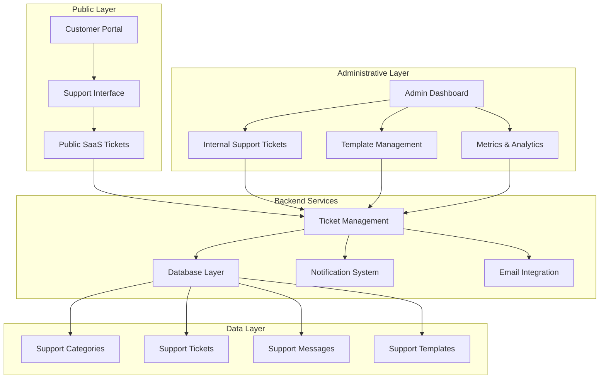

**Diagram sources**

- [20250116200000_create_support_system.sql](file://supabase/migrations/20250116200000_create_support_system.sql#L1-L387)
- [20260131000011_create_saas_support_system.sql](file://supabase/migrations/20260131000011_create_saas_support_system.sql#L1-L333)
- [20260201000002_create_optical_internal_support.sql](file://supabase/migrations/20260201000002_create_optical_internal_support.sql#L1-L334)

The architecture supports three primary support domains:

1. **Public SaaS Support**: External customer support for Opttius platform users
2. **Internal Optical Support**: Intra-organizational support for optical businesses
3. **Customer Support**: Direct customer service interface

## Core Components

### Database Schema Design

The system utilizes a robust relational database design with comprehensive foreign key relationships and row-level security policies:

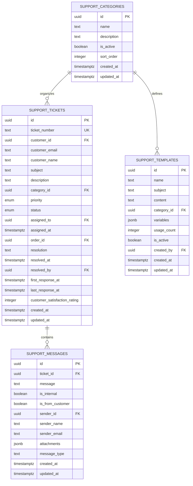

**Diagram sources**

- [20250116200000_create_support_system.sql](file://supabase/migrations/20250116200000_create_support_system.sql#L18-L115)

### Ticket Lifecycle Management

The system implements a comprehensive ticket lifecycle with automated state transitions and timestamp tracking:

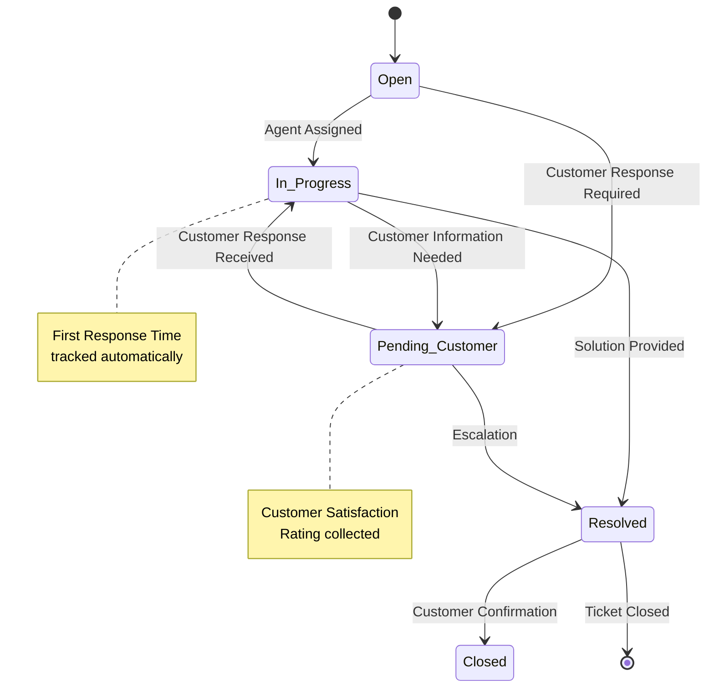

**Diagram sources**

- [20250116200000_create_support_system.sql](file://supabase/migrations/20250116200000_create_support_system.sql#L11-L16)
- [20250116200000_create_support_system.sql](file://supabase/migrations/20250116200000_create_support_system.sql#L56-L64)

## Ticket Management System

### Public SaaS Support Tickets

The public SaaS support system handles external customer inquiries with automatic ticket numbering and email notifications:

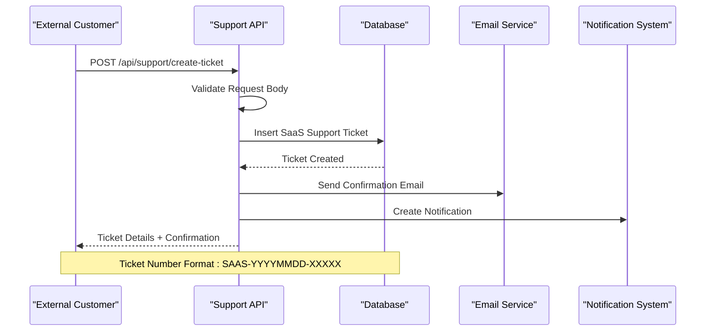

**Diagram sources**

- [route.ts](file://src/app/api/support/create-ticket/route.ts#L11-L142)
- [20260131000011_create_saas_support_system.sql](file://supabase/migrations/20260131000011_create_saas_support_system.sql#L8-L65)

### Internal Optical Support Tickets

The internal optical support system manages intra-organizational support requests with branch-level visibility and multi-entity relationships:

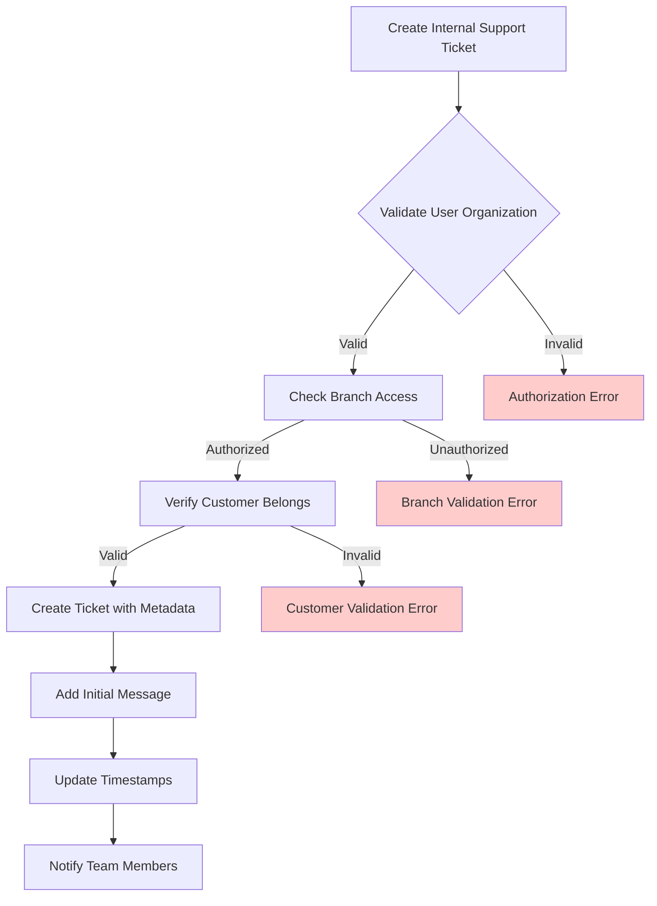

**Diagram sources**

- [route.ts](file://src/app/api/admin/optical-support/tickets/route.ts#L166-L342)
- [20260201000002_create_optical_internal_support.sql](file://supabase/migrations/20260201000002_create_optical_internal_support.sql#L6-L78)

### Ticket Categories and Priorities

The system supports hierarchical categorization with predefined categories and priority levels:

| Category      | Description                                            | Priority Levels           |
| ------------- | ------------------------------------------------------ | ------------------------- |
| **Technical** | Platform bugs, feature requests, account issues        | Low, Medium, High, Urgent |
| **Billing**   | Payment issues, subscription problems, refund requests | Low, Medium, High, Urgent |
| **General**   | Product questions, general inquiries, feedback         | Low, Medium, High, Urgent |

**Section sources**

- [20260131000011_create_saas_support_system.sql](file://supabase/migrations/20260131000011_create_saas_support_system.sql#L22-L38)
- [20260201000002_create_optical_internal_support.sql](file://supabase/migrations/20260201000002_create_optical_internal_support.sql#L35-L54)

## Customer Support Interfaces

### Public Support Portal

The public support portal provides external customers with a streamlined interface for creating and tracking support tickets:

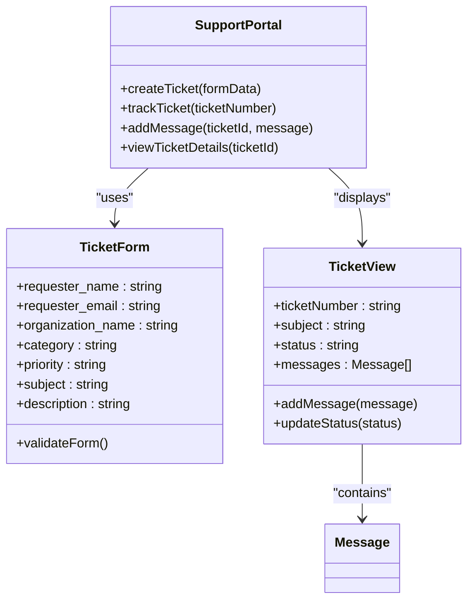

**Diagram sources**

- [page.tsx](file://src/app/support/page.tsx#L60-L114)
- [page.tsx](file://src/app/support/ticket/[ticketNumber]/page.tsx#L120-L207)

### Administrative Support Dashboard

The administrative dashboard provides comprehensive ticket management capabilities for support agents:

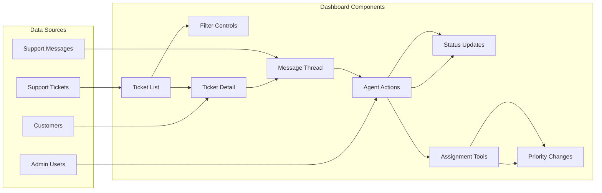

**Diagram sources**

- [page.tsx](file://src/app/admin/support/page.tsx#L134-L283)
- [page.tsx](file://src/app/admin/support/tickets/[id]/page.tsx#L189-L400)

**Section sources**

- [page.tsx](file://src/app/support/page.tsx#L1-L467)
- [page.tsx](file://src/app/admin/support/page.tsx#L1-L804)

## Internal Help Desk Functionality

### Multi-Tenant Architecture

The internal help desk supports multiple organizations with strict data isolation and role-based access controls:

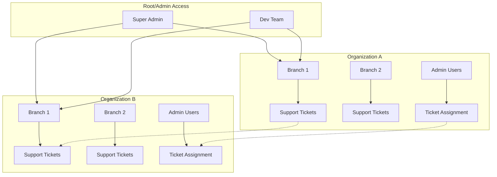

**Diagram sources**

- [20260201000002_create_optical_internal_support.sql](file://supabase/migrations/20260201000002_create_optical_internal_support.sql#L12-L25)
- [route.ts](file://src/app/api/admin/optical-support/tickets/route.ts#L43-L56)

### Branch-Level Visibility

The system implements granular branch-level access control ensuring support agents can only view tickets from their assigned branches:

| User Role       | Ticket Visibility              | Branch Access          |
| --------------- | ------------------------------ | ---------------------- |
| **Super Admin** | All tickets in organization    | All branches           |
| **Admin**       | All tickets in organization    | All branches           |
| **Employee**    | Tickets from assigned branches | Assigned branches only |
| **Vendedor**    | Tickets from assigned branches | Assigned branches only |

**Section sources**

- [route.ts](file://src/app/api/admin/optical-support/tickets/route.ts#L217-L231)
- [20260201000002_create_optical_internal_support.sql](file://supabase/migrations/20260201000002_create_optical_internal_support.sql#L213-L232)

## Knowledge Base Integration

### Template Management System

The knowledge base integration provides reusable response templates with variable substitution:

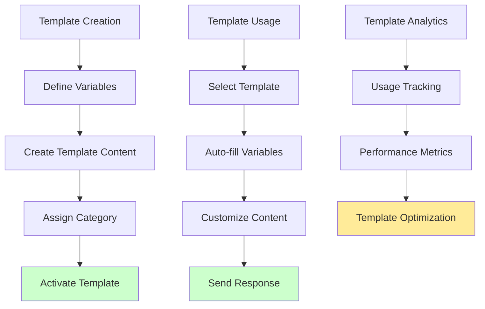

**Diagram sources**

- [page.tsx](file://src/app/admin/support/templates/page.tsx#L71-L128)
- [20250116200000_create_support_system.sql](file://supabase/migrations/20250116200000_create_support_system.sql#L92-L115)

### Variable Substitution Engine

The template system supports dynamic variable substitution for personalized responses:

| Variable Type            | Example Value      | Usage Context          |
| ------------------------ | ------------------ | ---------------------- |
| `{{customer_name}}`      | "María González"   | Personalized greetings |
| `{{ticket_number}}`      | "TKT-202501-0001"  | Ticket identification  |
| `{{order_number}}`       | "ORD-001"          | Order reference        |
| `{{product_name}}`       | "Crema Facial"     | Product details        |
| `{{resolution_details}}` | "Solved via email" | Resolution summary     |

**Section sources**

- [page.tsx](file://src/app/admin/support/templates/page.tsx#L167-L204)
- [20250116200000_create_support_system.sql](file://supabase/migrations/20250116200000_create_support_system.sql#L315-L364)

## Multi-Channel Support

### Live Chat Integration

The system supports real-time communication through integrated chat functionality with message threading and agent availability tracking.

### Email Integration

Automated email notifications are sent for ticket creation, status changes, and customer responses with configurable templates and scheduling.

### Phone Support Channels

Phone support integration provides call logging, callback scheduling, and integration with ticket numbering systems.

### Self-Service Options

Self-service portals offer FAQ access, knowledge base search, and automated response suggestions to reduce support workload.

## Configuration Options

### Support Categories Configuration

The system supports dynamic category management with customizable sorting and activation controls:

| Configuration Option | Description                       | Default Value |
| -------------------- | --------------------------------- | ------------- |
| **Category Name**    | Display name for support category | Required      |
| **Description**      | Category purpose and scope        | Optional      |
| **Sort Order**       | Display priority in UI            | Integer       |
| **Active Status**    | Enable/disable category           | Boolean       |

### SLA Management

Service Level Agreement tracking includes automated response time monitoring and escalation triggers:

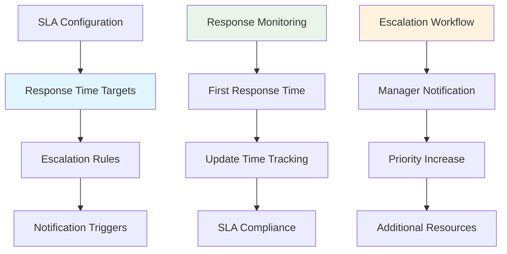

**Diagram sources**

- [20260131000011_create_saas_support_system.sql](file://supabase/migrations/20260131000011_create_saas_support_system.sql#L49-L57)

### Agent Assignment Rules

Dynamic agent assignment based on expertise, workload, and geographic proximity:

| Assignment Rule          | Trigger Condition                | Action                 |
| ------------------------ | -------------------------------- | ---------------------- |
| **Category Expertise**   | Agent specialized in category    | Automatic assignment   |
| **Load Balancing**       | Equal distribution across agents | Queue-based assignment |
| **Geographic Proximity** | Agent location matches customer  | Preferred assignment   |
| **Availability**         | Agent online and available       | Priority assignment    |

**Section sources**

- [20260131000011_create_saas_support_system.sql](file://supabase/migrations/20260131000011_create_saas_support_system.sql#L40-L47)
- [20260201000002_create_optical_internal_support.sql](file://supabase/migrations/20260201000002_create_optical_internal_support.sql#L56-L64)

## Performance and Scalability

### Database Optimization

The system implements comprehensive indexing strategies for optimal query performance:

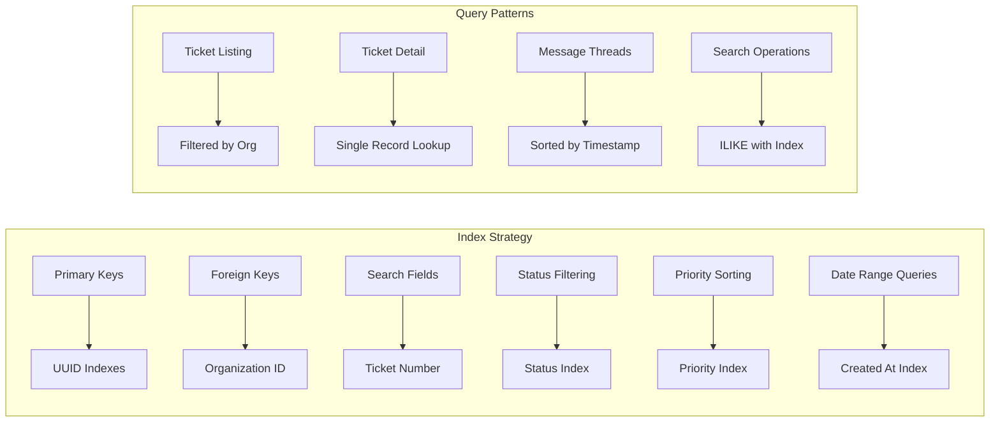

**Diagram sources**

- [20250116200000_create_support_system.sql](file://supabase/migrations/20250116200000_create_support_system.sql#L208-L215)
- [20260131000011_create_saas_support_system.sql](file://supabase/migrations/20260131000011_create_saas_support_system.sql#L124-L133)

### Caching Strategies

Redis caching implementation for frequently accessed data including:

- Ticket lists with filters
- Template content
- Agent availability status
- Organization metadata

### Horizontal Scaling

The system supports horizontal scaling through:

- Read replicas for reporting queries
- Load balancer distribution
- Database connection pooling
- Asynchronous job processing

## Troubleshooting Guide

### Common Issues and Solutions

| Issue                        | Symptoms                       | Solution                                             |
| ---------------------------- | ------------------------------ | ---------------------------------------------------- |
| **Ticket Creation Failures** | 500 errors on submit           | Check database connectivity and validation rules     |
| **Email Delivery Problems**  | Missing confirmation emails    | Verify SMTP configuration and rate limits            |
| **Permission Denied Errors** | 403 responses on ticket access | Review RLS policies and user organization membership |
| **Slow Performance**         | Delayed ticket loading         | Check database indexes and query optimization        |
| **Message Not Appearing**    | New messages missing from UI   | Verify message filtering and internal flag settings  |

### API Error Handling

The system implements comprehensive error handling with detailed error messages:

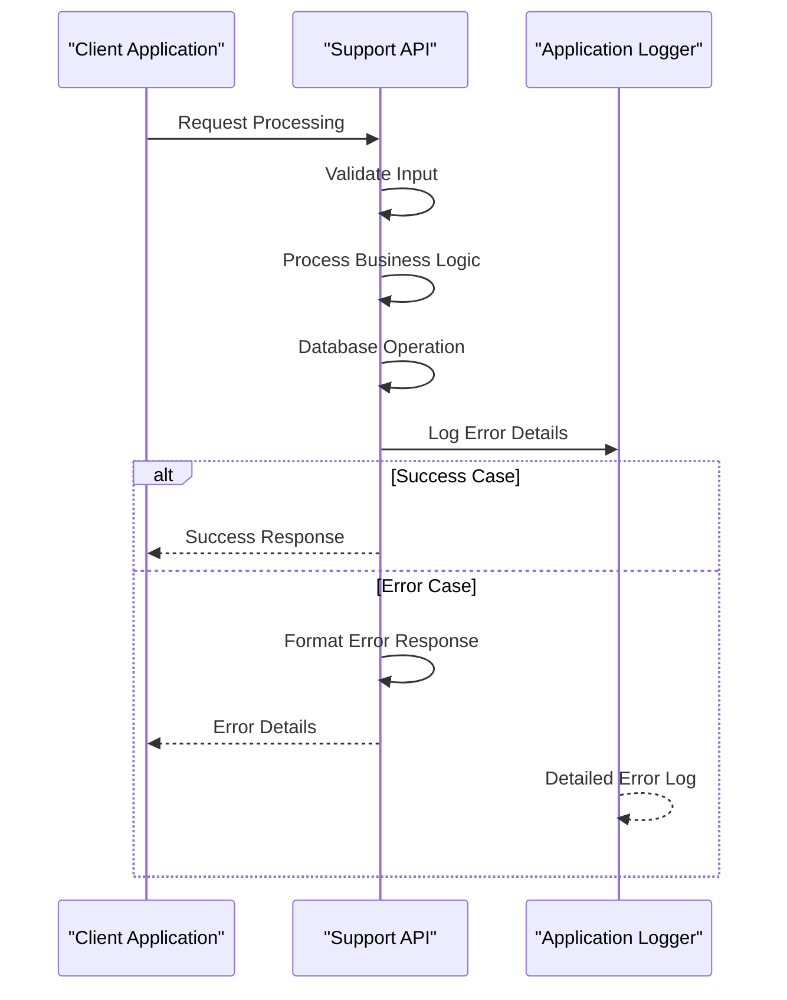

**Diagram sources**

- [route.ts](file://src/app/api/support/create-ticket/route.ts#L135-L142)
- [route.ts](file://src/app/api/admin/optical-support/tickets/route.ts#L150-L159)

### Monitoring and Logging

Comprehensive logging implementation tracks:

- API request/response cycles
- Database query performance
- User authentication events
- Ticket lifecycle transitions
- System error conditions

**Section sources**

- [route.ts](file://src/app/api/support/create-ticket/route.ts#L68-L103)
- [route.ts](file://src/app/api/admin/optical-support/tickets/route.ts#L133-L139)

## Conclusion

The Opttius Support & Help System provides a comprehensive, scalable solution for managing customer service and internal support workflows. The system's multi-layered architecture ensures proper separation between different support domains while maintaining unified management capabilities.

Key strengths of the system include:

- **Multi-Tenant Isolation**: Secure separation between organizations with granular access controls
- **Comprehensive Ticket Management**: Full lifecycle tracking with automated workflows
- **Flexible Communication Channels**: Support for email, chat, phone, and self-service options
- **Advanced Analytics**: Real-time metrics and reporting for performance monitoring
- **Scalable Architecture**: Optimized for growth with proper indexing and caching strategies

The system successfully balances ease of use for end customers with powerful administrative capabilities for support teams, providing a solid foundation for customer service operations across diverse organizational needs.

Future enhancements could include advanced AI-powered ticket routing, predictive support analytics, and expanded integration capabilities with third-party systems.
