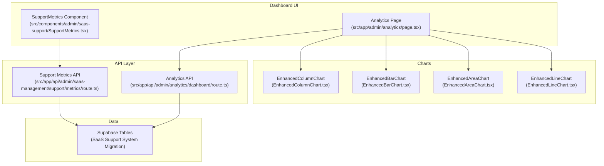
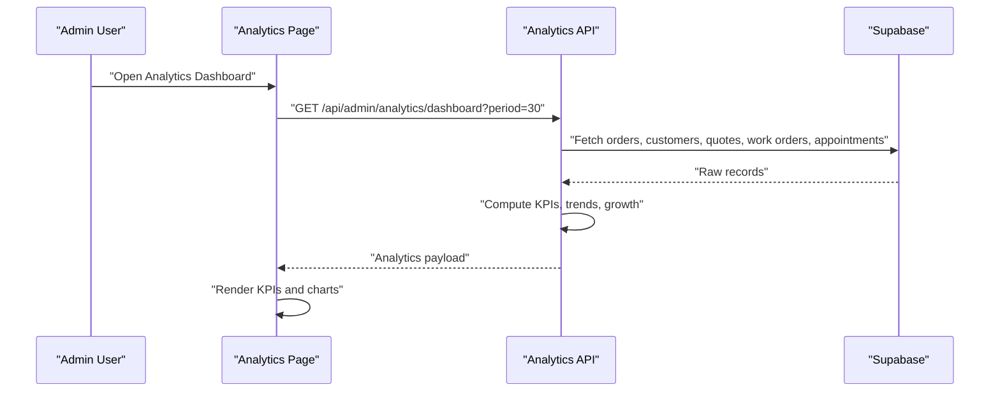
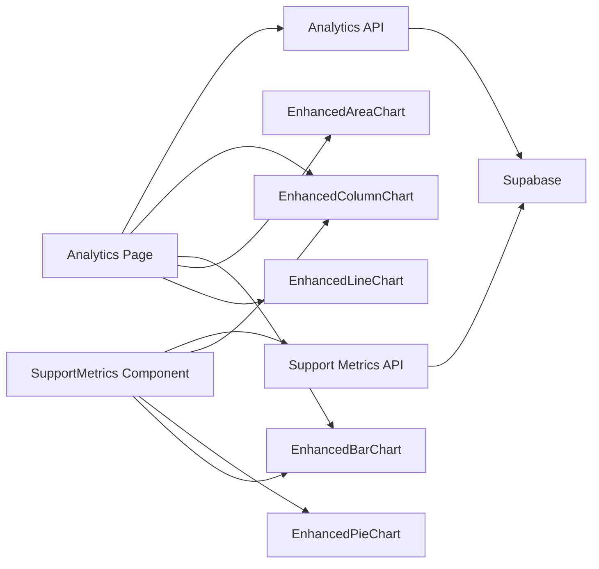

# Support Analytics & Metrics

<cite>
**Referenced Files in This Document**
- [Analytics Page](file://src/app/admin/analytics/page.tsx)
- [Analytics API](file://src/app/api/admin/analytics/dashboard/route.ts)
- [Support Metrics Component](file://src/components/admin/saas-support/SupportMetrics.tsx)
- [Support Metrics API](file://src/app/api/admin/saas-management/support/metrics/route.ts)
- [Enhanced Column Chart](file://src/components/admin/charts/EnhancedColumnChart.tsx)
- [Enhanced Bar Chart](file://src/components/admin/charts/EnhancedBarChart.tsx)
- [Enhanced Area Chart](file://src/components/admin/charts/EnhancedAreaChart.tsx)
- [Enhanced Line Chart](file://src/components/admin/charts/EnhancedLineChart.tsx)
- [Analytics Help Texts](file://src/lib/analytics-help.ts)
- [SaaS Support System Migration](file://supabase/migrations/20260131000011_create_saas_support_system.sql)
</cite>

## Table of Contents

1. [Introduction](#introduction)
2. [Project Structure](#project-structure)
3. [Core Components](#core-components)
4. [Architecture Overview](#architecture-overview)
5. [Detailed Component Analysis](#detailed-component-analysis)
6. [Dependency Analysis](#dependency-analysis)
7. [Performance Considerations](#performance-considerations)
8. [Troubleshooting Guide](#troubleshooting-guide)
9. [Conclusion](#conclusion)
10. [Appendices](#appendices)

## Introduction

This document describes the support analytics and metrics system in Opttius with a focus on performance measurement and continuous improvement. It explains the analytics dashboard design, key performance indicators, and reporting capabilities. It documents implementation details for metric calculation, trend analysis, and automated export/reporting. It also covers configuration options for custom metrics, benchmark settings, and SLA tracking, and connects analytics to ticket resolution times, customer satisfaction scores, and support volume trends. Finally, it provides guidance for interpreting analytics data, identifying improvement opportunities, and making data-driven support decisions.

## Project Structure

The analytics system is composed of:

- A React dashboard page that renders KPIs, charts, and tabs for multiple domains (sales, work orders, quotes, products).
- An API endpoint that computes aggregated metrics and time-series data for the selected period and branch context.
- A dedicated support metrics component and API for SaaS support tickets, including response/resolution times, satisfaction, and organizational breakdowns.
- Recharts-based visualization components for column, bar, area, and line charts.
- Help texts and empty-state messages for metric interpretation and guidance.

**Diagram sources**

- [Analytics Page](file://src/app/admin/analytics/page.tsx#L134-L301)
- [Support Metrics Component](file://src/components/admin/saas-support/SupportMetrics.tsx#L48-L70)
- [Enhanced Column Chart](file://src/components/admin/charts/EnhancedColumnChart.tsx#L32-L85)
- [Enhanced Bar Chart](file://src/components/admin/charts/EnhancedBarChart.tsx#L36-L80)
- [Enhanced Area Chart](file://src/components/admin/charts/EnhancedAreaChart.tsx#L33-L82)
- [Enhanced Line Chart](file://src/components/admin/charts/EnhancedLineChart.tsx#L33-L82)
- [Analytics API](file://src/app/api/admin/analytics/dashboard/route.ts#L8-L635)
- [Support Metrics API](file://src/app/api/admin/saas-management/support/metrics/route.ts#L11-L260)
- [SaaS Support System Migration](file://supabase/migrations/20260131000011_create_saas_support_system.sql#L32-L65)

**Section sources**

- [Analytics Page](file://src/app/admin/analytics/page.tsx#L134-L301)
- [Analytics API](file://src/app/api/admin/analytics/dashboard/route.ts#L8-L635)
- [Support Metrics Component](file://src/components/admin/saas-support/SupportMetrics.tsx#L48-L70)
- [Support Metrics API](file://src/app/api/admin/saas-management/support/metrics/route.ts#L11-L260)
- [Enhanced Column Chart](file://src/components/admin/charts/EnhancedColumnChart.tsx#L32-L85)
- [Enhanced Bar Chart](file://src/components/admin/charts/EnhancedBarChart.tsx#L36-L80)
- [Enhanced Area Chart](file://src/components/admin/charts/EnhancedAreaChart.tsx#L33-L82)
- [Enhanced Line Chart](file://src/components/admin/charts/EnhancedLineChart.tsx#L33-L82)
- [SaaS Support System Migration](file://supabase/migrations/20260131000011_create_saas_support_system.sql#L32-L65)

## Core Components

- Analytics Dashboard Page: Renders KPI cards, tabs, and charts for sales, work orders, quotes, and products. Supports period selection, branch scoping, and refresh actions.
- Analytics API: Computes revenue, growth, orders, customers, quotes, appointments, products, payment methods, and daily trends. Applies branch filters and previous-period comparisons.
- Support Metrics Component: Displays SaaS support KPIs, charts for tickets per day, status/priority/category distributions, top organizations, and performance metrics (response/resolution times, satisfaction).
- Support Metrics API: Aggregates ticket counts by status, priority, category; computes averages for response/resolution times and satisfaction; builds daily ticket series and top organizations.
- Visualization Components: Recharts-based charts with tooltips, summary statistics, and responsive layouts.

**Section sources**

- [Analytics Page](file://src/app/admin/analytics/page.tsx#L58-L132)
- [Analytics API](file://src/app/api/admin/analytics/dashboard/route.ts#L204-L618)
- [Support Metrics Component](file://src/components/admin/saas-support/SupportMetrics.tsx#L20-L46)
- [Support Metrics API](file://src/app/api/admin/saas-management/support/metrics/route.ts#L20-L244)
- [Enhanced Column Chart](file://src/components/admin/charts/EnhancedColumnChart.tsx#L15-L40)
- [Enhanced Bar Chart](file://src/components/admin/charts/EnhancedBarChart.tsx#L15-L44)
- [Enhanced Area Chart](file://src/components/admin/charts/EnhancedAreaChart.tsx#L15-L40)
- [Enhanced Line Chart](file://src/components/admin/charts/EnhancedLineChart.tsx#L15-L40)

## Architecture Overview

The system follows a client-server pattern:

- The client-side pages trigger API requests with branch and period parameters.
- APIs compute aggregates and time-series data using Supabase service role clients.
- Results are returned as structured analytics payloads consumed by the UI.

**Diagram sources**

- [Analytics Page](file://src/app/admin/analytics/page.tsx#L164-L191)
- [Analytics API](file://src/app/api/admin/analytics/dashboard/route.ts#L8-L635)

## Detailed Component Analysis

### Analytics Dashboard Page

Responsibilities:

- Period selection (7/30/90/365 days) and branch scoping via headers.
- Fetch analytics via a single endpoint and render KPIs and charts.
- Provide chart type toggles for sales/work orders (column/line).

Key UI elements:

- KPI cards for total revenue, work orders, quotes, appointments.
- Secondary KPI cards for POS revenue, work orders revenue, customer counts, and product stock status.
- Tabs for overview, work orders, quotes, sales, and products.
- Charts powered by reusable components.

Metric rendering highlights:

- Revenue growth icon/color reflects positive/negative change.
- Status labels mapped to localized statuses.
- Payment method labels localized.

**Section sources**

- [Analytics Page](file://src/app/admin/analytics/page.tsx#L134-L301)
- [Analytics Page](file://src/app/admin/analytics/page.tsx#L348-L576)
- [Analytics Page](file://src/app/admin/analytics/page.tsx#L578-L764)

### Analytics API Implementation

Responsibilities:

- Validate admin access and feature availability.
- Compute branch-scoped datasets and previous-period baselines.
- Aggregate revenue (POS + work orders), growth, orders, customers, quotes, appointments, products, payment methods.
- Build daily time-series for sales, customers, work orders, and quotes.
- Return structured analytics payload.

Important calculations:

- Revenue growth percentage vs previous same-size period.
- Quote conversion rate (accepted + converted) / total quotes.
- Appointment completion rate (completed / total).
- Average delivery days for delivered work orders.
- Daily trends by date with value and count.

Branch and feature gating:

- Branch-aware filtering; super admin global view supported.
- Feature flag for advanced analytics enforced.

**Section sources**

- [Analytics API](file://src/app/api/admin/analytics/dashboard/route.ts#L8-L635)
- [Analytics API](file://src/app/api/admin/analytics/dashboard/route.ts#L204-L618)

### Support Metrics Component

Responsibilities:

- Fetch support metrics from the dedicated API.
- Render key metrics (total/open/resolved tickets, average response/resolution times, satisfaction).
- Visualize tickets per day (last 30 days), status distribution, priority distribution, and top organizations.
- Provide CSV export link for reports.

Data transformations:

- Open tickets aggregation from multiple statuses.
- Priority/status/category counts derived from raw ticket data.
- Tickets-per-day aggregated from created_at timestamps.
- Top organizations computed via joined organization names.

**Section sources**

- [Support Metrics Component](file://src/components/admin/saas-support/SupportMetrics.tsx#L48-L70)
- [Support Metrics Component](file://src/components/admin/saas-support/SupportMetrics.tsx#L84-L103)
- [Support Metrics Component](file://src/components/admin/saas-support/SupportMetrics.tsx#L139-L143)

### Support Metrics API Implementation

Responsibilities:

- Root-only access enforced.
- Count total tickets and group by status, priority, category.
- Compute averages for response time, resolution time, and satisfaction ratings.
- Build tickets-per-day series for the last 30 days.
- Identify top organizations by ticket count.

Date filtering:

- Optional start_date and end_date parameters supported.

**Section sources**

- [Support Metrics API](file://src/app/api/admin/saas-management/support/metrics/route.ts#L11-L260)

### Visualization Components

Reusable chart components:

- EnhancedColumnChart: Daily sales/work orders/quotes trends with weekly aggregation when appropriate.
- EnhancedBarChart: Horizontal bar charts for categorical comparisons.
- EnhancedAreaChart: Area charts for continuous trends.
- EnhancedLineChart: Line charts for smooth trend visualization.

Common features:

- Localized date formatting.
- Custom tooltips with formatted values and counts.
- Summary statistics (average, min, max).
- Responsive containers and accessibility-friendly axes.

**Section sources**

- [Enhanced Column Chart](file://src/components/admin/charts/EnhancedColumnChart.tsx#L32-L85)
- [Enhanced Bar Chart](file://src/components/admin/charts/EnhancedBarChart.tsx#L36-L80)
- [Enhanced Area Chart](file://src/components/admin/charts/EnhancedAreaChart.tsx#L33-L82)
- [Enhanced Line Chart](file://src/components/admin/charts/EnhancedLineChart.tsx#L33-L82)

### Analytics Help Texts and Interpretation

Help texts define metric semantics, formulas, and caveats for:

- Total revenue, revenue growth, total orders, total customers.
- Sales trend, customer acquisition, order status distribution.
- Category revenue, top products.

These help texts guide dashboard tooltips and contextual guidance.

**Section sources**

- [Analytics Help Texts](file://src/lib/analytics-help.ts#L3-L98)

### SaaS Support System Schema

The support metrics rely on a dedicated SaaS support system with:

- Ticket table including status, priority, category, assignment, resolution, response/resolution times, satisfaction, and organization linkage.
- Messages table for ticket conversations.
- Rich metadata and timestamps.

This schema enables accurate computation of SLAs (response/resolve times), satisfaction, and organizational breakdowns.

**Section sources**

- [SaaS Support System Migration](file://supabase/migrations/20260131000011_create_saas_support_system.sql#L32-L65)

## Dependency Analysis

High-level dependencies:

- Analytics Page depends on Analytics API and chart components.
- Support Metrics Component depends on Support Metrics API and chart components.
- Both APIs depend on Supabase service role clients and enforce authorization and feature checks.
- Charts depend on Recharts and share common formatting utilities.

**Diagram sources**

- [Analytics Page](file://src/app/admin/analytics/page.tsx#L134-L301)
- [Analytics API](file://src/app/api/admin/analytics/dashboard/route.ts#L8-L635)
- [Support Metrics Component](file://src/components/admin/saas-support/SupportMetrics.tsx#L48-L70)
- [Support Metrics API](file://src/app/api/admin/saas-management/support/metrics/route.ts#L11-L260)
- [Enhanced Column Chart](file://src/components/admin/charts/EnhancedColumnChart.tsx#L32-L85)
- [Enhanced Bar Chart](file://src/components/admin/charts/EnhancedBarChart.tsx#L36-L80)
- [Enhanced Area Chart](file://src/components/admin/charts/EnhancedAreaChart.tsx#L33-L82)
- [Enhanced Line Chart](file://src/components/admin/charts/EnhancedLineChart.tsx#L33-L82)

**Section sources**

- [Analytics Page](file://src/app/admin/analytics/page.tsx#L134-L301)
- [Analytics API](file://src/app/api/admin/analytics/dashboard/route.ts#L8-L635)
- [Support Metrics Component](file://src/components/admin/saas-support/SupportMetrics.tsx#L48-L70)
- [Support Metrics API](file://src/app/api/admin/saas-management/support/metrics/route.ts#L11-L260)
- [Enhanced Column Chart](file://src/components/admin/charts/EnhancedColumnChart.tsx#L32-L85)
- [Enhanced Bar Chart](file://src/components/admin/charts/EnhancedBarChart.tsx#L36-L80)
- [Enhanced Area Chart](file://src/components/admin/charts/EnhancedAreaChart.tsx#L33-L82)
- [Enhanced Line Chart](file://src/components/admin/charts/EnhancedLineChart.tsx#L33-L82)

## Performance Considerations

- Data volume: The analytics API computes aggregates over potentially large datasets. Consider indexing on created_at, status, and branch_id fields to optimize queries.
- Time-series granularity: Weekly aggregation in EnhancedColumnChart reduces overplotting for long periods.
- Parallelization: The API uses Promise.all to fetch related datasets concurrently.
- Branch scoping: Filtering by branch_id reduces dataset sizes and improves responsiveness.
- Client-side memoization: Charts use useMemo to avoid unnecessary re-renders.

[No sources needed since this section provides general guidance]

## Troubleshooting Guide

Common issues and remedies:

- Unauthorized access: Admin access and feature validation must pass; otherwise, the API returns 401/403.
- Empty data states: The dashboard displays loading skeletons and error states; verify period and branch selections.
- No charts rendered: Ensure data exists for the selected period; charts show empty states when no data is found.
- Export failures: CSV export opens a new tab; verify network connectivity and CORS settings.

**Section sources**

- [Analytics API](file://src/app/api/admin/analytics/dashboard/route.ts#L14-L57)
- [Analytics Page](file://src/app/admin/analytics/page.tsx#L251-L301)
- [Support Metrics Component](file://src/components/admin/saas-support/SupportMetrics.tsx#L72-L82)
- [Support Metrics Component](file://src/components/admin/saas-support/SupportMetrics.tsx#L139-L143)

## Conclusion

The Opttius analytics and metrics system provides a comprehensive, branch-aware, and feature-gated solution for measuring business and support performance. It combines financial KPIs, operational metrics, and support SLAs into a unified dashboard with interactive visualizations and export capabilities. By leveraging clear metric definitions, robust API computations, and reusable chart components, stakeholders can monitor trends, track SLAs, and drive continuous improvements in customer service and operational efficiency.

[No sources needed since this section summarizes without analyzing specific files]

## Appendices

### Key Performance Indicators (KPIs) and Definitions

- Total Revenue: Sum of paid orders and paid work orders in the period.
- Revenue Growth: Percentage change vs previous same-size period.
- Total Orders: Count of all orders in the period.
- Total Work Orders: Count of work orders in the period.
- Total Quotes: Count of quotes in the period.
- Total Appointments: Count of appointments in the period.
- Total Customers: Total registered customers.
- New Customers: Customers created in the period.
- Recurring Customers: Customers with multiple orders/work orders.
- Average Order Value: POS revenue divided by POS order count.
- Average Work Order Value: Work orders revenue divided by work orders count.
- Average Quote Value: Sum of quote totals divided by quote count.
- Quote Conversion Rate: (Accepted + Converted) / Total Quotes.
- Appointment Completion Rate: Completed / Total Appointments.
- Average Delivery Days: Average days between ordered and delivered for delivered work orders.

**Section sources**

- [Analytics API](file://src/app/api/admin/analytics/dashboard/route.ts#L204-L321)
- [Analytics API](file://src/app/api/admin/analytics/dashboard/route.ts#L322-L347)
- [Analytics API](file://src/app/api/admin/analytics/dashboard/route.ts#L549-L618)

### Support Metrics and SLAs

- Total Tickets, Open Tickets, Resolved Tickets.
- Average Response Time: Minutes until first response.
- Average Resolution Time: Minutes until full resolution.
- Average Satisfaction Rating: 1–5 scale.
- Tickets Per Day (last 30 days).
- Top Organizations by ticket volume.

**Section sources**

- [Support Metrics Component](file://src/components/admin/saas-support/SupportMetrics.tsx#L20-L46)
- [Support Metrics API](file://src/app/api/admin/saas-management/support/metrics/route.ts#L226-L244)

### Reporting and Export Capabilities

- Dashboard supports CSV export for support metrics.
- Charts include summary statistics and tooltips for quick insights.
- Help texts provide metric definitions and formulas for interpretation.

**Section sources**

- [Support Metrics Component](file://src/components/admin/saas-support/SupportMetrics.tsx#L139-L143)
- [Analytics Help Texts](file://src/lib/analytics-help.ts#L3-L98)

### Configuration Options and Customization

- Period selection: 7/30/90/365 days.
- Branch scoping: Super admin global view; regular admin scoped to assigned branch.
- Feature gating: Advanced analytics requires a qualifying plan tier.
- Chart type toggles: Column/line for sales and work orders.
- Localized labels: Statuses and payment methods are translated for readability.

**Section sources**

- [Analytics Page](file://src/app/admin/analytics/page.tsx#L144-L156)
- [Analytics API](file://src/app/api/admin/analytics/dashboard/route.ts#L35-L57)
- [Analytics Page](file://src/app/admin/analytics/page.tsx#L321-L344)

### Forecasting, Capacity Planning, and Resource Allocation

- Trend analysis: Use daily sales, customer acquisition, and tickets-per-day charts to identify growth and workload patterns.
- Capacity planning: Compare open tickets against resolution times and top organizations to allocate resources.
- Benchmarking: Track revenue growth, conversion rates, and satisfaction to set targets.
- SLA tracking: Monitor response and resolution times to ensure adherence to internal benchmarks.

[No sources needed since this section provides general guidance]
