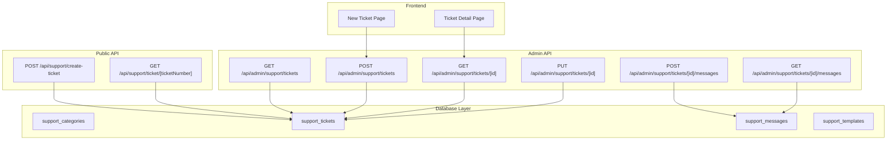
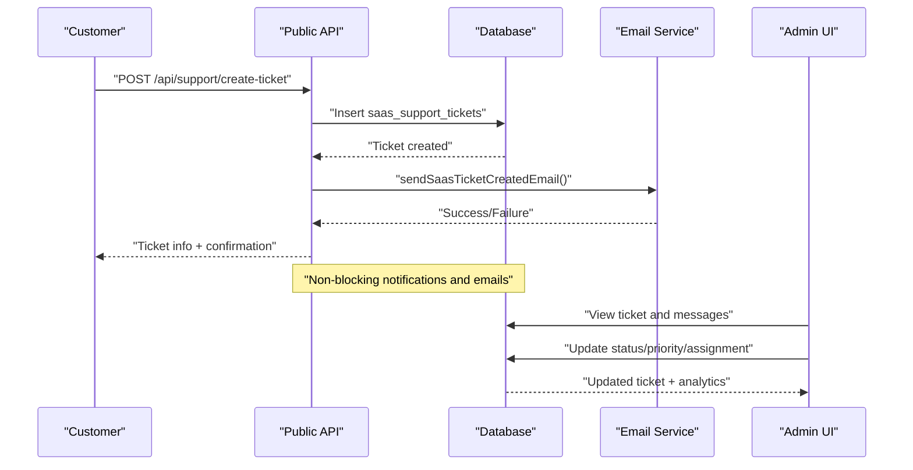
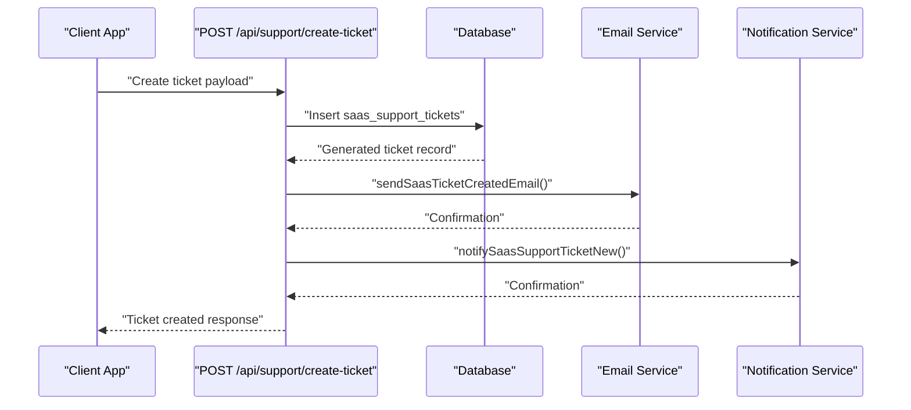
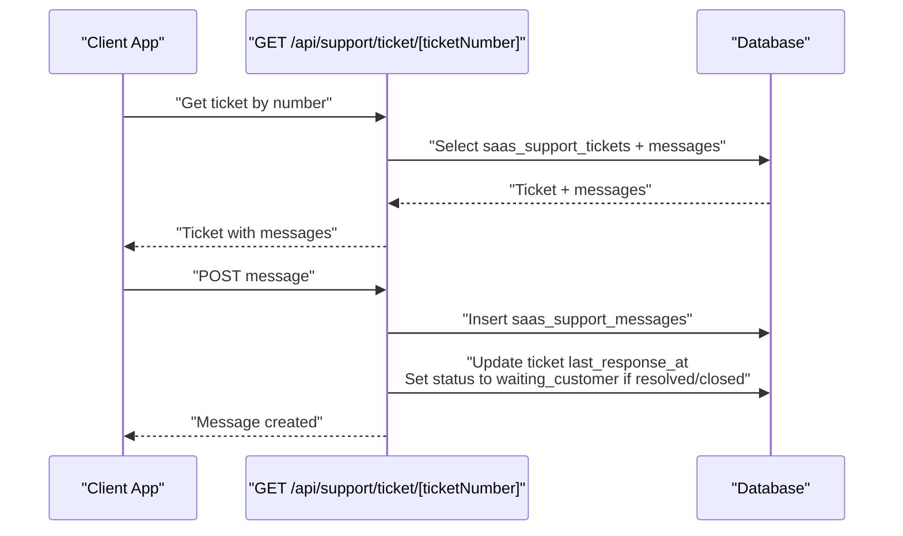
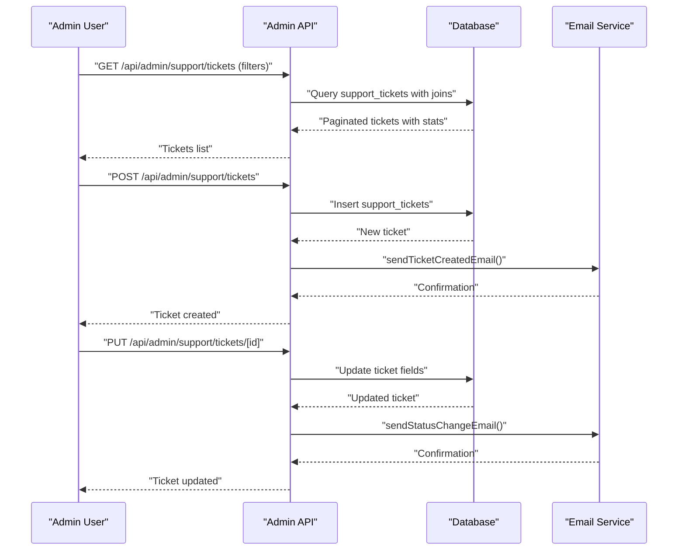
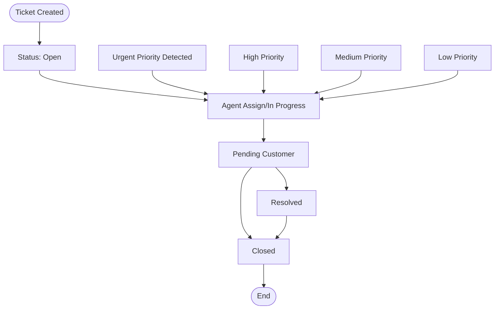
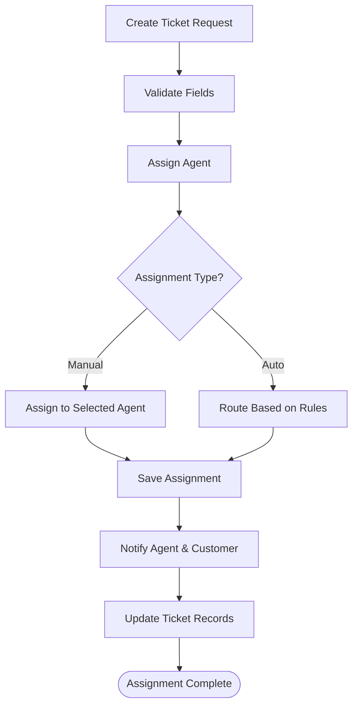
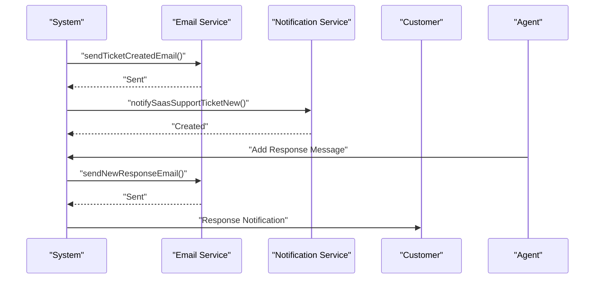
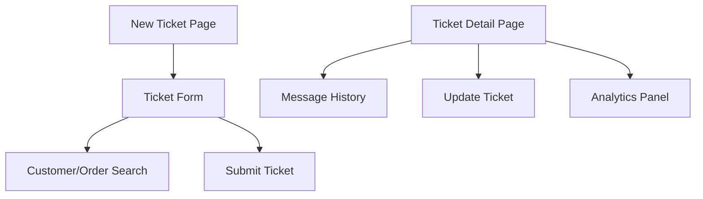
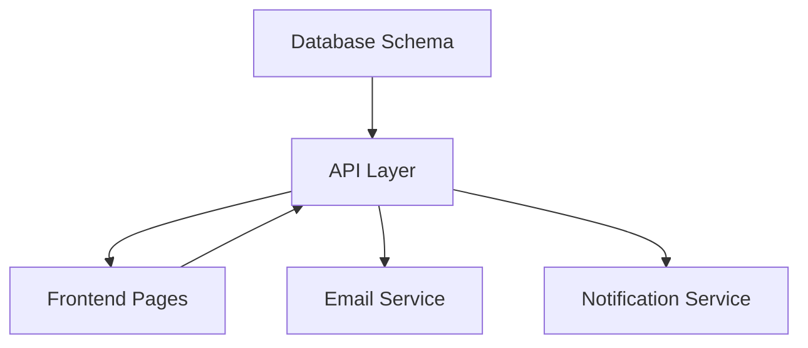

# Ticket Management System

<cite>
**Referenced Files in This Document**
- [20250116200000_create_support_system.sql](file://supabase/migrations/20250116200000_create_support_system.sql)
- [create-ticket/route.ts](file://src/app/api/support/create-ticket/route.ts)
- [ticket/[ticketNumber]/route.ts](file://src/app/api/support/ticket/[ticketNumber]/route.ts)
- [admin/support/tickets/new/page.tsx](file://src/app/admin/support/tickets/new/page.tsx)
- [admin/support/tickets/[id]/page.tsx](file://src/app/admin/support/tickets/[id]/page.tsx)
- [admin/support/tickets/route.ts](file://src/app/api/admin/support/tickets/route.ts)
- [admin/support/tickets/[id]/route.ts](file://src/app/api/admin/support/tickets/[id]/route.ts)
- [admin/support/tickets/[id]/messages/route.ts](file://src/app/api/admin/support/tickets/[id]/messages/route.ts)
- [zod-schemas.ts](file://src/lib/api/validation/zod-schemas.ts)
</cite>

## Table of Contents

1. [Introduction](#introduction)
2. [Project Structure](#project-structure)
3. [Core Components](#core-components)
4. [Architecture Overview](#architecture-overview)
5. [Detailed Component Analysis](#detailed-component-analysis)
6. [Dependency Analysis](#dependency-analysis)
7. [Performance Considerations](#performance-considerations)
8. [Troubleshooting Guide](#troubleshooting-guide)
9. [Conclusion](#conclusion)

## Introduction

This document provides comprehensive documentation for the Opttius ticket management system, focusing on the support ticket lifecycle and workflow automation. It explains the complete ticket creation process, categorization system, priority assignment, automated routing mechanisms, status tracking, agent assignment algorithms, and customer notification workflows. It also covers configuration options for categories, SLA thresholds, auto-responses, relationships with customer profiles, order history, and product information, along with analytics, reporting capabilities, and performance metrics. Guidance is included for managing ticket queues, handling urgent cases, and maintaining service level agreements.

## Project Structure

The ticket management system spans Supabase database migrations, public-facing APIs for customer self-service, and admin-facing APIs for internal support teams. Key areas include:

- Database schema and enums for tickets, categories, messages, and templates
- Public API endpoints for creating and viewing public tickets
- Admin API endpoints for full CRUD operations, status transitions, and messaging
- Frontend pages for creating tickets and viewing ticket details

**Diagram sources**

- [20250116200000_create_support_system.sql](file://supabase/migrations/20250116200000_create_support_system.sql#L1-L387)
- [create-ticket/route.ts](file://src/app/api/support/create-ticket/route.ts#L1-L143)
- [ticket/[ticketNumber]/route.ts](file://src/app/api/support/ticket/[ticketNumber]/route.ts#L1-L197)
- [admin/support/tickets/route.ts](file://src/app/api/admin/support/tickets/route.ts#L1-L503)
- [admin/support/tickets/[id]/route.ts](file://src/app/api/admin/support/tickets/[id]/route.ts#L1-L457)
- [admin/support/tickets/[id]/messages/route.ts](file://src/app/api/admin/support/tickets/[id]/messages/route.ts#L1-L211)
- [admin/support/tickets/new/page.tsx](file://src/app/admin/support/tickets/new/page.tsx#L1-L580)
- [admin/support/tickets/[id]/page.tsx](file://src/app/admin/support/tickets/[id]/page.tsx#L1-L952)

**Section sources**

- [20250116200000_create_support_system.sql](file://supabase/migrations/20250116200000_create_support_system.sql#L1-L387)
- [create-ticket/route.ts](file://src/app/api/support/create-ticket/route.ts#L1-L143)
- [ticket/[ticketNumber]/route.ts](file://src/app/api/support/ticket/[ticketNumber]/route.ts#L1-L197)
- [admin/support/tickets/route.ts](file://src/app/api/admin/support/tickets/route.ts#L1-L503)
- [admin/support/tickets/[id]/route.ts](file://src/app/api/admin/support/tickets/[id]/route.ts#L1-L457)
- [admin/support/tickets/[id]/messages/route.ts](file://src/app/api/admin/support/tickets/[id]/messages/route.ts#L1-L211)
- [admin/support/tickets/new/page.tsx](file://src/app/admin/support/tickets/new/page.tsx#L1-L580)
- [admin/support/tickets/[id]/page.tsx](file://src/app/admin/support/tickets/[id]/page.tsx#L1-L952)

## Core Components

- Database schema defines enums for priority and status, tables for categories, tickets, messages, and templates, and triggers for auto-numbering and timestamp updates.
- Public API enables customers to create tickets and view ticket details and messages.
- Admin API supports full CRUD operations, status transitions, agent assignments, and internal/external messaging with notifications.
- Frontend pages provide intuitive forms for creating tickets and detailed views for managing ticket conversations.

Key implementation highlights:

- Priority and status enums ensure consistent lifecycle states across the system.
- Auto-generated ticket numbers and triggers maintain auditability and traceability.
- RLS policies secure access to tickets and messages for admin users and customers.
- Templates enable standardized auto-responses with variable substitution.

**Section sources**

- [20250116200000_create_support_system.sql](file://supabase/migrations/20250116200000_create_support_system.sql#L4-L16)
- [20250116200000_create_support_system.sql](file://supabase/migrations/20250116200000_create_support_system.sql#L29-L64)
- [20250116200000_create_support_system.sql](file://supabase/migrations/20250116200000_create_support_system.sql#L66-L90)
- [20250116200000_create_support_system.sql](file://supabase/migrations/20250116200000_create_support_system.sql#L92-L115)
- [20250116200000_create_support_system.sql](file://supabase/migrations/20250116200000_create_support_system.sql#L217-L283)
- [20250116200000_create_support_system.sql](file://supabase/migrations/20250116200000_create_support_system.sql#L305-L364)

## Architecture Overview

The system follows a layered architecture:

- Database layer with enums, tables, triggers, and RLS policies
- API layer with public endpoints for customer self-service and admin endpoints for internal operations
- Frontend layer with React pages for ticket creation and management
- Notification and email services integrated via non-blocking calls

**Diagram sources**

- [create-ticket/route.ts](file://src/app/api/support/create-ticket/route.ts#L11-L142)
- [ticket/[ticketNumber]/route.ts](file://src/app/api/support/ticket/[ticketNumber]/route.ts#L9-L196)
- [20250116200000_create_support_system.sql](file://supabase/migrations/20250116200000_create_support_system.sql#L117-L206)

## Detailed Component Analysis

### Ticket Creation Workflow (Public)

This workflow handles customer-initiated ticket creation through the public API, including auto-numbering, email notifications, and admin notifications.

**Diagram sources**

- [create-ticket/route.ts](file://src/app/api/support/create-ticket/route.ts#L36-L120)

**Section sources**

- [create-ticket/route.ts](file://src/app/api/support/create-ticket/route.ts#L1-L143)

### Ticket Retrieval and Messaging (Public)

This workflow retrieves public ticket details and allows customers to add messages, with automatic status transitions and notifications.

**Diagram sources**

- [ticket/[ticketNumber]/route.ts](file://src/app/api/support/ticket/[ticketNumber]/route.ts#L9-L81)
- [ticket/[ticketNumber]/route.ts](file://src/app/api/support/ticket/[ticketNumber]/route.ts#L87-L196)

**Section sources**

- [ticket/[ticketNumber]/route.ts](file://src/app/api/support/ticket/[ticketNumber]/route.ts#L1-L197)

### Admin Ticket Management

Admins can create, view, update, and delete tickets, manage messages, and receive notifications. The system supports filtering, pagination, and analytics.

**Diagram sources**

- [admin/support/tickets/route.ts](file://src/app/api/admin/support/tickets/route.ts#L7-L240)
- [admin/support/tickets/route.ts](file://src/app/api/admin/support/tickets/route.ts#L242-L502)
- [admin/support/tickets/[id]/route.ts](file://src/app/api/admin/support/tickets/[id]/route.ts#L171-L396)

**Section sources**

- [admin/support/tickets/route.ts](file://src/app/api/admin/support/tickets/route.ts#L1-L503)
- [admin/support/tickets/[id]/route.ts](file://src/app/api/admin/support/tickets/[id]/route.ts#L1-L457)

### Ticket Status Transitions and Escalation

The system enforces status transitions and supports escalation for urgent cases. Status changes trigger internal notes and optional customer notifications.

**Diagram sources**

- [20250116200000_create_support_system.sql](file://supabase/migrations/20250116200000_create_support_system.sql#L11-L16)
- [admin/support/tickets/[id]/messages/route.ts](file://src/app/api/admin/support/tickets/[id]/messages/route.ts#L86-L128)

**Section sources**

- [admin/support/tickets/[id]/messages/route.ts](file://src/app/api/admin/support/tickets/[id]/messages/route.ts#L1-L211)

### Agent Assignment Algorithms

Agent assignment is configurable during ticket creation. The system supports:

- Manual assignment to a specific admin user
- Automatic routing based on category, priority, and workload
- Assignment timestamps and notifications

**Diagram sources**

- [admin/support/tickets/route.ts](file://src/app/api/admin/support/tickets/route.ts#L339-L354)
- [admin/support/tickets/[id]/route.ts](file://src/app/api/admin/support/tickets/[id]/route.ts#L258-L272)

**Section sources**

- [admin/support/tickets/route.ts](file://src/app/api/admin/support/tickets/route.ts#L242-L502)
- [admin/support/tickets/[id]/route.ts](file://src/app/api/admin/support/tickets/[id]/route.ts#L171-L396)

### Customer Notification Workflows

Notifications are sent for:

- Ticket creation confirmation
- Status changes
- New responses to tickets
- Admin actions (non-blocking)

**Diagram sources**

- [create-ticket/route.ts](file://src/app/api/support/create-ticket/route.ts#L78-L103)
- [admin/support/tickets/[id]/messages/route.ts](file://src/app/api/admin/support/tickets/[id]/messages/route.ts#L101-L127)

**Section sources**

- [create-ticket/route.ts](file://src/app/api/support/create-ticket/route.ts#L1-L143)
- [admin/support/tickets/[id]/messages/route.ts](file://src/app/api/admin/support/tickets/[id]/messages/route.ts#L1-L211)

### Frontend Ticket Creation and Management

The frontend provides:

- New ticket creation with customer and order search
- Ticket detail view with message history
- Status updates and internal/external notes
- Analytics display (age, response time, message counts)

**Diagram sources**

- [admin/support/tickets/new/page.tsx](file://src/app/admin/support/tickets/new/page.tsx#L181-L241)
- [admin/support/tickets/[id]/page.tsx](file://src/app/admin/support/tickets/[id]/page.tsx#L268-L360)

**Section sources**

- [admin/support/tickets/new/page.tsx](file://src/app/admin/support/tickets/new/page.tsx#L1-L580)
- [admin/support/tickets/[id]/page.tsx](file://src/app/admin/support/tickets/[id]/page.tsx#L1-L952)

## Dependency Analysis

The system exhibits clear separation of concerns:

- Database layer defines core entities and constraints
- API layer encapsulates business logic and validations
- Frontend interacts with APIs for user-facing operations
- Notifications and email services are integrated as external dependencies

**Diagram sources**

- [20250116200000_create_support_system.sql](file://supabase/migrations/20250116200000_create_support_system.sql#L117-L206)
- [admin/support/tickets/route.ts](file://src/app/api/admin/support/tickets/route.ts#L424-L448)

**Section sources**

- [20250116200000_create_support_system.sql](file://supabase/migrations/20250116200000_create_support_system.sql#L1-L387)
- [admin/support/tickets/route.ts](file://src/app/api/admin/support/tickets/route.ts#L1-L503)

## Performance Considerations

- Database indexes on frequently queried columns (status, priority, assigned_to, created_at) improve query performance.
- Triggers for auto-numbering and timestamp updates ensure consistency without application-level overhead.
- Non-blocking email and notification calls prevent request latency spikes.
- Pagination and filtering reduce payload sizes for large datasets.

Recommendations:

- Monitor slow queries on ticket lists and optimize filters.
- Consider materialized views for complex analytics if needed.
- Implement caching for frequently accessed categories and templates.

**Section sources**

- [20250116200000_create_support_system.sql](file://supabase/migrations/20250116200000_create_support_system.sql#L208-L216)

## Troubleshooting Guide

Common issues and resolutions:

- Authentication failures: Ensure admin RPC checks pass and branch access is validated.
- Unauthorized access: Verify RLS policies and branch context filters.
- Email failures: Check Resend API key configuration; non-blocking failures are logged.
- Validation errors: Review Zod schemas for required fields and formats.
- Status transition errors: Confirm previous status and required fields are provided.

**Section sources**

- [admin/support/tickets/route.ts](file://src/app/api/admin/support/tickets/route.ts#L32-L61)
- [admin/support/tickets/[id]/route.ts](file://src/app/api/admin/support/tickets/[id]/route.ts#L19-L36)
- [admin/support/tickets/[id]/messages/route.ts](file://src/app/api/admin/support/tickets/[id]/messages/route.ts#L22-L39)

## Conclusion

The Opttius ticket management system provides a robust foundation for support ticket lifecycle management. Its modular architecture, comprehensive validation, automated workflows, and rich analytics enable efficient handling of customer inquiries while maintaining compliance and scalability. By leveraging the documented APIs, configurations, and best practices, administrators can effectively manage ticket queues, escalate urgent cases, and uphold service level agreements.
