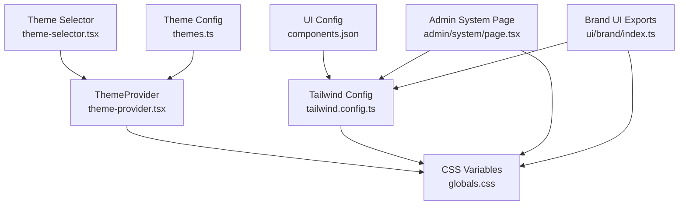
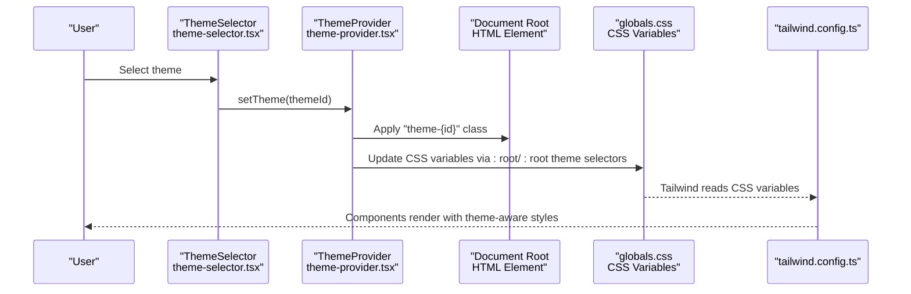
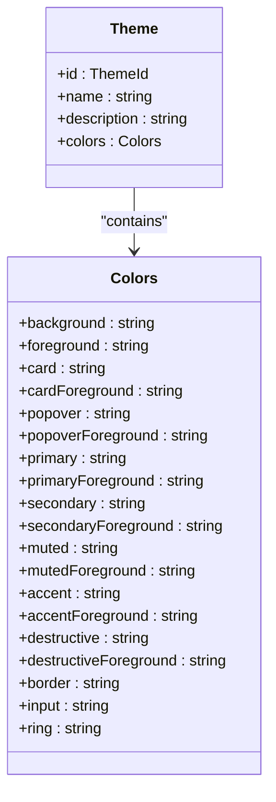
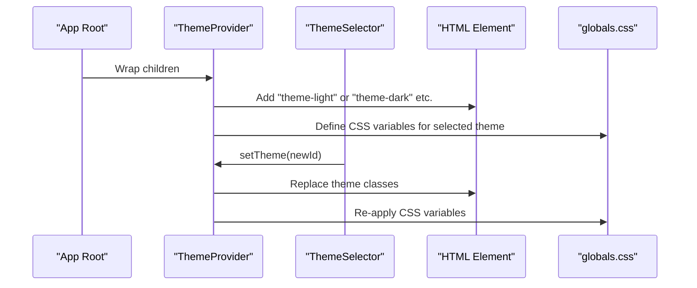
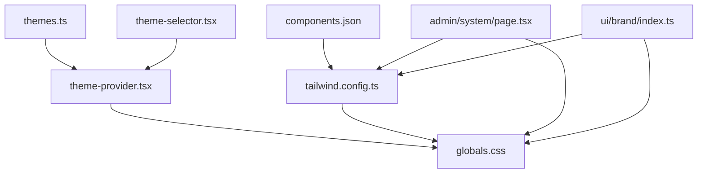

# Branding & Styling Configuration

<cite>
**Referenced Files in This Document**
- [themes.ts](file://src/config/themes.ts)
- [globals.css](file://src/app/globals.css)
- [tailwind.config.ts](file://tailwind.config.ts)
- [components.json](file://components.json)
- [theme-provider.tsx](file://src/components/theme-provider.tsx)
- [theme-selector.tsx](file://src/components/theme-selector.tsx)
- [index.ts](file://src/components/ui/brand/index.ts)
- [page.tsx](file://src/app/admin/system/page.tsx)
- [SystemConfig.tsx](file://src/app/admin/system/components/SystemConfig.tsx)
</cite>

## Table of Contents

1. [Introduction](#introduction)
2. [Project Structure](#project-structure)
3. [Core Components](#core-components)
4. [Architecture Overview](#architecture-overview)
5. [Detailed Component Analysis](#detailed-component-analysis)
6. [Dependency Analysis](#dependency-analysis)
7. [Performance Considerations](#performance-considerations)
8. [Troubleshooting Guide](#troubleshooting-guide)
9. [Conclusion](#conclusion)
10. [Appendices](#appendices)

## Introduction

This document explains how Opttius manages branding and styling across the application. It covers color scheme management, theme customization, typography settings, logo configuration, visual identity controls, admin panel branding, and brand asset management. It also provides guidance on enforcing brand guidelines, ensuring visual accessibility, maintaining cross-platform consistency, performing brand refreshes, and conducting visual testing.

## Project Structure

Branding and styling are implemented through a cohesive stack:

- Theme definitions and selection logic in TypeScript
- CSS variables and layered Tailwind-based styles
- Tailwind configuration extending design tokens
- Theme provider and selector components
- Admin system configuration pages for brand assets
- Brand UI component exports for consistent usage

**Diagram sources**

- [theme-provider.tsx](file://src/components/theme-provider.tsx#L1-L105)
- [theme-selector.tsx](file://src/components/theme-selector.tsx#L1-L65)
- [themes.ts](file://src/config/themes.ts#L1-L167)
- [globals.css](file://src/app/globals.css#L1-L519)
- [tailwind.config.ts](file://tailwind.config.ts#L1-L425)
- [components.json](file://components.json#L1-L21)
- [page.tsx](file://src/app/admin/system/page.tsx#L47-L89)
- [index.ts](file://src/components/ui/brand/index.ts#L1-L27)

**Section sources**

- [theme-provider.tsx](file://src/components/theme-provider.tsx#L1-L105)
- [theme-selector.tsx](file://src/components/theme-selector.tsx#L1-L65)
- [themes.ts](file://src/config/themes.ts#L1-L167)
- [globals.css](file://src/app/globals.css#L1-L519)
- [tailwind.config.ts](file://tailwind.config.ts#L1-L425)
- [components.json](file://components.json#L1-L21)
- [page.tsx](file://src/app/admin/system/page.tsx#L47-L89)
- [index.ts](file://src/components/ui/brand/index.ts#L1-L27)

## Core Components

- Theme definitions: Centralized theme metadata and color palettes.
- Theme provider: Applies theme classes and CSS variables to the document root.
- Theme selector: UI for switching themes in the admin area.
- Global CSS: Defines CSS variables per theme and admin-specific styles.
- Tailwind config: Extends design tokens, fonts, spacing, animations, and gradients.
- Admin system: Provides configuration surfaces for branding and system settings.

Key capabilities:

- Color scheme management via CSS variables mapped to theme IDs
- Typography scale and font families controlled centrally
- Admin panel branding with theme-aware variables
- Extensible theme palette supporting brand refreshes

**Section sources**

- [themes.ts](file://src/config/themes.ts#L1-L167)
- [theme-provider.tsx](file://src/components/theme-provider.tsx#L1-L105)
- [theme-selector.tsx](file://src/components/theme-selector.tsx#L1-L65)
- [globals.css](file://src/app/globals.css#L1-L519)
- [tailwind.config.ts](file://tailwind.config.ts#L1-L425)

## Architecture Overview

The theming architecture applies theme classes to the HTML element and uses CSS variables for colors, typography, and spacing. Tailwind utilities consume these variables, enabling consistent design tokens across components and the admin panel.

**Diagram sources**

- [theme-selector.tsx](file://src/components/theme-selector.tsx#L1-L65)
- [theme-provider.tsx](file://src/components/theme-provider.tsx#L1-L105)
- [globals.css](file://src/app/globals.css#L1-L519)
- [tailwind.config.ts](file://tailwind.config.ts#L1-L425)

## Detailed Component Analysis

### Theme Management

Opttius defines five built-in themes with consistent semantic roles across light, dark, blue, green, and red variants. Each theme maps to CSS variable definitions in global styles.

**Diagram sources**

- [themes.ts](file://src/config/themes.ts#L3-L28)

Implementation highlights:

- Theme IDs: light, dark, blue, green, red
- Semantic color roles: background, foreground, card, popover, primary, secondary, muted, accent, destructive, border, input, ring
- Theme retrieval utility for programmatic access

**Section sources**

- [themes.ts](file://src/config/themes.ts#L1-L167)

### Theme Application and Selection

The theme provider applies theme classes to the HTML element and ensures a smooth initial render. The theme selector exposes a dropdown menu to switch themes.

**Diagram sources**

- [theme-provider.tsx](file://src/components/theme-provider.tsx#L1-L105)
- [theme-selector.tsx](file://src/components/theme-selector.tsx#L1-L65)
- [globals.css](file://src/app/globals.css#L1-L519)

**Section sources**

- [theme-provider.tsx](file://src/components/theme-provider.tsx#L1-L105)
- [theme-selector.tsx](file://src/components/theme-selector.tsx#L1-L65)

### Color Scheme Management

CSS variables define theme-specific colors. Each theme selector block updates variables for background, foreground, primary, secondary, borders, and admin-specific variables.

Key areas:

- Base theme variables: background, foreground, card, popover, primary, secondary, muted, accent, destructive, border, input, ring
- Admin-specific variables: admin-bg-primary, admin-bg-secondary, admin-border-primary, admin-text-primary, admin-accent-primary, and status colors
- Theme selectors: :root, html.theme-light, html.theme-dark, html.theme-blue, html.theme-green, html.theme-red

Examples of configurable roles:

- Primary color: brand accent used for CTAs and highlights
- Secondary color: supportive backgrounds and complementary elements
- Admin accents: primary, secondary, and tertiary accents for admin UI
- Status colors: success, warning, error, info for admin badges and alerts

**Section sources**

- [globals.css](file://src/app/globals.css#L39-L265)

### Typography Settings

Typography is centralized via CSS variables for font families, sizes, spacing, and line heights. Tailwind extends these variables into utilities.

Highlights:

- Font families: heading, body, display, serif, sans, and legacy aliases
- Typography scale: xs to 9xl mapped to CSS variables
- Spacing utilities: 1–96 mapped to CSS variables
- Line heights and letter spacing extended for readability

**Section sources**

- [globals.css](file://src/app/globals.css#L9-L37)
- [tailwind.config.ts](file://tailwind.config.ts#L194-L251)

### Logo Configuration and Brand Assets

Logo assets are provided under the public directory with theme-specific variants. These assets can be integrated into the admin header and navigation.

Asset locations:

- Favicon and hero image
- Primary logos: logo-opttius.png and theme variants (blue, dark, green, red)
- Text logos: logo-text-\*.svg variants

Integration points:

- Admin header and sidebar can reference these assets for consistent branding
- Brand UI components export reusable sections that can incorporate logos

**Section sources**

- [index.ts](file://src/components/ui/brand/index.ts#L1-L27)

### Visual Identity Controls

Tailwind configuration exposes:

- Color roles mapped to CSS variables for theme-aware rendering
- Admin-specific color roles for consistent admin UI
- Premium gradients, shadows, and animations for brand expression
- Product line color sets for specialized content

These utilities enable consistent visual identity across components and admin sections.

**Section sources**

- [tailwind.config.ts](file://tailwind.config.ts#L20-L130)
- [tailwind.config.ts](file://tailwind.config.ts#L252-L299)

### Admin Panel Branding

Admin-specific styles leverage CSS variables to maintain consistent branding across layouts, cards, badges, and transitions. The admin layout classes ensure a cohesive look-and-feel.

Key elements:

- Layout classes: admin-layout, admin-header, admin-sidebar, admin-content
- Card and badge utilities with theme-aware colors
- Transition timing and easing for smooth interactions

**Section sources**

- [globals.css](file://src/app/globals.css#L278-L491)

### Custom CSS Injection and Overrides

While the system primarily relies on CSS variables and Tailwind utilities, custom CSS can be introduced via:

- Adding scoped classes in component styles
- Extending Tailwind utilities in tailwind.config.ts
- Using CSS layers to override defaults when necessary

Guidelines:

- Prefer CSS variables and Tailwind utilities for maintainability
- Scope overrides to specific components or admin sections
- Keep overrides minimal to preserve theme consistency

**Section sources**

- [tailwind.config.ts](file://tailwind.config.ts#L350-L421)
- [globals.css](file://src/app/globals.css#L1-L519)

### Brand Asset Management

Brand assets (logos, favicons, hero images) are managed under the public directory. They can be referenced directly in components and admin layouts.

Best practices:

- Store theme variants alongside base assets
- Use SVG for scalable logos and PNG for complex imagery
- Reference assets via relative paths in components and admin UI

**Section sources**

- [index.ts](file://src/components/ui/brand/index.ts#L1-L27)

### Brand Guidelines Enforcement

To enforce brand guidelines:

- Use semantic color roles consistently (primary, secondary, destructive)
- Maintain typography scale and hierarchy across components
- Apply admin-specific variables uniformly in admin sections
- Limit custom overrides to preserve consistency

**Section sources**

- [themes.ts](file://src/config/themes.ts#L3-L28)
- [globals.css](file://src/app/globals.css#L39-L265)
- [tailwind.config.ts](file://tailwind.config.ts#L20-L130)

### Visual Accessibility Requirements

Accessibility considerations:

- Ensure sufficient contrast between foreground and background colors
- Maintain readable typography scales and line heights
- Provide focus indicators and high-contrast modes via dark theme
- Test color combinations against WCAG guidelines

**Section sources**

- [globals.css](file://src/app/globals.css#L39-L265)
- [tailwind.config.ts](file://tailwind.config.ts#L325-L337)

### Cross-Platform Branding Consistency

Consistency across platforms:

- Share theme definitions and color roles across environments
- Use CSS variables to synchronize design tokens
- Align Tailwind utilities and font families across builds
- Standardize admin layouts and component libraries

**Section sources**

- [components.json](file://components.json#L1-L21)
- [tailwind.config.ts](file://tailwind.config.ts#L1-L425)
- [globals.css](file://src/app/globals.css#L1-L519)

### Brand Refresh Procedures

Steps to refresh branding:

1. Update theme definitions in theme configuration
2. Adjust CSS variables in global styles for new palettes
3. Extend Tailwind utilities if introducing new roles or gradients
4. Update admin-specific variables for consistent admin UI
5. Verify brand assets and update references
6. Run visual regression tests across themes and devices

**Section sources**

- [themes.ts](file://src/config/themes.ts#L1-L167)
- [globals.css](file://src/app/globals.css#L1-L519)
- [tailwind.config.ts](file://tailwind.config.ts#L1-L425)

### Visual Testing

Recommendations:

- Snapshot tests for theme variations
- Accessibility audits for color contrast and keyboard navigation
- Responsive testing across breakpoints and devices
- Print styles verification for receipts and reports

**Section sources**

- [globals.css](file://src/app/globals.css#L492-L519)

## Dependency Analysis

Theme-related dependencies and relationships:

**Diagram sources**

- [themes.ts](file://src/config/themes.ts#L1-L167)
- [theme-provider.tsx](file://src/components/theme-provider.tsx#L1-L105)
- [theme-selector.tsx](file://src/components/theme-selector.tsx#L1-L65)
- [globals.css](file://src/app/globals.css#L1-L519)
- [tailwind.config.ts](file://tailwind.config.ts#L1-L425)
- [components.json](file://components.json#L1-L21)
- [page.tsx](file://src/app/admin/system/page.tsx#L47-L89)
- [index.ts](file://src/components/ui/brand/index.ts#L1-L27)

**Section sources**

- [themes.ts](file://src/config/themes.ts#L1-L167)
- [theme-provider.tsx](file://src/components/theme-provider.tsx#L1-L105)
- [theme-selector.tsx](file://src/components/theme-selector.tsx#L1-L65)
- [globals.css](file://src/app/globals.css#L1-L519)
- [tailwind.config.ts](file://tailwind.config.ts#L1-L425)
- [components.json](file://components.json#L1-L21)
- [page.tsx](file://src/app/admin/system/page.tsx#L47-L89)
- [index.ts](file://src/components/ui/brand/index.ts#L1-L27)

## Performance Considerations

- CSS variables minimize cascade and improve theme switching performance
- Tailwind utilities reduce runtime style computation
- Avoid excessive custom CSS overrides to prevent layout thrashing
- Use theme-aware variables to avoid recalculating styles on the fly

[No sources needed since this section provides general guidance]

## Troubleshooting Guide

Common issues and resolutions:

- Theme not applying: verify theme provider wrapping and class application on the HTML element
- Colors not updating: ensure CSS variable blocks match the selected theme ID
- Admin styles inconsistent: confirm admin-specific variables are defined for the active theme
- Typography mismatch: check Tailwind font family and size variable mappings
- Print styles not working: validate print media queries for receipts and reports

**Section sources**

- [theme-provider.tsx](file://src/components/theme-provider.tsx#L27-L81)
- [globals.css](file://src/app/globals.css#L39-L265)
- [tailwind.config.ts](file://tailwind.config.ts#L194-L251)

## Conclusion

Opttius provides a robust, theme-driven branding system centered on CSS variables, semantic color roles, and Tailwind utilities. The theme provider and selector enable seamless theme switching, while global styles and admin-specific variables ensure consistent visual identity. By leveraging these mechanisms and following the best practices outlined, teams can maintain brand consistency, enforce guidelines, and adapt visuals efficiently across platforms.

[No sources needed since this section summarizes without analyzing specific files]

## Appendices

### Configuration Options Summary

- Theme IDs: light, dark, blue, green, red
- Semantic roles: background, foreground, card, popover, primary, secondary, muted, accent, destructive, border, input, ring
- Admin roles: admin-bg-primary, admin-bg-secondary, admin-border-primary, admin-text-primary, admin-accent-primary, status colors
- Typography: font families, scale, spacing, line heights, letter spacing
- Admin layout: header, sidebar, content, cards, badges

**Section sources**

- [themes.ts](file://src/config/themes.ts#L1-L167)
- [globals.css](file://src/app/globals.css#L39-L265)
- [tailwind.config.ts](file://tailwind.config.ts#L194-L251)
