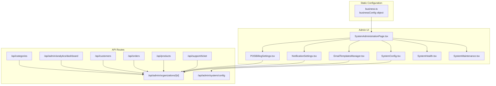
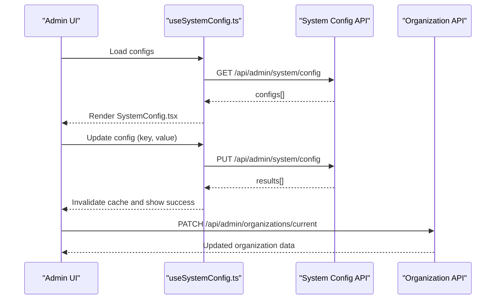
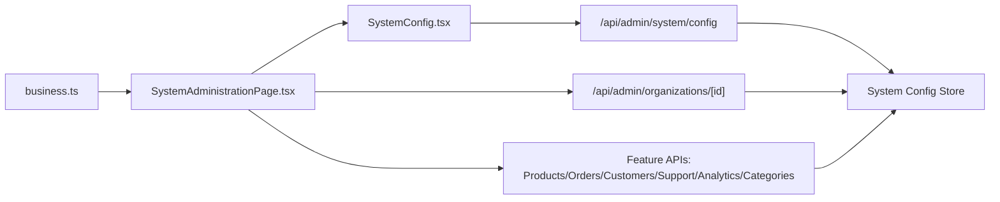

# Business Rules Configuration

<cite>
**Referenced Files in This Document**
- [business.ts](file://src/config/business.ts)
- [SystemAdministrationPage.tsx](file://src/app/admin/system/page.tsx)
- [SystemConfig.tsx](file://src/app/admin/system/components/SystemConfig.tsx)
- [useSystemConfig.ts](file://src/app/admin/system/hooks/useSystemConfig.ts)
- [EmailTemplatesManager.tsx](file://src/components/admin/EmailTemplatesManager.tsx)
- [NotificationSettings.tsx](file://src/components/admin/NotificationSettings.tsx)
- [POSBillingSettings.tsx](file://src/app/admin/system/pos-billing-settings/page.tsx)
- [SystemHealth.tsx](file://src/app/admin/system/components/SystemHealth.tsx)
- [SystemMaintenance.tsx](file://src/app/admin/system/components/SystemMaintenance.tsx)
- [Organization API Route](file://src/app/api/admin/organizations/[id]/route.ts)
- [System Config API Route](file://src/app/api/admin/system/config/route.ts)
- [Support Tickets API Route](file://src/app/api/support/ticket/route.ts)
- [Products API Route](file://src/app/api/products/route.ts)
- [Orders API Route](file://src/app/api/orders/route.ts)
- [Customers API Route](file://src/app/api/customers/route.ts)
- [Analytics API Route](file://src/app/api/admin/analytics/dashboard/route.ts)
- [Categories API Route](file://src/app/api/categories/route.ts)
</cite>

## Table of Contents

1. [Introduction](#introduction)
2. [Project Structure](#project-structure)
3. [Core Components](#core-components)
4. [Architecture Overview](#architecture-overview)
5. [Detailed Component Analysis](#detailed-component-analysis)
6. [Dependency Analysis](#dependency-analysis)
7. [Performance Considerations](#performance-considerations)
8. [Troubleshooting Guide](#troubleshooting-guide)
9. [Conclusion](#conclusion)
10. [Appendices](#appendices)

## Introduction

This document explains how to configure business rules in Opttius using the businessConfig object and the administrative interface. It covers core business parameters such as product management, customer service, order processing, and support ticket routing. You will learn how to validate configurations, manage inheritance and tenant-specific overrides, and operate the admin UI and API endpoints effectively.

## Project Structure

Business rules configuration spans three layers:

- Static configuration: businessConfig defines global defaults for branding, features, currencies, email templates, support categories, shipping, and analytics.
- Runtime system configuration: the admin System Administration page exposes editable system settings via API routes.
- Feature-specific configuration: products, orders, customers, support, analytics, and categories each have dedicated API routes and admin interfaces.

**Diagram sources**

- [business.ts](file://src/config/business.ts#L8-L89)
- [SystemAdministrationPage.tsx](file://src/app/admin/system/page.tsx#L55-L530)
- [SystemConfig.tsx](file://src/app/admin/system/components/SystemConfig.tsx#L122-L706)
- [EmailTemplatesManager.tsx](file://src/components/admin/EmailTemplatesManager.tsx)
- [NotificationSettings.tsx](file://src/components/admin/NotificationSettings.tsx)
- [POSBillingSettings.tsx](file://src/app/admin/system/pos-billing-settings/page.tsx)
- [SystemHealth.tsx](file://src/app/admin/system/components/SystemHealth.tsx)
- [SystemMaintenance.tsx](file://src/app/admin/system/components/SystemMaintenance.tsx)
- [Organization API Route](file://src/app/api/admin/organizations/[id]/route.ts)
- [System Config API Route](file://src/app/api/admin/system/config/route.ts)
- [Support Tickets API Route](file://src/app/api/support/ticket/route.ts)
- [Products API Route](file://src/app/api/products/route.ts)
- [Orders API Route](file://src/app/api/orders/route.ts)
- [Customers API Route](file://src/app/api/customers/route.ts)
- [Analytics API Route](file://src/app/api/admin/analytics/dashboard/route.ts)
- [Categories API Route](file://src/app/api/categories/route.ts)

**Section sources**

- [business.ts](file://src/config/business.ts#L1-L92)
- [SystemAdministrationPage.tsx](file://src/app/admin/system/page.tsx#L1-L1328)

## Core Components

The businessConfig object centralizes business parameters:

- Business identity and branding (name, display name, tagline, contact email, colors).
- Feature toggles (products, orders, customers, support, analytics, categories).
- Currency settings (code, symbol, locale).
- Email configuration (from/reply-to and template availability flags).
- Support system (enabled flag and predefined categories).
- Shipping defaults (enabled flag and default carrier).
- Analytics controls (enabled flag and tracking flags).

These values influence UI behavior, feature visibility, and default system behavior across the application.

**Section sources**

- [business.ts](file://src/config/business.ts#L8-L89)

## Architecture Overview

The business rules configuration architecture combines static defaults with runtime overrides and tenant-specific settings.

**Diagram sources**

- [SystemAdministrationPage.tsx](file://src/app/admin/system/page.tsx#L111-L138)
- [useSystemConfig.ts](file://src/app/admin/system/hooks/useSystemConfig.ts#L18-L86)
- [SystemConfig.tsx](file://src/app/admin/system/components/SystemConfig.tsx#L244-L303)
- [System Config API Route](file://src/app/api/admin/system/config/route.ts)
- [Organization API Route](file://src/app/api/admin/organizations/[id]/route.ts)

## Detailed Component Analysis

### Business Configuration Object (businessConfig)

The businessConfig object defines:

- Branding and identity: name, display name, tagline, contact email, and color palette.
- Feature flags: products, orders, customers, support, analytics, categories.
- Currency: code, symbol, locale.
- Email configuration: sender/replier and template availability flags.
- Support categories: predefined list used by the support system.
- Shipping defaults: enabled flag and default carrier.
- Analytics: enabled flag and tracking flags for revenue, orders, and customers.

Impact on system behavior:

- Feature flags control UI visibility and route availability.
- Currency settings affect price formatting and calculations.
- Email template flags enable/disable automated notifications.
- Support categories define routing and categorization options.
- Shipping defaults provide baseline shipping behavior.

**Section sources**

- [business.ts](file://src/config/business.ts#L8-L89)

### Admin System Configuration (SystemAdministrationPage)

The System Administration page orchestrates:

- Tabbed interface for overview, configuration, email, notifications, billing, health, and maintenance.
- Real-time system health monitoring and manual refresh.
- Backup creation, restoration, and deletion workflows.
- Integration with system configuration hooks and components.

Key behaviors:

- Maintains active tab state from URL parameters.
- Handles maintenance actions via POST to maintenance endpoint.
- Manages backup dialogs and results.

**Section sources**

- [SystemAdministrationPage.tsx](file://src/app/admin/system/page.tsx#L55-L530)

### System Configuration Management (SystemConfig)

SystemConfig renders categorized system settings:

- Filters sensitive vs. public settings.
- Groups settings by category (general, contact, ecommerce, inventory, membership, email, system, database, business).
- Provides inline editing with per-key save actions.
- Special handling for organization-level settings (name, slogan, logo) via a dedicated card.

Operational flow:

- Loads initial values from useSystemConfig hook.
- Applies updates via PUT to system config API.
- Supports saving individual keys and organization-wide branding settings.

**Section sources**

- [SystemConfig.tsx](file://src/app/admin/system/components/SystemConfig.tsx#L122-L706)
- [useSystemConfig.ts](file://src/app/admin/system/hooks/useSystemConfig.ts#L27-L86)

### Email Templates and Notifications

EmailTemplatesManager and NotificationSettings enable:

- Template management for order and support-related emails.
- Notification preferences and delivery channels.

Integration:

- Organization API supports patching organization metadata (used by branding cards).
- Email template flags in businessConfig govern which templates are available.

**Section sources**

- [EmailTemplatesManager.tsx](file://src/components/admin/EmailTemplatesManager.tsx)
- [NotificationSettings.tsx](file://src/components/admin/NotificationSettings.tsx)
- [business.ts](file://src/config/business.ts#L50-L61)

### POS Billing Settings

POSBillingSettings integrates with:

- Point-of-sale billing configuration.
- Organization-level billing settings.

This component appears conditionally in the admin interface and interacts with organization APIs for persistent settings.

**Section sources**

- [POSBillingSettings.tsx](file://src/app/admin/system/pos-billing-settings/page.tsx)

### System Health and Maintenance

SystemHealth displays metrics and allows memory clearing and refresh.
SystemMaintenance provides:

- Security audit reports.
- System status reports.
- Backup lifecycle management (create, restore, delete, download).

These components rely on dedicated API endpoints and React Query hooks for data fetching and mutations.

**Section sources**

- [SystemHealth.tsx](file://src/app/admin/system/components/SystemHealth.tsx)
- [SystemMaintenance.tsx](file://src/app/admin/system/components/SystemMaintenance.tsx)

### Feature-Specific Configuration Endpoints

#### Products

Products API enables:

- CRUD operations for product definitions.
- Category associations and pricing rules.
- Tax inclusion and branch-specific visibility.

Best practices:

- Use categories to organize products.
- Configure tax settings consistently with currency and regional regulations.
- Apply branch-level overrides for multi-location deployments.

**Section sources**

- [Products API Route](file://src/app/api/products/route.ts)

#### Orders

Orders API manages:

- Order lifecycle (creation, updates, cancellations).
- Payment status transitions.
- Branch and organization scoping.

Best practices:

- Enforce payment status validations.
- Track cancellation reasons for analytics.
- Align order workflows with POS sessions and branch settings.

**Section sources**

- [Orders API Route](file://src/app/api/orders/route.ts)

#### Customers

Customers API supports:

- Customer profiles and opt-in preferences.
- Branch and organization scoping.
- Integration with prescriptions and work orders.

Best practices:

- Keep customer data synchronized across branches.
- Respect privacy and consent settings.
- Use customer segments for targeted communications.

**Section sources**

- [Customers API Route](file://src/app/api/customers/route.ts)

#### Support Tickets

Support Tickets API handles:

- Ticket creation and updates.
- Category assignment and routing.
- Agent and customer interactions.

Best practices:

- Define clear support categories aligned with businessConfig.
- Use templates for common issue types.
- Implement SLA tracking and escalation rules.

**Section sources**

- [Support Tickets API Route](file://src/app/api/support/ticket/route.ts)

#### Analytics

Analytics API provides:

- Dashboard metrics and reporting.
- Revenue, order, and customer tracking controls.

Best practices:

- Enable/disable tracking flags per compliance requirements.
- Segment data by organization and branch.
- Use analytics to drive business decisions and rule adjustments.

**Section sources**

- [Analytics API Route](file://src/app/api/admin/analytics/dashboard/route.ts)

#### Categories

Categories API manages:

- Product taxonomy and classification.
- System and custom categories.

Best practices:

- Maintain a hierarchical and consistent category structure.
- Use categories to enforce product organization and filtering.
- Align categories with businessConfig feature flags.

**Section sources**

- [Categories API Route](file://src/app/api/categories/route.ts)

## Dependency Analysis

Business rules configuration depends on:

- Static businessConfig for defaults.
- System configuration API for runtime overrides.
- Organization API for tenant-specific branding and settings.
- Feature-specific APIs for domain rules (products, orders, customers, support, analytics, categories).

**Diagram sources**

- [business.ts](file://src/config/business.ts#L8-L89)
- [SystemAdministrationPage.tsx](file://src/app/admin/system/page.tsx#L55-L530)
- [SystemConfig.tsx](file://src/app/admin/system/components/SystemConfig.tsx#L122-L706)
- [System Config API Route](file://src/app/api/admin/system/config/route.ts)
- [Organization API Route](file://src/app/api/admin/organizations/[id]/route.ts)
- [Products API Route](file://src/app/api/products/route.ts)
- [Orders API Route](file://src/app/api/orders/route.ts)
- [Customers API Route](file://src/app/api/customers/route.ts)
- [Support Tickets API Route](file://src/app/api/support/ticket/route.ts)
- [Analytics API Route](file://src/app/api/admin/analytics/dashboard/route.ts)
- [Categories API Route](file://src/app/api/categories/route.ts)

**Section sources**

- [business.ts](file://src/config/business.ts#L8-L89)
- [SystemAdministrationPage.tsx](file://src/app/admin/system/page.tsx#L55-L530)
- [SystemConfig.tsx](file://src/app/admin/system/components/SystemConfig.tsx#L122-L706)

## Performance Considerations

- Cache system configuration queries to minimize network requests.
- Batch updates where possible to reduce API calls.
- Use category filters in the admin UI to limit rendering overhead.
- Defer heavy operations (audits, backups) to off-peak times.

## Troubleshooting Guide

Common issues and resolutions:

- Configuration not applying: Verify the key exists in system config and category filter is correct.
- Sensitive settings hidden: Toggle "Show Sensitive" to reveal masked values.
- Organization branding not updating: Ensure PATCH to organization endpoint succeeds and browser reloads to reflect changes.
- Backup failures: Check maintenance logs and retry after resolving underlying errors.
- Feature visibility mismatch: Confirm feature flags in businessConfig align with system config overrides.

**Section sources**

- [SystemConfig.tsx](file://src/app/admin/system/components/SystemConfig.tsx#L353-L373)
- [SystemAdministrationPage.tsx](file://src/app/admin/system/page.tsx#L140-L197)

## Conclusion

Business rules in Opttius are governed by a combination of static defaults in businessConfig and runtime overrides managed through the admin interface and API. By leveraging feature flags, currency settings, email templates, support categories, shipping defaults, and analytics controls, administrators can tailor the system to their operational needs while maintaining tenant-specific isolation and compliance.

## Appendices

### Business Rule Validation

- Validate feature flags against businessConfig before enabling features.
- Ensure currency and locale settings match regional requirements.
- Confirm email template flags align with notification workflows.
- Review support categories for completeness and accuracy.

### Inheritance Patterns and Tenant Overrides

- businessConfig provides global defaults.
- System configuration API allows per-tenant overrides.
- Organization API stores branding and billing settings.
- Feature APIs enforce tenant scoping via organization and branch identifiers.

### Best Practices for Business Rule Management

- Centralize configuration in businessConfig for consistency.
- Use the admin UI for frequent adjustments and immediate feedback.
- Leverage API endpoints for automation and integrations.
- Regularly audit system health and backups.
- Segment analytics data by organization and branch for accurate reporting.
