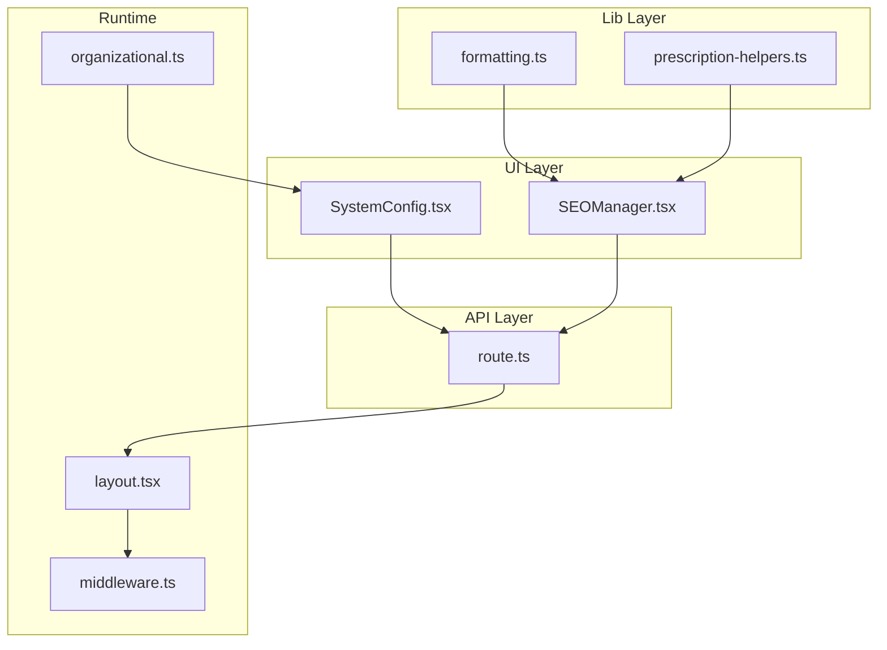
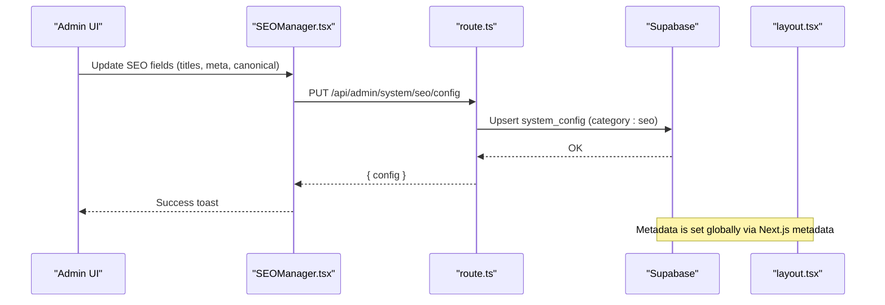
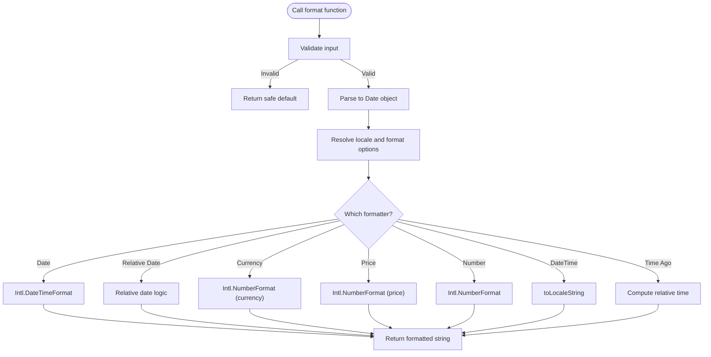
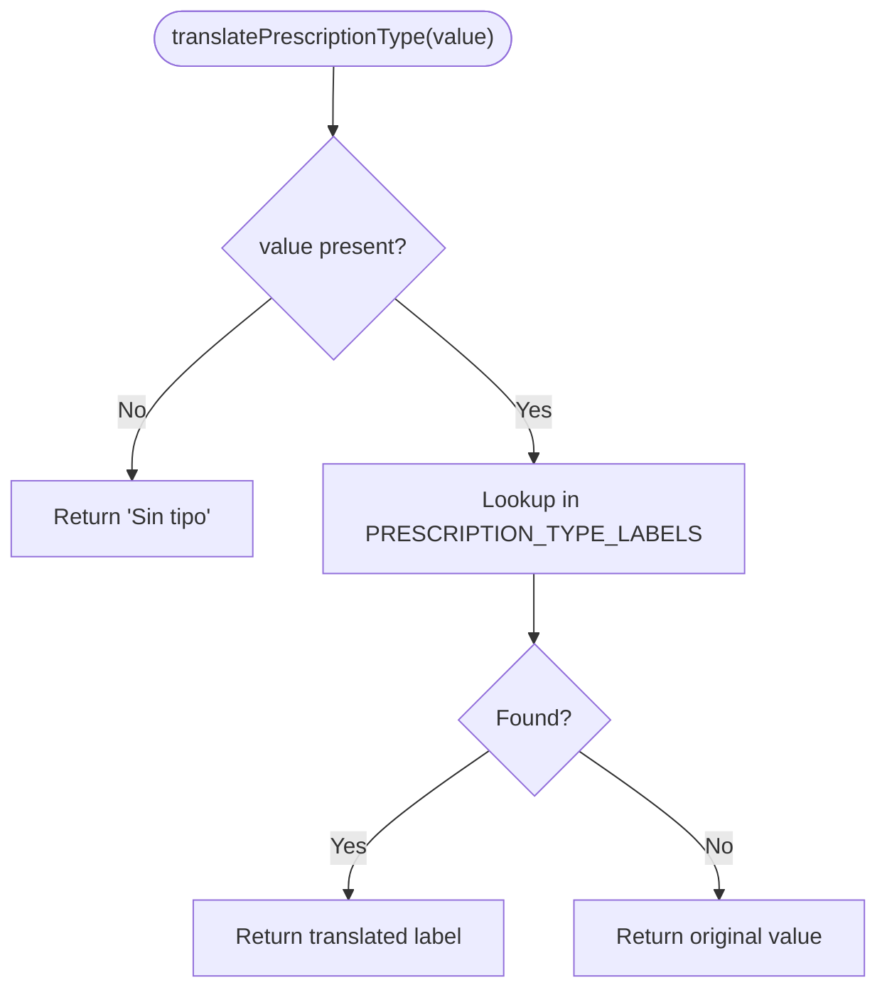
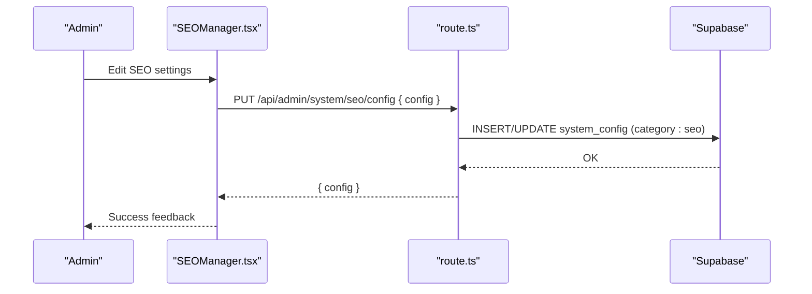
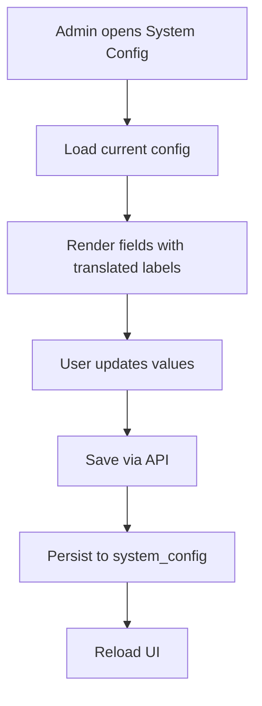
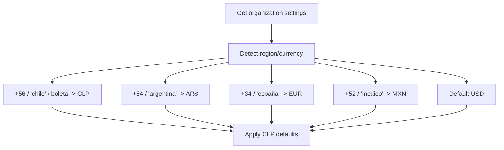
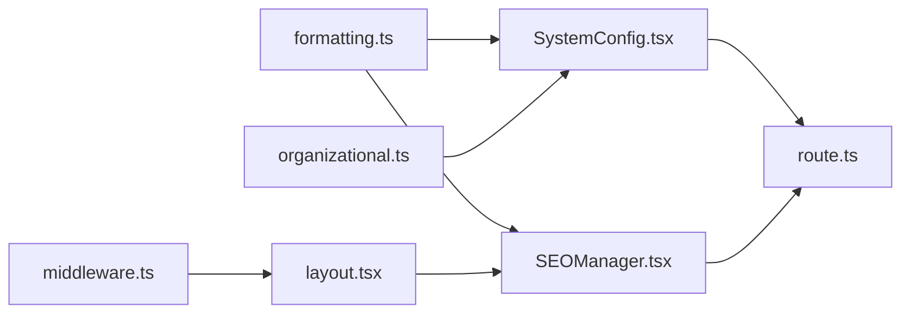

# Localization & Translation

<cite>
**Referenced Files in This Document**
- [formatting.ts](file://src/lib/utils/formatting.ts)
- [prescription-helpers.ts](file://src/lib/prescription-helpers.ts)
- [SEOManager.tsx](file://src/components/admin/SEOManager.tsx)
- [route.ts](file://src/app/api/admin/system/seo/config/route.ts)
- [layout.tsx](file://src/app/layout.tsx)
- [middleware.ts](file://src/middleware.ts)
- [organizational.ts](file://src/lib/ai/memory/organizational.ts)
- [SystemConfig.tsx](file://src/app/admin/system/components/SystemConfig.tsx)
- [SystemConfig.page.backup.tsx](file://src/app/admin/system/page.backup.tsx)
- [next.config.js](file://next.config.js)
</cite>

## Table of Contents

1. [Introduction](#introduction)
2. [Project Structure](#project-structure)
3. [Core Components](#core-components)
4. [Architecture Overview](#architecture-overview)
5. [Detailed Component Analysis](#detailed-component-analysis)
6. [Dependency Analysis](#dependency-analysis)
7. [Performance Considerations](#performance-considerations)
8. [Troubleshooting Guide](#troubleshooting-guide)
9. [Conclusion](#conclusion)
10. [Appendices](#appendices)

## Introduction

This document explains how Opttius implements localization and translation configuration across the application. It covers multi-language support setup, regional settings, cultural adaptation, language switching mechanisms, content localization strategies, and regional formatting options. It also documents SEO localization settings, metadata management, and internationalization best practices, along with guidance for managing translations across business domains and ensuring cultural appropriateness.

## Project Structure

Localization-related capabilities are implemented through:

- Shared formatting utilities for dates, currencies, numbers, and relative time
- Domain-specific translation helpers (e.g., prescription types)
- Admin-managed SEO configuration and API endpoints
- Next.js metadata and middleware for routing and access control
- AI-driven organizational context detection for currency and region hints
- System configuration UI for business defaults (language, currency, formats)

**Diagram sources**

- [SEOManager.tsx](file://src/components/admin/SEOManager.tsx#L1-L120)
- [SystemConfig.tsx](file://src/app/admin/system/components/SystemConfig.tsx#L60-L120)
- [formatting.ts](file://src/lib/utils/formatting.ts#L13-L357)
- [prescription-helpers.ts](file://src/lib/prescription-helpers.ts#L1-L37)
- [route.ts](file://src/app/api/admin/system/seo/config/route.ts#L1-L50)
- [layout.tsx](file://src/app/layout.tsx#L17-L28)
- [middleware.ts](file://src/middleware.ts#L14-L95)
- [organizational.ts](file://src/lib/ai/memory/organizational.ts#L60-L126)

**Section sources**

- [formatting.ts](file://src/lib/utils/formatting.ts#L1-L357)
- [prescription-helpers.ts](file://src/lib/prescription-helpers.ts#L1-L37)
- [SEOManager.tsx](file://src/components/admin/SEOManager.tsx#L1-L120)
- [route.ts](file://src/app/api/admin/system/seo/config/route.ts#L1-L50)
- [layout.tsx](file://src/app/layout.tsx#L17-L28)
- [middleware.ts](file://src/middleware.ts#L14-L95)
- [organizational.ts](file://src/lib/ai/memory/organizational.ts#L60-L126)
- [SystemConfig.tsx](file://src/app/admin/system/components/SystemConfig.tsx#L60-L120)
- [SystemConfig.page.backup.tsx](file://src/app/admin/system/page.backup.tsx#L338-L381)
- [next.config.js](file://next.config.js#L1-L161)

## Core Components

- Regional formatting utilities: centralized functions for date, currency, number, and relative time formatting with locale-aware options.
- Translation helpers: domain-specific label translation for optometry terms.
- SEO configuration manager: admin UI to manage default titles, descriptions, canonical URLs, and platform verification keys.
- System configuration: admin UI to set default language, currency, and formats; backed by API endpoints.
- Next.js metadata and middleware: global metadata and route protection/middleware behavior.
- AI-driven context: inference of organization location and currency for regional defaults.

**Section sources**

- [formatting.ts](file://src/lib/utils/formatting.ts#L13-L357)
- [prescription-helpers.ts](file://src/lib/prescription-helpers.ts#L1-L37)
- [SEOManager.tsx](file://src/components/admin/SEOManager.tsx#L1-L120)
- [route.ts](file://src/app/api/admin/system/seo/config/route.ts#L1-L50)
- [SystemConfig.tsx](file://src/app/admin/system/components/SystemConfig.tsx#L60-L120)
- [layout.tsx](file://src/app/layout.tsx#L17-L28)
- [middleware.ts](file://src/middleware.ts#L14-L95)
- [organizational.ts](file://src/lib/ai/memory/organizational.ts#L60-L126)

## Architecture Overview

The localization stack integrates UI configuration, backend persistence, runtime formatting, and metadata policies.

**Diagram sources**

- [SEOManager.tsx](file://src/components/admin/SEOManager.tsx#L64-L88)
- [route.ts](file://src/app/api/admin/system/seo/config/route.ts#L43-L50)
- [layout.tsx](file://src/app/layout.tsx#L17-L28)

## Detailed Component Analysis

### Regional Formatting Utilities

The formatting module provides locale-aware formatting for dates, currency, prices, numbers, and relative timestamps. It supports configurable locales and format variants.

**Diagram sources**

- [formatting.ts](file://src/lib/utils/formatting.ts#L47-L357)

Key capabilities:

- Locale selection: "es-CL", "es-AR", "es-ES" supported.
- Date formats: short, medium, long, full with optional time and year inclusion.
- Currency formatting: style "currency" with configurable fraction digits.
- Price formatting: numeric formatting without currency symbol.
- Number formatting: thousand separators per locale.
- Relative date/time: localized human-friendly strings.

Best practices:

- Always pass explicit locale options for financial and legal contexts.
- Use separate formatters for currency vs. numeric pricing to avoid symbol confusion.
- Normalize inputs (strings, numbers, Dates) before formatting.

**Section sources**

- [formatting.ts](file://src/lib/utils/formatting.ts#L13-L357)

### Translation Helpers for Optometry Terms

Prescription type labels are translated from English to Spanish for display, with a fallback to the original value if missing.

**Diagram sources**

- [prescription-helpers.ts](file://src/lib/prescription-helpers.ts#L20-L37)

**Section sources**

- [prescription-helpers.ts](file://src/lib/prescription-helpers.ts#L1-L37)

### SEO Localization and Metadata Management

The SEO Manager allows administrators to configure default titles, descriptions, keywords, canonical URLs, and platform verification IDs. The configuration is persisted to the system configuration table and loaded on demand.

Metadata management:

- Global metadata is defined in the root layout for default title template and description.
- Canonical URL can be configured centrally to guide indexing.
- Validation helpers enforce recommended lengths for titles and descriptions.

**Diagram sources**

- [SEOManager.tsx](file://src/components/admin/SEOManager.tsx#L64-L120)
- [route.ts](file://src/app/api/admin/system/seo/config/route.ts#L43-L50)
- [layout.tsx](file://src/app/layout.tsx#L17-L28)

**Section sources**

- [SEOManager.tsx](file://src/components/admin/SEOManager.tsx#L1-L120)
- [route.ts](file://src/app/api/admin/system/seo/config/route.ts#L1-L50)
- [layout.tsx](file://src/app/layout.tsx#L17-L28)

### System Configuration for Regional Defaults

The System Configuration component exposes administrative controls for language, currency, formats, and business hours. Translations for labels are embedded in the component.

Supported defaults include:

- Default language
- Currency and symbol
- Tax rate
- Date/time formats
- Business hours and online appointment availability

**Diagram sources**

- [SystemConfig.tsx](file://src/app/admin/system/components/SystemConfig.tsx#L60-L120)
- [SystemConfig.page.backup.tsx](file://src/app/admin/system/page.backup.tsx#L338-L381)

**Section sources**

- [SystemConfig.tsx](file://src/app/admin/system/components/SystemConfig.tsx#L60-L120)
- [SystemConfig.page.backup.tsx](file://src/app/admin/system/page.backup.tsx#L338-L381)

### AI-Driven Regional Context

The AI memory module infers organization location and currency based on phone prefixes, address mentions, and document types. This enables contextual defaults for regional formatting.

**Diagram sources**

- [organizational.ts](file://src/lib/ai/memory/organizational.ts#L88-L126)

**Section sources**

- [organizational.ts](file://src/lib/ai/memory/organizational.ts#L60-L126)

### Next.js Metadata and Middleware Behavior

- Global metadata defines default title and description templates.
- Middleware protects admin routes and enforces authentication, indirectly supporting localized access patterns.

**Section sources**

- [layout.tsx](file://src/app/layout.tsx#L17-L28)
- [middleware.ts](file://src/middleware.ts#L14-L95)

## Dependency Analysis

Localization features depend on:

- Shared formatting utilities for consistent regional formatting
- System configuration for default language and currency
- SEO configuration for metadata and canonical URLs
- AI context for inferred regional defaults
- Next.js metadata and middleware for global behavior

**Diagram sources**

- [formatting.ts](file://src/lib/utils/formatting.ts#L13-L357)
- [SEOManager.tsx](file://src/components/admin/SEOManager.tsx#L1-L120)
- [SystemConfig.tsx](file://src/app/admin/system/components/SystemConfig.tsx#L60-L120)
- [route.ts](file://src/app/api/admin/system/seo/config/route.ts#L1-L50)
- [organizational.ts](file://src/lib/ai/memory/organizational.ts#L60-L126)
- [layout.tsx](file://src/app/layout.tsx#L17-L28)
- [middleware.ts](file://src/middleware.ts#L14-L95)

**Section sources**

- [formatting.ts](file://src/lib/utils/formatting.ts#L13-L357)
- [SEOManager.tsx](file://src/components/admin/SEOManager.tsx#L1-L120)
- [SystemConfig.tsx](file://src/app/admin/system/components/SystemConfig.tsx#L60-L120)
- [route.ts](file://src/app/api/admin/system/seo/config/route.ts#L1-L50)
- [organizational.ts](file://src/lib/ai/memory/organizational.ts#L60-L126)
- [layout.tsx](file://src/app/layout.tsx#L17-L28)
- [middleware.ts](file://src/middleware.ts#L14-L95)

## Performance Considerations

- Centralized formatting utilities reduce duplication and improve consistency.
- Prefer client-side caching for frequently accessed configuration (e.g., SEO defaults) to minimize API calls.
- Avoid excessive re-renders by batching configuration updates and using local state until save.
- Use locale-specific formatting only when necessary; defer heavy computations to server APIs for dynamic content.

## Troubleshooting Guide

Common issues and resolutions:

- Invalid or missing date inputs: formatting utilities return safe defaults; ensure inputs are validated before formatting.
- Currency formatting anomalies: specify locale and currency explicitly; adjust fraction digits for local standards.
- SEO configuration errors: verify API responses and handle error states gracefully; confirm category filtering for SEO config.
- Metadata not applying: ensure Next.js metadata is defined in the root layout and canonical URLs are absolute.
- Middleware redirection loops: review excluded paths and authentication cookie names; confirm Supabase project reference parsing.

**Section sources**

- [formatting.ts](file://src/lib/utils/formatting.ts#L47-L115)
- [route.ts](file://src/app/api/admin/system/seo/config/route.ts#L14-L41)
- [layout.tsx](file://src/app/layout.tsx#L17-L28)
- [middleware.ts](file://src/middleware.ts#L44-L95)

## Conclusion

Opttius implements a layered localization strategy combining shared formatting utilities, domain-specific translation helpers, admin-managed SEO and system configurations, and AI-driven regional context. This approach ensures consistent regional formatting, culturally appropriate content, and robust metadata management across business domains.

## Appendices

### Examples: Configuring Locales and Formats

- Configure default language and currency in System Configuration UI; persist via API.
- Use formatting utilities to render dates, currency, and numbers according to selected locale.
- Manage SEO defaults (title, description, canonical URL) through the SEO Manager UI.

**Section sources**

- [SystemConfig.tsx](file://src/app/admin/system/components/SystemConfig.tsx#L60-L120)
- [formatting.ts](file://src/lib/utils/formatting.ts#L13-L357)
- [SEOManager.tsx](file://src/components/admin/SEOManager.tsx#L1-L120)

### Internationalization Best Practices

- Define explicit locale options for financial and legal contexts.
- Separate currency formatting from numeric formatting to avoid symbol ambiguity.
- Use canonical URLs and localized metadata to improve SEO.
- Provide fallbacks for missing translations and invalid inputs.
- Keep regional defaults aligned with organization settings and inferred context.

**Section sources**

- [formatting.ts](file://src/lib/utils/formatting.ts#L13-L357)
- [organizational.ts](file://src/lib/ai/memory/organizational.ts#L88-L126)
- [SEOManager.tsx](file://src/components/admin/SEOManager.tsx#L1-L120)
- [layout.tsx](file://src/app/layout.tsx#L17-L28)
