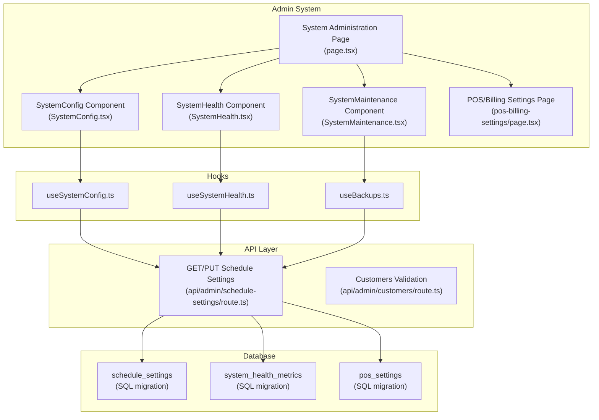
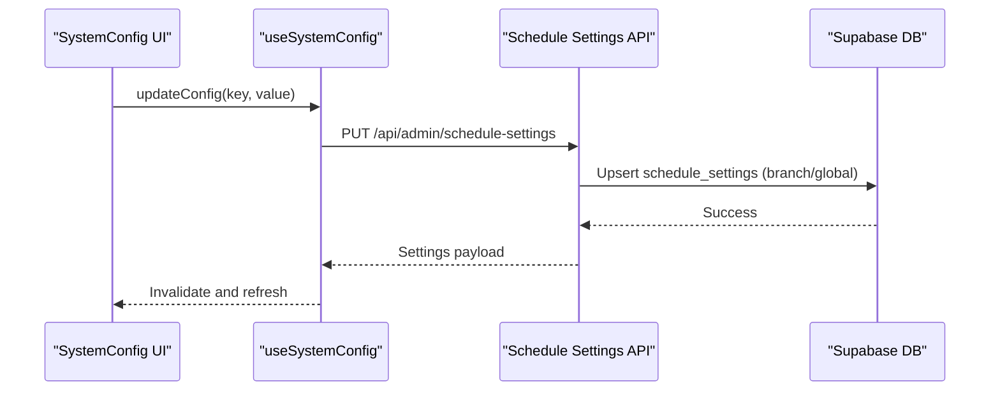
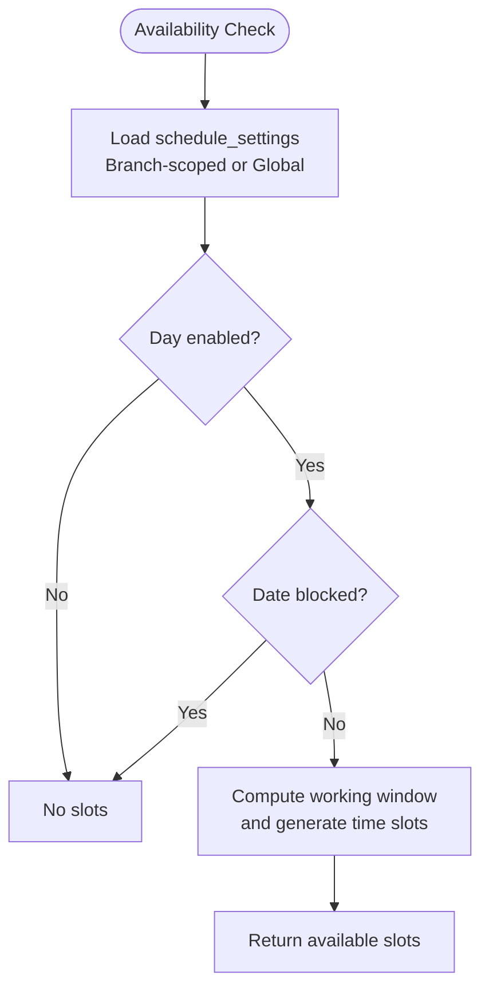
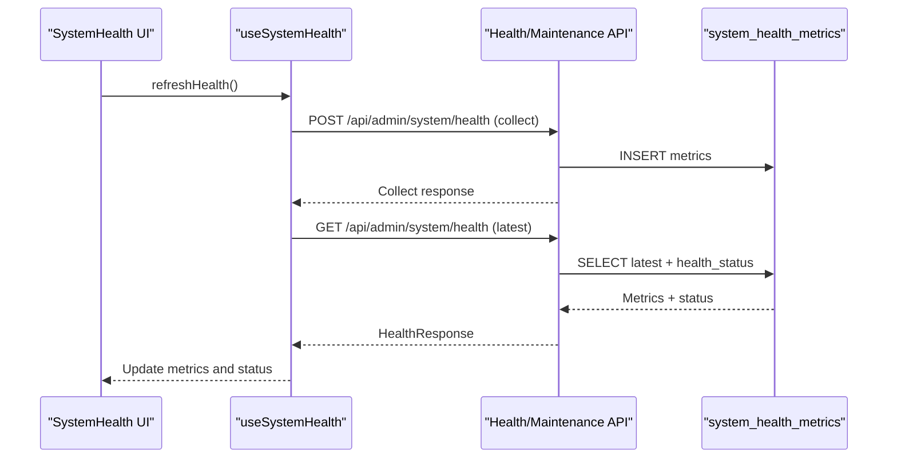
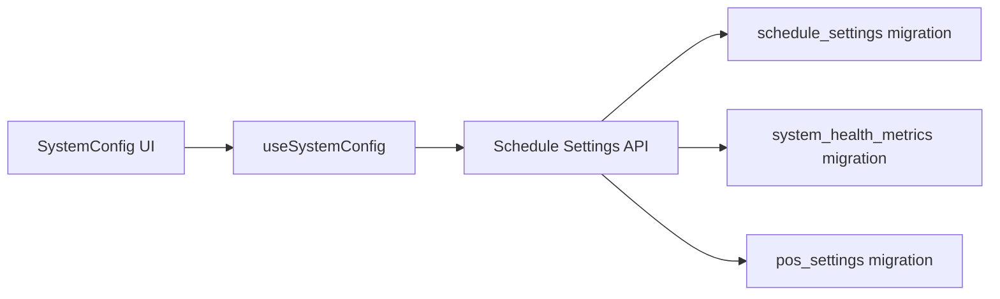

# Operational Settings

<cite>
**Referenced Files in This Document**
- [page.tsx](file://src/app/admin/system/page.tsx)
- [SystemConfig.tsx](file://src/app/admin/system/components/SystemConfig.tsx)
- [SystemHealth.tsx](file://src/app/admin/system/components/SystemHealth.tsx)
- [SystemMaintenance.tsx](file://src/app/admin/system/components/SystemMaintenance.tsx)
- [useSystemConfig.ts](file://src/app/admin/system/hooks/useSystemConfig.ts)
- [useSystemHealth.ts](file://src/app/admin/system/hooks/useSystemHealth.ts)
- [useBackups.ts](file://src/app/admin/system/hooks/useBackups.ts)
- [page.tsx](file://src/app/admin/system/pos-billing-settings/page.tsx)
- [route.ts](file://src/app/api/admin/schedule-settings/route.ts)
- [page.tsx](file://src/app/admin/appointments/settings/page.tsx)
- [route.ts](file://src/app/api/admin/customers/route.ts)
- [diagnoseSystem.ts](file://src/lib/ai/tools/diagnoseSystem.ts)
- [analyzeBusinessFlow.ts](file://src/lib/ai/tools/analyzeBusinessFlow.ts)
- [20250126000000_create_schedule_settings_system.sql](file://supabase/migrations/20250126000000_create_schedule_settings_system.sql)
- [20251216000002_update_appointment_availability_for_branches.sql](file://supabase/migrations/20251216000002_update_appointment_availability_for_branches.sql)
- [20251216000004_fix_appointment_availability_fallback.sql](file://supabase/migrations/20251216001604_fix_appointment_availability_fallback.sql)
- [20251216000005_update_get_available_time_slots_for_branches.sql](file://supabase/migrations/20251216000005_update_get_available_time_slots_for_branches.sql)
- [20260126000000_create_pos_settings.sql](file://supabase/migrations/20260126000000_create_pos_settings.sql)
- [20260201000002_create_optical_internal_support.sql](file://supabase/migrations/20260201000002_create_optical_internal_support.sql)
- [20260124000002_fix_system_health_metrics_rls.sql](file://supabase/migrations/20260124000002_fix_system_health_metrics_rls.sql)
</cite>

## Table of Contents

1. [Introduction](#introduction)
2. [Project Structure](#project-structure)
3. [Core Components](#core-components)
4. [Architecture Overview](#architecture-overview)
5. [Detailed Component Analysis](#detailed-component-analysis)
6. [Dependency Analysis](#dependency-analysis)
7. [Performance Considerations](#performance-considerations)
8. [Troubleshooting Guide](#troubleshooting-guide)
9. [Conclusion](#conclusion)
10. [Appendices](#appendices)

## Introduction

This document explains operational settings configuration in Opttius, focusing on system-wide operational parameters such as business hours, operational limits, workflow automation, and performance tuning. It covers policy configuration, capacity management, resource allocation, validation and constraint enforcement, monitoring and alerting, and maintenance scheduling. Guidance is provided for best practices, performance optimization, and reliability configuration.

## Project Structure

Operational settings are organized under the System Administration module with dedicated pages for configuration, health monitoring, POS/billing settings, and maintenance. Frontend components integrate with backend APIs and Supabase database tables to manage operational parameters.

**Diagram sources**

- [page.tsx](file://src/app/admin/system/page.tsx#L55-L530)
- [SystemConfig.tsx](file://src/app/admin/system/components/SystemConfig.tsx#L1-L707)
- [SystemHealth.tsx](file://src/app/admin/system/components/SystemHealth.tsx#L1-L300)
- [SystemMaintenance.tsx](file://src/app/admin/system/components/SystemMaintenance.tsx#L1-L141)
- [useSystemConfig.ts](file://src/app/admin/system/hooks/useSystemConfig.ts#L1-L87)
- [useSystemHealth.ts](file://src/app/admin/system/hooks/useSystemHealth.ts#L1-L119)
- [useBackups.ts](file://src/app/admin/system/hooks/useBackups.ts#L1-L194)
- [route.ts](file://src/app/api/admin/schedule-settings/route.ts#L1-L334)
- [route.ts](file://src/app/api/admin/customers/route.ts#L349-L362)
- [20250126000000_create_schedule_settings_system.sql](file://supabase/migrations/20250126000000_create_schedule_settings_system.sql#L20-L45)
- [20260124000002_fix_system_health_metrics_rls.sql](file://supabase/migrations/20260124000002_fix_system_health_metrics_rls.sql#L1-L48)
- [20260126000000_create_pos_settings.sql](file://supabase/migrations/20260126000000_create_pos_settings.sql)

**Section sources**

- [page.tsx](file://src/app/admin/system/page.tsx#L55-L530)
- [SystemConfig.tsx](file://src/app/admin/system/components/SystemConfig.tsx#L1-L707)
- [SystemHealth.tsx](file://src/app/admin/system/components/SystemHealth.tsx#L1-L300)
- [SystemMaintenance.tsx](file://src/app/admin/system/components/SystemMaintenance.tsx#L1-L141)
- [useSystemConfig.ts](file://src/app/admin/system/hooks/useSystemConfig.ts#L1-L87)
- [useSystemHealth.ts](file://src/app/admin/system/hooks/useSystemHealth.ts#L1-L119)
- [useBackups.ts](file://src/app/admin/system/hooks/useBackups.ts#L1-L194)
- [route.ts](file://src/app/api/admin/schedule-settings/route.ts#L1-L334)
- [route.ts](file://src/app/api/admin/customers/route.ts#L349-L362)
- [20250126000000_create_schedule_settings_system.sql](file://supabase/migrations/20250126000000_create_schedule_settings_system.sql#L20-L45)
- [20260124000002_fix_system_health_metrics_rls.sql](file://supabase/migrations/20260124000002_fix_system_health_metrics_rls.sql#L1-L48)
- [20260126000000_create_pos_settings.sql](file://supabase/migrations/20260126000000_create_pos_settings.sql)

## Core Components

- System Configuration: Centralized management of operational parameters across categories (general, contact, e-commerce, inventory, membership, email, system, database, business).
- System Health: Real-time metrics and status display with thresholds and resolution guidance.
- Maintenance Tools: Backup creation, log cleanup, database optimization, security audit, email testing, and system status reporting.
- POS/Billing Settings: Deposit minimum configuration and receipt customization for point-of-sale operations.
- Business Hours and Availability: Branch-aware scheduling with working hours, blocked dates, and appointment availability logic.

**Section sources**

- [SystemConfig.tsx](file://src/app/admin/system/components/SystemConfig.tsx#L60-L120)
- [SystemHealth.tsx](file://src/app/admin/system/components/SystemHealth.tsx#L26-L81)
- [SystemMaintenance.tsx](file://src/app/admin/system/components/SystemMaintenance.tsx#L45-L82)
- [page.tsx](file://src/app/admin/system/pos-billing-settings/page.tsx#L44-L104)
- [route.ts](file://src/app/api/admin/schedule-settings/route.ts#L8-L135)

## Architecture Overview

Operational settings are managed through a layered architecture:

- UI components render configuration forms and dashboards.
- React Query hooks fetch and mutate settings via REST endpoints.
- Backend routes validate permissions, enforce branch context, and interact with Supabase.
- Supabase migrations define schema and constraints for operational data.

**Diagram sources**

- [SystemConfig.tsx](file://src/app/admin/system/components/SystemConfig.tsx#L244-L263)
- [useSystemConfig.ts](file://src/app/admin/system/hooks/useSystemConfig.ts#L36-L74)
- [route.ts](file://src/app/api/admin/schedule-settings/route.ts#L137-L334)

**Section sources**

- [SystemConfig.tsx](file://src/app/admin/system/components/SystemConfig.tsx#L1-L707)
- [useSystemConfig.ts](file://src/app/admin/system/hooks/useSystemConfig.ts#L1-L87)
- [route.ts](file://src/app/api/admin/schedule-settings/route.ts#L1-L334)

## Detailed Component Analysis

### Business Hours and Operational Limits

Business hours and availability are governed by schedule settings with branch scoping and fallback logic. The system supports:

- Working hours per weekday with enable flag and lunch break windows.
- Blocked dates for holidays or closures.
- Advance booking constraints (minimum hours and maximum days).
- Slot duration and default appointment duration for calendar generation.

**Diagram sources**

- [20251216000002_update_appointment_availability_for_branches.sql](file://supabase/migrations/20251216000002_update_appointment_availability_for_branches.sql#L36-L76)
- [20251216000004_fix_appointment_availability_fallback.sql](file://supabase/migrations/20251216000004_fix_appointment_availability_fallback.sql#L36-L83)
- [20251216000005_update_get_available_time_slots_for_branches.sql](file://supabase/migrations/20251216000005_update_get_available_time_slots_for_branches.sql#L42-L89)

Configuration UI allows editing working hours, blocked dates, and advance booking parameters. Global updates by super admins propagate to all branches.

**Section sources**

- [route.ts](file://src/app/api/admin/schedule-settings/route.ts#L8-L135)
- [route.ts](file://src/app/api/admin/schedule-settings/route.ts#L198-L334)
- [page.tsx](file://src/app/admin/appointments/settings/page.tsx#L96-L146)
- [20250126000000_create_schedule_settings_system.sql](file://supabase/migrations/20250126000000_create_schedule_settings_system.sql#L20-L45)

### Workflow Automation and Capacity Management

Workflow automation is supported through:

- Automated quote expiration and status transitions.
- POS deposit minimum enforcement (percent or fixed amount).
- Receipt printing automation and document customization.

Capacity management includes:

- Slot duration and buffer time to prevent overlap.
- Blocked dates to temporarily suspend bookings.
- Branch-level isolation with global defaults.

**Section sources**

- [page.tsx](file://src/app/admin/system/pos-billing-settings/page.tsx#L44-L104)
- [page.tsx](file://src/app/admin/system/pos-billing-settings/page.tsx#L163-L265)
- [20260126000000_create_pos_settings.sql](file://supabase/migrations/20260126000000_create_pos_settings.sql)

### Performance Tuning and Monitoring

Performance tuning involves:

- Database optimization actions via maintenance tools.
- Memory usage monitoring and manual clearing.
- Health metrics collection and threshold-based alerts.

Monitoring integrates with:

- Health metrics table with RLS policies for admin visibility.
- Resolution guidance for critical and warning metrics.

**Diagram sources**

- [useSystemHealth.ts](file://src/app/admin/system/hooks/useSystemHealth.ts#L49-L75)
- [SystemHealth.tsx](file://src/app/admin/system/components/SystemHealth.tsx#L101-L123)
- [20260124000002_fix_system_health_metrics_rls.sql](file://supabase/migrations/20260124000002_fix_system_health_metrics_rls.sql#L1-L48)

**Section sources**

- [SystemHealth.tsx](file://src/app/admin/system/components/SystemHealth.tsx#L1-L300)
- [useSystemHealth.ts](file://src/app/admin/system/hooks/useSystemHealth.ts#L1-L119)
- [20260124000002_fix_system_health_metrics_rls.sql](file://supabase/migrations/20260124000002_fix_system_health_metrics_rls.sql#L1-L48)

### Resource Allocation and Alerts

Resource allocation is controlled via:

- System configuration toggles (e.g., maintenance mode, debug mode).
- Session timeout and login attempt limits.
- Inventory thresholds and low stock alerts.

Alerting is integrated through:

- Health metrics with warning/critical thresholds.
- Resolution suggestions for actionable remediation.
- Backup and maintenance dialogs for operational feedback.

**Section sources**

- [SystemConfig.tsx](file://src/app/admin/system/components/SystemConfig.tsx#L101-L111)
- [SystemHealth.tsx](file://src/app/admin/system/components/SystemHealth.tsx#L61-L81)

### Operational Data Validation and Constraint Enforcement

Validation and constraints ensure data integrity:

- Customer validation pipeline logs and rethrows unexpected errors.
- Branch-aware schedule settings with service role upserts.
- Unique constraints on single organization-level schedule settings.

**Section sources**

- [route.ts](file://src/app/api/admin/customers/route.ts#L349-L362)
- [route.ts](file://src/app/api/admin/schedule-settings/route.ts#L166-L195)
- [20250126000000_create_schedule_settings_system.sql](file://supabase/migrations/20250126000000_create_schedule_settings_system.sql#L42-L44)

### Maintenance Scheduling and Backups

Maintenance scheduling includes:

- Backup creation with metadata and download URLs.
- Backup restoration with safety backup toggle.
- Cleanup actions: log cleaning, database optimization, security audit, email testing, and system status reports.

**Section sources**

- [SystemMaintenance.tsx](file://src/app/admin/system/components/SystemMaintenance.tsx#L45-L82)
- [useBackups.ts](file://src/app/admin/system/hooks/useBackups.ts#L56-L90)
- [useBackups.ts](file://src/app/admin/system/hooks/useBackups.ts#L92-L122)

### AI-Driven Operations Insights

AI tools assist with operational diagnostics and workflow analysis:

- System diagnosis across orders, inventory, customers, and performance.
- Business flow analysis identifying bottlenecks and efficiency metrics.

**Section sources**

- [diagnoseSystem.ts](file://src/lib/ai/tools/diagnoseSystem.ts#L1-L83)
- [diagnoseSystem.ts](file://src/lib/ai/tools/diagnoseSystem.ts#L49-L83)
- [analyzeBusinessFlow.ts](file://src/lib/ai/tools/analyzeBusinessFlow.ts#L215-L331)

## Dependency Analysis

Operational settings depend on:

- Supabase schema migrations defining tables and constraints.
- Backend routes enforcing authorization and branch context.
- Frontend hooks managing state and caching with React Query.

**Diagram sources**

- [useSystemConfig.ts](file://src/app/admin/system/hooks/useSystemConfig.ts#L1-L87)
- [route.ts](file://src/app/api/admin/schedule-settings/route.ts#L1-L334)
- [20250126000000_create_schedule_settings_system.sql](file://supabase/migrations/20250126000000_create_schedule_settings_system.sql#L20-L45)
- [20260124000002_fix_system_health_metrics_rls.sql](file://supabase/migrations/20260124000002_fix_system_health_metrics_rls.sql#L1-L48)
- [20260126000000_create_pos_settings.sql](file://supabase/migrations/20260126000000_create_pos_settings.sql)

**Section sources**

- [useSystemConfig.ts](file://src/app/admin/system/hooks/useSystemConfig.ts#L1-L87)
- [route.ts](file://src/app/api/admin/schedule-settings/route.ts#L1-L334)
- [20250126000000_create_schedule_settings_system.sql](file://supabase/migrations/20250126000000_create_schedule_settings_system.sql#L20-L45)
- [20260124000002_fix_system_health_metrics_rls.sql](file://supabase/migrations/20260124000002_fix_system_health_metrics_rls.sql#L1-L48)
- [20260126000000_create_pos_settings.sql](file://supabase/migrations/20260126000000_create_pos_settings.sql)

## Performance Considerations

- Minimize redundant queries: leverage cached data and invalidate only affected keys.
- Use branch context to reduce cross-branch scans.
- Apply database optimization actions periodically to maintain query performance.
- Monitor memory usage and clear caches when necessary.

[No sources needed since this section provides general guidance]

## Troubleshooting Guide

Common issues and resolutions:

- Unauthorized access to administrative endpoints: verify admin RPC and branch context.
- Missing schedule settings: default values are returned when no records exist.
- Backup failures: check endpoint availability and error messages; retry with safety backup enabled.
- Health metric visibility: ensure RLS policies permit admin access.

**Section sources**

- [route.ts](file://src/app/api/admin/schedule-settings/route.ts#L12-L29)
- [route.ts](file://src/app/api/admin/schedule-settings/route.ts#L62-L62)
- [useBackups.ts](file://src/app/admin/system/hooks/useBackups.ts#L124-L147)
- [20260124000002_fix_system_health_metrics_rls.sql](file://supabase/migrations/20260124000002_fix_system_health_metrics_rls.sql#L1-L48)

## Conclusion

Opttius operational settings provide a robust framework for managing business hours, workflow automation, capacity constraints, and system performance. Through centralized configuration, health monitoring, maintenance tools, and AI-driven insights, administrators can ensure reliable and efficient operations across branches and organizations.

[No sources needed since this section summarizes without analyzing specific files]

## Appendices

### Configuration Examples

- Configure business hours: enable/disable days, set start/end times, define lunch breaks, and add blocked dates.
- Set operational limits: adjust minimum advance booking hours and maximum booking days.
- POS deposit minimum: choose between percentage-based and fixed-amount enforcement.
- Receipt customization: set default document type, header/footer text, terms and conditions, and automatic printing.

**Section sources**

- [page.tsx](file://src/app/admin/appointments/settings/page.tsx#L404-L430)
- [route.ts](file://src/app/api/admin/schedule-settings/route.ts#L173-L195)
- [page.tsx](file://src/app/admin/system/pos-billing-settings/page.tsx#L373-L424)
- [page.tsx](file://src/app/admin/system/pos-billing-settings/page.tsx#L586-L665)

### Best Practices

- Use branch selectors to scope changes appropriately; leverage global views only for super admins.
- Keep health metrics visible and act on warnings before they escalate.
- Schedule regular maintenance tasks (backups, optimizations) as part of routine operations.
- Enforce validation and logging for critical data entry points (e.g., customer records).

**Section sources**

- [page.tsx](file://src/app/admin/system/page.tsx#L55-L89)
- [SystemHealth.tsx](file://src/app/admin/system/components/SystemHealth.tsx#L161-L296)
- [route.ts](file://src/app/api/admin/customers/route.ts#L349-L362)
