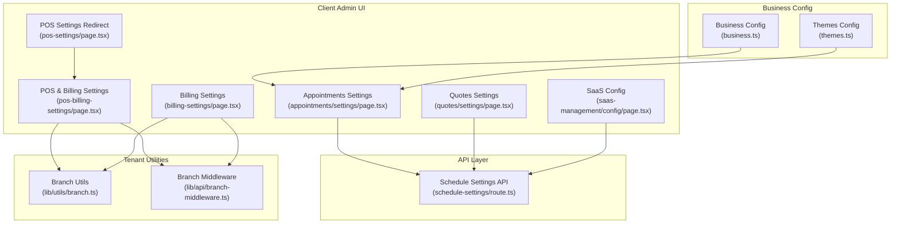
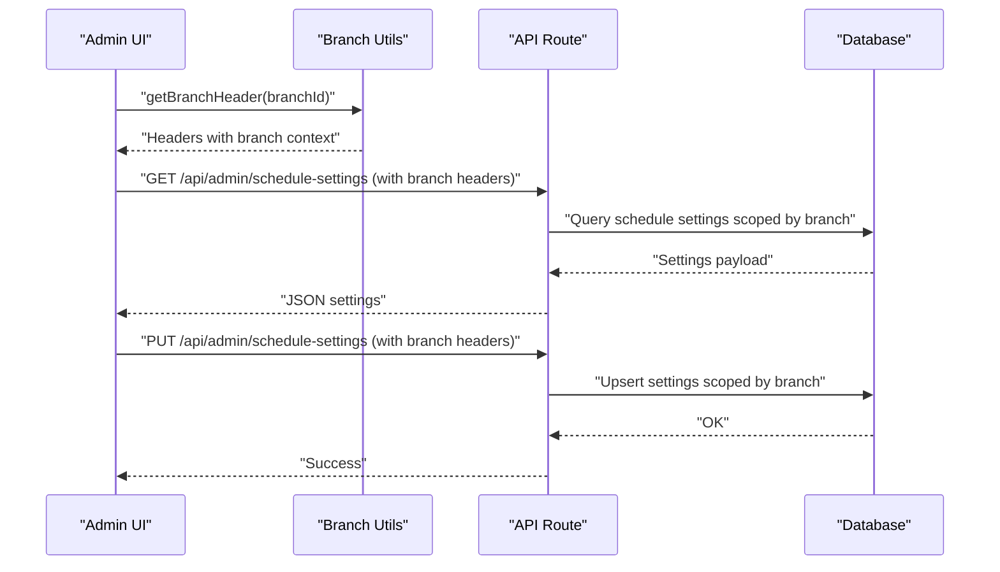
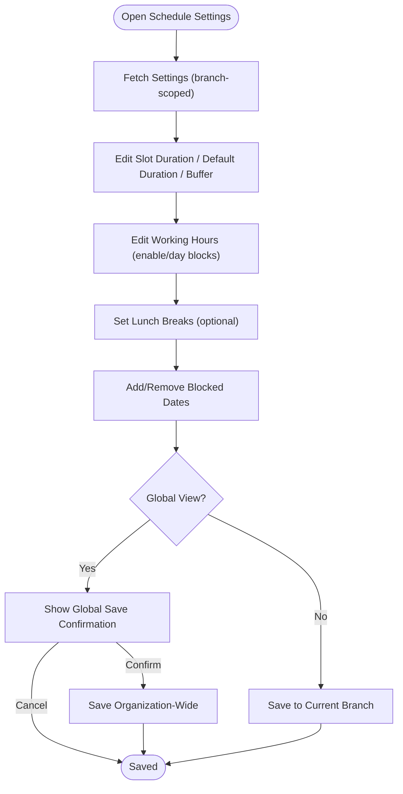
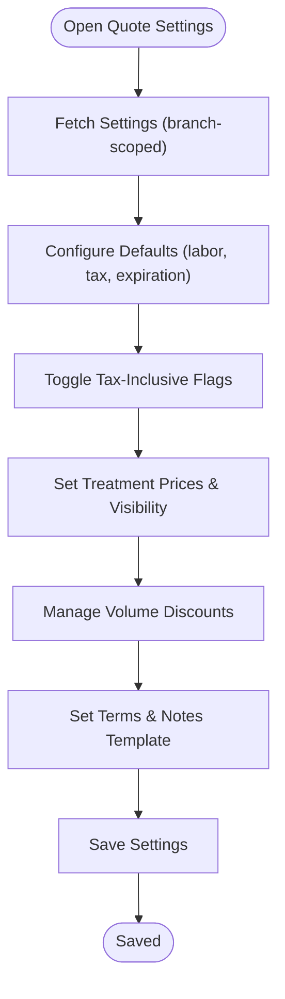
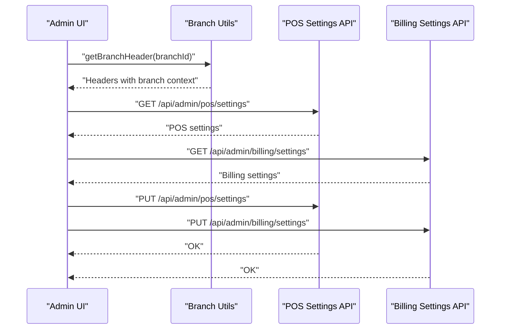
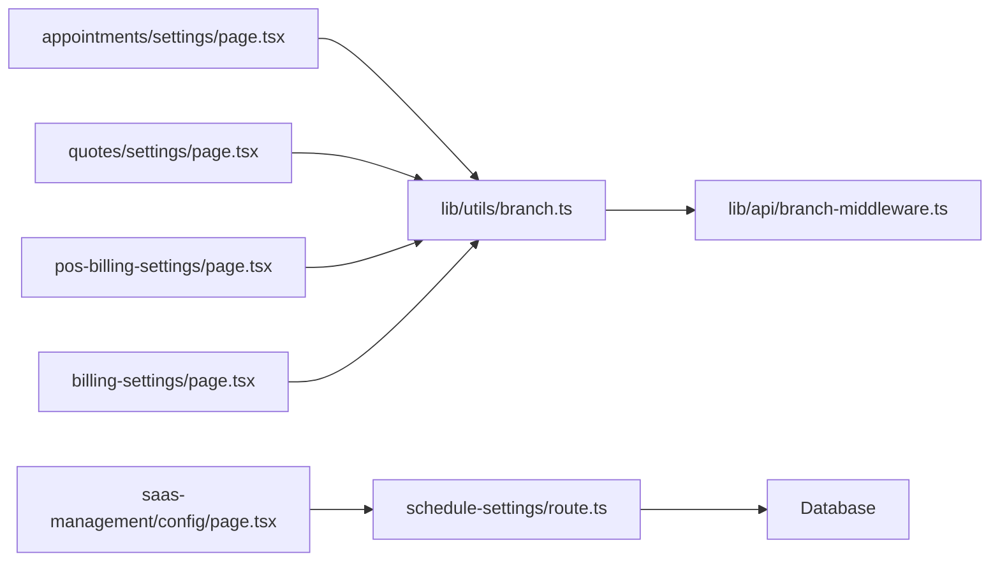

# System Configuration

<cite>
**Referenced Files in This Document**
- [business.ts](file://src/config/business.ts)
- [themes.ts](file://src/config/themes.ts)
- [billing-settings/page.tsx](file://src/app/admin/system/billing-settings/page.tsx)
- [pos-billing-settings/page.tsx](file://src/app/admin/system/pos-billing-settings/page.tsx)
- [pos-settings/page.tsx](file://src/app/admin/system/pos-settings/page.tsx)
- [saas-management/config/page.tsx](file://src/app/admin/saas-management/config/page.tsx)
- [appointments/settings/page.tsx](file://src/app/admin/appointments/settings/page.tsx)
- [quotes/settings/page.tsx](file://src/app/admin/quotes/settings/page.tsx)
- [schedule-settings/route.ts](file://src/app/api/admin/schedule-settings/route.ts)
- [branch.ts](file://src/lib/utils/branch.ts)
- [branch-middleware.ts](file://src/lib/api/branch-middleware.ts)
- [backup-service.ts](file://src/lib/backup-service.ts)
- [saas-backup-service.ts](file://src/lib/saas-backup-service.ts)
</cite>

## Table of Contents

1. [Introduction](#introduction)
2. [Project Structure](#project-structure)
3. [Core Components](#core-components)
4. [Architecture Overview](#architecture-overview)
5. [Detailed Component Analysis](#detailed-component-analysis)
6. [Dependency Analysis](#dependency-analysis)
7. [Performance Considerations](#performance-considerations)
8. [Troubleshooting Guide](#troubleshooting-guide)
9. [Conclusion](#conclusion)
10. [Appendices](#appendices)

## Introduction

This document explains the complete system configuration framework in Opttius with a focus on business rule management and operational settings. It covers how business rules, tax settings, localization options, branding customization, and multi-tenant configuration are modeled and applied across the system. It also documents the configuration forms, validation rules, inheritance, and relationships with organizational and branch-level settings. Guidance is included for administrators on performance optimization, managing business rules, and maintaining system integrity across tenants.

## Project Structure

The configuration system is organized around:

- Centralized business and theme configuration
- Tenant-aware configuration pages under the Admin panel
- API routes that persist and enforce configuration rules
- Utility modules for branch scoping and tenant isolation

**Diagram sources**

- [appointments/settings/page.tsx](file://src/app/admin/appointments/settings/page.tsx#L1-L633)
- [quotes/settings/page.tsx](file://src/app/admin/quotes/settings/page.tsx#L1-L830)
- [pos-billing-settings/page.tsx](file://src/app/admin/system/pos-billing-settings/page.tsx#L1-L961)
- [billing-settings/page.tsx](file://src/app/admin/system/billing-settings/page.tsx#L1-L366)
- [pos-settings/page.tsx](file://src/app/admin/system/pos-settings/page.tsx#L1-L23)
- [saas-management/config/page.tsx](file://src/app/admin/saas-management/config/page.tsx#L1-L135)
- [business.ts](file://src/config/business.ts#L1-L92)
- [themes.ts](file://src/config/themes.ts#L1-L167)
- [schedule-settings/route.ts](file://src/app/api/admin/schedule-settings/route.ts)
- [branch.ts](file://src/lib/utils/branch.ts)
- [branch-middleware.ts](file://src/lib/api/branch-middleware.ts)

**Section sources**

- [business.ts](file://src/config/business.ts#L1-L92)
- [themes.ts](file://src/config/themes.ts#L1-L167)
- [appointments/settings/page.tsx](file://src/app/admin/appointments/settings/page.tsx#L1-L633)
- [quotes/settings/page.tsx](file://src/app/admin/quotes/settings/page.tsx#L1-L830)
- [pos-billing-settings/page.tsx](file://src/app/admin/system/pos-billing-settings/page.tsx#L1-L961)
- [billing-settings/page.tsx](file://src/app/admin/system/billing-settings/page.tsx#L1-L366)
- [pos-settings/page.tsx](file://src/app/admin/system/pos-settings/page.tsx#L1-L23)
- [saas-management/config/page.tsx](file://src/app/admin/saas-management/config/page.tsx#L1-L135)
- [schedule-settings/route.ts](file://src/app/api/admin/schedule-settings/route.ts)
- [branch.ts](file://src/lib/utils/branch.ts)
- [branch-middleware.ts](file://src/lib/api/branch-middleware.ts)

## Core Components

- Business configuration: centralizes branding, features, currency, email defaults, and support categories.
- Theme configuration: defines UI color palettes and theme selection.
- Appointment scheduling settings: manages slot durations, default appointment length, buffer time, working hours, blocked dates, and booking windows.
- Quote settings: controls default labor cost, tax inclusion, expiration days, treatment prices, volume discounts, and terms.
- POS/Billing settings: minimum deposit rules, receipt printing, document customization, and printer configuration.
- SaaS configuration: trial period defaults for new organizations.
- Branch utilities and middleware: enforce tenant scoping via branch headers and policies.

**Section sources**

- [business.ts](file://src/config/business.ts#L1-L92)
- [themes.ts](file://src/config/themes.ts#L1-L167)
- [appointments/settings/page.tsx](file://src/app/admin/appointments/settings/page.tsx#L27-L51)
- [quotes/settings/page.tsx](file://src/app/admin/quotes/settings/page.tsx#L45-L67)
- [pos-billing-settings/page.tsx](file://src/app/admin/system/pos-billing-settings/page.tsx#L44-L67)
- [billing-settings/page.tsx](file://src/app/admin/system/billing-settings/page.tsx#L27-L40)
- [saas-management/config/page.tsx](file://src/app/admin/saas-management/config/page.tsx#L12-L32)
- [branch.ts](file://src/lib/utils/branch.ts)
- [branch-middleware.ts](file://src/lib/api/branch-middleware.ts)

## Architecture Overview

The configuration architecture follows a tenant-aware pattern:

- Admin UI pages load and persist settings via API endpoints.
- Branch-scoped settings are isolated using branch headers and middleware.
- Global views (super admin) can apply settings organization-wide with explicit confirmation.
- Business and theme configs are loaded client-side for branding and UI consistency.

**Diagram sources**

- [appointments/settings/page.tsx](file://src/app/admin/appointments/settings/page.tsx#L66-L88)
- [schedule-settings/route.ts](file://src/app/api/admin/schedule-settings/route.ts)
- [branch.ts](file://src/lib/utils/branch.ts)

**Section sources**

- [appointments/settings/page.tsx](file://src/app/admin/appointments/settings/page.tsx#L66-L88)
- [schedule-settings/route.ts](file://src/app/api/admin/schedule-settings/route.ts)
- [branch.ts](file://src/lib/utils/branch.ts)

## Detailed Component Analysis

### Business Configuration

- Purpose: Define brand identity, feature flags, currency, email defaults, support categories, shipping, and analytics toggles.
- Implementation highlights:
  - Centralized object with nested keys for colors, admin panel metadata, features, currency, email templates, support categories, shipping, and analytics.
  - Used by UI components and branding utilities to render consistent visuals and messaging.

**Section sources**

- [business.ts](file://src/config/business.ts#L1-L92)

### Theme Configuration

- Purpose: Provide selectable UI themes with consistent color tokens.
- Implementation highlights:
  - Defines ThemeId union and Theme interface with color tokens.
  - Includes predefined themes (light, dark, blue, green, red) and a lookup function.

**Section sources**

- [themes.ts](file://src/config/themes.ts#L1-L167)

### Appointment Schedule Settings

- Purpose: Configure operational hours, availability slots, booking windows, and blocked dates.
- Key fields:
  - Slot duration minutes, default appointment duration, buffer time minutes.
  - Working hours per day with open/close times and optional lunch break.
  - Blocked dates array for holidays or closures.
  - Min/max advance booking windows.
- Validation and UX:
  - Enforces numeric ranges for durations and windows.
  - Provides global vs branch view with explicit confirmation for global saves.
  - Real-time updates to working hours and blocked dates.

**Diagram sources**

- [appointments/settings/page.tsx](file://src/app/admin/appointments/settings/page.tsx#L27-L51)
- [appointments/settings/page.tsx](file://src/app/admin/appointments/settings/page.tsx#L148-L183)

**Section sources**

- [appointments/settings/page.tsx](file://src/app/admin/appointments/settings/page.tsx#L27-L51)
- [appointments/settings/page.tsx](file://src/app/admin/appointments/settings/page.tsx#L148-L183)

### Quote Settings

- Purpose: Control default pricing parameters, tax inclusion, expiration, treatment prices, and volume discounts.
- Key fields:
  - Default labor cost, default tax percentage, default expiration days.
  - Tax inclusion flags for labor, lens, and treatments costs.
  - Treatment prices with enable/disable toggles.
  - Volume discounts with min amount and discount percentage.
  - Terms and conditions and notes template.
- Validation and UX:
  - Numeric inputs validated for positive values and percentages within bounds.
  - Backward compatibility handling for treatment price formats.
  - LocalStorage event to notify other tabs of updates.

**Diagram sources**

- [quotes/settings/page.tsx](file://src/app/admin/quotes/settings/page.tsx#L45-L67)
- [quotes/settings/page.tsx](file://src/app/admin/quotes/settings/page.tsx#L112-L168)

**Section sources**

- [quotes/settings/page.tsx](file://src/app/admin/quotes/settings/page.tsx#L45-L67)
- [quotes/settings/page.tsx](file://src/app/admin/quotes/settings/page.tsx#L112-L168)

### POS and Billing Settings

- Purpose: Configure POS deposit rules, receipt printing, document customization, and printer settings.
- Key fields:
  - POS: minimum deposit percent and optional fixed minimum deposit.
  - Billing: business info, document type, header/footer/conditions, logo reuse, auto-print receipt, printer type and dimensions.
- Validation and UX:
  - Deposit percent range validation (0–100).
  - Fixed deposit must be non-negative.
  - Printer presets and custom dimensions.
  - Global vs branch view with confirmation prompts.

**Diagram sources**

- [pos-billing-settings/page.tsx](file://src/app/admin/system/pos-billing-settings/page.tsx#L114-L161)
- [billing-settings/page.tsx](file://src/app/admin/system/billing-settings/page.tsx#L66-L93)
- [branch.ts](file://src/lib/utils/branch.ts)

**Section sources**

- [pos-billing-settings/page.tsx](file://src/app/admin/system/pos-billing-settings/page.tsx#L44-L104)
- [pos-billing-settings/page.tsx](file://src/app/admin/system/pos-billing-settings/page.tsx#L163-L218)
- [pos-billing-settings/page.tsx](file://src/app/admin/system/pos-billing-settings/page.tsx#L220-L265)
- [billing-settings/page.tsx](file://src/app/admin/system/billing-settings/page.tsx#L27-L58)
- [billing-settings/page.tsx](file://src/app/admin/system/billing-settings/page.tsx#L95-L128)

### SaaS Configuration

- Purpose: Set default trial days for new organizations during onboarding.
- Validation and UX:
  - Accepts integer from 1 to 365.
  - Persists via API endpoint with error handling.

**Section sources**

- [saas-management/config/page.tsx](file://src/app/admin/saas-management/config/page.tsx#L12-L32)
- [saas-management/config/page.tsx](file://src/app/admin/saas-management/config/page.tsx#L34-L65)

### Branch Scoping and Multi-Tenancy

- Branch utilities:
  - Provide branch-aware headers for API requests.
- Branch middleware:
  - Enforce tenant isolation and branch-scoped access.
- Global vs branch view:
  - Super admin can toggle global view; saving requires explicit confirmation.

**Section sources**

- [branch.ts](file://src/lib/utils/branch.ts)
- [branch-middleware.ts](file://src/lib/api/branch-middleware.ts)
- [pos-billing-settings/page.tsx](file://src/app/admin/system/pos-billing-settings/page.tsx#L106-L112)
- [billing-settings/page.tsx](file://src/app/admin/system/billing-settings/page.tsx#L60-L64)

## Dependency Analysis

- UI pages depend on branch utilities for tenant scoping.
- API routes encapsulate persistence and enforce tenant boundaries.
- Business and theme configs are consumed by UI components for branding and theming.

**Diagram sources**

- [appointments/settings/page.tsx](file://src/app/admin/appointments/settings/page.tsx#L22-L25)
- [quotes/settings/page.tsx](file://src/app/admin/quotes/settings/page.tsx#L34-L36)
- [pos-billing-settings/page.tsx](file://src/app/admin/system/pos-billing-settings/page.tsx#L37-L42)
- [billing-settings/page.tsx](file://src/app/admin/system/billing-settings/page.tsx#L22-L25)
- [saas-management/config/page.tsx](file://src/app/admin/saas-management/config/page.tsx#L19-L20)
- [branch.ts](file://src/lib/utils/branch.ts)
- [branch-middleware.ts](file://src/lib/api/branch-middleware.ts)
- [schedule-settings/route.ts](file://src/app/api/admin/schedule-settings/route.ts)

**Section sources**

- [branch.ts](file://src/lib/utils/branch.ts)
- [branch-middleware.ts](file://src/lib/api/branch-middleware.ts)
- [schedule-settings/route.ts](file://src/app/api/admin/schedule-settings/route.ts)

## Performance Considerations

- Minimize unnecessary re-fetches by leveraging local state and confirming global saves only when needed.
- Use branch-scoped queries to avoid cross-tenant scans.
- Batch UI updates for grouped settings (e.g., POS and Billing tabs) to reduce redundant network calls.
- Cache frequently accessed business and theme configs in memory to reduce repeated loads.

## Troubleshooting Guide

- Branch scoping issues:
  - Ensure branch headers are present in API requests; verify branch selection and super admin permissions.
- Validation errors:
  - For schedule settings, confirm numeric ranges and time formats.
  - For quote settings, ensure positive numbers and valid percentages.
  - For POS settings, verify deposit percent and fixed amount constraints.
- Global save warnings:
  - Confirm organization-wide changes when using global view; otherwise, changes apply to the selected branch only.
- Backup and restore:
  - Use backup services to export configuration snapshots before applying global changes; restore if needed.

**Section sources**

- [appointments/settings/page.tsx](file://src/app/admin/appointments/settings/page.tsx#L148-L183)
- [quotes/settings/page.tsx](file://src/app/admin/quotes/settings/page.tsx#L112-L168)
- [pos-billing-settings/page.tsx](file://src/app/admin/system/pos-billing-settings/page.tsx#L163-L218)
- [billing-settings/page.tsx](file://src/app/admin/system/billing-settings/page.tsx#L95-L128)
- [backup-service.ts](file://src/lib/backup-service.ts)
- [saas-backup-service.ts](file://src/lib/saas-backup-service.ts)

## Conclusion

Opttius provides a robust, tenant-aware configuration system that separates business rules from operational parameters while ensuring strong isolation across branches and organizations. Administrators can manage everything from branding and taxes to scheduling and POS behavior, with clear validation, global vs branch scoping, and safeguards for system integrity.

## Appendices

### Configuration Options Summary

- Business rules and branding:
  - Business info, colors, admin panel metadata, features, currency, email defaults, support categories, shipping, analytics.
- Operational parameters:
  - Appointment slot duration, default duration, buffer time, working hours, blocked dates, booking windows.
  - Quote defaults (labor cost, tax %, expiration), tax inclusion flags, treatment prices, volume discounts, terms.
  - POS deposit rules (percent and fixed), receipt printing, document customization, printer settings.
- Multi-language and localization:
  - Currency code and locale are configurable; UI text is localized via component translations and date/time formatting.
- Multi-tenancy:
  - Branch-scoped settings with optional global overrides for super admins.

**Section sources**

- [business.ts](file://src/config/business.ts#L8-L89)
- [appointments/settings/page.tsx](file://src/app/admin/appointments/settings/page.tsx#L27-L51)
- [quotes/settings/page.tsx](file://src/app/admin/quotes/settings/page.tsx#L45-L67)
- [pos-billing-settings/page.tsx](file://src/app/admin/system/pos-billing-settings/page.tsx#L44-L104)
- [billing-settings/page.tsx](file://src/app/admin/system/billing-settings/page.tsx#L27-L40)

### Backup, Migration, and Rollback Procedures

- Backup:
  - Export configuration snapshots using backup services prior to major changes.
- Migration:
  - Apply global settings organization-wide with explicit confirmation; verify branch-specific overrides remain intact.
- Rollback:
  - Restore from previous snapshot; re-apply incremental changes selectively.

**Section sources**

- [backup-service.ts](file://src/lib/backup-service.ts)
- [saas-backup-service.ts](file://src/lib/saas-backup-service.ts)
