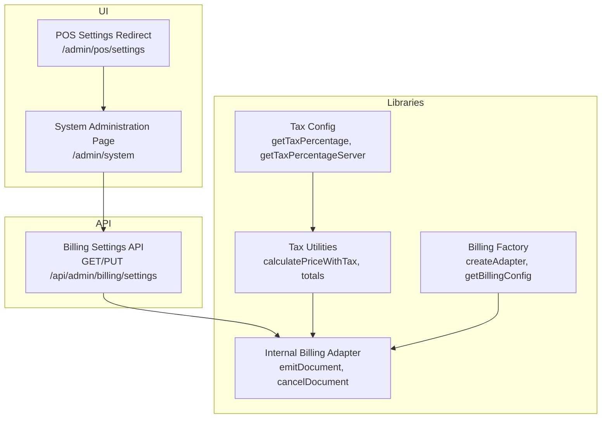
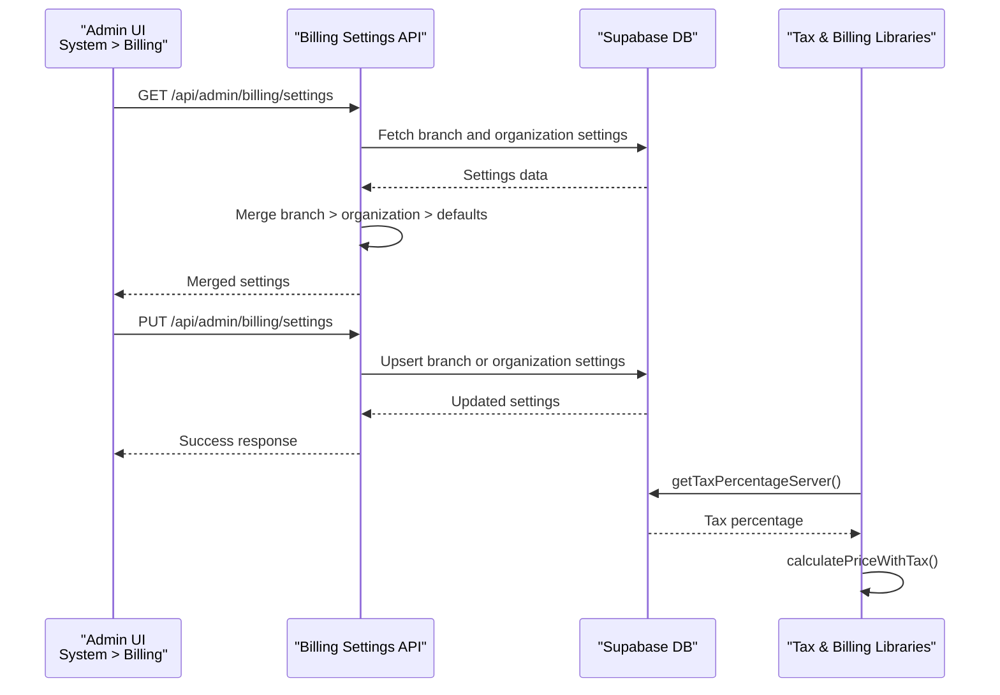
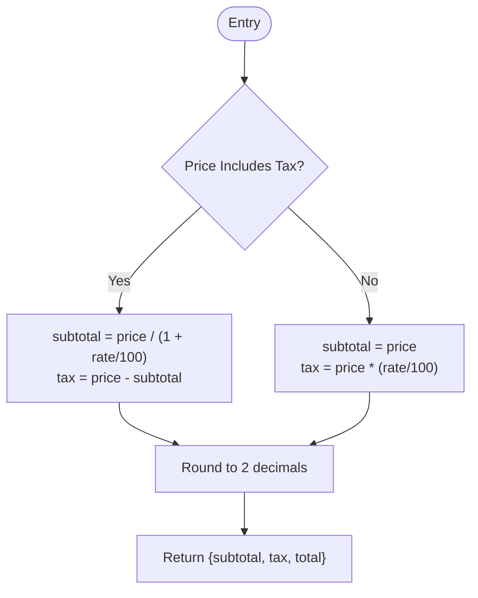
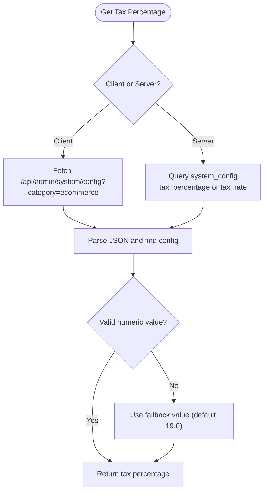
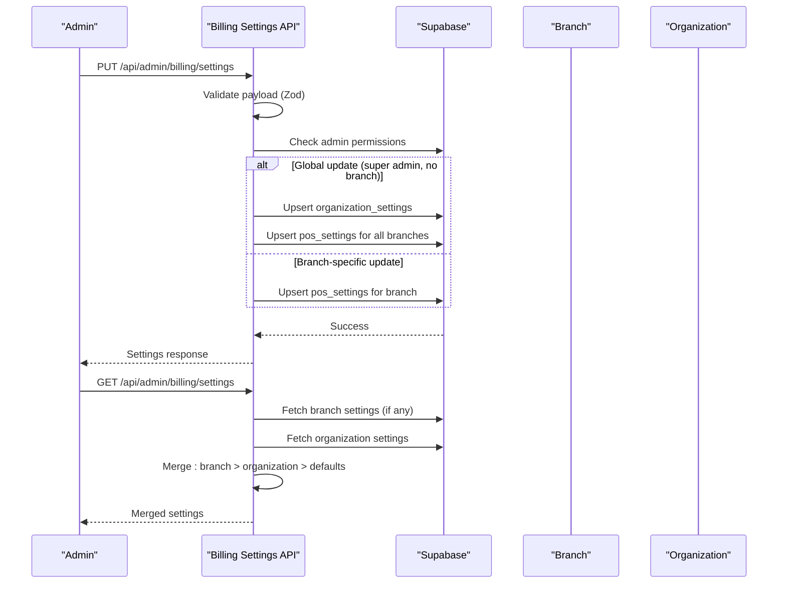
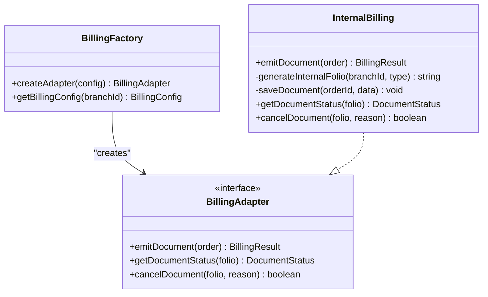
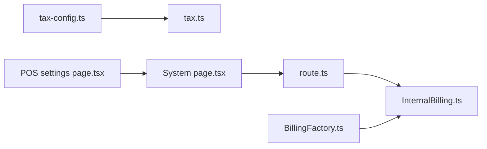

# Tax & Financial Configuration

<cite>
**Referenced Files in This Document**
- [tax.ts](file://src/lib/utils/tax.ts)
- [tax-config.ts](file://src/lib/utils/tax-config.ts)
- [tax.test.ts](file://src/__tests__/unit/lib/utils/tax.test.ts)
- [route.ts](file://src/app/api/admin/billing/settings/route.ts)
- [BillingFactory.ts](file://src/lib/billing/BillingFactory.ts)
- [InternalBilling.ts](file://src/lib/billing/adapters/InternalBilling.ts)
- [page.tsx](file://src/app/admin/system/page.tsx)
- [page.tsx](file://src/app/admin/pos/settings/page.tsx)
</cite>

## Table of Contents

1. [Introduction](#introduction)
2. [Project Structure](#project-structure)
3. [Core Components](#core-components)
4. [Architecture Overview](#architecture-overview)
5. [Detailed Component Analysis](#detailed-component-analysis)
6. [Dependency Analysis](#dependency-analysis)
7. [Performance Considerations](#performance-considerations)
8. [Troubleshooting Guide](#troubleshooting-guide)
9. [Conclusion](#conclusion)
10. [Appendices](#appendices)

## Introduction

This document explains tax and financial configuration in Opttius, focusing on tax rate management, currency settings, tax inclusion/exclusion rules, and financial calculation logic. It also covers POS billing settings, pricing strategies, revenue tracking parameters, financial reporting settings, and payment method configurations. Guidance is provided for tax compliance, financial audit trails, and regulatory reporting features, along with best practices for financial data integrity, currency conversion, and tax calculation accuracy across jurisdictions.

## Project Structure

The tax and financial configuration spans several areas:

- Tax calculation utilities for inclusive/exclusive pricing
- System configuration retrieval for tax percentages
- Billing settings API for POS receipts and documents
- Billing factory and adapter for internal billing
- System administration UI routing for POS billing settings

**Diagram sources**

- [page.tsx](file://src/app/admin/system/page.tsx#L47-L53)
- [page.tsx](file://src/app/admin/pos/settings/page.tsx#L10-L22)
- [route.ts](file://src/app/api/admin/billing/settings/route.ts#L26-L137)
- [tax.ts](file://src/lib/utils/tax.ts#L13-L94)
- [tax-config.ts](file://src/lib/utils/tax-config.ts#L12-L91)
- [BillingFactory.ts](file://src/lib/billing/BillingFactory.ts#L21-L49)
- [InternalBilling.ts](file://src/lib/billing/adapters/InternalBilling.ts#L21-L139)

**Section sources**

- [page.tsx](file://src/app/admin/system/page.tsx#L47-L53)
- [page.tsx](file://src/app/admin/pos/settings/page.tsx#L10-L22)
- [route.ts](file://src/app/api/admin/billing/settings/route.ts#L26-L137)

## Core Components

- Tax calculation utilities: compute price breakdowns, totals, and subtotals for inclusive/exclusive pricing scenarios.
- Tax configuration retrieval: fetch system-configured tax percentage with fallbacks.
- Billing settings API: manage POS billing settings per branch or globally, with merging logic and validation.
- Billing factory and internal billing adapter: generate internal receipts and documents, track status, and support cancellation.

Key capabilities:

- Tax-inclusive vs tax-exclusive pricing with rounding to two decimals.
- Multi-item tax, subtotal, and total aggregation.
- Centralized tax percentage retrieval from system configuration with robust fallbacks.
- Branch-level and organization-level billing settings with precedence rules.
- Internal billing with sequential folio generation and document persistence.

**Section sources**

- [tax.ts](file://src/lib/utils/tax.ts#L13-L94)
- [tax-config.ts](file://src/lib/utils/tax-config.ts#L12-L91)
- [route.ts](file://src/app/api/admin/billing/settings/route.ts#L9-L24)
- [route.ts](file://src/app/api/admin/billing/settings/route.ts#L84-L123)
- [BillingFactory.ts](file://src/lib/billing/BillingFactory.ts#L21-L49)
- [InternalBilling.ts](file://src/lib/billing/adapters/InternalBilling.ts#L27-L139)

## Architecture Overview

The tax and financial configuration integrates UI, API, and library layers to support accurate tax computation and compliant billing.

**Diagram sources**

- [route.ts](file://src/app/api/admin/billing/settings/route.ts#L26-L137)
- [route.ts](file://src/app/api/admin/billing/settings/route.ts#L139-L283)
- [tax-config.ts](file://src/lib/utils/tax-config.ts#L53-L91)
- [tax.ts](file://src/lib/utils/tax.ts#L13-L94)

## Detailed Component Analysis

### Tax Calculation Utilities

These utilities support accurate financial computations for tax-inclusive and tax-exclusive pricing, with consistent rounding and aggregation across items.

- calculatePriceWithTax: Computes breakdown for a single item.
- calculateTotalTax/calculateSubtotal/calculateTotal: Aggregate across multiple items using the same logic.

Best practices:

- Always round to two decimals for currency display and reconciliation.
- Apply consistent rounding at item level before summing to avoid cumulative rounding errors.

**Diagram sources**

- [tax.ts](file://src/lib/utils/tax.ts#L13-L94)

**Section sources**

- [tax.ts](file://src/lib/utils/tax.ts#L13-L94)
- [tax.test.ts](file://src/__tests__/unit/lib/utils/tax.test.ts#L10-L79)

### Tax Configuration Retrieval

Centralized retrieval of tax percentage from system configuration with fallbacks for client and server environments.

- getTaxPercentage: Client-side fetch with fallback.
- getTaxPercentageServer: Server-side Supabase query with robust parsing.

**Diagram sources**

- [tax-config.ts](file://src/lib/utils/tax-config.ts#L12-L91)

**Section sources**

- [tax-config.ts](file://src/lib/utils/tax-config.ts#L12-L91)

### Billing Settings API

Manages POS billing settings with validation, precedence rules, and global updates for super admins.

- Validation: Zod schema ensures safe updates.
- Precedence: Branch settings override organization settings; otherwise defaults apply.
- Global sync: Super admins can propagate changes to all branches.

**Diagram sources**

- [route.ts](file://src/app/api/admin/billing/settings/route.ts#L9-L24)
- [route.ts](file://src/app/api/admin/billing/settings/route.ts#L139-L283)
- [route.ts](file://src/app/api/admin/billing/settings/route.ts#L26-L137)

**Section sources**

- [route.ts](file://src/app/api/admin/billing/settings/route.ts#L9-L24)
- [route.ts](file://src/app/api/admin/billing/settings/route.ts#L84-L123)
- [route.ts](file://src/app/api/admin/billing/settings/route.ts#L139-L283)

### Billing Factory and Internal Billing Adapter

Internal billing adapter generates internal receipts and documents, tracks status, and supports cancellation.

- emitDocument: Determines document type, generates internal folio, persists billing document and items, and updates order metadata.
- generateInternalFolio: Uses database RPC with fallback logic.
- cancelDocument: Marks internal documents as cancelled.

**Diagram sources**

- [BillingFactory.ts](file://src/lib/billing/BillingFactory.ts#L21-L49)
- [InternalBilling.ts](file://src/lib/billing/adapters/InternalBilling.ts#L21-L139)

**Section sources**

- [BillingFactory.ts](file://src/lib/billing/BillingFactory.ts#L21-L49)
- [InternalBilling.ts](file://src/lib/billing/adapters/InternalBilling.ts#L27-L139)
- [InternalBilling.ts](file://src/lib/billing/adapters/InternalBilling.ts#L145-L204)
- [InternalBilling.ts](file://src/lib/billing/adapters/InternalBilling.ts#L246-L267)

### POS Settings Configuration and Redirects

- POS settings redirect: Legacy route redirects to the new location under System > Billing.
- System administration page: Hosts the Billing tab and dynamically loads POS billing settings.

**Section sources**

- [page.tsx](file://src/app/admin/pos/settings/page.tsx#L10-L22)
- [page.tsx](file://src/app/admin/system/page.tsx#L47-L53)

## Dependency Analysis

- Tax utilities depend on numeric pricing inputs and tax rates; rounding ensures consistency.
- Tax configuration retrieval depends on system configuration availability; fallbacks prevent runtime failures.
- Billing settings API depends on Supabase for settings persistence and admin validation.
- Internal billing adapter depends on database RPC for folio generation and document persistence.

**Diagram sources**

- [tax-config.ts](file://src/lib/utils/tax-config.ts#L12-L91)
- [tax.ts](file://src/lib/utils/tax.ts#L13-L94)
- [route.ts](file://src/app/api/admin/billing/settings/route.ts#L26-L137)
- [InternalBilling.ts](file://src/lib/billing/adapters/InternalBilling.ts#L21-L139)
- [BillingFactory.ts](file://src/lib/billing/BillingFactory.ts#L21-L49)
- [page.tsx](file://src/app/admin/system/page.tsx#L47-L53)
- [page.tsx](file://src/app/admin/pos/settings/page.tsx#L10-L22)

**Section sources**

- [tax-config.ts](file://src/lib/utils/tax-config.ts#L12-L91)
- [tax.ts](file://src/lib/utils/tax.ts#L13-L94)
- [route.ts](file://src/app/api/admin/billing/settings/route.ts#L26-L137)
- [InternalBilling.ts](file://src/lib/billing/adapters/InternalBilling.ts#L21-L139)
- [BillingFactory.ts](file://src/lib/billing/BillingFactory.ts#L21-L49)
- [page.tsx](file://src/app/admin/system/page.tsx#L47-L53)
- [page.tsx](file://src/app/admin/pos/settings/page.tsx#L10-L22)

## Performance Considerations

- Rounding precision: Two-decimal rounding reduces floating-point drift during aggregation.
- Aggregation loops: Prefer single-pass reductions to minimize iterations over item lists.
- Database queries: Use targeted selects and upserts with conflict resolution to avoid redundant writes.
- Folio generation: RPC-based generation ensures consistency; fallback logic prevents blocking on failures.

[No sources needed since this section provides general guidance]

## Troubleshooting Guide

Common issues and resolutions:

- Tax percentage not found:
  - Verify system configuration keys exist and are numeric.
  - Confirm fallback value is acceptable for jurisdiction.
  - Check server-side retrieval path for configuration parsing.
- Billing settings merge conflicts:
  - Ensure branch settings are present when overrides are intended.
  - Validate organization-level settings as defaults.
- Document emission failures:
  - Confirm database RPC for folio generation succeeds; fallback logic applies otherwise.
  - Review billing document creation and item insertion logs.
- Cancellation errors:
  - Validate internal folio mapping and order updates.

**Section sources**

- [tax-config.ts](file://src/lib/utils/tax-config.ts#L53-L91)
- [route.ts](file://src/app/api/admin/billing/settings/route.ts#L84-L123)
- [InternalBilling.ts](file://src/lib/billing/adapters/InternalBilling.ts#L145-L204)
- [InternalBilling.ts](file://src/lib/billing/adapters/InternalBilling.ts#L246-L267)

## Conclusion

Opttius provides a robust foundation for tax and financial configuration:

- Accurate tax calculations for inclusive/exclusive pricing with consistent rounding.
- Centralized tax percentage retrieval with fallbacks for reliability.
- Flexible billing settings with branch and organization precedence and global propagation for super admins.
- Internal billing adapter supporting document emission, status tracking, and cancellation.

These components enable compliant billing, reliable financial reporting, and scalable multi-branch operations.

[No sources needed since this section summarizes without analyzing specific files]

## Appendices

### Examples and How-To

- Configure tax brackets and rates
  - Set system configuration keys for tax percentage or tax rate.
  - Retrieve via client or server utilities; fallback ensures continuity.
  - Use tax utilities to compute totals for mixed inclusive/exclusive items.

- Currency formatting and multi-currency support
  - Internal billing documents currently use CLP; adjust currency field when extending multi-currency.
  - Ensure tax calculations align with target currency’s minor units.

- POS billing settings
  - Update branch or organization settings via the Billing tab in System administration.
  - Use the API for programmatic updates with validation and precedence rules.

- Revenue tracking parameters
  - Subtotal, tax amount, discount amount, and total amount are persisted with each billing document.
  - Use these fields for revenue categorization and reporting.

- Payment method configurations
  - Payment methods are configured in the broader payment system; billing settings define receipt and document metadata.

- Tax compliance and audit trails
  - Internal billing maintains emitted documents with timestamps and folios.
  - Cancellation updates order metadata for auditability.

- Regulatory reporting
  - Internal billing adapter emits internal receipts; future fiscal billing adapters can integrate with local tax authorities.

[No sources needed since this section provides general guidance]
