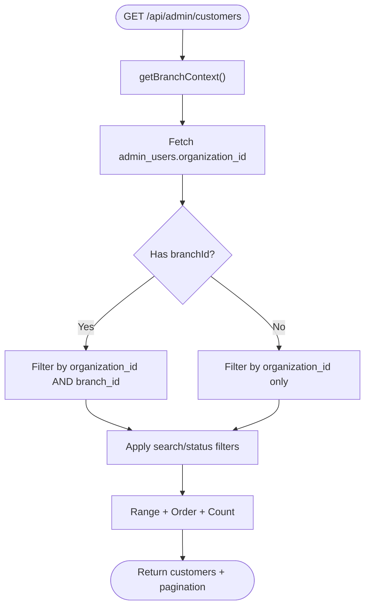

# Integration Testing

<cite>
**Referenced Files in This Document**
- [test-setup.ts](file://src/__tests__/integration/helpers/test-setup.ts)
- [vitest.config.ts](file://vitest.config.ts)
- [setup.ts](file://src/__tests__/setup.ts)
- [server.ts](file://src/utils/supabase/server.ts)
- [customers.route.ts](file://src/app/api/admin/customers/route.ts)
- [TESTING_INTEGRATION_AUTH_FIX.md](file://docs/TESTING_INTEGRATION_AUTH_FIX.md)
</cite>

## Table of Contents

1. [Introduction](#introduction)
2. [Project Structure](#project-structure)
3. [Core Components](#core-components)
4. [Architecture Overview](#architecture-overview)
5. [Detailed Component Analysis](#detailed-component-analysis)
6. [Dependency Analysis](#dependency-analysis)
7. [Performance Considerations](#performance-considerations)
8. [Troubleshooting Guide](#troubleshooting-guide)
9. [Conclusion](#conclusion)

## Introduction

This document explains how to develop and execute integration tests that validate:

- API endpoint behavior with realistic data
- Database operations and multi-tenancy isolation
- Authentication and authorization flows
- Cross-service communication patterns (e.g., Supabase, payment providers)
- Real-time data synchronization expectations
- Business process validation across frontend and backend

It consolidates testing patterns, strategies, and concrete examples derived from the repository’s integration test helpers, Supabase authentication utilities, and API routes.

## Project Structure

The integration testing framework centers around:

- A shared test setup module that provisions test organizations, users, branches, and data, and executes authenticated HTTP requests against the running Next.js server
- A Supabase server client that supports both cookie-based and Bearer-token-based authentication for seamless integration testing
- API routes that enforce admin authorization, branch/organization scoping, and validation

**Diagram sources**

- [vitest.config.ts](file://vitest.config.ts#L1-L32)
- [test-setup.ts](file://src/__tests__/integration/helpers/test-setup.ts#L1-L577)
- [setup.ts](file://src/__tests__/setup.ts#L1-L42)
- [server.ts](file://src/utils/supabase/server.ts#L1-L110)
- [customers.route.ts](file://src/app/api/admin/customers/route.ts#L1-L703)

**Section sources**

- [vitest.config.ts](file://vitest.config.ts#L1-L32)
- [setup.ts](file://src/__tests__/setup.ts#L1-L42)
- [test-setup.ts](file://src/__tests__/integration/helpers/test-setup.ts#L1-L577)
- [server.ts](file://src/utils/supabase/server.ts#L1-L110)
- [customers.route.ts](file://src/app/api/admin/customers/route.ts#L1-L703)

## Core Components

- Test setup utilities:
  - Provisioning organizations, users, branches, customers, products, orders
  - Creating authenticated requests via Supabase session cookies or Bearer tokens
  - Cleanup helpers to remove test data deterministically
- Supabase server client:
  - Supports cookie-based auth for browser flows and Bearer token fallback for tests
  - Provides a service role client for admin operations bypassing Row Level Security
- API routes:
  - Enforce admin checks, branch/organization scoping, and validation
  - Return structured error responses and pagination metadata

**Section sources**

- [test-setup.ts](file://src/__tests__/integration/helpers/test-setup.ts#L103-L132)
- [test-setup.ts](file://src/__tests__/integration/helpers/test-setup.ts#L137-L214)
- [test-setup.ts](file://src/__tests__/integration/helpers/test-setup.ts#L219-L247)
- [test-setup.ts](file://src/__tests__/integration/helpers/test-setup.ts#L280-L305)
- [test-setup.ts](file://src/__tests__/integration/helpers/test-setup.ts#L310-L337)
- [test-setup.ts](file://src/__tests__/integration/helpers/test-setup.ts#L342-L377)
- [test-setup.ts](file://src/__tests__/integration/helpers/test-setup.ts#L382-L445)
- [test-setup.ts](file://src/__tests__/integration/helpers/test-setup.ts#L483-L576)
- [server.ts](file://src/utils/supabase/server.ts#L43-L92)

## Architecture Overview

The integration test flow connects the test runner to the Next.js server, which authenticates requests using Supabase and applies business logic and data access patterns.

**Diagram sources**

- [test-setup.ts](file://src/__tests__/integration/helpers/test-setup.ts#L483-L576)
- [server.ts](file://src/utils/supabase/server.ts#L43-L92)
- [customers.route.ts](file://src/app/api/admin/customers/route.ts#L22-L223)

## Detailed Component Analysis

### Authentication and Authorization Flow

- Supabase server client supports two authentication modes:
  - Cookie-based: reads session from Next.js cookies (browser flow)
  - Bearer token fallback: accepts Authorization header for programmatic tests
- API routes call a helper to create a client from the incoming request, enabling both flows
- Admin checks are performed via an RPC call to verify administrative access

**Diagram sources**

- [server.ts](file://src/utils/supabase/server.ts#L43-L92)
- [customers.route.ts](file://src/app/api/admin/customers/route.ts#L52-L82)

**Section sources**

- [server.ts](file://src/utils/supabase/server.ts#L43-L92)
- [customers.route.ts](file://src/app/api/admin/customers/route.ts#L52-L82)

### Multi-Tenant Data Isolation

- Users are scoped to an organization and optionally to a branch
- Queries are filtered by organization_id and branch_id to ensure tenant isolation
- Super admin behavior differs from regular admin in branch selection and filtering

**Diagram sources**

- [customers.route.ts](file://src/app/api/admin/customers/route.ts#L84-L126)
- [customers.route.ts](file://src/app/api/admin/customers/route.ts#L128-L186)

**Section sources**

- [customers.route.ts](file://src/app/api/admin/customers/route.ts#L84-L126)
- [customers.route.ts](file://src/app/api/admin/customers/route.ts#L128-L186)

### API Request/Response Validation Patterns

- Query parameters are validated using Zod schemas and merged for pagination and search
- Request bodies are validated before processing create/update operations
- Errors are returned with structured messages and appropriate HTTP status codes

**Diagram sources**

- [customers.route.ts](file://src/app/api/admin/customers/route.ts#L22-L703)

**Section sources**

- [customers.route.ts](file://src/app/api/admin/customers/route.ts#L22-L703)

### Database Transaction Testing Strategies

- Use the service role client for deterministic admin operations during setup/cleanup
- Wrap test data creation in transactions where applicable to maintain consistency
- Validate cascading deletions and referential integrity by cleaning up organizations and verifying child records are removed

**Diagram sources**

- [test-setup.ts](file://src/__tests__/integration/helpers/test-setup.ts#L103-L132)
- [test-setup.ts](file://src/__tests__/integration/helpers/test-setup.ts#L137-L214)
- [test-setup.ts](file://src/__tests__/integration/helpers/test-setup.ts#L219-L247)
- [test-setup.ts](file://src/__tests__/integration/helpers/test-setup.ts#L280-L305)
- [test-setup.ts](file://src/__tests__/integration/helpers/test-setup.ts#L310-L337)
- [test-setup.ts](file://src/__tests__/integration/helpers/test-setup.ts#L342-L377)

**Section sources**

- [test-setup.ts](file://src/__tests__/integration/helpers/test-setup.ts#L450-L468)
- [test-setup.ts](file://src/__tests__/integration/helpers/test-setup.ts#L946-L976)

### Real-Time Data Synchronization Expectations

- Notifications are triggered after customer creation and sent asynchronously; tests should assert side effects do not block primary responses
- For payment/webhook-driven updates, validate eventual consistency by polling or asserting event queues

[No sources needed since this section provides general guidance]

### Multi-Tenant Scenarios and Permission Validation

- Validate that users only see their organization’s data
- Validate branch-level access for users with assigned branches
- Validate super admin behavior when viewing across branches or organizations
- Use the helper to create root/dev users and organization-less admin users for platform-level tests

**Section sources**

- [test-setup.ts](file://src/__tests__/integration/helpers/test-setup.ts#L382-L445)
- [customers.route.ts](file://src/app/api/admin/customers/route.ts#L84-L126)

### Cross-Service Communication

- Payment gateway flows (e.g., Mercado Pago) integrate via API routes and webhooks; validate end-to-end payment lifecycle
- Use the Supabase service role client for administrative operations and to bypass RLS during test setup

**Section sources**

- [server.ts](file://src/utils/supabase/server.ts#L94-L110)

## Dependency Analysis

The integration test stack depends on:

- Vitest configuration for environment and coverage
- Supabase server client for authentication and database access
- API routes for business logic and data access
- Test helpers for provisioning and authenticated requests

**Diagram sources**

- [vitest.config.ts](file://vitest.config.ts#L1-L32)
- [setup.ts](file://src/__tests__/setup.ts#L1-L42)
- [test-setup.ts](file://src/__tests__/integration/helpers/test-setup.ts#L1-L577)
- [customers.route.ts](file://src/app/api/admin/customers/route.ts#L1-L703)
- [server.ts](file://src/utils/supabase/server.ts#L1-L110)

**Section sources**

- [vitest.config.ts](file://vitest.config.ts#L1-L32)
- [setup.ts](file://src/__tests__/setup.ts#L1-L42)
- [test-setup.ts](file://src/__tests__/integration/helpers/test-setup.ts#L1-L577)
- [customers.route.ts](file://src/app/api/admin/customers/route.ts#L1-L703)
- [server.ts](file://src/utils/supabase/server.ts#L1-L110)

## Performance Considerations

- Keep test suites fast by reusing authenticated sessions and minimizing repeated setup
- Use pagination and targeted queries to reduce payload sizes during assertions
- Avoid excessive writes in hot paths; batch or reuse test data where safe

[No sources needed since this section provides general guidance]

## Troubleshooting Guide

Common issues and resolutions:

- Unauthorized errors in integration tests:
  - Ensure requests include a valid session cookie or Bearer token
  - Confirm the Supabase server client is configured to accept Bearer tokens for tests
- Multi-tenancy violations:
  - Verify organization and branch scoping logic in API routes
  - Confirm test data is created under the correct organization/branch
- Authentication mismatch:
  - Align test helpers with the Supabase SSR cookie format and project reference
  - Use the documented helper to construct authenticated requests

**Section sources**

- [TESTING_INTEGRATION_AUTH_FIX.md](file://docs/TESTING_INTEGRATION_AUTH_FIX.md#L1-L281)
- [test-setup.ts](file://src/__tests__/integration/helpers/test-setup.ts#L483-L576)
- [server.ts](file://src/utils/supabase/server.ts#L43-L92)
- [customers.route.ts](file://src/app/api/admin/customers/route.ts#L52-L82)

## Conclusion

The integration testing framework leverages a robust test setup, Supabase authentication utilities, and API routes to validate end-to-end behavior across authentication, authorization, multi-tenancy, and business processes. By following the patterns and strategies outlined here—especially around authenticated requests, tenant scoping, and structured validation—you can build reliable, deterministic integration tests that mirror production flows and ensure system correctness.
