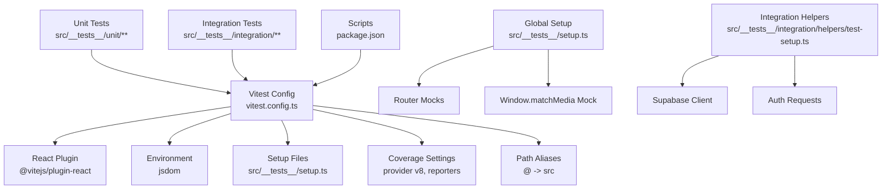
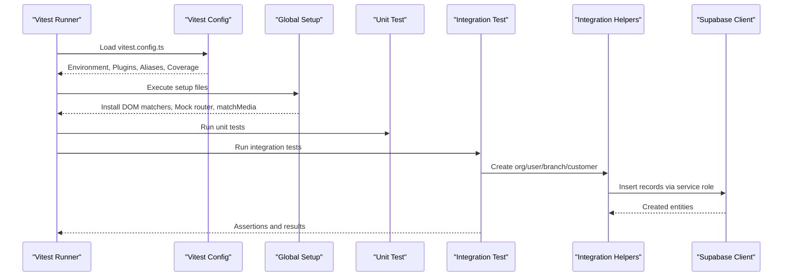
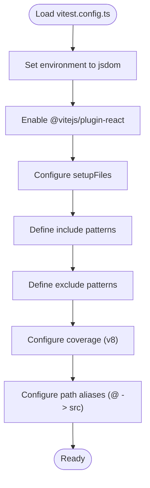
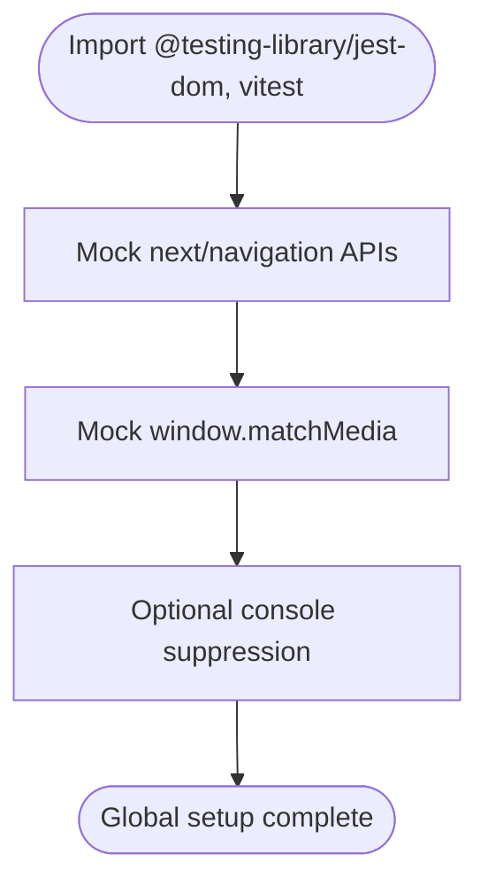
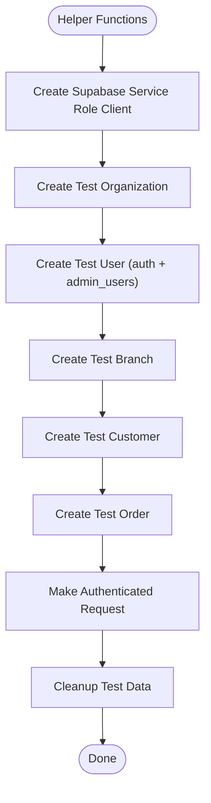
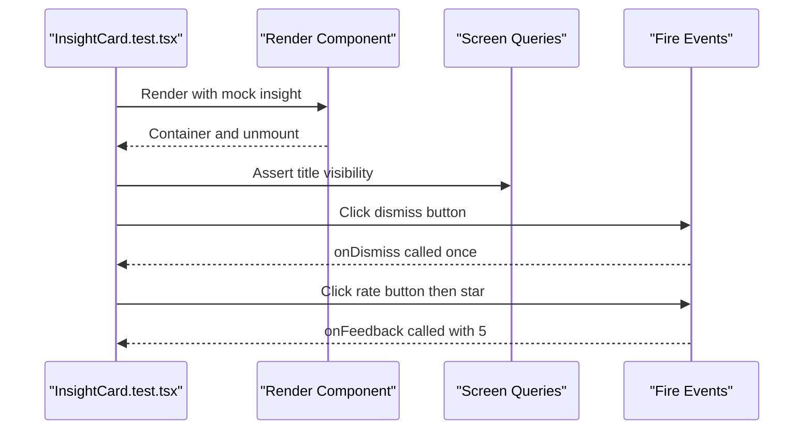
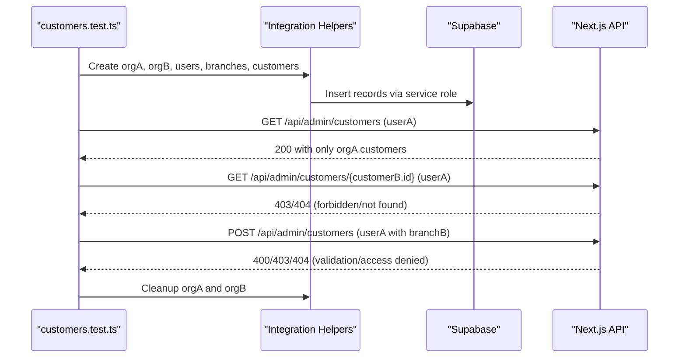
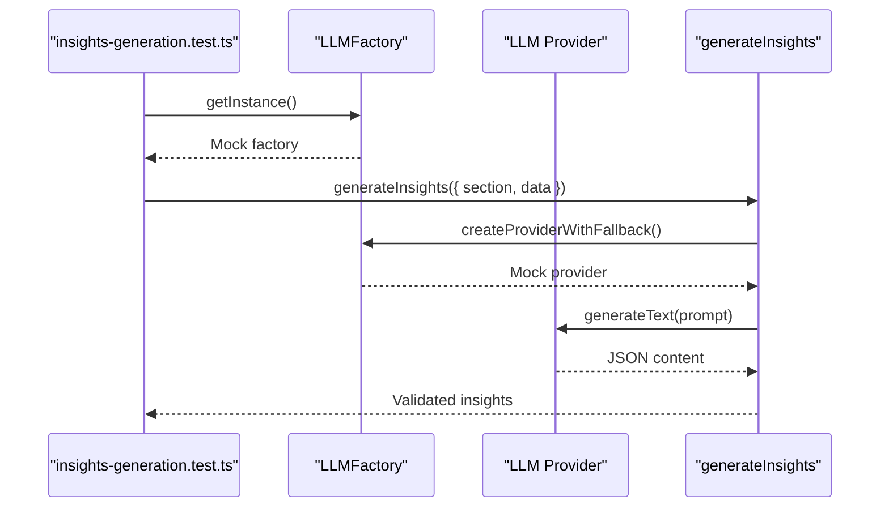
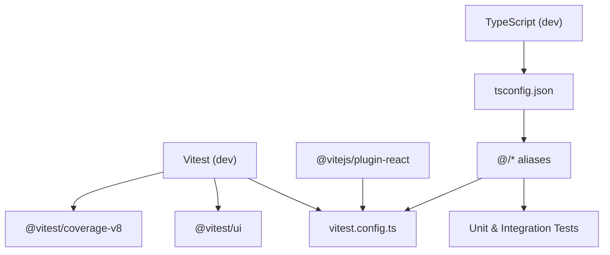

# Test Configuration & Setup

<cite>
**Referenced Files in This Document**
- [vitest.config.ts](file://vitest.config.ts)
- [package.json](file://package.json)
- [tsconfig.json](file://tsconfig.json)
- [src/__tests__/setup.ts](file://src/__tests__/setup.ts)
- [src/__tests__/integration/helpers/test-setup.ts](file://src/__tests__/integration/helpers/test-setup.ts)
- [src/__tests__/unit/components/ai/InsightCard.test.tsx](file://src/__tests__/unit/components/ai/InsightCard.test.tsx)
- [src/__tests__/integration/ai/insights-generation.test.ts](file://src/__tests__/integration/ai/insights-generation.test.ts)
- [src/__tests__/integration/api/customers.test.ts](file://src/__tests__/integration/api/customers.test.ts)
- [next.config.js](file://next.config.js)
- [.env.local](file://.env.local)
</cite>

## Table of Contents

1. [Introduction](#introduction)
2. [Project Structure](#project-structure)
3. [Core Components](#core-components)
4. [Architecture Overview](#architecture-overview)
5. [Detailed Component Analysis](#detailed-component-analysis)
6. [Dependency Analysis](#dependency-analysis)
7. [Performance Considerations](#performance-considerations)
8. [Troubleshooting Guide](#troubleshooting-guide)
9. [Conclusion](#conclusion)
10. [Appendices](#appendices)

## Introduction

This document explains how the project’s test suite is configured and executed using Vitest. It covers the Vitest configuration, plugin setup, test environment initialization, path aliases, coverage reporting, and integration with Next.js. It also documents environment variable requirements, test setup patterns, and best practices for writing unit and integration tests in a Next.js application with TypeScript. Guidance is included for performance optimization, parallel execution, and debugging test failures.

## Project Structure

The testing infrastructure is organized under a dedicated test directory with separate folders for unit and integration tests. Global test setup and integration helpers are provided to initialize mocks and database clients. The Vitest configuration defines the runtime environment, plugin chain, path aliases, and coverage settings.

**Diagram sources**

- [vitest.config.ts](file://vitest.config.ts#L1-L32)
- [src/**tests**/setup.ts](file://src/__tests__/setup.ts#L1-L42)
- [src/**tests**/integration/helpers/test-setup.ts](file://src/__tests__/integration/helpers/test-setup.ts#L1-L577)
- [package.json](file://package.json#L28-L34)

**Section sources**

- [vitest.config.ts](file://vitest.config.ts#L1-L32)
- [src/**tests**/setup.ts](file://src/__tests__/setup.ts#L1-L42)
- [src/**tests**/integration/helpers/test-setup.ts](file://src/__tests__/integration/helpers/test-setup.ts#L1-L577)
- [package.json](file://package.json#L28-L34)

## Core Components

- Vitest configuration: Defines plugins, environment, setup files, include/exclude patterns, coverage, and path aliases.
- Global test setup: Installs DOM testing utilities, mocks Next.js router APIs, and polyfills browser APIs.
- Integration helpers: Provides Supabase client creation, test data factories, authentication request helpers, and cleanup utilities.
- Scripts: Exposes commands for running tests, UI, watch mode, and coverage reports.

Key configuration highlights:

- Environment: jsdom for DOM APIs and React component testing.
- Plugins: React plugin for JSX/TSX transforms.
- Setup files: Loads global setup for all tests.
- Coverage: V8 provider with text, json, html reporters and selective exclusions.
- Path aliases: Resolves @ to src for concise imports.

**Section sources**

- [vitest.config.ts](file://vitest.config.ts#L5-L26)
- [src/**tests**/setup.ts](file://src/__tests__/setup.ts#L1-L42)
- [src/**tests**/integration/helpers/test-setup.ts](file://src/__tests__/integration/helpers/test-setup.ts#L14-L27)
- [package.json](file://package.json#L28-L34)

## Architecture Overview

The test architecture integrates Vitest with Next.js and Supabase for end-to-end validation. Unit tests focus on isolated components and logic, while integration tests validate API behavior and multi-tenancy constraints against a local Supabase instance.

**Diagram sources**

- [vitest.config.ts](file://vitest.config.ts#L5-L26)
- [src/**tests**/setup.ts](file://src/__tests__/setup.ts#L6-L34)
- [src/**tests**/integration/helpers/test-setup.ts](file://src/__tests__/integration/helpers/test-setup.ts#L14-L27)
- [src/**tests**/integration/api/customers.test.ts](file://src/__tests__/integration/api/customers.test.ts#L38-L72)

## Detailed Component Analysis

### Vitest Configuration

The configuration sets up the testing environment, plugin pipeline, and coverage reporting. It also defines path aliases for ergonomic imports.

- Environment: jsdom enables DOM APIs for React testing.
- Plugins: React plugin supports JSX/TSX compilation.
- Setup files: src/**tests**/setup.ts initializes mocks and utilities.
- Include/Exclude: Targets test/spec files with supported extensions; excludes node_modules, .next, and dist.
- Coverage: V8 provider with text, json, html reporters; excludes generated files and test scaffolding.
- Path aliases: @ resolves to src for concise module references.

**Diagram sources**

- [vitest.config.ts](file://vitest.config.ts#L5-L31)

**Section sources**

- [vitest.config.ts](file://vitest.config.ts#L5-L31)

### Global Test Setup

The global setup installs DOM testing utilities and mocks Next.js router APIs and window.matchMedia to avoid browser-specific behavior during tests. It intentionally avoids global cleanup to prevent interference with integration tests that manage their own lifecycle.

- DOM testing utilities: Adds jest-dom matchers.
- Router mocks: Provides useRouter, usePathname, useSearchParams with stubbed methods.
- Window.matchMedia: Polyfills matchMedia for responsive component tests.
- Optional console suppression: Can be enabled to reduce noise.

**Diagram sources**

- [src/**tests**/setup.ts](file://src/__tests__/setup.ts#L1-L42)

**Section sources**

- [src/**tests**/setup.ts](file://src/__tests__/setup.ts#L1-L42)

### Integration Test Helpers

The integration helpers provide utilities to bootstrap test data and authenticate requests against the Next.js API. They rely on a local Supabase instance and service role keys.

- Supabase client: Uses NEXT_PUBLIC_SUPABASE_URL and SUPABASE_SERVICE_ROLE_KEY.
- Test data factories: Create organizations, users, branches, customers, and orders with realistic attributes.
- Authentication: Generates session cookies and Authorization headers compatible with Next.js SSR.
- Cleanup: Removes test data and auth users to keep the database clean.

**Diagram sources**

- [src/**tests**/integration/helpers/test-setup.ts](file://src/__tests__/integration/helpers/test-setup.ts#L14-L27)
- [src/**tests**/integration/helpers/test-setup.ts](file://src/__tests__/integration/helpers/test-setup.ts#L103-L132)
- [src/**tests**/integration/helpers/test-setup.ts](file://src/__tests__/integration/helpers/test-setup.ts#L483-L577)

**Section sources**

- [src/**tests**/integration/helpers/test-setup.ts](file://src/__tests__/integration/helpers/test-setup.ts#L14-L27)
- [src/**tests**/integration/helpers/test-setup.ts](file://src/__tests__/integration/helpers/test-setup.ts#L103-L132)
- [src/**tests**/integration/helpers/test-setup.ts](file://src/__tests__/integration/helpers/test-setup.ts#L483-L577)

### Example Unit Test: Component Behavior

This unit test demonstrates rendering a component, asserting behavior across variants, and verifying event handlers. It uses Testing Library and Vitest spies.

- Renders InsightCard with different insight types.
- Verifies dismissal and feedback interactions.
- Checks action button presence and priority indicators.

**Diagram sources**

- [src/**tests**/unit/components/ai/InsightCard.test.tsx](file://src/__tests__/unit/components/ai/InsightCard.test.tsx#L23-L80)

**Section sources**

- [src/**tests**/unit/components/ai/InsightCard.test.tsx](file://src/__tests__/unit/components/ai/InsightCard.test.tsx#L1-L136)

### Example Integration Test: API Multi-Tenancy

This integration test validates multi-tenancy isolation and CRUD operations for the customers API. It creates separate organizations and users, then asserts that each user can only access their own data.

- Pre-test setup: Creates organizations, users, branches, and customers.
- Assertions: Ensures users cannot access data from other organizations and that CRUD operations respect organization boundaries.
- Cleanup: Removes test data after completion.

**Diagram sources**

- [src/**tests**/integration/api/customers.test.ts](file://src/__tests__/integration/api/customers.test.ts#L38-L72)
- [src/**tests**/integration/api/customers.test.ts](file://src/__tests__/integration/api/customers.test.ts#L82-L177)
- [src/**tests**/integration/helpers/test-setup.ts](file://src/__tests__/integration/helpers/test-setup.ts#L450-L468)

**Section sources**

- [src/**tests**/integration/api/customers.test.ts](file://src/__tests__/integration/api/customers.test.ts#L1-L325)
- [src/**tests**/integration/helpers/test-setup.ts](file://src/__tests__/integration/helpers/test-setup.ts#L450-L468)

### Example Integration Test: AI Insights Generation

This integration test validates the AI insights generator with mocked LLM providers, maturity adaptation, error handling, and prompt customization.

- Mocks: LLMFactory and Logger to isolate behavior.
- Scenarios: Successful generation, maturity adaptation, markdown-wrapped JSON, retry logic, validation, and custom configuration.
- Assertions: Validates returned insights, provider calls, and error conditions.

**Diagram sources**

- [src/**tests**/integration/ai/insights-generation.test.ts](file://src/__tests__/integration/ai/insights-generation.test.ts#L28-L50)
- [src/**tests**/integration/ai/insights-generation.test.ts](file://src/__tests__/integration/ai/insights-generation.test.ts#L75-L89)

**Section sources**

- [src/**tests**/integration/ai/insights-generation.test.ts](file://src/__tests__/integration/ai/insights-generation.test.ts#L1-L435)

## Dependency Analysis

The test configuration depends on Next.js and Vitest ecosystem packages. TypeScript path mapping aligns with Vitest aliases to ensure consistent imports across unit and integration tests.

**Diagram sources**

- [package.json](file://package.json#L88-L116)
- [tsconfig.json](file://tsconfig.json#L22-L28)
- [vitest.config.ts](file://vitest.config.ts#L26-L31)

**Section sources**

- [package.json](file://package.json#L88-L116)
- [tsconfig.json](file://tsconfig.json#L22-L28)
- [vitest.config.ts](file://vitest.config.ts#L26-L31)

## Performance Considerations

- Parallel execution: Vitest runs tests in parallel by default. Keep tests self-contained to avoid contention.
- Watch mode: Use the watch script to re-run only changed tests during development.
- Coverage scope: Exclude generated files and test scaffolding to keep coverage reports focused and fast.
- Mock external systems: Mock LLM providers and third-party SDKs to avoid flaky network-dependent tests.
- Environment reuse: Reuse global setup for shared mocks; avoid heavy per-test initialization.

[No sources needed since this section provides general guidance]

## Troubleshooting Guide

Common issues and resolutions:

- Missing environment variables for Supabase: Ensure NEXT_PUBLIC_SUPABASE_URL and SUPABASE_SERVICE_ROLE_KEY are present in the environment.
- Router mocks: If routing tests fail, verify that next/navigation mocks are applied in setup.
- matchMedia errors: Confirm window.matchMedia is mocked in global setup.
- Integration test failures: Validate that the local Supabase instance is running and accessible.
- Coverage report anomalies: Review coverage exclude patterns to ensure legitimate code is included.

**Section sources**

- [.env.local](file://.env.local#L9-L11)
- [src/**tests**/setup.ts](file://src/__tests__/setup.ts#L6-L34)
- [src/**tests**/integration/helpers/test-setup.ts](file://src/__tests__/integration/helpers/test-setup.ts#L15-L26)

## Conclusion

The project’s test configuration leverages Vitest with a jsdom environment, React plugin, and global setup to support both unit and integration testing. Path aliases and TypeScript configuration ensure consistent imports. Integration tests utilize a local Supabase instance to validate multi-tenancy and API behavior. Scripts enable flexible test execution modes, and coverage is configured for actionable insights. Following the best practices outlined here will improve reliability, performance, and maintainability of the test suite.

[No sources needed since this section summarizes without analyzing specific files]

## Appendices

### Test Scripts Reference

- Run tests: npm test
- Run with UI: npm run test:ui
- Run with coverage: npm run test:coverage
- Watch mode: npm run test:watch
- Single run: npm run test:run

**Section sources**

- [package.json](file://package.json#L28-L34)

### Environment Variables for Testing

Required variables for integration tests:

- NEXT_PUBLIC_SUPABASE_URL: Supabase project URL
- SUPABASE_SERVICE_ROLE_KEY: Supabase service role key

Optional variables for local development:

- NEXT_PUBLIC_APP_URL: Application base URL
- NEXT_PUBLIC_BASE_URL: Public base URL for tunnels

**Section sources**

- [.env.local](file://.env.local#L9-L11)
- [.env.local](file://.env.local#L5)
- [.env.local](file://.env.local#L6)

### Vitest Configuration Options Summary

- Environment: jsdom
- Plugins: @vitejs/plugin-react
- Setup files: src/**tests**/setup.ts
- Include patterns: src/\*_/_.{test,spec}.{js,mjs,cjs,ts,mts,cts,jsx,tsx}
- Exclude patterns: node_modules, .next, dist
- Coverage provider: v8
- Coverage reporters: text, json, html
- Path aliases: @ -> src

**Section sources**

- [vitest.config.ts](file://vitest.config.ts#L7-L26)
- [vitest.config.ts](file://vitest.config.ts#L26-L31)
