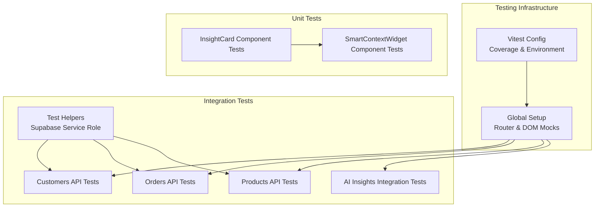
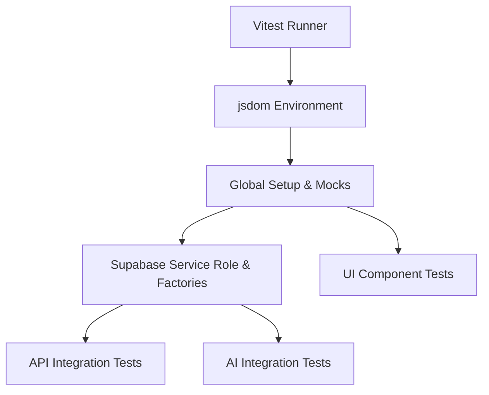
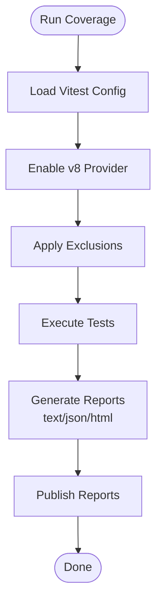
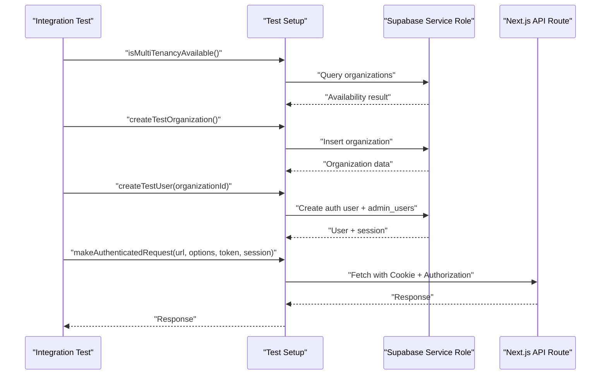
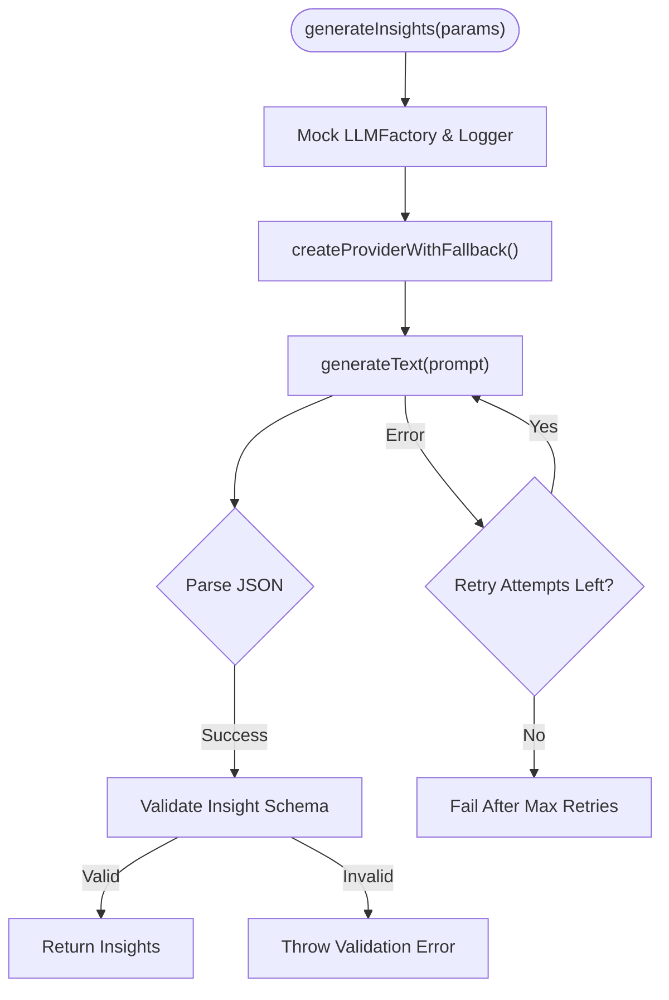
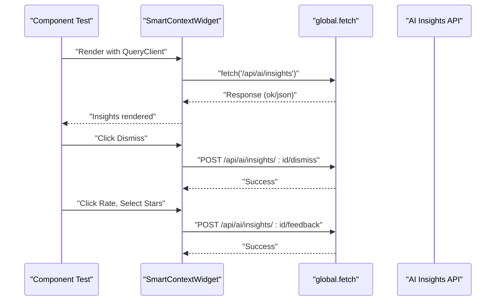
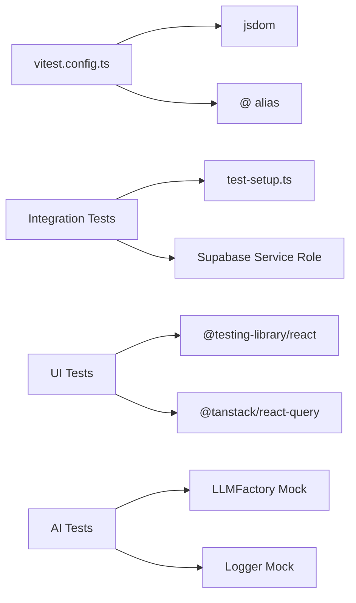

# Test Coverage & Quality Assurance

<cite>
**Referenced Files in This Document**
- [vitest.config.ts](file://vitest.config.ts)
- [package.json](file://package.json)
- [src/__tests__/setup.ts](file://src/__tests__/setup.ts)
- [src/__tests__/integration/helpers/test-setup.ts](file://src/__tests__/integration/helpers/test-setup.ts)
- [src/__tests__/integration/api/customers.test.ts](file://src/__tests__/integration/api/customers.test.ts)
- [src/__tests__/integration/api/orders.test.ts](file://src/__tests__/integration/api/orders.test.ts)
- [src/__tests__/integration/api/products.test.ts](file://src/__tests__/integration/api/products.test.ts)
- [src/__tests__/integration/ai/insights-generation.test.ts](file://src/__tests__/integration/ai/insights-generation.test.ts)
- [src/__tests__/unit/components/ai/InsightCard.test.tsx](file://src/__tests__/unit/components/ai/InsightCard.test.tsx)
- [src/__tests__/unit/components/ai/SmartContextWidget.test.tsx](file://src/__tests__/unit/components/ai/SmartContextWidget.test.tsx)
</cite>

## Table of Contents

1. [Introduction](#introduction)
2. [Project Structure](#project-structure)
3. [Core Components](#core-components)
4. [Architecture Overview](#architecture-overview)
5. [Detailed Component Analysis](#detailed-component-analysis)
6. [Dependency Analysis](#dependency-analysis)
7. [Performance Considerations](#performance-considerations)
8. [Troubleshooting Guide](#troubleshooting-guide)
9. [Conclusion](#conclusion)
10. [Appendices](#appendices)

## Introduction

This document defines a comprehensive test coverage and quality assurance strategy for the optical management system. It explains how to measure and improve test coverage across layers, establish quality gates, and maintain reliable continuous testing workflows. It also covers testing strategies for critical business logic, edge cases, error conditions, AI features, SaaS components, and multi-tenant scenarios. Guidance is grounded in the repository’s existing Vitest configuration, integration scaffolding, and example tests.

## Project Structure

The testing infrastructure is organized around:

- Vitest configuration for environment, coverage, and test discovery
- Global setup for browser mocks and router mocking
- Integration tests validating multi-tenancy, SaaS features, and business APIs
- Unit tests for AI components and React UI
- Shared helpers for test data provisioning and authenticated requests

**Diagram sources**

- [vitest.config.ts](file://vitest.config.ts#L1-L32)
- [src/**tests**/setup.ts](file://src/__tests__/setup.ts#L1-L42)
- [src/**tests**/integration/helpers/test-setup.ts](file://src/__tests__/integration/helpers/test-setup.ts#L1-L577)
- [src/**tests**/integration/api/customers.test.ts](file://src/__tests__/integration/api/customers.test.ts#L1-L325)
- [src/**tests**/integration/api/orders.test.ts](file://src/__tests__/integration/api/orders.test.ts#L1-L323)
- [src/**tests**/integration/api/products.test.ts](file://src/__tests__/integration/api/products.test.ts#L1-L463)
- [src/**tests**/integration/ai/insights-generation.test.ts](file://src/__tests__/integration/ai/insights-generation.test.ts#L1-L435)
- [src/**tests**/unit/components/ai/InsightCard.test.tsx](file://src/__tests__/unit/components/ai/InsightCard.test.tsx#L1-L136)
- [src/**tests**/unit/components/ai/SmartContextWidget.test.tsx](file://src/__tests__/unit/components/ai/SmartContextWidget.test.tsx#L1-L205)

**Section sources**

- [vitest.config.ts](file://vitest.config.ts#L1-L32)
- [src/**tests**/setup.ts](file://src/__tests__/setup.ts#L1-L42)

## Core Components

- Vitest configuration enables jsdom environment, global setup, and coverage reporting in text, JSON, and HTML formats. Coverage excludes node_modules, test files, type declarations, config files, mock data, and type folders.
- Global setup mocks Next.js router and window.matchMedia, and centralizes cleanup behavior to avoid interference between component and integration tests.
- Integration test helpers provide Supabase service role clients, organization/user/branch/product/customer/order creation, branch access assignment, and authenticated request utilities with proper session cookies for Next.js API routes.
- Example integration suites validate multi-tenancy isolation, CRUD operations, filtering, validation, and data integrity for customers, orders, and products.
- AI integration tests validate insight generation, maturity adaptation, error handling with retries, JSON parsing robustness, and insight schema validation.
- Unit tests validate AI UI components’ rendering, actions (dismiss, feedback), and error-handling behavior.

**Section sources**

- [vitest.config.ts](file://vitest.config.ts#L13-L24)
- [src/**tests**/setup.ts](file://src/__tests__/setup.ts#L6-L34)
- [src/**tests**/integration/helpers/test-setup.ts](file://src/__tests__/integration/helpers/test-setup.ts#L72-L98)
- [src/**tests**/integration/api/customers.test.ts](file://src/__tests__/integration/api/customers.test.ts#L81-L177)
- [src/**tests**/integration/api/orders.test.ts](file://src/__tests__/integration/api/orders.test.ts#L85-L193)
- [src/**tests**/integration/api/products.test.ts](file://src/__tests__/integration/api/products.test.ts#L88-L198)
- [src/**tests**/integration/ai/insights-generation.test.ts](file://src/__tests__/integration/ai/insights-generation.test.ts#L52-L203)
- [src/**tests**/unit/components/ai/InsightCard.test.tsx](file://src/__tests__/unit/components/ai/InsightCard.test.tsx#L23-L134)
- [src/**tests**/unit/components/ai/SmartContextWidget.test.tsx](file://src/__tests__/unit/components/ai/SmartContextWidget.test.tsx#L19-L97)

## Architecture Overview

The testing architecture separates concerns across layers:

- Layer 1: Test runner and environment (Vitest + jsdom)
- Layer 2: Global setup and mocks
- Layer 3: Integration scaffolding (Supabase service role, test data factories)
- Layer 4: Business API tests (multi-tenancy, CRUD, filters, validation)
- Layer 5: AI feature tests (generation, retries, validation)
- Layer 6: UI component tests (rendering, actions, error handling)

**Diagram sources**

- [vitest.config.ts](file://vitest.config.ts#L7-L11)
- [src/**tests**/setup.ts](file://src/__tests__/setup.ts#L1-L42)
- [src/**tests**/integration/helpers/test-setup.ts](file://src/__tests__/integration/helpers/test-setup.ts#L14-L27)
- [src/**tests**/integration/api/customers.test.ts](file://src/__tests__/integration/api/customers.test.ts#L1-L325)
- [src/**tests**/integration/ai/insights-generation.test.ts](file://src/__tests__/integration/ai/insights-generation.test.ts#L1-L435)
- [src/**tests**/unit/components/ai/InsightCard.test.tsx](file://src/__tests__/unit/components/ai/InsightCard.test.tsx#L1-L136)

## Detailed Component Analysis

### Coverage Configuration and Reporting

- Coverage provider: v8
- Reporters: text, json, html
- Exclusions: node_modules, test directories, type declarations, config files, mock data, and type folders
- Scripts: test, test:ui, test:coverage, test:watch, test:run

**Diagram sources**

- [vitest.config.ts](file://vitest.config.ts#L13-L24)
- [package.json](file://package.json#L28-L32)

**Section sources**

- [vitest.config.ts](file://vitest.config.ts#L13-L24)
- [package.json](file://package.json#L28-L32)

### Integration Test Suite: Multi-Tenant Data Isolation and CRUD

- Multi-tenancy checks via helper to ensure infrastructure availability
- Creation of organizations, users, branches, and test resources
- Authenticated requests using Supabase session cookies for Next.js API routes
- Validation of isolation boundaries, CRUD correctness, filtering, and data integrity

**Diagram sources**

- [src/**tests**/integration/helpers/test-setup.ts](file://src/__tests__/integration/helpers/test-setup.ts#L72-L98)
- [src/**tests**/integration/helpers/test-setup.ts](file://src/__tests__/integration/helpers/test-setup.ts#L103-L132)
- [src/**tests**/integration/helpers/test-setup.ts](file://src/__tests__/integration/helpers/test-setup.ts#L137-L214)
- [src/**tests**/integration/helpers/test-setup.ts](file://src/__tests__/integration/helpers/test-setup.ts#L483-L576)
- [src/**tests**/integration/api/customers.test.ts](file://src/__tests__/integration/api/customers.test.ts#L38-L79)
- [src/**tests**/integration/api/orders.test.ts](file://src/__tests__/integration/api/orders.test.ts#L38-L83)
- [src/**tests**/integration/api/products.test.ts](file://src/__tests__/integration/api/products.test.ts#L39-L86)

**Section sources**

- [src/**tests**/integration/helpers/test-setup.ts](file://src/__tests__/integration/helpers/test-setup.ts#L72-L98)
- [src/**tests**/integration/helpers/test-setup.ts](file://src/__tests__/integration/helpers/test-setup.ts#L103-L132)
- [src/**tests**/integration/helpers/test-setup.ts](file://src/__tests__/integration/helpers/test-setup.ts#L137-L214)
- [src/**tests**/integration/helpers/test-setup.ts](file://src/__tests__/integration/helpers/test-setup.ts#L483-L576)
- [src/**tests**/integration/api/customers.test.ts](file://src/__tests__/integration/api/customers.test.ts#L81-L177)
- [src/**tests**/integration/api/orders.test.ts](file://src/__tests__/integration/api/orders.test.ts#L85-L193)
- [src/**tests**/integration/api/products.test.ts](file://src/__tests__/integration/api/products.test.ts#L88-L198)

### AI Insights Generation: Retry Logic, Validation, and Maturity Adaptation

- Mocks LLMFactory and Logger to isolate AI generation
- Validates successful generation, maturity adaptation, markdown-wrapped JSON, and all supported sections
- Implements retry logic for transient failures and guards against validation errors
- Enforces insight schema validation and respects configuration overrides

**Diagram sources**

- [src/**tests**/integration/ai/insights-generation.test.ts](file://src/__tests__/integration/ai/insights-generation.test.ts#L6-L50)
- [src/**tests**/integration/ai/insights-generation.test.ts](file://src/__tests__/integration/ai/insights-generation.test.ts#L206-L293)

**Section sources**

- [src/**tests**/integration/ai/insights-generation.test.ts](file://src/__tests__/integration/ai/insights-generation.test.ts#L52-L203)
- [src/**tests**/integration/ai/insights-generation.test.ts](file://src/__tests__/integration/ai/insights-generation.test.ts#L205-L293)
- [src/**tests**/integration/ai/insights-generation.test.ts](file://src/__tests__/integration/ai/insights-generation.test.ts#L295-L373)
- [src/**tests**/integration/ai/insights-generation.test.ts](file://src/__tests__/integration/ai/insights-generation.test.ts#L375-L433)

### UI Component Tests: InsightCard and SmartContextWidget

- InsightCard renders different insight types, handles dismissal, feedback rating, action buttons, priority indicators, and feedback scores
- SmartContextWidget renders loading states, displays insights, handles errors, and performs dismiss and feedback actions via fetch calls

**Diagram sources**

- [src/**tests**/unit/components/ai/SmartContextWidget.test.tsx](file://src/__tests__/unit/components/ai/SmartContextWidget.test.tsx#L19-L97)
- [src/**tests**/unit/components/ai/SmartContextWidget.test.tsx](file://src/__tests__/unit/components/ai/SmartContextWidget.test.tsx#L99-L203)
- [src/**tests**/unit/components/ai/InsightCard.test.tsx](file://src/__tests__/unit/components/ai/InsightCard.test.tsx#L45-L97)

**Section sources**

- [src/**tests**/unit/components/ai/InsightCard.test.tsx](file://src/__tests__/unit/components/ai/InsightCard.test.tsx#L23-L134)
- [src/**tests**/unit/components/ai/SmartContextWidget.test.tsx](file://src/__tests__/unit/components/ai/SmartContextWidget.test.tsx#L19-L97)
- [src/**tests**/unit/components/ai/SmartContextWidget.test.tsx](file://src/__tests__/unit/components/ai/SmartContextWidget.test.tsx#L99-L203)

## Dependency Analysis

- Vitest configuration depends on jsdom and Vite aliases for module resolution
- Integration tests depend on Supabase service role client and helper utilities
- UI tests depend on @testing-library/react and TanStack Query for caching and retries
- AI tests depend on mocked LLMFactory and Logger

**Diagram sources**

- [vitest.config.ts](file://vitest.config.ts#L6-L11)
- [src/**tests**/integration/helpers/test-setup.ts](file://src/__tests__/integration/helpers/test-setup.ts#L14-L27)
- [src/**tests**/unit/components/ai/SmartContextWidget.test.tsx](file://src/__tests__/unit/components/ai/SmartContextWidget.test.tsx#L1-L17)
- [src/**tests**/integration/ai/insights-generation.test.ts](file://src/__tests__/integration/ai/insights-generation.test.ts#L6-L22)

**Section sources**

- [vitest.config.ts](file://vitest.config.ts#L6-L11)
- [src/**tests**/integration/helpers/test-setup.ts](file://src/__tests__/integration/helpers/test-setup.ts#L14-L27)
- [src/**tests**/unit/components/ai/SmartContextWidget.test.tsx](file://src/__tests__/unit/components/ai/SmartContextWidget.test.tsx#L1-L17)
- [src/**tests**/integration/ai/insights-generation.test.ts](file://src/__tests__/integration/ai/insights-generation.test.ts#L6-L22)

## Performance Considerations

- Keep integration tests scoped and fast by reusing shared helpers and minimizing cross-organization data creation
- Use database-level cleanup to avoid accumulating test data
- Prefer deterministic identifiers and controlled randomization to reduce flakiness
- Limit heavy external provider calls by mocking and controlling retry logic in tests
- Use queryClient defaults with retry disabled for predictable UI tests

[No sources needed since this section provides general guidance]

## Troubleshooting Guide

Common issues and resolutions:

- Multi-tenancy infrastructure unavailable: Tests skip with warnings; ensure Supabase migrations are applied and organizations table exists
- Authentication failures: Verify session cookie format and Supabase project reference; ensure Authorization header is set alongside cookies
- Flaky UI tests: Disable retries for queries/mutations; stub fetch globally; assert visibility and roles with Testing Library
- Coverage gaps: Add targeted unit tests for edge cases; instrument AI generation paths; expand component action coverage

**Section sources**

- [src/**tests**/integration/helpers/test-setup.ts](file://src/__tests__/integration/helpers/test-setup.ts#L72-L98)
- [src/**tests**/integration/helpers/test-setup.ts](file://src/__tests__/integration/helpers/test-setup.ts#L483-L576)
- [src/**tests**/unit/components/ai/SmartContextWidget.test.tsx](file://src/__tests__/unit/components/ai/SmartContextWidget.test.tsx#L19-L97)

## Conclusion

The repository establishes a solid foundation for test coverage and quality assurance with Vitest, jsdom, and comprehensive integration scaffolding. By leveraging the existing helpers, expanding targeted unit tests, enforcing validation and retry logic in AI features, and maintaining strict multi-tenancy and SaaS-focused tests, teams can achieve reliable, maintainable, and comprehensive coverage across the optical management system.

[No sources needed since this section summarizes without analyzing specific files]

## Appendices

### Measuring and Improving Test Coverage

- Run coverage reports using the configured scripts and review text, JSON, and HTML outputs
- Focus on increasing coverage for critical business logic, AI generation paths, and SaaS multi-tenancy enforcement
- Add unit tests for edge cases and error conditions in AI and UI components
- Maintain exclusion lists carefully to avoid hiding uncovered files

**Section sources**

- [package.json](file://package.json#L28-L32)
- [vitest.config.ts](file://vitest.config.ts#L13-L24)

### Quality Gates and Continuous Testing Workflows

- Use coverage thresholds as quality gates in CI pipelines (e.g., minimum % for statements/branches/functions/lines)
- Gate pull requests on passing integration tests and coverage thresholds
- Automate report publishing for HTML coverage artifacts

**Section sources**

- [vitest.config.ts](file://vitest.config.ts#L13-L24)
- [package.json](file://package.json#L28-L32)

### Testing Strategies for AI Features, SaaS, and Multi-Tenant Scenarios

- AI: Validate retry logic, JSON parsing robustness, maturity adaptation, and insight schema validation
- SaaS: Validate organization isolation, branch filtering, and subscription-tier dependent behaviors
- Multi-tenancy: Ensure CRUD operations respect organization boundaries and branch access policies

**Section sources**

- [src/**tests**/integration/ai/insights-generation.test.ts](file://src/__tests__/integration/ai/insights-generation.test.ts#L52-L203)
- [src/**tests**/integration/api/customers.test.ts](file://src/__tests__/integration/api/customers.test.ts#L81-L177)
- [src/**tests**/integration/api/orders.test.ts](file://src/__tests__/integration/api/orders.test.ts#L85-L193)
- [src/**tests**/integration/api/products.test.ts](file://src/__tests__/integration/api/products.test.ts#L88-L198)
