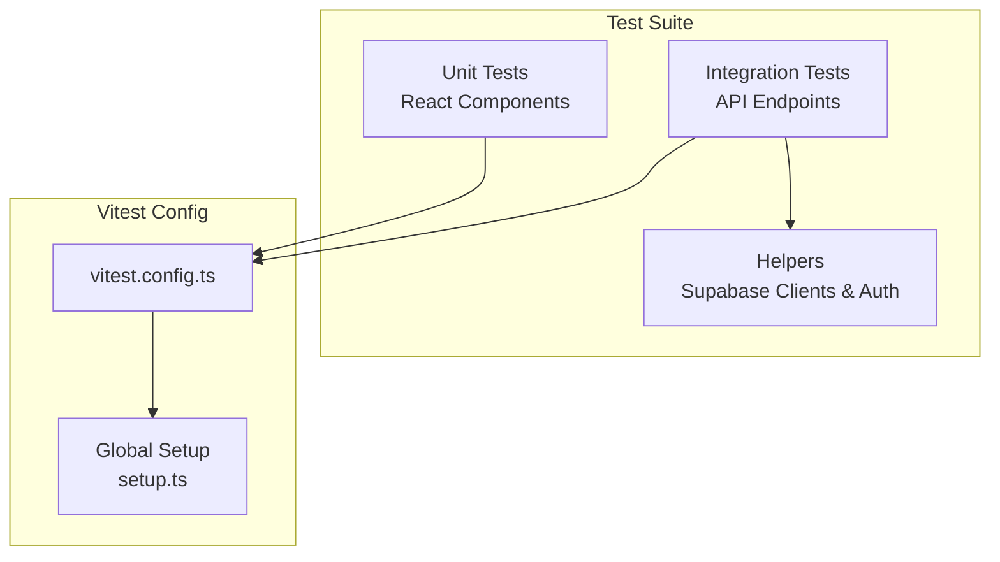
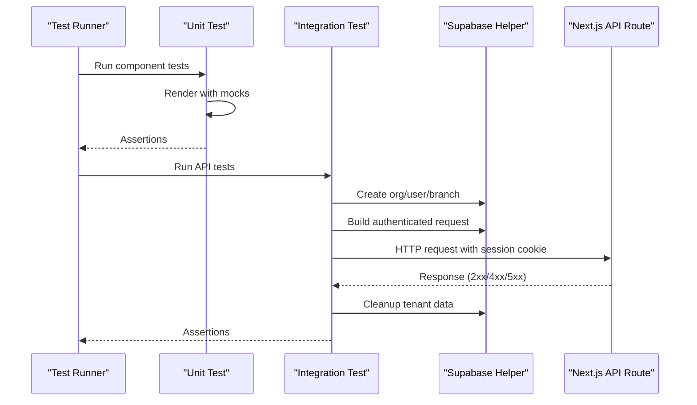
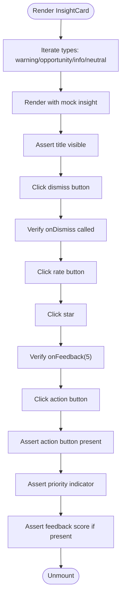
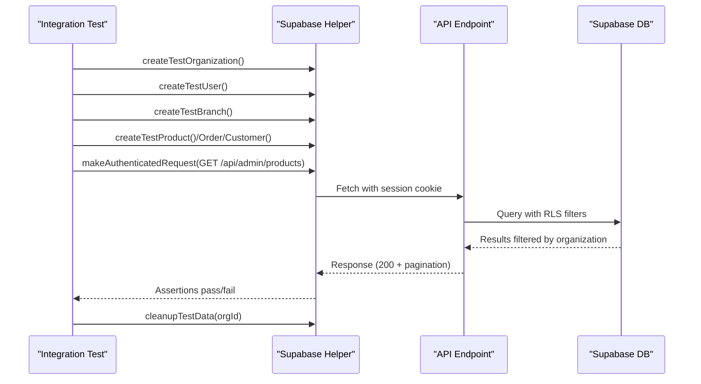
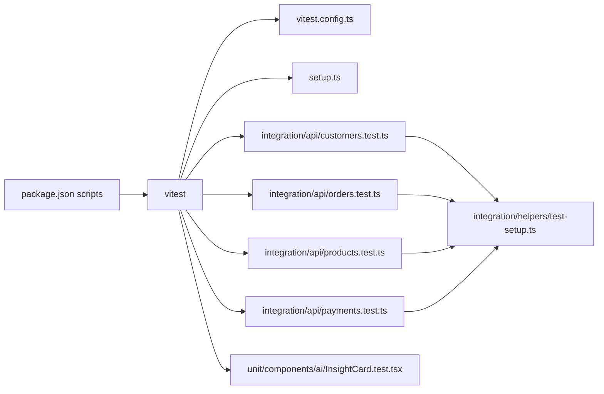

# Testing Strategy

<cite>
**Referenced Files in This Document**
- [vitest.config.ts](file://vitest.config.ts)
- [setup.ts](file://src/__tests__/setup.ts)
- [test-setup.ts](file://src/__tests__/integration/helpers/test-setup.ts)
- [customers.test.ts](file://src/__tests__/integration/api/customers.test.ts)
- [orders.test.ts](file://src/__tests__/integration/api/orders.test.ts)
- [products.test.ts](file://src/__tests__/integration/api/products.test.ts)
- [payments.test.ts](file://src/__tests__/integration/api/payments.test.ts)
- [InsightCard.test.tsx](file://src/__tests__/unit/components/ai/InsightCard.test.tsx)
- [package.json](file://package.json)
</cite>

## Table of Contents

1. [Introduction](#introduction)
2. [Project Structure](#project-structure)
3. [Core Components](#core-components)
4. [Architecture Overview](#architecture-overview)
5. [Detailed Component Analysis](#detailed-component-analysis)
6. [Dependency Analysis](#dependency-analysis)
7. [Performance Considerations](#performance-considerations)
8. [Troubleshooting Guide](#troubleshooting-guide)
9. [Conclusion](#conclusion)

## Introduction

This document defines the comprehensive testing strategy for Opttius, covering unit tests, integration tests, and API test coverage. It explains the Vitest configuration, test setup procedures, and testing patterns used across the application. It documents testing approaches for React components, API endpoints, database operations, and business logic, with concrete examples from the existing test suite. It also provides guidance for Next.js applications, TypeScript integration, asynchronous operations, test coverage requirements, mocking strategies, and continuous integration setup tailored to the multi-tenant architecture.

## Project Structure

The test suite is organized under a dedicated directory with clear separation of concerns:

- Unit tests: React components and utility logic
- Integration tests: API endpoints validated against a local Supabase instance
- Shared setup: Global mocks and helpers for authenticated requests and tenant isolation

**Diagram sources**

- [vitest.config.ts](file://vitest.config.ts#L1-L32)
- [setup.ts](file://src/__tests__/setup.ts#L1-L42)
- [test-setup.ts](file://src/__tests__/integration/helpers/test-setup.ts#L1-L577)

**Section sources**

- [vitest.config.ts](file://vitest.config.ts#L1-L32)
- [setup.ts](file://src/__tests__/setup.ts#L1-L42)

## Core Components

- Vitest configuration enables jsdom environment, TypeScript support, global setup, and coverage reporting.
- Global setup mocks Next.js router and window.matchMedia, and suppresses console errors if desired.
- Integration helpers provide Supabase service role clients, tenant-aware data factories, and authenticated request utilities.

Key capabilities:

- Multi-tenancy validation via organization/branch/user scaffolding
- Authenticated API requests emulating Supabase SSR cookie format
- Cleanup utilities to maintain test isolation

**Section sources**

- [vitest.config.ts](file://vitest.config.ts#L7-L26)
- [setup.ts](file://src/__tests__/setup.ts#L6-L34)
- [test-setup.ts](file://src/__tests__/integration/helpers/test-setup.ts#L14-L27)

## Architecture Overview

The testing architecture integrates three layers:

- Unit layer: Component tests using @testing-library/react with mocked Next.js router and matchMedia
- Integration layer: API tests that spin up tenant data and assert multi-tenancy isolation and validation
- Infrastructure layer: Supabase service role client and authenticated request builder

**Diagram sources**

- [InsightCard.test.tsx](file://src/__tests__/unit/components/ai/InsightCard.test.tsx#L1-L136)
- [customers.test.ts](file://src/__tests__/integration/api/customers.test.ts#L82-L177)
- [test-setup.ts](file://src/__tests__/integration/helpers/test-setup.ts#L483-L577)

## Detailed Component Analysis

### Vitest Configuration and Global Setup

- Environment: jsdom for DOM APIs
- Globals enabled for describe/it/etc.
- Setup file initializes mocks for Next.js router and matchMedia
- Coverage configured with v8 provider and HTML/text/json reporters
- Path aliases mapped for clean imports

Best practices:

- Keep global setup minimal and deterministic
- Use setupFiles per test group when needed for isolation
- Prefer explicit mocks over global ones for component tests

**Section sources**

- [vitest.config.ts](file://vitest.config.ts#L7-L26)
- [setup.ts](file://src/__tests__/setup.ts#L6-L34)

### Unit Testing: React Components

The component test suite demonstrates:

- Rendering variants for different insight types
- Event handling for dismissal and feedback
- Conditional rendering based on presence of action URLs
- Priority indicators and feedback scores

Recommended patterns:

- Use Testing Library’s getByRole/getByText for semantic queries
- Mock callbacks with vi.fn() and assert call counts
- Test conditional UI paths (presence/absence of action buttons)

**Diagram sources**

- [InsightCard.test.tsx](file://src/__tests__/unit/components/ai/InsightCard.test.tsx#L23-L134)

**Section sources**

- [InsightCard.test.tsx](file://src/__tests__/unit/components/ai/InsightCard.test.tsx#L1-L136)

### Integration Testing: API Endpoints with Supabase

The integration tests validate:

- Multi-tenancy data isolation across organizations and branches
- CRUD operations with proper status codes and payload structure
- Filtering and pagination behavior
- Validation rules for malformed inputs
- Payments API authentication and gateway validation

Key testing patterns:

- beforeAll creates tenant data and verifies multi-tenancy infrastructure
- makeAuthenticatedRequest builds session cookies matching Supabase SSR expectations
- afterAll cleans up test data to avoid cross-test contamination

**Diagram sources**

- [products.test.ts](file://src/__tests__/integration/api/products.test.ts#L39-L86)
- [orders.test.ts](file://src/__tests__/integration/api/orders.test.ts#L38-L83)
- [customers.test.ts](file://src/__tests__/integration/api/customers.test.ts#L38-L79)
- [test-setup.ts](file://src/__tests__/integration/helpers/test-setup.ts#L483-L577)

**Section sources**

- [products.test.ts](file://src/__tests__/integration/api/products.test.ts#L1-L463)
- [orders.test.ts](file://src/__tests__/integration/api/orders.test.ts#L1-L323)
- [customers.test.ts](file://src/__tests__/integration/api/customers.test.ts#L1-L325)
- [payments.test.ts](file://src/__tests__/integration/api/payments.test.ts#L1-L129)
- [test-setup.ts](file://src/__tests__/integration/helpers/test-setup.ts#L103-L132)

### Authentication and Tenant Isolation Utilities

The helper module centralizes:

- Supabase service role client creation
- Organization/user/branch/product/order/customer factories
- Branch access assignment for users
- Authenticated request builder that sets Supabase session cookies
- Cleanup routines to remove test data

Guidelines:

- Always pair cleanupTestData with created organizations
- Use assignTestUserBranchAccess to simulate granular permissions
- Prefer service role client for deterministic writes during tests

**Section sources**

- [test-setup.ts](file://src/__tests__/integration/helpers/test-setup.ts#L14-L27)
- [test-setup.ts](file://src/__tests__/integration/helpers/test-setup.ts#L103-L214)
- [test-setup.ts](file://src/__tests__/integration/helpers/test-setup.ts#L252-L275)
- [test-setup.ts](file://src/__tests__/integration/helpers/test-setup.ts#L483-L577)

## Dependency Analysis

- Vitest orchestrates all tests with jsdom and TypeScript support
- Global setup depends on @testing-library/jest-dom and Vitest mocks
- Integration tests depend on Supabase JS client and local Supabase instance
- Package scripts expose test commands for development and CI

**Diagram sources**

- [package.json](file://package.json#L28-L32)
- [vitest.config.ts](file://vitest.config.ts#L1-L32)
- [setup.ts](file://src/__tests__/setup.ts#L1-L42)
- [customers.test.ts](file://src/__tests__/integration/api/customers.test.ts#L1-L325)
- [orders.test.ts](file://src/__tests__/integration/api/orders.test.ts#L1-L323)
- [products.test.ts](file://src/__tests__/integration/api/products.test.ts#L1-L463)
- [payments.test.ts](file://src/__tests__/integration/api/payments.test.ts#L1-L129)
- [InsightCard.test.tsx](file://src/__tests__/unit/components/ai/InsightCard.test.tsx#L1-L136)
- [test-setup.ts](file://src/__tests__/integration/helpers/test-setup.ts#L1-L577)

**Section sources**

- [package.json](file://package.json#L28-L32)
- [vitest.config.ts](file://vitest.config.ts#L1-L32)

## Performance Considerations

- Keep integration tests scoped and fast by reusing shared setup where possible
- Use lightweight factories and targeted cleanup to minimize DB churn
- Prefer GET requests for reads and batch operations where feasible
- Avoid unnecessary retries and timeouts in tests; rely on deterministic Supabase state

## Troubleshooting Guide

Common issues and resolutions:

- Multi-tenancy infrastructure unavailable: Tests skip gracefully with warnings; ensure Supabase migrations are applied and service role keys are configured
- Authentication failures: Verify session cookie format and Supabase project reference; ensure makeAuthenticatedRequest includes Authorization header fallback
- Coverage gaps: Confirm coverage excludes are appropriate and reporter targets are enabled
- Asynchronous operations: Use waitFor utilities for UI updates and network responses

Debugging tips:

- Add console logs inside integration tests to inspect response payloads
- Validate RLS policies by temporarily disabling them in test environments
- Use Vitest UI mode to inspect failing assertions interactively

**Section sources**

- [customers.test.ts](file://src/__tests__/integration/api/customers.test.ts#L42-L47)
- [orders.test.ts](file://src/__tests__/integration/api/orders.test.ts#L42-L47)
- [payments.test.ts](file://src/__tests__/integration/api/payments.test.ts#L28-L32)
- [test-setup.ts](file://src/__tests__/integration/helpers/test-setup.ts#L509-L576)

## Conclusion

Opttius employs a robust testing strategy combining unit and integration tests with a strong focus on multi-tenancy validation and API correctness. Vitest provides a modern, fast test runner with excellent TypeScript support, while global mocks and Supabase helpers enable reliable, isolated tests. By following the documented patterns—tenant scaffolding, authenticated request emulation, and comprehensive assertion coverage—the team can maintain high-quality, maintainable tests across the Next.js application.
