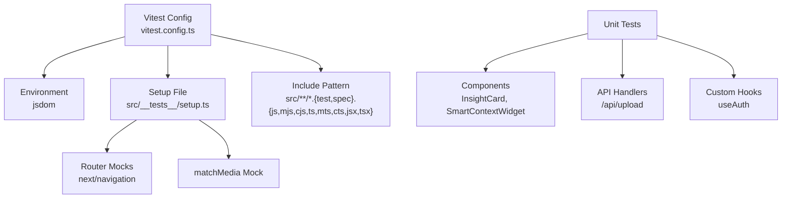
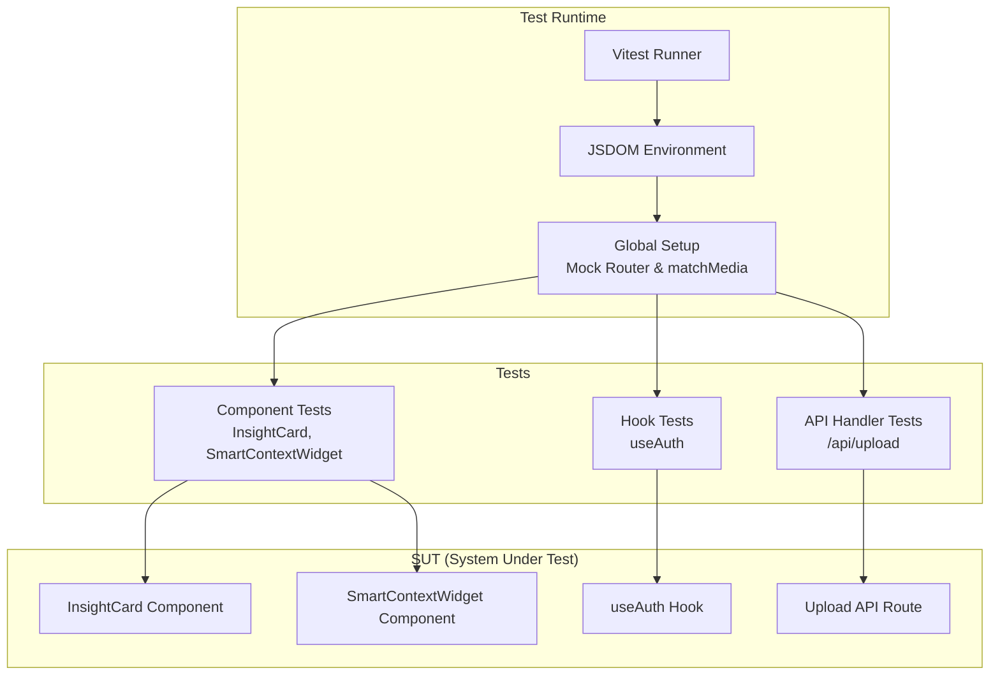
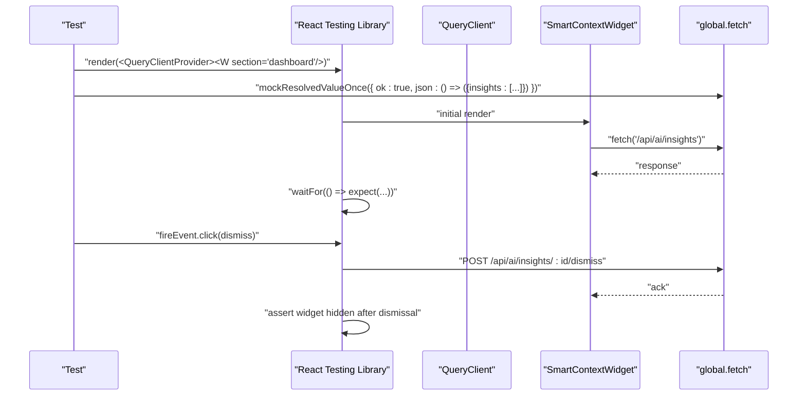
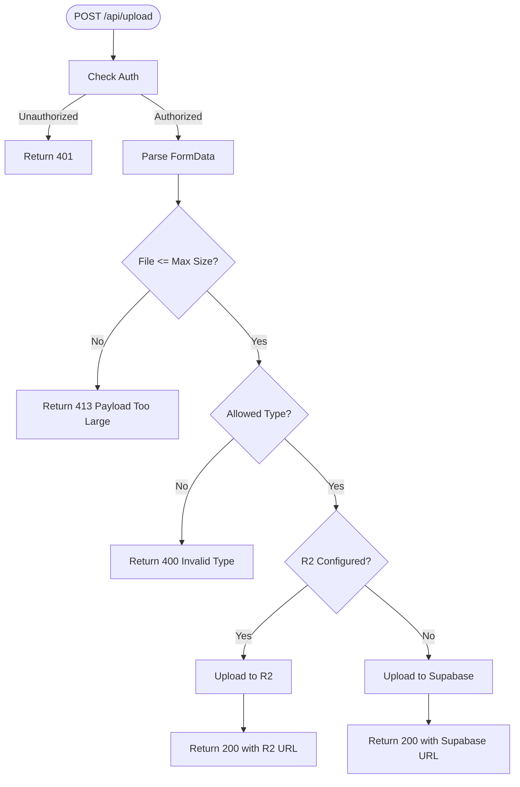
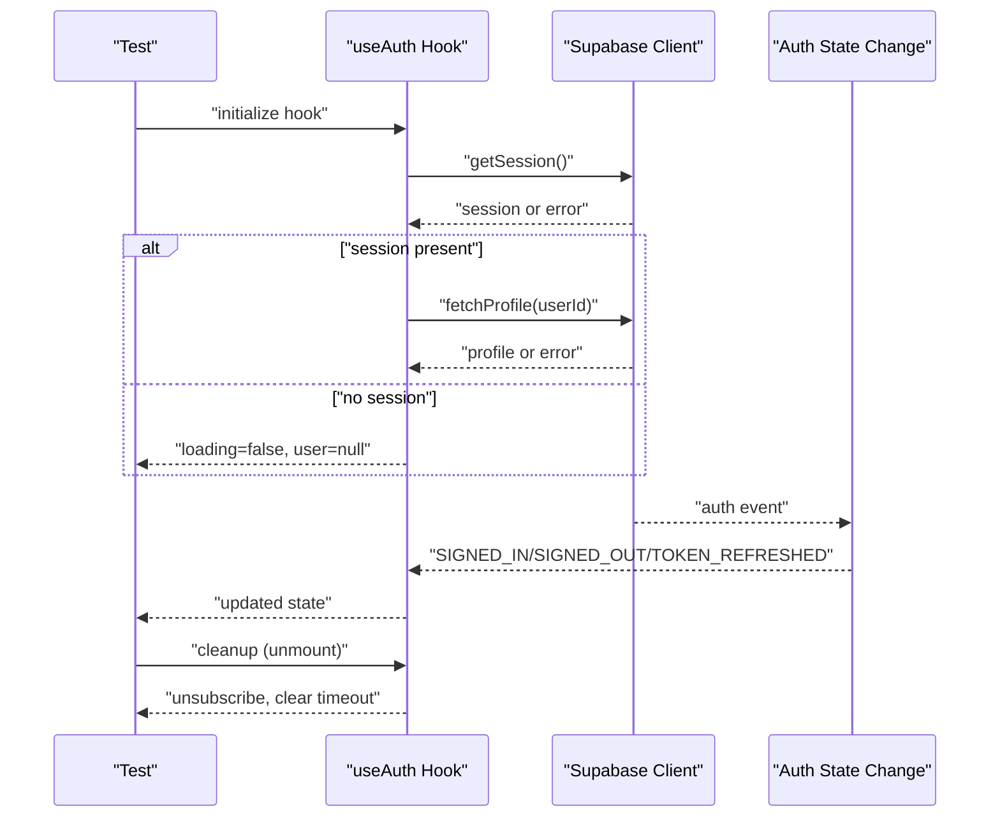
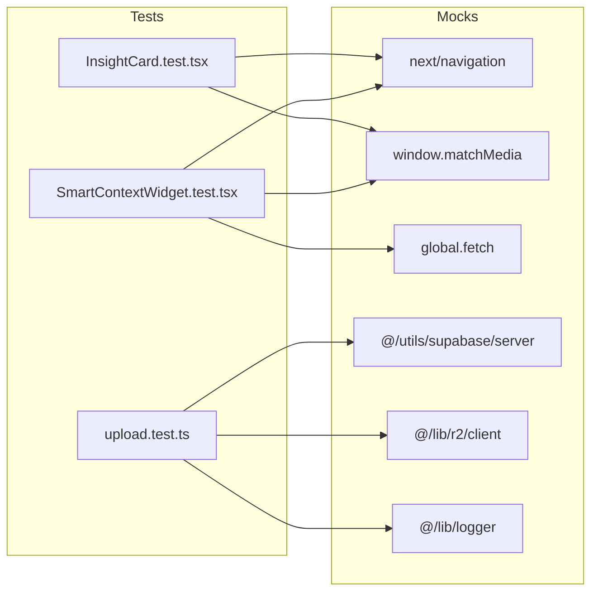

# Unit Testing

<cite>
**Referenced Files in This Document**
- [vitest.config.ts](file://vitest.config.ts)
- [src/__tests__/setup.ts](file://src/__tests__/setup.ts)
- [src/__tests__/unit/components/ai/InsightCard.test.tsx](file://src/__tests__/unit/components/ai/InsightCard.test.tsx)
- [src/__tests__/unit/components/ai/SmartContextWidget.test.tsx](file://src/__tests__/unit/components/ai/SmartContextWidget.test.tsx)
- [src/__tests__/unit/api/upload.test.ts](file://src/__tests__/unit/api/upload.test.ts)
- [src/hooks/useAuth.ts](file://src/hooks/useAuth.ts)
</cite>

## Table of Contents

1. [Introduction](#introduction)
2. [Project Structure](#project-structure)
3. [Core Components](#core-components)
4. [Architecture Overview](#architecture-overview)
5. [Detailed Component Analysis](#detailed-component-analysis)
6. [Dependency Analysis](#dependency-analysis)
7. [Performance Considerations](#performance-considerations)
8. [Troubleshooting Guide](#troubleshooting-guide)
9. [Conclusion](#conclusion)
10. [Appendices](#appendices)

## Introduction

This document explains how to write effective unit tests for this project using Vitest and React Testing Library. It covers:

- Individual component testing with React Testing Library
- Mocking component dependencies and external integrations
- Isolated behavior validation for custom hooks and business logic
- Utility and library function validation
- Async operations, TypeScript interfaces, and error handling
- Test organization, naming conventions, and isolation strategies

## Project Structure

The project uses Vitest with JSDOM for DOM APIs, a global setup file for mocks, and a strict include pattern to discover tests. Tests are organized under src/**tests** with subfolders for unit and integration tests.

**Diagram sources**

- [vitest.config.ts](file://vitest.config.ts#L1-L32)
- [src/**tests**/setup.ts](file://src/__tests__/setup.ts#L1-L42)

**Section sources**

- [vitest.config.ts](file://vitest.config.ts#L1-L32)
- [src/**tests**/setup.ts](file://src/__tests__/setup.ts#L1-L42)

## Core Components

- Test runner and environment: Vitest with jsdom environment and global setup.
- Global mocks: Router mocks for Next.js and matchMedia polyfill.
- Test discovery: Glob pattern includes all TypeScript/TypeScript JSX files under src.
- Coverage: V8 provider with selective exclusion of types, configs, and test scaffolding.

Key behaviors validated in the existing unit tests:

- Rendering variants and user interactions for AI Insight components
- Async data fetching and error handling for AI widget
- API route validation for file upload with Supabase and R2 fallback
- Hook state transitions and lifecycle events

**Section sources**

- [vitest.config.ts](file://vitest.config.ts#L7-L12)
- [src/**tests**/setup.ts](file://src/__tests__/setup.ts#L6-L34)

## Architecture Overview

The unit testing architecture centers around isolated tests that:

- Render components under test with minimal providers
- Mock external dependencies (router, storage, network)
- Assert UI behavior and state transitions
- Validate API handlers and hook logic without side effects

**Diagram sources**

- [vitest.config.ts](file://vitest.config.ts#L7-L12)
- [src/**tests**/setup.ts](file://src/__tests__/setup.ts#L6-L34)
- [src/**tests**/unit/components/ai/InsightCard.test.tsx](file://src/__tests__/unit/components/ai/InsightCard.test.tsx#L1-L136)
- [src/**tests**/unit/components/ai/SmartContextWidget.test.tsx](file://src/__tests__/unit/components/ai/SmartContextWidget.test.tsx#L1-L205)
- [src/**tests**/unit/api/upload.test.ts](file://src/__tests__/unit/api/upload.test.ts#L1-L176)
- [src/hooks/useAuth.ts](file://src/hooks/useAuth.ts#L1-L377)

## Detailed Component Analysis

### Component Testing with React Testing Library

This section demonstrates how to test React components in isolation, simulate user interactions, and assert behavior.

- Rendering variants and user interactions
  - Example: Rendering different insight types and verifying presence of text and actions.
  - Example: Clicking dismiss and feedback controls and asserting callbacks are invoked.
  - Example: Verifying conditional rendering based on missing action URLs.

- Async rendering and error handling
  - Example: Simulating long-running fetch and asserting loading indicators.
  - Example: Handling empty insight lists and ensuring the widget does not render.
  - Example: Handling HTTP errors and ensuring graceful no-render behavior.

- Mocking external dependencies
  - Example: Using a QueryClient with disabled retries to stabilize async tests.
  - Example: Mocking global fetch to control API responses and verify requests.

**Diagram sources**

- [src/**tests**/unit/components/ai/SmartContextWidget.test.tsx](file://src/__tests__/unit/components/ai/SmartContextWidget.test.tsx#L31-L97)
- [src/**tests**/unit/components/ai/SmartContextWidget.test.tsx](file://src/__tests__/unit/components/ai/SmartContextWidget.test.tsx#L99-L146)

**Section sources**

- [src/**tests**/unit/components/ai/InsightCard.test.tsx](file://src/__tests__/unit/components/ai/InsightCard.test.tsx#L23-L135)
- [src/**tests**/unit/components/ai/SmartContextWidget.test.tsx](file://src/__tests__/unit/components/ai/SmartContextWidget.test.tsx#L19-L97)
- [src/**tests**/unit/components/ai/SmartContextWidget.test.tsx](file://src/__tests__/unit/components/ai/SmartContextWidget.test.tsx#L99-L203)

### API Handler Validation

This section focuses on validating server-side routes in isolation, including authentication checks, input validation, and storage fallback logic.

- Authentication and input validation
  - Example: Returning unauthorized for missing auth.
  - Example: Returning bad request for missing or invalid file types.
  - Example: Returning payload too large for oversized files.

- Storage integration and fallback
  - Example: Uploading via R2 when configured and verifying response and client invocation.
  - Example: Falling back to Supabase storage when R2 is not configured and verifying URL construction.

**Diagram sources**

- [src/**tests**/unit/api/upload.test.ts](file://src/__tests__/unit/api/upload.test.ts#L62-L174)

**Section sources**

- [src/**tests**/unit/api/upload.test.ts](file://src/__tests__/unit/api/upload.test.ts#L62-L174)

### Custom Hooks Testing Patterns

Testing custom hooks requires isolating side effects and mocking external clients. The useAuth hook demonstrates:

- Initial session retrieval and profile fetch with timeouts and error handling
- Auth state change subscriptions and cleanup
- Sign-up, sign-in, sign-out, profile updates, and password reset flows

Recommended patterns:

- Mock the Supabase client factory to return deterministic responses.
- Use fake timers if applicable to test timeouts.
- Assert state transitions and error handling paths.
- Verify cleanup of subscriptions and timeouts on unmount.

**Diagram sources**

- [src/hooks/useAuth.ts](file://src/hooks/useAuth.ts#L27-L130)

**Section sources**

- [src/hooks/useAuth.ts](file://src/hooks/useAuth.ts#L18-L377)

### Utility and Library Function Validation

Guidance for validating utility and library functions:

- Keep utilities pure when possible; isolate impure parts (e.g., network, storage) behind injectable dependencies or factories.
- Mock external libraries (e.g., AWS SDK clients) to control behavior and assert invocations.
- Validate TypeScript interfaces by passing strongly typed inputs and asserting outputs meet expected shapes.
- For async utilities, use promises and controlled mocks to simulate success/failure paths.

[No sources needed since this section provides general guidance]

### TypeScript Interfaces and Strictness

- Use strongly typed props and return values in tests to catch interface mismatches early.
- Leverage type inference from React Testing Library helpers to ensure assertions align with component contracts.
- When mocking, maintain type fidelity to avoid silent failures.

[No sources needed since this section provides general guidance]

### Async Operations and Error Handling

- Use waitFor and async helpers to assert UI updates after async operations settle.
- Mock asynchronous resources (fetch, storage) to simulate various outcomes (success, network error, timeout).
- Assert error boundaries and graceful fallbacks (e.g., empty renders on failure).

**Section sources**

- [src/**tests**/unit/components/ai/SmartContextWidget.test.tsx](file://src/__tests__/unit/components/ai/SmartContextWidget.test.tsx#L19-L97)
- [src/**tests**/unit/components/ai/SmartContextWidget.test.tsx](file://src/__tests__/unit/components/ai/SmartContextWidget.test.tsx#L99-L203)

## Dependency Analysis

This section maps test dependencies and how they are mocked to maintain isolation.

**Diagram sources**

- [src/**tests**/setup.ts](file://src/__tests__/setup.ts#L6-L34)
- [src/**tests**/unit/components/ai/SmartContextWidget.test.tsx](file://src/__tests__/unit/components/ai/SmartContextWidget.test.tsx#L19-L97)
- [src/**tests**/unit/api/upload.test.ts](file://src/__tests__/unit/api/upload.test.ts#L8-L32)

**Section sources**

- [src/**tests**/setup.ts](file://src/__tests__/setup.ts#L6-L34)
- [src/**tests**/unit/components/ai/SmartContextWidget.test.tsx](file://src/__tests__/unit/components/ai/SmartContextWidget.test.tsx#L19-L97)
- [src/**tests**/unit/api/upload.test.ts](file://src/__tests__/unit/api/upload.test.ts#L8-L32)

## Performance Considerations

- Prefer deterministic mocks over real network calls to keep tests fast and reliable.
- Disable retries for external clients in tests to avoid flakiness.
- Use minimal providers (e.g., QueryClient with defaultOptions) to reduce overhead.
- Keep test suites focused and avoid unnecessary re-renders.

[No sources needed since this section provides general guidance]

## Troubleshooting Guide

Common issues and resolutions:

- Router-related errors: Ensure next/navigation is mocked globally via setup.
- matchMedia errors: Confirm the matchMedia polyfill is applied in setup.
- Stale state in async tests: Use QueryClient with retry disabled and waitFor assertions.
- External client failures: Mock factories (e.g., Supabase, R2) and assert invocation counts and arguments.
- Timeout warnings: Adjust timeouts in tests or increase tolerance in the hook under test.

**Section sources**

- [src/**tests**/setup.ts](file://src/__tests__/setup.ts#L6-L34)
- [src/**tests**/unit/components/ai/SmartContextWidget.test.tsx](file://src/__tests__/unit/components/ai/SmartContextWidget.test.tsx#L9-L17)
- [src/hooks/useAuth.ts](file://src/hooks/useAuth.ts#L31-L37)

## Conclusion

This guide outlined practical patterns for unit testing in this project:

- Use React Testing Library to render components in isolation
- Mock Next.js router and browser APIs globally
- Validate component behavior for rendering, interactions, and async flows
- Test API handlers with realistic inputs and storage fallbacks
- Validate custom hooks with deterministic state transitions and cleanup
- Maintain test isolation and reliability through targeted mocks and controlled environments

## Appendices

### Test Organization and Naming Conventions

- Place unit tests alongside source files under src/**tests**/unit with appropriate subfolders (components, hooks, api, lib).
- Name test files with a .test.ts or .test.tsx suffix and use descriptive describe blocks.
- Group related tests with it(...) statements that read like specifications.
- Keep tests self-contained; avoid cross-test dependencies.

[No sources needed since this section provides general guidance]
