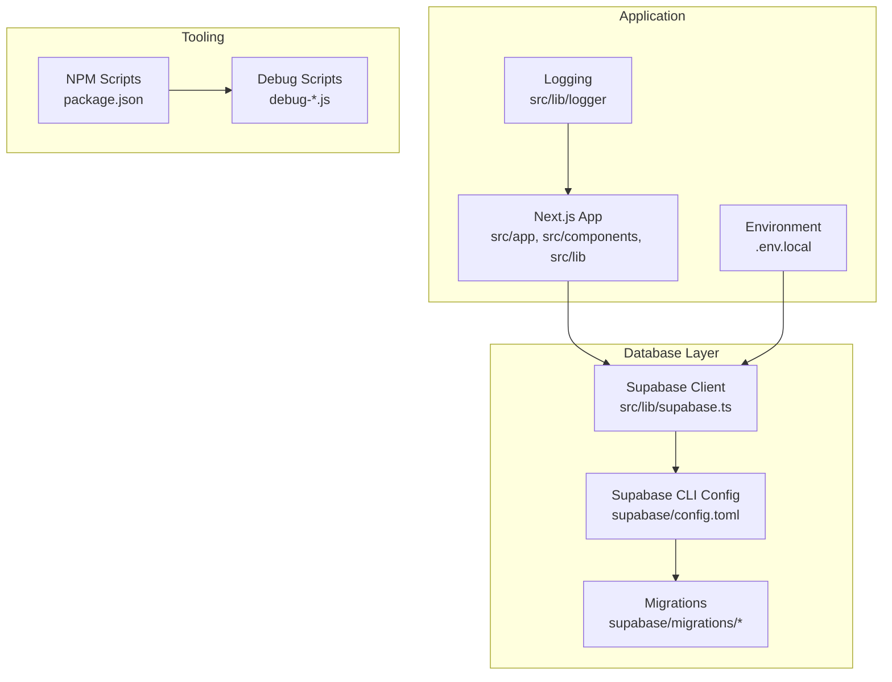
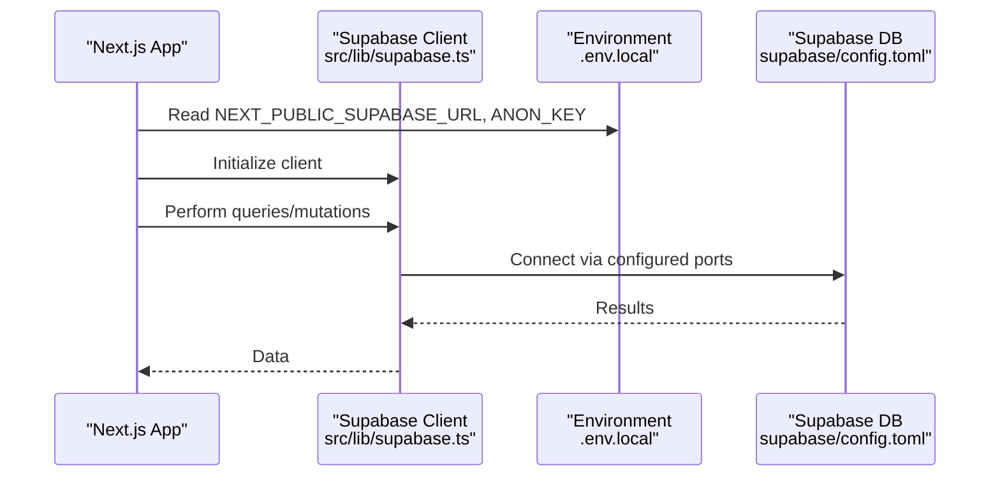
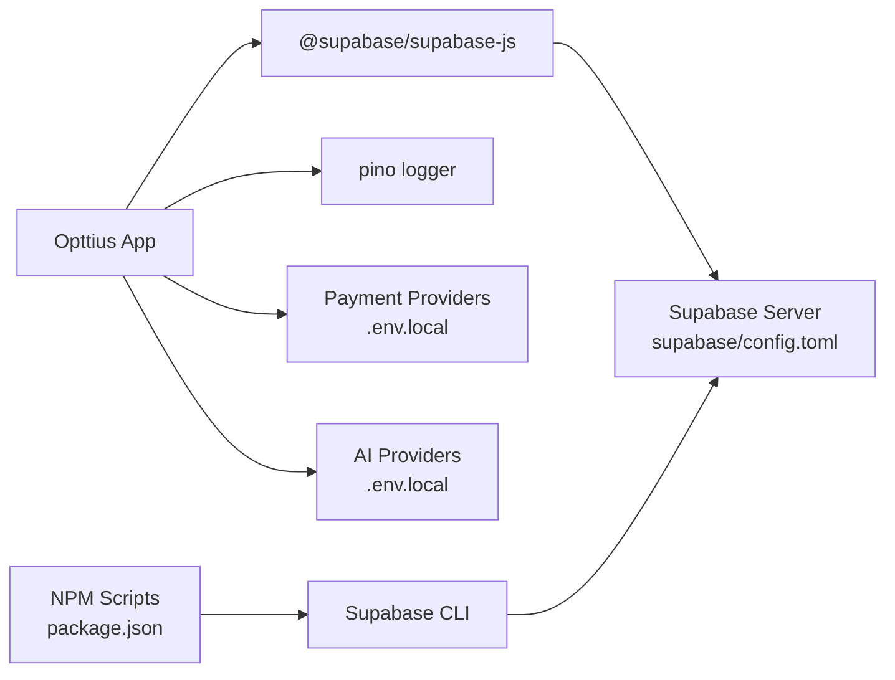

# Troubleshooting & FAQ

<cite>
**Referenced Files in This Document**
- [README.md](file://README.md)
- [SETUP_GUIDE.md](file://SETUP_GUIDE.md)
- [.env.local](file://.env.local)
- [package.json](file://package.json)
- [supabase/config.toml](file://supabase/config.toml)
- [src/lib/supabase.ts](file://src/lib/supabase.ts)
- [src/lib/logger/index.ts](file://src/lib/logger/index.ts)
- [debug-gateways.js](file://debug-gateways.js)
- [debug-policies.js](file://debug-policies.js)
- [debug-prescriptions.js](file://debug-prescriptions.js)
</cite>

## Table of Contents

1. [Introduction](#introduction)
2. [Project Structure](#project-structure)
3. [Core Components](#core-components)
4. [Architecture Overview](#architecture-overview)
5. [Detailed Component Analysis](#detailed-component-analysis)
6. [Dependency Analysis](#dependency-analysis)
7. [Performance Considerations](#performance-considerations)
8. [Troubleshooting Guide](#troubleshooting-guide)
9. [Conclusion](#conclusion)
10. [Appendices](#appendices)

## Introduction

This document provides a comprehensive troubleshooting and FAQ guide for Opttius, focusing on diagnosing and resolving common issues in development and production environments. It covers database connectivity, authentication failures, payment gateway problems, performance bottlenecks, Supabase container and port conflicts, migration failures, build errors, and operational FAQs around optical workflows, multi-tenancy, AI integration, and payment processing. It also includes step-by-step diagnostics, log analysis guidance, escalation paths, preventive measures, monitoring recommendations, and community resources.

## Project Structure

Opttius is a Next.js 14 application with TypeScript and Supabase. The repository includes:

- Application code under src/
- Supabase configuration and migrations under supabase/
- Scripts for administration and debugging under scripts/ and root-level npm scripts
- Environment configuration in .env.local and package.json scripts
- Logging utilities under src/lib/logger/

**Diagram sources**

- [src/lib/supabase.ts](file://src/lib/supabase.ts#L1-L36)
- [supabase/config.toml](file://supabase/config.toml#L1-L345)
- [package.json](file://package.json#L5-L35)
- [src/lib/logger/index.ts](file://src/lib/logger/index.ts#L1-L111)

**Section sources**

- [README.md](file://README.md#L283-L331)
- [SETUP_GUIDE.md](file://SETUP_GUIDE.md#L400-L443)

## Core Components

- Supabase client initialization and service role client creation for server-side operations
- Environment-driven configuration for Supabase, payment providers, AI providers, and cloud storage
- Structured logging with pino for development and production
- NPM scripts for Supabase lifecycle and admin tasks
- Debugging utilities for gateways, policies, and table schemas

Key implementation references:

- Supabase client initialization and validation
- Service role client factory
- Environment variables for Supabase and optional providers
- Logging interface and transport configuration
- NPM scripts for Supabase operations and admin tasks
- Debug scripts for payment gateways, policies, and prescriptions

**Section sources**

- [src/lib/supabase.ts](file://src/lib/supabase.ts#L1-L36)
- [.env.local](file://.env.local#L1-L116)
- [src/lib/logger/index.ts](file://src/lib/logger/index.ts#L1-L111)
- [package.json](file://package.json#L5-L35)
- [debug-gateways.js](file://debug-gateways.js#L1-L20)
- [debug-policies.js](file://debug-policies.js#L1-L24)
- [debug-prescriptions.js](file://debug-prescriptions.js#L1-L20)

## Architecture Overview

The application relies on Supabase for authentication, real-time, storage, and database operations. The Supabase client is initialized from environment variables and used across the app. Server-side operations use a service role client. Payment gateways and AI providers are configured via environment variables. Logging is centralized for observability.

**Diagram sources**

- [src/lib/supabase.ts](file://src/lib/supabase.ts#L1-L36)
- [.env.local](file://.env.local#L8-L11)
- [supabase/config.toml](file://supabase/config.toml#L7-L31)

## Detailed Component Analysis

### Supabase Connectivity Diagnostics

Common symptoms:

- Application fails to connect to Supabase
- Authentication or authorization errors
- Migrations fail or hang
- Port conflicts preventing startup

Diagnostic steps:

- Verify Supabase is running and ports are free
- Confirm environment variables are set correctly
- Check Supabase status and credentials
- Validate client initialization and service role key presence
- Inspect Supabase configuration TOML for port overrides

Resolution actions:

- Restart Supabase if needed
- Change ports in config.toml if conflicts exist
- Re-apply migrations using reset script
- Ensure environment variables match Supabase status output

**Section sources**

- [README.md](file://README.md#L443-L490)
- [SETUP_GUIDE.md](file://SETUP_GUIDE.md#L446-L488)
- [src/lib/supabase.ts](file://src/lib/supabase.ts#L7-L9)
- [supabase/config.toml](file://supabase/config.toml#L45-L98)
- [.env.local](file://.env.local#L8-L11)

### Authentication Failures

Symptoms:

- Cannot access admin panel
- Users cannot log in or register
- Admin privileges not recognized

Diagnostic steps:

- Confirm user exists in admin_users table
- Verify membership tier and admin status
- Check Supabase Auth configuration and site URL
- Validate environment variables for auth

Resolution actions:

- Grant admin access using SQL or admin creation scripts
- Adjust auth settings in config.toml if needed
- Ensure site_url matches application URL

**Section sources**

- [README.md](file://README.md#L492-L503)
- [SETUP_GUIDE.md](file://SETUP_GUIDE.md#L470-L477)
- [supabase/config.toml](file://supabase/config.toml#L128-L153)

### Payment Gateway Problems

Symptoms:

- Payment intents failing
- Webhooks not processed
- Gateway configuration missing

Diagnostic steps:

- Use debug script to list payment gateways configuration
- Verify gateway-specific environment variables
- Check webhook secrets and sandbox mode
- Validate gateway RPCs and tables

Resolution actions:

- Populate payment gateways config via admin UI or scripts
- Set correct API keys and secrets
- Align webhook URLs with Supabase project settings
- Toggle sandbox mode for testing

**Section sources**

- [debug-gateways.js](file://debug-gateways.js#L1-L20)
- [.env.local](file://.env.local#L13-L17)
- [.env.local](file://.env.local#L99-L104)

### Performance Bottlenecks

Symptoms:

- Slow page loads
- Database query slowness
- High memory usage

Diagnostic steps:

- Monitor Next.js build and runtime logs
- Use pino logs for performance insights
- Check Supabase Analytics and query patterns
- Review Tailwind and asset sizes

Resolution actions:

- Optimize queries and add indexes as needed
- Enable caching and CDN for assets
- Reduce unnecessary re-renders
- Tune Supabase configuration for workload

**Section sources**

- [src/lib/logger/index.ts](file://src/lib/logger/index.ts#L1-L111)
- [supabase/config.toml](file://supabase/config.toml#L327-L332)

### Supabase Container Issues

Symptoms:

- Containers fail to start
- Ports already in use
- Storage bucket warnings

Diagnostic steps:

- Check Docker status and resource availability
- Verify ports in config.toml
- Review storage bucket directories
- Inspect Supabase status output

Resolution actions:

- Free conflicting ports or change them in config.toml
- Create storage directories as suggested
- Restart Supabase cleanly

**Section sources**

- [README.md](file://README.md#L445-L470)
- [SETUP_GUIDE.md](file://SETUP_GUIDE.md#L448-L468)
- [supabase/config.toml](file://supabase/config.toml#L45-L127)

### Migration Failures

Symptoms:

- Migrations stuck or failing
- Schema inconsistencies
- Policy errors

Diagnostic steps:

- Use reset script to re-apply migrations
- Inspect migration order and dependencies
- Check policy functions and triggers
- Validate RLS policies

Resolution actions:

- Run reset script to clean and re-apply
- Fix failing migration scripts
- Recreate policies and triggers if needed

**Section sources**

- [README.md](file://README.md#L471-L477)
- [SETUP_GUIDE.md](file://SETUP_GUIDE.md#L463-L468)

### Build Errors

Symptoms:

- Compilation failures
- Type errors
- Cache corruption

Diagnostic steps:

- Clear Next.js cache
- Reinstall dependencies
- Run type checks and linting

Resolution actions:

- Clean cache and reinstall dependencies
- Fix TypeScript errors
- Resolve linting issues

**Section sources**

- [README.md](file://README.md#L478-L490)
- [SETUP_GUIDE.md](file://SETUP_GUIDE.md#L478-L487)

### Optical Business Workflows

Common questions:

- How are prescriptions managed?
- How do I handle lab work orders?
- How do I manage POS sales?

Diagnostic steps:

- Verify prescriptions table structure
- Check lab work order statuses and history
- Validate POS settings and sessions

Resolution actions:

- Use debug scripts to inspect table schemas
- Ensure proper status transitions
- Configure POS settings appropriately

**Section sources**

- [debug-prescriptions.js](file://debug-prescriptions.js#L1-L20)
- [supabase/config.toml](file://supabase/config.toml#L7-L31)

### Multi-Tenant Configuration

Common questions:

- How do I configure organizations and branches?
- How do I enforce row-level security across tenants?

Diagnostic steps:

- Check organization and branch tables
- Verify RLS policies for multi-tenancy
- Validate user access per organization

Resolution actions:

- Seed demo organization if needed
- Ensure RLS policies are applied
- Assign users to appropriate organizations

**Section sources**

- [.env.local](file://.env.local#L77-L82)
- [supabase/config.toml](file://supabase/config.toml#L48-L60)

### AI Integration

Common questions:

- How do I configure AI providers?
- How do I troubleshoot AI agent issues?

Diagnostic steps:

- Verify AI provider environment variables
- Check default provider and fallbacks
- Validate model selection and base URLs

Resolution actions:

- Set correct API keys and base URLs
- Choose a primary provider and configure fallbacks
- Test provider connectivity

**Section sources**

- [.env.local](file://.env.local#L38-L74)

### Payment Processing

Common questions:

- How do I configure Mercado Pago?
- How do I configure NowPayments?
- How do I test payment webhooks?

Diagnostic steps:

- Verify gateway credentials and secrets
- Check webhook URLs and signatures
- Validate sandbox vs production modes

Resolution actions:

- Set correct access tokens and secrets
- Configure webhook endpoints
- Toggle sandbox mode for testing

**Section sources**

- [.env.local](file://.env.local#L13-L17)
- [.env.local](file://.env.local#L99-L104)

## Dependency Analysis

The application depends on Supabase for backend services, payment providers for transactions, and AI providers for intelligent operations. The Supabase client is configured via environment variables and validated at runtime. NPM scripts orchestrate Supabase lifecycle and administrative tasks.

**Diagram sources**

- [src/lib/supabase.ts](file://src/lib/supabase.ts#L1-L36)
- [src/lib/logger/index.ts](file://src/lib/logger/index.ts#L1-L111)
- [.env.local](file://.env.local#L13-L104)
- [package.json](file://package.json#L5-L35)
- [supabase/config.toml](file://supabase/config.toml#L1-L345)

**Section sources**

- [package.json](file://package.json#L5-L35)
- [src/lib/supabase.ts](file://src/lib/supabase.ts#L1-L36)
- [src/lib/logger/index.ts](file://src/lib/logger/index.ts#L1-L111)
- [.env.local](file://.env.local#L1-L116)

## Performance Considerations

- Use pino structured logging for efficient log aggregation
- Minimize heavy computations on the client; leverage Supabase RLS and edge runtime
- Optimize database queries and add indexes as needed
- Monitor Supabase Analytics for query performance
- Keep Supabase and dependencies updated

[No sources needed since this section provides general guidance]

## Troubleshooting Guide

### Step-by-Step Diagnostic Procedures

- Database connectivity
  - Confirm Supabase is running and accessible
  - Verify environment variables match Supabase status output
  - Check port configuration and conflicts
- Authentication
  - Validate user exists and has admin access
  - Confirm Supabase Auth settings and site URL
- Payment gateways
  - List configured gateways and verify credentials
  - Check webhook secrets and sandbox mode
- Performance
  - Review pino logs for errors and warnings
  - Monitor Next.js build and runtime logs
  - Inspect Supabase Analytics for slow queries

### Log Analysis Guidance

- Use pino logs for structured logging
- Filter by level (debug/info/warn/error)
- Include contextual data for correlation
- In development, logs are JSON; pipe to pino-pretty if desired

### Escalation Paths

- For persistent issues, open a GitHub issue with logs and reproduction steps
- Include environment details, Supabase status, and steps taken

**Section sources**

- [src/lib/logger/index.ts](file://src/lib/logger/index.ts#L1-L111)
- [README.md](file://README.md#L602-L609)

## Conclusion

This guide provides a systematic approach to diagnosing and resolving common Opttius issues across development and production. By following the diagnostic procedures, leveraging logging, and applying the recommended resolutions, most problems can be quickly identified and fixed. For complex issues, escalate with detailed logs and environment information.

[No sources needed since this section summarizes without analyzing specific files]

## Appendices

### Preventive Measures and Maintenance Best Practices

- Regularly back up Supabase data and configurations
- Keep environment variables secure and updated
- Monitor logs and metrics continuously
- Apply migrations carefully and test in staging
- Maintain dependency versions and run type checks

[No sources needed since this section provides general guidance]

### Community Resources, Support Channels, and Contribution Guidelines

- GitHub repository for issues and contributions
- Follow contribution workflow: fork, branch, commit, push, PR

**Section sources**

- [README.md](file://README.md#L557-L568)
