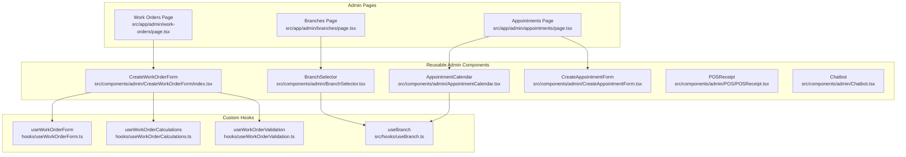
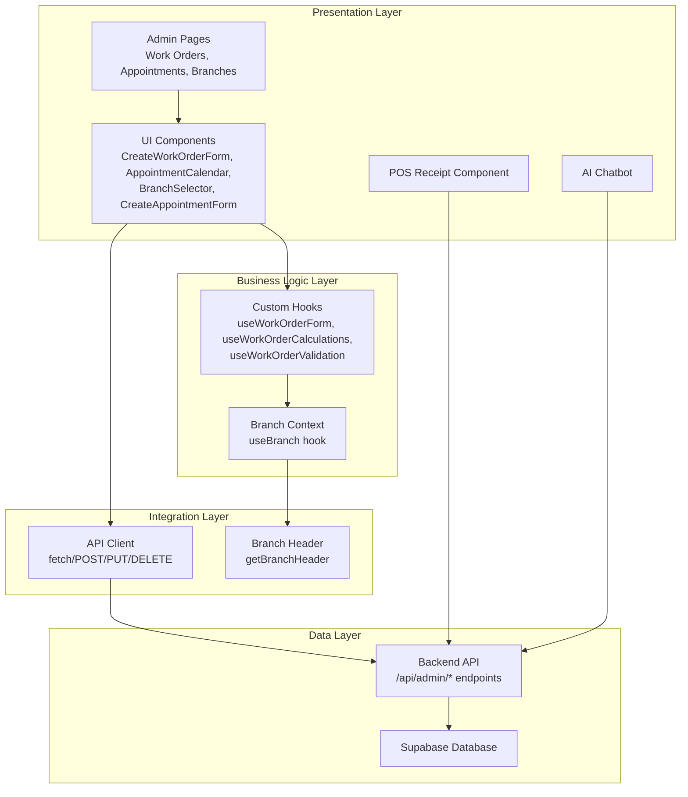
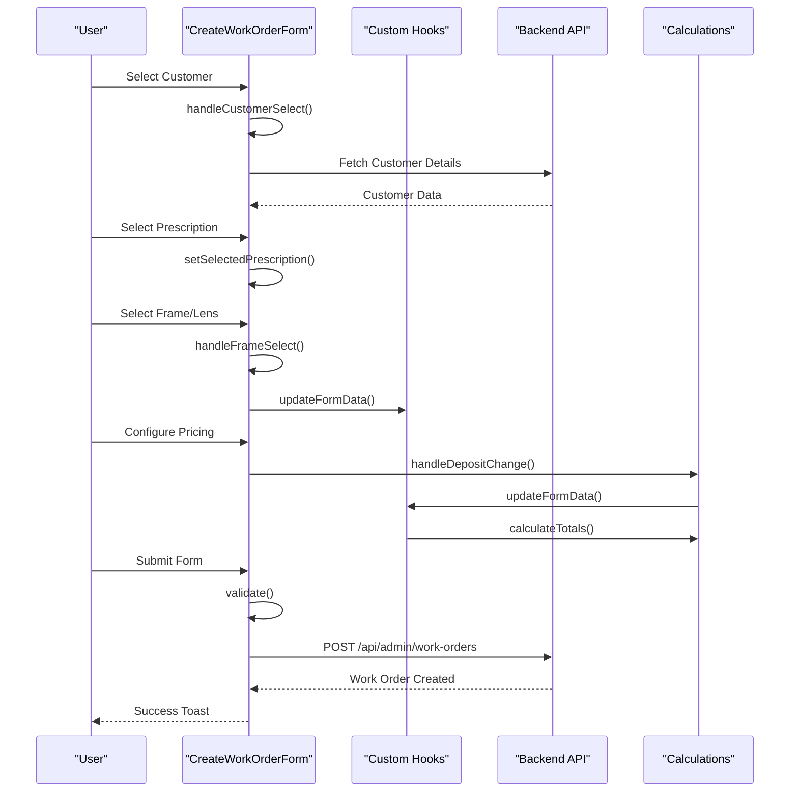
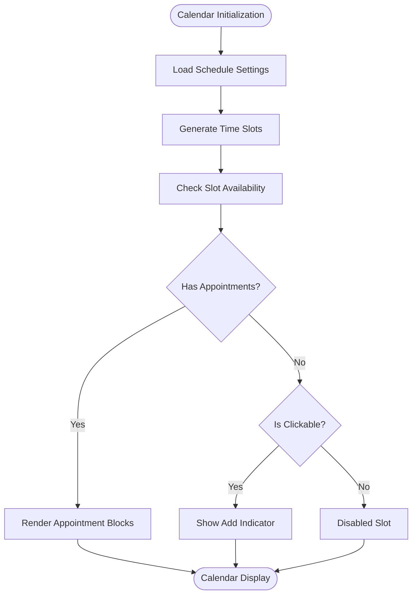
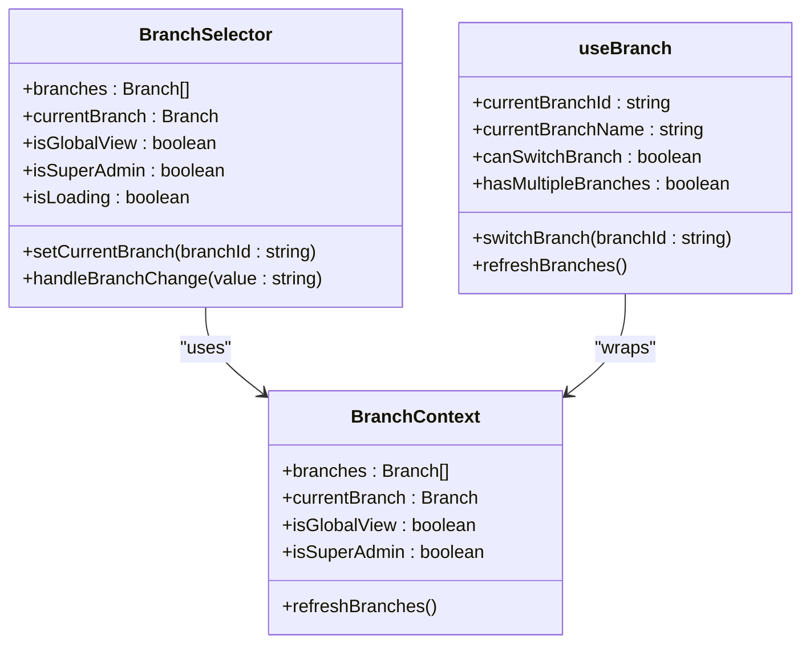
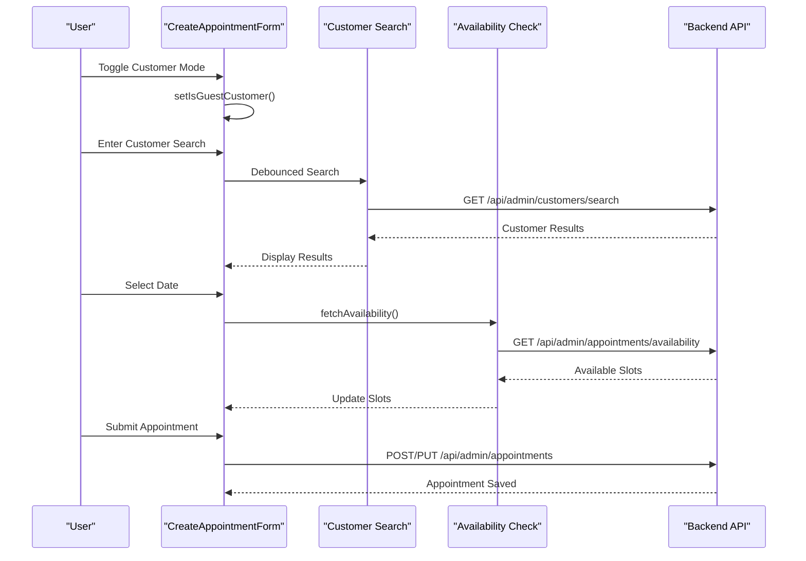
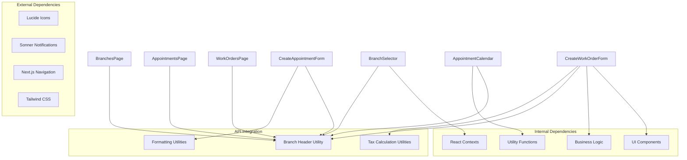

# Admin Interface Components

<cite>
**Referenced Files in This Document**
- [CreateWorkOrderForm/index.tsx](file://src/components/admin/CreateWorkOrderForm/index.tsx)
- [CreateWorkOrderForm/hooks/useWorkOrderForm.ts](file://src/components/admin/CreateWorkOrderForm/hooks/useWorkOrderForm.ts)
- [CreateWorkOrderForm/hooks/useWorkOrderCalculations.ts](file://src/components/admin/CreateWorkOrderForm/hooks/useWorkOrderCalculations.ts)
- [CreateWorkOrderForm/hooks/useWorkOrderValidation.ts](file://src/components/admin/CreateWorkOrderForm/hooks/useWorkOrderValidation.ts)
- [AppointmentCalendar.tsx](file://src/components/admin/AppointmentCalendar.tsx)
- [BranchSelector.tsx](file://src/components/admin/BranchSelector.tsx)
- [CreateAppointmentForm.tsx](file://src/components/admin/CreateAppointmentForm.tsx)
- [work-orders/page.tsx](file://src/app/admin/work-orders/page.tsx)
- [appointments/page.tsx](file://src/app/admin/appointments/page.tsx)
- [branches/page.tsx](file://src/app/admin/branches/page.tsx)
- [POSReceipt.tsx](file://src/components/admin/POS/POSReceipt.tsx)
- [useBranch.ts](file://src/hooks/useBranch.ts)
- [Chatbot.tsx](file://src/components/admin/Chatbot.tsx)
</cite>

## Table of Contents

1. [Introduction](#introduction)
2. [Project Structure](#project-structure)
3. [Core Components](#core-components)
4. [Architecture Overview](#architecture-overview)
5. [Detailed Component Analysis](#detailed-component-analysis)
6. [Dependency Analysis](#dependency-analysis)
7. [Performance Considerations](#performance-considerations)
8. [Troubleshooting Guide](#troubleshooting-guide)
9. [Conclusion](#conclusion)

## Introduction

This document provides comprehensive technical documentation for the admin interface components focused on optical shop management. It covers specialized components including CreateWorkOrderForm, AppointmentCalendar, BranchSelector, and supporting chart components. The documentation explains business-specific UI patterns, form validation, data visualization, administrative workflows, component props, state management, event handling, and integration with backend APIs. It also details the relationship between admin components and business logic, data binding patterns, and real-time updates.

## Project Structure

The admin interface follows a modular structure organized by feature areas:

- Admin pages under src/app/admin/ handle high-level views and orchestration
- Reusable components under src/components/admin/ encapsulate UI logic and business patterns
- Custom hooks under src/components/admin/CreateWorkOrderForm/hooks/ manage form state and calculations
- Shared hooks under src/hooks/ provide cross-cutting concerns like branch context

**Diagram sources**

- [work-orders/page.tsx](file://src/app/admin/work-orders/page.tsx#L90-L724)
- [appointments/page.tsx](file://src/app/admin/appointments/page.tsx#L112-L800)
- [branches/page.tsx](file://src/app/admin/branches/page.tsx#L73-L648)
- [CreateWorkOrderForm/index.tsx](file://src/components/admin/CreateWorkOrderForm/index.tsx#L32-L378)
- [AppointmentCalendar.tsx](file://src/components/admin/AppointmentCalendar.tsx#L72-L630)
- [BranchSelector.tsx](file://src/components/admin/BranchSelector.tsx#L15-L107)
- [CreateAppointmentForm.tsx](file://src/components/admin/CreateAppointmentForm.tsx#L47-L800)
- [POSReceipt.tsx](file://src/components/admin/POS/POSReceipt.tsx#L14-L211)
- [useBranch.ts](file://src/hooks/useBranch.ts#L40-L53)

**Section sources**

- [work-orders/page.tsx](file://src/app/admin/work-orders/page.tsx#L90-L724)
- [appointments/page.tsx](file://src/app/admin/appointments/page.tsx#L112-L800)
- [branches/page.tsx](file://src/app/admin/branches/page.tsx#L73-L648)

## Core Components

This section documents the primary admin components and their specialized functionality for optical shop management.

### CreateWorkOrderForm

The CreateWorkOrderForm component orchestrates the creation of laboratory work orders from optical prescriptions. It integrates customer selection, prescription mapping, frame and lens configuration, pricing calculations, and submission to backend APIs.

Key features:

- Multi-step form with specialized sections for customer, prescription, frame, lens configuration, lab info, pricing, status, and notes
- Real-time pricing calculations with tax inclusion/exclusion logic
- Business rule enforcement for optical shop workflows
- Integration with quote-to-work-order conversion

**Section sources**

- [CreateWorkOrderForm/index.tsx](file://src/components/admin/CreateWorkOrderForm/index.tsx#L24-L378)

### AppointmentCalendar

The AppointmentCalendar provides a sophisticated scheduling interface supporting both weekly and monthly views. It integrates with schedule settings, handles availability checking, and supports drag-and-drop appointment management.

Key features:

- Dual view modes (week/month) with responsive design
- Dynamic time slot generation based on schedule settings
- Availability checking per date and time slot
- Color-coded appointment types and statuses
- Interactive slot selection for new appointments

**Section sources**

- [AppointmentCalendar.tsx](file://src/components/admin/AppointmentCalendar.tsx#L62-L630)

### BranchSelector

The BranchSelector enables administrators to switch between branches or access global views when appropriate. It integrates with the branch context and provides visual feedback during branch switching operations.

Key features:

- Dynamic branch selection with loading states
- Global view option for super administrators
- Visual indicators for current branch and primary branch designation
- Disabled states during branch switching operations

**Section sources**

- [BranchSelector.tsx](file://src/components/admin/BranchSelector.tsx#L15-L107)

### CreateAppointmentForm

The CreateAppointmentForm manages appointment creation and editing with support for both registered customers and guest customers. It includes customer search, availability checking, and comprehensive appointment details.

Key features:

- Toggle between registered and guest customer modes
- Customer search with debounced API calls
- Availability checking with schedule settings integration
- Comprehensive appointment type and status management
- Follow-up appointment creation support

**Section sources**

- [CreateAppointmentForm.tsx](file://src/components/admin/CreateAppointmentForm.tsx#L39-L800)

## Architecture Overview

The admin interface follows a layered architecture with clear separation of concerns:

**Diagram sources**

- [CreateWorkOrderForm/index.tsx](file://src/components/admin/CreateWorkOrderForm/index.tsx#L17-L22)
- [useBranch.ts](file://src/hooks/useBranch.ts#L40-L53)
- [work-orders/page.tsx](file://src/app/admin/work-orders/page.tsx#L134-L140)

## Detailed Component Analysis

### CreateWorkOrderForm Analysis

The CreateWorkOrderForm implements a complex optical shop workflow with specialized business logic:

**Diagram sources**

- [CreateWorkOrderForm/index.tsx](file://src/components/admin/CreateWorkOrderForm/index.tsx#L72-L245)
- [useWorkOrderCalculations.ts](file://src/components/admin/CreateWorkOrderForm/hooks/useWorkOrderCalculations.ts#L50-L124)

**Section sources**

- [CreateWorkOrderForm/index.tsx](file://src/components/admin/CreateWorkOrderForm/index.tsx#L24-L378)
- [useWorkOrderForm.ts](file://src/components/admin/CreateWorkOrderForm/hooks/useWorkOrderForm.ts#L81-L190)
- [useWorkOrderCalculations.ts](file://src/components/admin/CreateWorkOrderForm/hooks/useWorkOrderCalculations.ts#L15-L153)
- [useWorkOrderValidation.ts](file://src/components/admin/CreateWorkOrderForm/hooks/useWorkOrderValidation.ts#L14-L96)

### AppointmentCalendar Analysis

The AppointmentCalendar implements sophisticated scheduling logic with business-specific constraints:

**Diagram sources**

- [AppointmentCalendar.tsx](file://src/components/admin/AppointmentCalendar.tsx#L83-L211)

**Section sources**

- [AppointmentCalendar.tsx](file://src/components/admin/AppointmentCalendar.tsx#L29-L630)

### BranchSelector Analysis

The BranchSelector provides multi-branch navigation with business logic integration:

**Diagram sources**

- [BranchSelector.tsx](file://src/components/admin/BranchSelector.tsx#L15-L107)
- [useBranch.ts](file://src/hooks/useBranch.ts#L40-L53)

**Section sources**

- [BranchSelector.tsx](file://src/components/admin/BranchSelector.tsx#L15-L107)
- [useBranch.ts](file://src/hooks/useBranch.ts#L1-L53)

### CreateAppointmentForm Analysis

The CreateAppointmentForm implements dual customer management with availability checking:

**Diagram sources**

- [CreateAppointmentForm.tsx](file://src/components/admin/CreateAppointmentForm.tsx#L308-L470)

**Section sources**

- [CreateAppointmentForm.tsx](file://src/components/admin/CreateAppointmentForm.tsx#L39-L800)

### POSReceipt Analysis

The POSReceipt component generates printable receipts with configurable printer settings:

**Section sources**

- [POSReceipt.tsx](file://src/components/admin/POS/POSReceipt.tsx#L14-L211)

### Chatbot Analysis

The Chatbot component provides contextual AI assistance integrated with admin sections:

**Section sources**

- [Chatbot.tsx](file://src/components/admin/Chatbot.tsx#L26-L94)

## Dependency Analysis

The admin components exhibit clear dependency relationships and integration patterns:

**Diagram sources**

- [CreateWorkOrderForm/index.tsx](file://src/components/admin/CreateWorkOrderForm/index.tsx#L1-L22)
- [BranchSelector.tsx](file://src/components/admin/BranchSelector.tsx#L1-L13)
- [CreateAppointmentForm.tsx](file://src/components/admin/CreateAppointmentForm.tsx#L1-L37)

**Section sources**

- [CreateWorkOrderForm/index.tsx](file://src/components/admin/CreateWorkOrderForm/index.tsx#L1-L22)
- [BranchSelector.tsx](file://src/components/admin/BranchSelector.tsx#L1-L13)
- [CreateAppointmentForm.tsx](file://src/components/admin/CreateAppointmentForm.tsx#L1-L37)

## Performance Considerations

The admin interface implements several performance optimizations:

- **Lazy Loading**: Large components like AppointmentCalendar and CreateAppointmentForm use dynamic imports to reduce initial bundle size
- **Memoization**: Complex calculations use useMemo for optimal re-rendering
- **Debounced Searches**: Customer search in CreateAppointmentForm uses debounced API calls
- **Conditional Rendering**: Loading states prevent unnecessary computations
- **Efficient State Updates**: Custom hooks minimize re-renders through targeted state updates

## Troubleshooting Guide

Common issues and their resolutions:

### Form Validation Issues

- **Problem**: Validation errors not displaying properly
- **Solution**: Check useWorkOrderValidation hook for field-specific validation logic
- **Location**: [useWorkOrderValidation.ts](file://src/components/admin/CreateWorkOrderForm/hooks/useWorkOrderValidation.ts#L19-L44)

### Branch Context Issues

- **Problem**: Branch switching not working correctly
- **Solution**: Verify useBranch hook returns proper context values
- **Location**: [useBranch.ts](file://src/hooks/useBranch.ts#L40-L53)

### API Integration Problems

- **Problem**: Branch-specific API calls failing
- **Solution**: Ensure getBranchHeader utility is properly applied to requests
- **Location**: [CreateWorkOrderForm/index.tsx](file://src/components/admin/CreateWorkOrderForm/index.tsx#L183-L186)

### Calendar Availability Issues

- **Problem**: Incorrect time slot availability
- **Solution**: Verify schedule settings and time slot generation logic
- **Location**: [AppointmentCalendar.tsx](file://src/components/admin/AppointmentCalendar.tsx#L83-L143)

**Section sources**

- [useWorkOrderValidation.ts](file://src/components/admin/CreateWorkOrderForm/hooks/useWorkOrderValidation.ts#L19-L44)
- [useBranch.ts](file://src/hooks/useBranch.ts#L40-L53)
- [CreateWorkOrderForm/index.tsx](file://src/components/admin/CreateWorkOrderForm/index.tsx#L183-L186)
- [AppointmentCalendar.tsx](file://src/components/admin/AppointmentCalendar.tsx#L83-L143)

## Conclusion

The admin interface components demonstrate a well-architected solution for optical shop management with specialized business logic, robust form handling, and seamless integration with backend systems. The components follow modern React patterns with custom hooks for state management, comprehensive validation, and real-time updates. The modular design enables maintainability and extensibility while providing an intuitive administrative experience for optical business operations.
