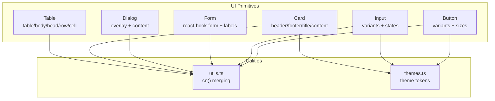
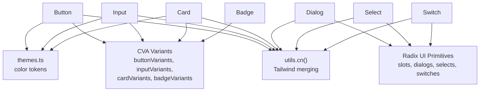
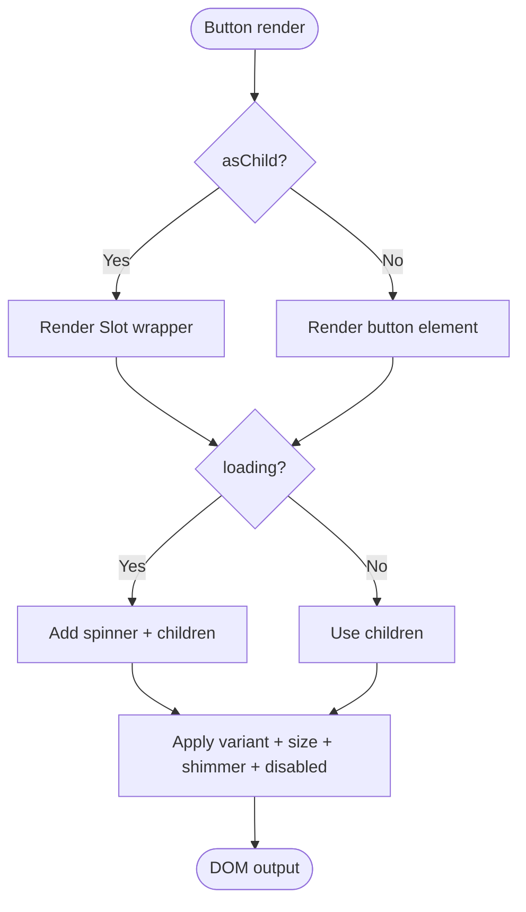
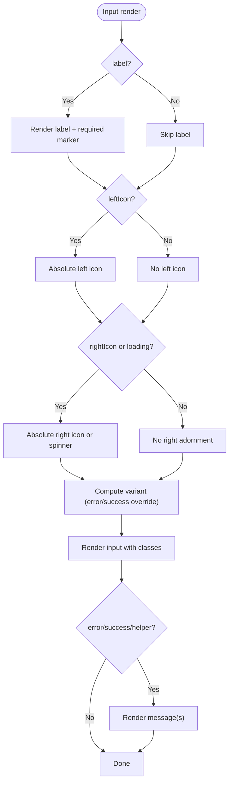
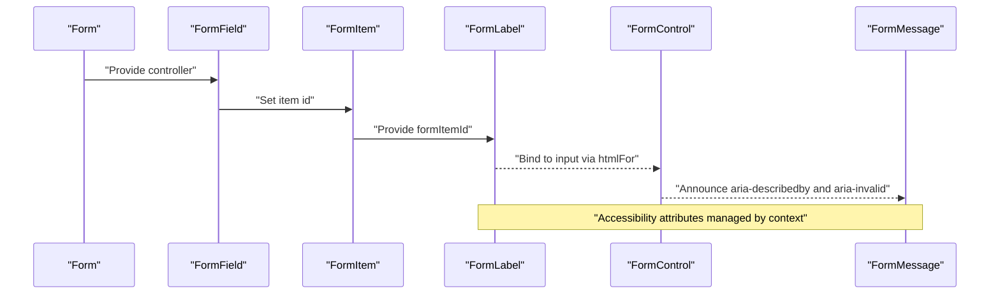
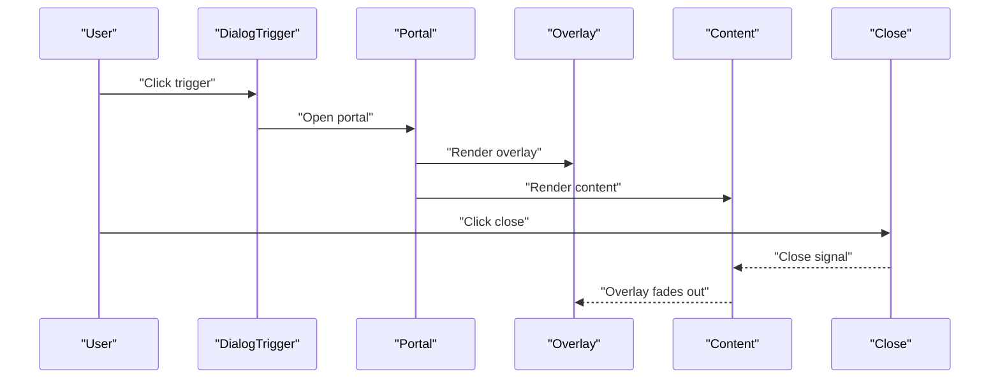
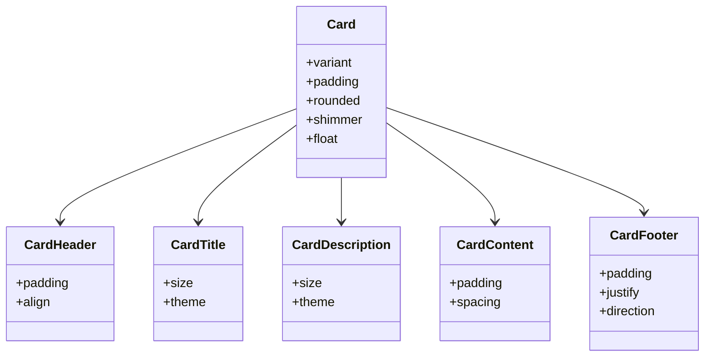
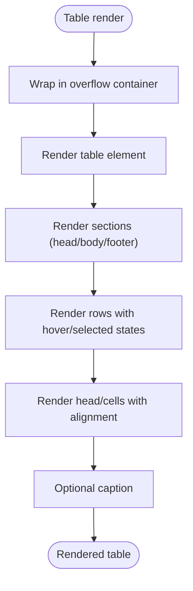
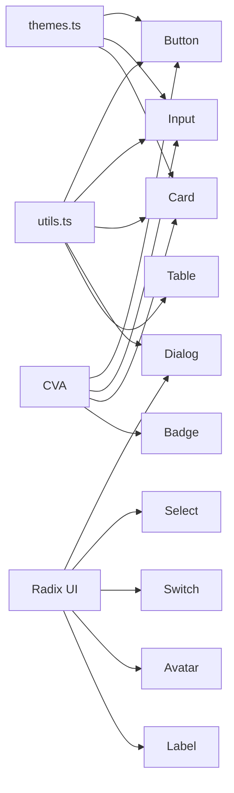

# Core UI Components

<cite>
**Referenced Files in This Document**
- [button.tsx](file://src/components/ui/button.tsx)
- [input.tsx](file://src/components/ui/input.tsx)
- [form.tsx](file://src/components/ui/form.tsx)
- [dialog.tsx](file://src/components/ui/dialog.tsx)
- [card.tsx](file://src/components/ui/card.tsx)
- [table.tsx](file://src/components/ui/table.tsx)
- [label.tsx](file://src/components/ui/label.tsx)
- [avatar.tsx](file://src/components/ui/avatar.tsx)
- [badge.tsx](file://src/components/ui/badge.tsx)
- [select.tsx](file://src/components/ui/select.tsx)
- [textarea.tsx](file://src/components/ui/textarea.tsx)
- [switch.tsx](file://src/components/ui/switch.tsx)
- [utils.ts](file://src/lib/utils.ts)
- [themes.ts](file://src/config/themes.ts)
</cite>

## Table of Contents

1. [Introduction](#introduction)
2. [Project Structure](#project-structure)
3. [Core Components](#core-components)
4. [Architecture Overview](#architecture-overview)
5. [Detailed Component Analysis](#detailed-component-analysis)
6. [Dependency Analysis](#dependency-analysis)
7. [Performance Considerations](#performance-considerations)
8. [Troubleshooting Guide](#troubleshooting-guide)
9. [Conclusion](#conclusion)
10. [Appendices](#appendices)

## Introduction

This document describes the core UI primitives used across the application, focusing on Button, Input, Form, Dialog, Card, and Table. It explains props, attributes, events, customization options, composition patterns, accessibility, responsive behavior, styling and theming integration, and performance considerations. Usage examples are provided via code snippet paths to guide implementation without exposing code content.

## Project Structure

The UI primitives live under the shared components library and are built with Tailwind CSS, class-variance-authority (CVA), Radix UI primitives, and utility helpers. Shared utilities merge and conditionally apply classes, while theme definitions provide color tokens for multiple palettes.

**Diagram sources**

- [button.tsx](file://src/components/ui/button.tsx#L1-L149)
- [input.tsx](file://src/components/ui/input.tsx#L1-L215)
- [form.tsx](file://src/components/ui/form.tsx#L1-L179)
- [dialog.tsx](file://src/components/ui/dialog.tsx#L1-L123)
- [card.tsx](file://src/components/ui/card.tsx#L1-L286)
- [table.tsx](file://src/components/ui/table.tsx#L1-L121)
- [utils.ts](file://src/lib/utils.ts#L1-L21)
- [themes.ts](file://src/config/themes.ts#L1-L167)

**Section sources**

- [button.tsx](file://src/components/ui/button.tsx#L1-L149)
- [input.tsx](file://src/components/ui/input.tsx#L1-L215)
- [form.tsx](file://src/components/ui/form.tsx#L1-L179)
- [dialog.tsx](file://src/components/ui/dialog.tsx#L1-L123)
- [card.tsx](file://src/components/ui/card.tsx#L1-L286)
- [table.tsx](file://src/components/ui/table.tsx#L1-L121)
- [utils.ts](file://src/lib/utils.ts#L1-L21)
- [themes.ts](file://src/config/themes.ts#L1-L167)

## Core Components

This section summarizes the primary props, customization options, and behaviors for each primitive.

- Button
  - Variants: default, destructive, outline, secondary, ghost, link, pill
  - Sizes: xs, sm, default, lg, icon, icon-sm
  - Props: className, variant, size, asChild, loading, shimmer, disabled
  - Accessibility: inherits native button semantics; supports focus-visible ring
  - Composition: supports asChild for semantic wrapping; loading spinner included
  - Events: standard button events (onClick, etc.)
  - Example snippet paths:
    - [Button with loading and shimmer](file://src/components/ui/button.tsx#L48-L146)
    - [Button with variant and size](file://src/components/ui/button.tsx#L48-L146)

- Input
  - Variants: default, elegant, outline, filled, ghost, brand, brand-subtle, line, line-subtle, line-accent, alma, ecos, jade, umbral, utopica, plus states error, success, warning
  - Sizes: sm, default, lg, xl
  - Rounded: none, sm, default, lg, xl, full
  - Props: label, error, success, helper, leftIcon, rightIcon, loading, disabled, required, type, variant, inputSize, rounded
  - Accessibility: optional label with required indicator; helper/error/success messaging
  - Composition: icon slots, loading spinner, auto-state variant selection
  - Example snippet paths:
    - [Input with icons and state](file://src/components/ui/input.tsx#L87-L215)
    - [Input variants and sizes](file://src/components/ui/input.tsx#L87-L215)

- Form
  - Components: Form (provider), FormField (controller), FormItem, FormLabel, FormControl, FormDescription, FormMessage
  - Hooks: useFormField
  - Accessibility: manages aria-invalid, aria-describedby, ids for labels and messages
  - Integration: pairs with react-hook-form and Label
  - Example snippet paths:
    - [Form provider and field context](file://src/components/ui/form.tsx#L18-L65)
    - [FormLabel and FormControl](file://src/components/ui/form.tsx#L89-L126)
    - [FormMessage and useFormField](file://src/components/ui/form.tsx#L145-L167)

- Dialog
  - Components: Root, Portal, Overlay, Trigger, Close, Content, Header, Footer, Title, Description
  - Accessibility: overlay animation, close button with sr-only label, centered content
  - Responsive: centered grid with max width and animations
  - Example snippet paths:
    - [Dialog overlay and content](file://src/components/ui/dialog.tsx#L17-L54)
    - [Dialog header/footer](file://src/components/ui/dialog.tsx#L56-L82)

- Card
  - Variants: default, elevated, interactive, outline, ghost, glass
  - Padding: none, sm, default, lg, xl
  - Rounded: default, sm, lg, full, none
  - Props: shimmer, float, variant, padding, rounded
  - Composition: CardHeader, CardTitle, CardDescription, CardContent, CardFooter
  - Example snippet paths:
    - [Card variants and shimmer](file://src/components/ui/card.tsx#L53-L78)
    - [CardHeader/Title/Content/Footer variants](file://src/components/ui/card.tsx#L106-L270)

- Table
  - Components: Table, TableHeader, TableBody, TableFooter, TableRow, TableHead, TableCell, TableCaption
  - Behavior: responsive wrapper with horizontal scrolling; hover and selected states
  - Example snippet paths:
    - [Table container and rows](file://src/components/ui/table.tsx#L5-L67)
    - [Table head and cell alignment](file://src/components/ui/table.tsx#L69-L97)

**Section sources**

- [button.tsx](file://src/components/ui/button.tsx#L40-L146)
- [input.tsx](file://src/components/ui/input.tsx#L75-L215)
- [form.tsx](file://src/components/ui/form.tsx#L18-L179)
- [dialog.tsx](file://src/components/ui/dialog.tsx#L9-L123)
- [card.tsx](file://src/components/ui/card.tsx#L46-L286)
- [table.tsx](file://src/components/ui/table.tsx#L5-L121)

## Architecture Overview

The UI primitives are composed with:

- CVA for variant-driven styles
- Radix UI for accessible base components
- cn() utility for safe class merging
- Theme tokens for color customization

**Diagram sources**

- [button.tsx](file://src/components/ui/button.tsx#L7-L38)
- [input.tsx](file://src/components/ui/input.tsx#L6-L73)
- [card.tsx](file://src/components/ui/card.tsx#L6-L44)
- [badge.tsx](file://src/components/ui/badge.tsx#L6-L26)
- [dialog.tsx](file://src/components/ui/dialog.tsx#L32-L54)
- [select.tsx](file://src/components/ui/select.tsx#L15-L33)
- [switch.tsx](file://src/components/ui/switch.tsx#L8-L27)
- [utils.ts](file://src/lib/utils.ts#L4-L6)
- [themes.ts](file://src/config/themes.ts#L3-L28)

## Detailed Component Analysis

### Button

- Purpose: Action primative with rich variant set and micro-interactions
- Props
  - variant: default | destructive | outline | secondary | ghost | link | pill
  - size: xs | sm | default | lg | icon | icon-sm
  - asChild: wrap children in a slot for semantic composition
  - loading: show spinner and disable interactions
  - shimmer: animated highlight effect
  - disabled: native disabled state
- Behavior
  - Uses Slot when asChild=true; otherwise renders button
  - Loading toggles pointer-events and adds spinner
  - Shimmer adds animated gradient overlay
  - Focus-visible ring and transitions for hover/active states
- Accessibility
  - Inherits button semantics; supports keyboard focus and screen reader labels
- Composition patterns
  - Icon buttons: size icon/icon-sm with icons inside children
  - Link-like actions: variant link with asChild for anchor semantics
- Example snippet paths
  - [Button forwardRef and variants](file://src/components/ui/button.tsx#L48-L146)
  - [Loading and shimmer rendering](file://src/components/ui/button.tsx#L67-L125)

**Diagram sources**

- [button.tsx](file://src/components/ui/button.tsx#L48-L146)

**Section sources**

- [button.tsx](file://src/components/ui/button.tsx#L40-L146)

### Input

- Purpose: Text input with extensive variants, states, and adornments
- Props
  - variant: default | elegant | outline | filled | ghost | brand | brand-subtle | line | line-subtle | line-accent | alma | ecos | jade | umbral | utopica | error | success | warning
  - inputSize: sm | default | lg | xl
  - rounded: none | sm | default | lg | xl | full
  - label, error, success, helper, leftIcon, rightIcon, loading
- Behavior
  - Auto-selects variant based on error/success; otherwise uses provided variant
  - Positions icons and adjusts padding accordingly
  - Shows loading spinner on the right when loading=true
  - Optional label with required asterisk
- Accessibility
  - Label associates with input via htmlFor
  - Helper/error/success messages styled appropriately
- Example snippet paths
  - [Input with label and icons](file://src/components/ui/input.tsx#L109-L209)
  - [State-based variant selection](file://src/components/ui/input.tsx#L106-L108)

**Diagram sources**

- [input.tsx](file://src/components/ui/input.tsx#L109-L209)

**Section sources**

- [input.tsx](file://src/components/ui/input.tsx#L75-L215)

### Form

- Purpose: Accessible form scaffolding integrating react-hook-form
- Components
  - Form: wraps react-hook-form FormProvider
  - FormField: controller wrapper with context
  - FormItem: container with generated id
  - FormLabel: label bound to field
  - FormControl: slot for input components
  - FormDescription/FormMessage: helper/error messaging
- Hooks
  - useFormField: resolves ids and error state
- Accessibility
  - aria-invalid and aria-describedby manage assistive tech
  - FormLabel binds to input via generated id
- Example snippet paths
  - [useFormField and ids](file://src/components/ui/form.tsx#L44-L65)
  - [FormLabel and FormControl](file://src/components/ui/form.tsx#L89-L126)
  - [FormMessage with error fallback](file://src/components/ui/form.tsx#L145-L167)

**Diagram sources**

- [form.tsx](file://src/components/ui/form.tsx#L18-L179)

**Section sources**

- [form.tsx](file://src/components/ui/form.tsx#L18-L179)

### Dialog

- Purpose: Modal overlay with animated content and close affordance
- Components
  - Root, Portal, Overlay, Trigger, Close, Content, Header, Footer, Title, Description
- Behavior
  - Overlay animates in/out; Content centers with slide/zoom transitions
  - Close button includes sr-only label for accessibility
- Responsive
  - Max width and centered layout; responsive footer layout
- Example snippet paths
  - [Dialog overlay and content](file://src/components/ui/dialog.tsx#L17-L54)
  - [Dialog header/footer layout](file://src/components/ui/dialog.tsx#L56-L82)

**Diagram sources**

- [dialog.tsx](file://src/components/ui/dialog.tsx#L9-L123)

**Section sources**

- [dialog.tsx](file://src/components/ui/dialog.tsx#L9-L123)

### Card

- Purpose: Container with multiple visual styles and composition helpers
- Props
  - variant: default | elevated | interactive | outline | ghost | glass
  - padding: none | sm | default | lg | xl
  - rounded: default | sm | lg | full | none
  - shimmer, float
- Composition
  - CardHeader, CardTitle, CardDescription, CardContent, CardFooter
  - Title and description variants for size/theme
- Example snippet paths
  - [Card with shimmer and float](file://src/components/ui/card.tsx#L53-L78)
  - [CardHeader/Title/Content/Footer variants](file://src/components/ui/card.tsx#L106-L270)

**Diagram sources**

- [card.tsx](file://src/components/ui/card.tsx#L46-L286)

**Section sources**

- [card.tsx](file://src/components/ui/card.tsx#L46-L286)

### Table

- Purpose: Structured data display with responsive scrolling
- Components
  - Table, TableHeader, TableBody, TableFooter, TableRow, TableHead, TableCell, TableCaption
- Behavior
  - Wrapper ensures horizontal scroll on small screens
  - Hover and selected states for interactivity
- Example snippet paths
  - [Table container and rows](file://src/components/ui/table.tsx#L5-L67)
  - [Table head and cells](file://src/components/ui/table.tsx#L69-L97)

**Diagram sources**

- [table.tsx](file://src/components/ui/table.tsx#L5-L121)

**Section sources**

- [table.tsx](file://src/components/ui/table.tsx#L5-L121)

### Additional Primitives (for completeness)

- Label: [Label](file://src/components/ui/label.tsx#L13-L24)
- Avatar: [Avatar, AvatarImage, AvatarFallback](file://src/components/ui/avatar.tsx#L8-L51)
- Badge: [Badge variants](file://src/components/ui/badge.tsx#L6-L39)
- Select: [Select primitives](file://src/components/ui/select.tsx#L15-L160)
- Textarea: [Textarea](file://src/components/ui/textarea.tsx#L8-L22)
- Switch: [Switch](file://src/components/ui/switch.tsx#L8-L29)

**Section sources**

- [label.tsx](file://src/components/ui/label.tsx#L13-L24)
- [avatar.tsx](file://src/components/ui/avatar.tsx#L8-L51)
- [badge.tsx](file://src/components/ui/badge.tsx#L6-L39)
- [select.tsx](file://src/components/ui/select.tsx#L15-L160)
- [textarea.tsx](file://src/components/ui/textarea.tsx#L8-L22)
- [switch.tsx](file://src/components/ui/switch.tsx#L8-L29)

## Dependency Analysis

- Utilities
  - cn() merges classes safely; used across all components
- Themes
  - Theme tokens define color roles; components consume tokens via CSS variables or Tailwind utilities
- Radix UI
  - Dialog, Select, Switch, Avatar, Label rely on Radix primitives for accessibility and composition
- CVA
  - Provides variant sets for Button, Input, Card, Badge

**Diagram sources**

- [utils.ts](file://src/lib/utils.ts#L4-L6)
- [themes.ts](file://src/config/themes.ts#L3-L28)
- [button.tsx](file://src/components/ui/button.tsx#L7-L38)
- [input.tsx](file://src/components/ui/input.tsx#L6-L73)
- [card.tsx](file://src/components/ui/card.tsx#L6-L44)
- [badge.tsx](file://src/components/ui/badge.tsx#L6-L26)
- [dialog.tsx](file://src/components/ui/dialog.tsx#L32-L54)
- [select.tsx](file://src/components/ui/select.tsx#L15-L33)
- [switch.tsx](file://src/components/ui/switch.tsx#L12-L26)
- [avatar.tsx](file://src/components/ui/avatar.tsx#L12-L20)
- [label.tsx](file://src/components/ui/label.tsx#L18-L23)

**Section sources**

- [utils.ts](file://src/lib/utils.ts#L4-L6)
- [themes.ts](file://src/config/themes.ts#L3-L28)
- [button.tsx](file://src/components/ui/button.tsx#L7-L38)
- [input.tsx](file://src/components/ui/input.tsx#L6-L73)
- [card.tsx](file://src/components/ui/card.tsx#L6-L44)
- [badge.tsx](file://src/components/ui/badge.tsx#L6-L26)
- [dialog.tsx](file://src/components/ui/dialog.tsx#L32-L54)
- [select.tsx](file://src/components/ui/select.tsx#L15-L33)
- [switch.tsx](file://src/components/ui/switch.tsx#L12-L26)
- [avatar.tsx](file://src/components/ui/avatar.tsx#L12-L20)
- [label.tsx](file://src/components/ui/label.tsx#L18-L23)

## Performance Considerations

- Prefer variant props over dynamic inline styles to leverage CSS specificity and reduce reflows.
- Use asChild where appropriate to avoid unnecessary DOM wrappers.
- Keep shimmer and floating animations off unless needed; they add layout and paint overhead.
- Limit heavy transitions on frequently updated components (e.g., inputs in rapid validation loops).
- Use responsive-friendly layouts (e.g., Table wrapper) to avoid forced reflows on narrow screens.

## Troubleshooting Guide

- Button disabled state
  - Ensure loading=false when enabling interaction; Button disables itself when loading is true.
  - Reference: [Button disabled and loading](file://src/components/ui/button.tsx#L138-L139)
- Input state conflicts
  - error/success take precedence over variant; verify state flags are set correctly.
  - Reference: [Computed variant](file://src/components/ui/input.tsx#L107)
- Form accessibility
  - Confirm FormLabel is used alongside FormControl; useFormField generates ids automatically.
  - Reference: [useFormField and ids](file://src/components/ui/form.tsx#L44-L65)
- Dialog focus and keyboard handling
  - Ensure Close button exists; sr-only label improves screen reader support.
  - Reference: [Dialog close button](file://src/components/ui/dialog.tsx#L47-L50)
- Card shimmer and float
  - Verify animations are not causing layout thrashing on low-end devices.
  - Reference: [Card shimmer and float](file://src/components/ui/card.tsx#L69-L74)

**Section sources**

- [button.tsx](file://src/components/ui/button.tsx#L138-L139)
- [input.tsx](file://src/components/ui/input.tsx#L107)
- [form.tsx](file://src/components/ui/form.tsx#L44-L65)
- [dialog.tsx](file://src/components/ui/dialog.tsx#L47-L50)
- [card.tsx](file://src/components/ui/card.tsx#L69-L74)

## Conclusion

These core UI primitives provide a cohesive, accessible, and customizable foundation. They emphasize composition, variant-driven styling, and strong accessibility defaults. By leveraging CVA, Radix UI, and utility helpers, teams can implement consistent experiences across the application while maintaining flexibility for branding and responsive needs.

## Appendices

- Theming integration
  - Use theme tokens to drive color roles; components reference tokens via CSS variables or Tailwind utilities.
  - Reference: [Theme tokens](file://src/config/themes.ts#L3-L28)
- Utility helpers
  - cn() merges classes safely; recommended for composing component classes.
  - Reference: [cn()](file://src/lib/utils.ts#L4-L6)

**Section sources**

- [themes.ts](file://src/config/themes.ts#L3-L28)
- [utils.ts](file://src/lib/utils.ts#L4-L6)
