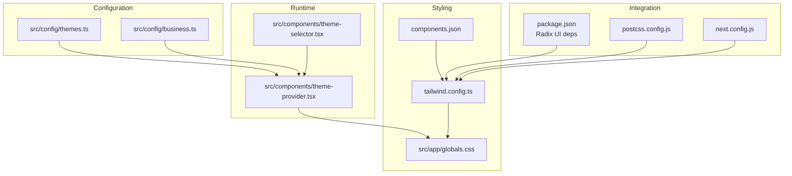
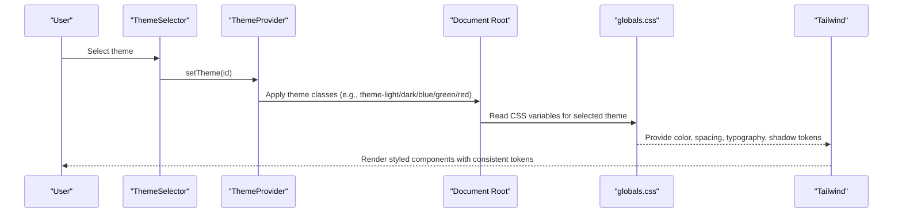
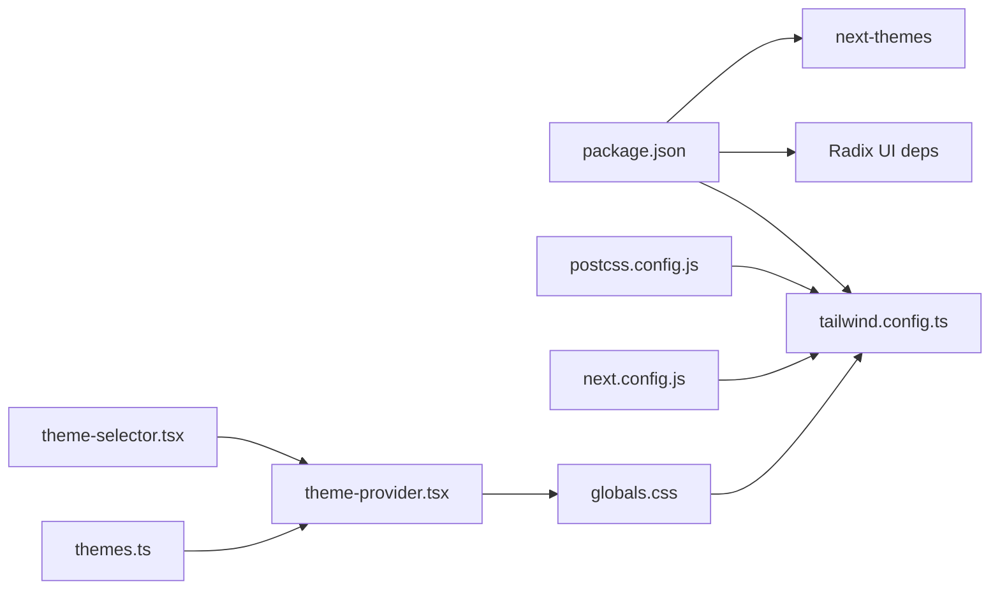
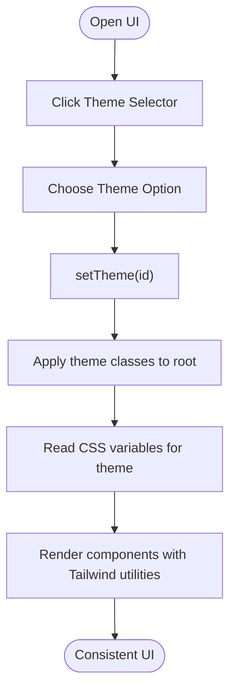

# Design System & Foundation

<cite>
**Referenced Files in This Document**
- [themes.ts](file://src/config/themes.ts)
- [business.ts](file://src/config/business.ts)
- [tailwind.config.ts](file://tailwind.config.ts)
- [components.json](file://components.json)
- [globals.css](file://src/app/globals.css)
- [theme-provider.tsx](file://src/components/theme-provider.tsx)
- [theme-selector.tsx](file://src/components/theme-selector.tsx)
- [package.json](file://package.json)
- [postcss.config.js](file://postcss.config.js)
- [next.config.js](file://next.config.js)
</cite>

## Table of Contents

1. [Introduction](#introduction)
2. [Project Structure](#project-structure)
3. [Core Components](#core-components)
4. [Architecture Overview](#architecture-overview)
5. [Detailed Component Analysis](#detailed-component-analysis)
6. [Dependency Analysis](#dependency-analysis)
7. [Performance Considerations](#performance-considerations)
8. [Troubleshooting Guide](#troubleshooting-guide)
9. [Conclusion](#conclusion)
10. [Appendices](#appendices)

## Introduction

This document describes the Opttius design system foundation, focusing on atomic design principles, component hierarchy, and the design token system. It explains theme configuration, color palette, typography system, spacing scale, and breakpoint definitions. It also documents the integration of Radix UI primitives, Tailwind CSS customization, and design consistency guidelines. Finally, it outlines component architecture patterns (atomic design, compound components, and reusable patterns) and provides guidance for maintaining design consistency across all components, including the relationship between design tokens and implementation.

## Project Structure

The design system spans configuration, theming, and styling layers:

- Configuration: theme definitions and business branding live under src/config.
- Theming runtime: theme provider and selector components manage theme activation and selection.
- Styling: Tailwind CSS configuration extends design tokens via CSS variables and Radix UI animations.
- Integration: Radix UI primitives are integrated through shadcn/ui and Tailwind’s theme extensions.

**Diagram sources**

- [themes.ts](file://src/config/themes.ts#L1-L167)
- [business.ts](file://src/config/business.ts#L1-L92)
- [theme-provider.tsx](file://src/components/theme-provider.tsx#L1-L105)
- [theme-selector.tsx](file://src/components/theme-selector.tsx#L1-L65)
- [tailwind.config.ts](file://tailwind.config.ts#L1-L425)
- [globals.css](file://src/app/globals.css#L1-L519)
- [components.json](file://components.json#L1-L21)
- [package.json](file://package.json#L1-L134)
- [postcss.config.js](file://postcss.config.js#L1-L6)
- [next.config.js](file://next.config.js#L1-L161)

**Section sources**

- [themes.ts](file://src/config/themes.ts#L1-L167)
- [business.ts](file://src/config/business.ts#L1-L92)
- [theme-provider.tsx](file://src/components/theme-provider.tsx#L1-L105)
- [theme-selector.tsx](file://src/components/theme-selector.tsx#L1-L65)
- [tailwind.config.ts](file://tailwind.config.ts#L1-L425)
- [globals.css](file://src/app/globals.css#L1-L519)
- [components.json](file://components.json#L1-L21)
- [package.json](file://package.json#L1-L134)
- [postcss.config.js](file://postcss.config.js#L1-L6)
- [next.config.js](file://next.config.js#L1-L161)

## Core Components

- Theme definitions: Centralized theme metadata and palettes.
- Theme provider: Manages theme lifecycle and applies CSS variables and classes.
- Theme selector: UI control to switch themes.
- Tailwind configuration: Extends design tokens into utilities and animations.
- Global CSS: Defines CSS variables for design tokens and theme variants.
- Business configuration: Branding and business-specific tokens.

Key responsibilities:

- Tokenization: Colors, typography, spacing, shadows, and z-index are defined as CSS variables and mapped to Tailwind scales.
- Theming: Theme switching toggles CSS variables and theme classes on the root element.
- Integration: Radix UI animations and shadcn/ui components consume Tailwind utilities and CSS variables.

**Section sources**

- [themes.ts](file://src/config/themes.ts#L1-L167)
- [theme-provider.tsx](file://src/components/theme-provider.tsx#L1-L105)
- [theme-selector.tsx](file://src/components/theme-selector.tsx#L1-L65)
- [tailwind.config.ts](file://tailwind.config.ts#L1-L425)
- [globals.css](file://src/app/globals.css#L1-L519)
- [business.ts](file://src/config/business.ts#L1-L92)

## Architecture Overview

The design system architecture connects configuration, runtime, and styling layers to deliver consistent theming and responsive UI.

**Diagram sources**

- [theme-selector.tsx](file://src/components/theme-selector.tsx#L1-L65)
- [theme-provider.tsx](file://src/components/theme-provider.tsx#L1-L105)
- [globals.css](file://src/app/globals.css#L1-L519)
- [tailwind.config.ts](file://tailwind.config.ts#L1-L425)

## Detailed Component Analysis

### Theme Configuration and Tokens

- Theme model: Each theme defines semantic roles (background, foreground, card, popover, primary, secondary, muted, accent, destructive, border, input, ring).
- Theme variants: Five built-in themes (light, dark, blue, green, red) with distinct palettes.
- Accessors: Utility to retrieve a theme by ID.

Implementation highlights:

- Semantic role mapping ensures consistent usage across components.
- Color values are expressed as HSL strings for consistent tone generation.

**Section sources**

- [themes.ts](file://src/config/themes.ts#L1-L167)

### Theme Provider and Selector

- ThemeProvider: Wraps the app with theme awareness, manages theme classes on the root element, and exposes a custom hook.
- ThemeSelector: Provides a dropdown UI to switch themes and reflects the active selection.

Behavior:

- Applies theme classes (e.g., theme-light) and ensures dark mode compatibility.
- Uses a custom hook to normalize theme IDs and provide current theme metadata.

**Section sources**

- [theme-provider.tsx](file://src/components/theme-provider.tsx#L1-L105)
- [theme-selector.tsx](file://src/components/theme-selector.tsx#L1-L65)

### Tailwind CSS Customization

- CSS variable integration: Tailwind reads theme tokens from CSS variables defined in globals.css.
- Extended scales: Colors, typography, spacing, shadows, z-index, transitions, and animations are extended with CSS variable-backed values.
- Radix UI animations: Accordion animations integrate with Radix UI primitives via CSS variables.
- Product line and dynamic line themes: Dedicated color groups for product lines and dynamic theming.
- Admin-specific tokens: Specialized tokens for admin UI consistency.

**Section sources**

- [tailwind.config.ts](file://tailwind.config.ts#L1-L425)
- [globals.css](file://src/app/globals.css#L1-L519)

### Global CSS Variables and Theme Variants

- Base tokens: Typography scale, spacing scale, and font families are defined as CSS variables.
- Theme variants: Each theme variant sets CSS variables for all semantic roles, enabling seamless switching.
- Admin UI tokens: Additional variables for admin backgrounds, borders, text, and accents.

**Section sources**

- [globals.css](file://src/app/globals.css#L1-L519)

### Business Configuration

- Branding tokens: Primary, secondary, accent, and semantic colors for success, warning, danger, and info.
- Feature flags and admin panel metadata.
- Currency and email configuration.

**Section sources**

- [business.ts](file://src/config/business.ts#L1-L92)

### Radix UI Primitive Integration

- Dependencies: Radix UI packages are included in the project dependencies.
- Tailwind integration: Radix UI animations (e.g., accordion) are configured via Tailwind theme extensions.
- Compound components: Radix UI primitives are used to build accessible, composable UI components.

**Section sources**

- [package.json](file://package.json#L1-L134)
- [tailwind.config.ts](file://tailwind.config.ts#L1-L425)

### Atomic Design Principles and Component Hierarchy

- Atoms: Basic UI elements (buttons, inputs, labels) styled via Tailwind utilities and CSS variables.
- Molecules: Combinations of atoms (e.g., forms, alerts) that form functional units.
- Organisms: Larger components (e.g., cards, navigation) assembled from molecules.
- Templates and pages: Page-level layouts and compositions.

Consistency patterns:

- Use semantic roles from themes for consistent color application.
- Prefer Tailwind utilities backed by CSS variables for typography and spacing.
- Leverage Radix UI primitives for accessibility and composability.

[No sources needed since this section synthesizes patterns without analyzing specific files]

### Compound Components and Reusable Patterns

- Compound components: Group related UI controls (e.g., tabs, dialogs) that share state and behavior.
- Reusable patterns: Shared utilities for animations, spacing, and typography scales.

Guidelines:

- Encapsulate shared behavior in compound components.
- Keep presentation logic in Tailwind utilities and CSS variables.

[No sources needed since this section provides general guidance]

## Dependency Analysis

The design system depends on Tailwind CSS, Radix UI, and Next Themes for theming. PostCSS and Next.js configurations integrate Tailwind and enforce security policies.

**Diagram sources**

- [package.json](file://package.json#L1-L134)
- [tailwind.config.ts](file://tailwind.config.ts#L1-L425)
- [postcss.config.js](file://postcss.config.js#L1-L6)
- [next.config.js](file://next.config.js#L1-L161)
- [globals.css](file://src/app/globals.css#L1-L519)
- [themes.ts](file://src/config/themes.ts#L1-L167)
- [theme-provider.tsx](file://src/components/theme-provider.tsx#L1-L105)
- [theme-selector.tsx](file://src/components/theme-selector.tsx#L1-L65)

**Section sources**

- [package.json](file://package.json#L1-L134)
- [tailwind.config.ts](file://tailwind.config.ts#L1-L425)
- [postcss.config.js](file://postcss.config.js#L1-L6)
- [next.config.js](file://next.config.js#L1-L161)
- [globals.css](file://src/app/globals.css#L1-L519)
- [themes.ts](file://src/config/themes.ts#L1-L167)
- [theme-provider.tsx](file://src/components/theme-provider.tsx#L1-L105)
- [theme-selector.tsx](file://src/components/theme-selector.tsx#L1-L65)

## Performance Considerations

- CSS variables reduce style recalculation overhead during theme switches.
- Tailwind utilities promote efficient rendering by generating minimal CSS.
- Radix UI animations rely on CSS variables for smooth transitions.
- Avoid excessive re-renders by memoizing theme selections and applying theme classes at the root level.

[No sources needed since this section provides general guidance]

## Troubleshooting Guide

Common issues and resolutions:

- Theme not applying: Verify theme classes are added to the root element and CSS variables are defined for the selected theme.
- Inconsistent colors: Ensure Tailwind utilities reference CSS variables and not hardcoded values.
- Radix UI animation mismatch: Confirm Tailwind theme extensions match Radix UI component states.
- Build errors: Check Tailwind and PostCSS configurations and ensure dependencies are installed.

**Section sources**

- [theme-provider.tsx](file://src/components/theme-provider.tsx#L1-L105)
- [tailwind.config.ts](file://tailwind.config.ts#L1-L425)
- [postcss.config.js](file://postcss.config.js#L1-L6)
- [next.config.js](file://next.config.js#L1-L161)

## Conclusion

Opttius’ design system foundation integrates theme configuration, runtime management, and Tailwind CSS customization to deliver a consistent, accessible, and maintainable UI. By centralizing design tokens in CSS variables and semantic theme roles, the system supports atomic design principles, compound components, and reusable patterns. Radix UI primitives and shadcn/ui components further enhance accessibility and composability. Adhering to the guidelines in this document ensures design consistency across all components and facilitates scalable evolution of the design system.

[No sources needed since this section summarizes without analyzing specific files]

## Appendices

### Design Token Reference

- Color tokens: Semantic roles (background, foreground, card, popover, primary, secondary, muted, accent, destructive, border, input, ring) per theme.
- Typography tokens: Display, title, subtitle, text, caption scales with font families.
- Spacing tokens: Incremental spacing scale mapped to CSS variables.
- Shadow and z-index tokens: Consistent elevation and stacking context.
- Transition and animation tokens: Timing functions and durations for smooth interactions.

**Section sources**

- [themes.ts](file://src/config/themes.ts#L1-L167)
- [tailwind.config.ts](file://tailwind.config.ts#L1-L425)
- [globals.css](file://src/app/globals.css#L1-L519)

### Theme Switching Flow

**Diagram sources**

- [theme-selector.tsx](file://src/components/theme-selector.tsx#L1-L65)
- [theme-provider.tsx](file://src/components/theme-provider.tsx#L1-L105)
- [globals.css](file://src/app/globals.css#L1-L519)
- [tailwind.config.ts](file://tailwind.config.ts#L1-L425)
