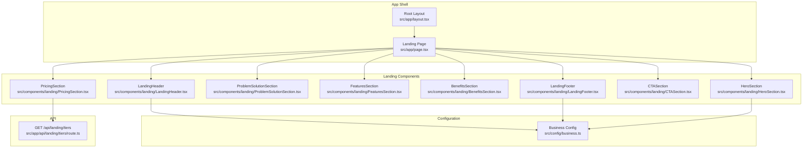
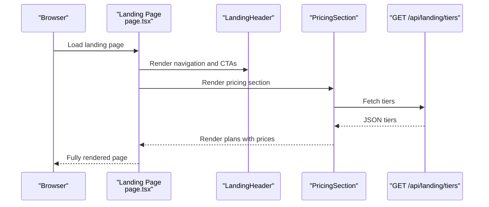
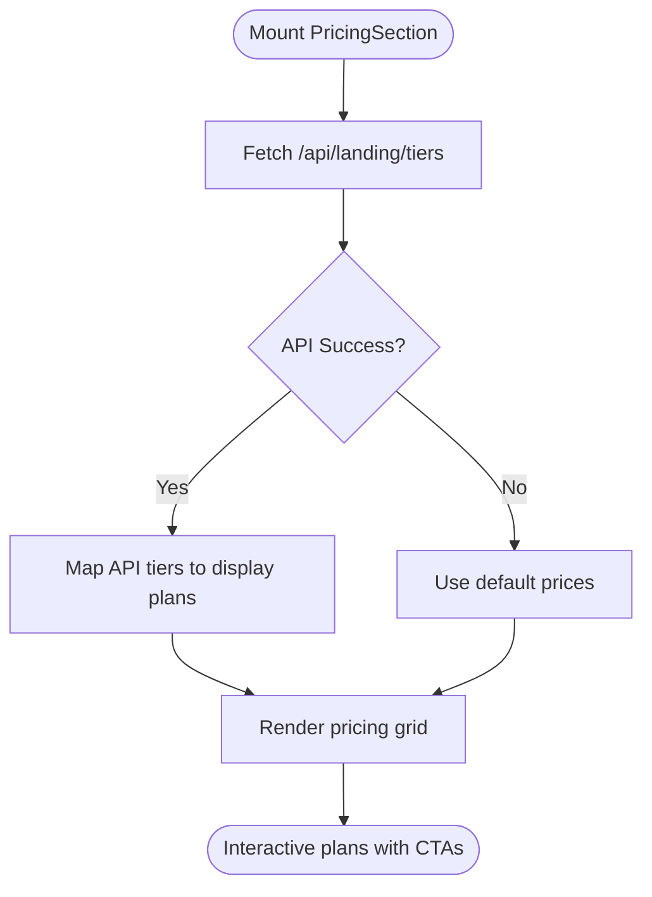
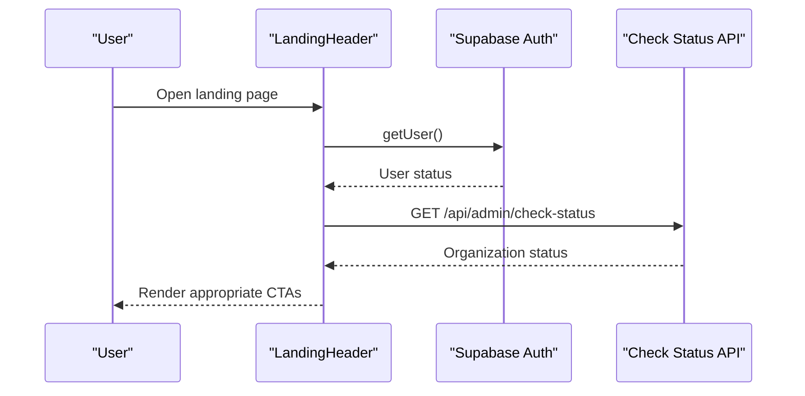
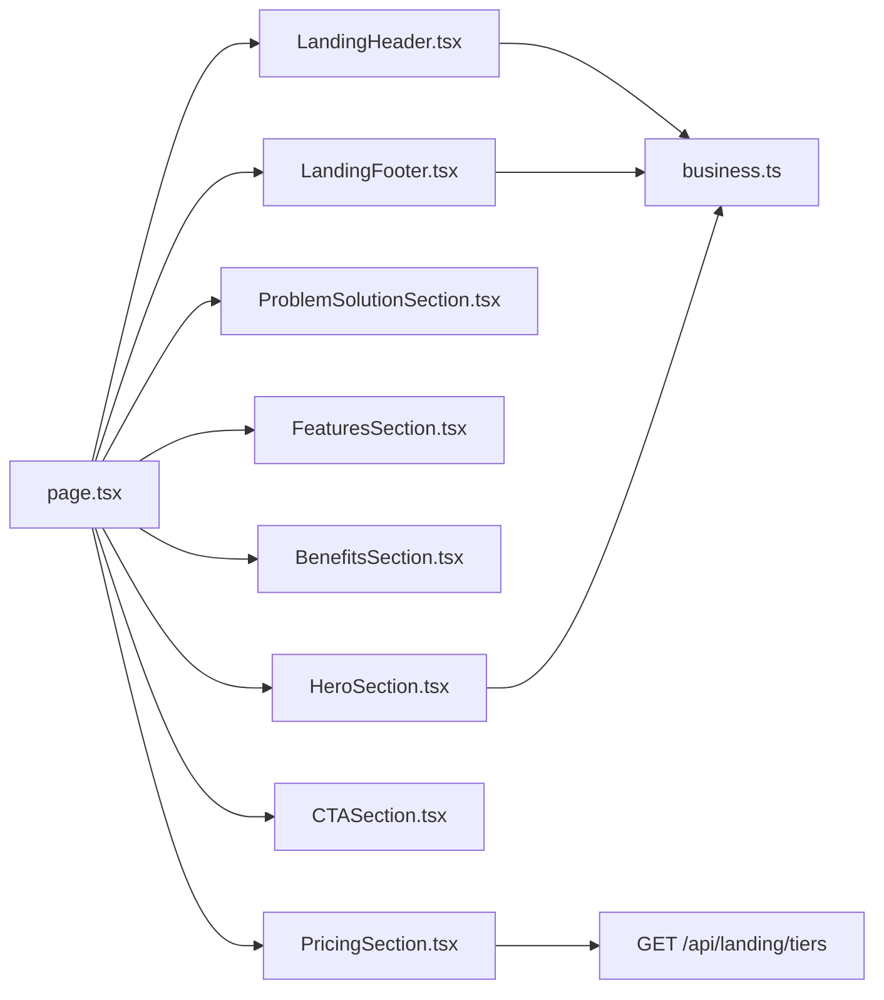

# Landing Page Components

<cite>
**Referenced Files in This Document**
- [HeroSection.tsx](file://src/components/landing/HeroSection.tsx)
- [PricingSection.tsx](file://src/components/landing/PricingSection.tsx)
- [FeaturesSection.tsx](file://src/components/landing/FeaturesSection.tsx)
- [TestimonialsSection.tsx](file://src/components/landing/TestimonialsSection.tsx)
- [BenefitsSection.tsx](file://src/components/landing/BenefitsSection.tsx)
- [CTASection.tsx](file://src/components/landing/CTASection.tsx)
- [LandingHeader.tsx](file://src/components/landing/LandingHeader.tsx)
- [LandingFooter.tsx](file://src/components/landing/LandingFooter.tsx)
- [ProblemSolutionSection.tsx](file://src/components/landing/ProblemSolutionSection.tsx)
- [page.tsx](file://src/app/page.tsx)
- [route.ts](file://src/app/api/landing/tiers/route.ts)
- [business.ts](file://src/config/business.ts)
- [layout.tsx](file://src/app/layout.tsx)
</cite>

## Table of Contents

1. [Introduction](#introduction)
2. [Project Structure](#project-structure)
3. [Core Components](#core-components)
4. [Architecture Overview](#architecture-overview)
5. [Detailed Component Analysis](#detailed-component-analysis)
6. [Dependency Analysis](#dependency-analysis)
7. [Performance Considerations](#performance-considerations)
8. [Troubleshooting Guide](#troubleshooting-guide)
9. [Conclusion](#conclusion)
10. [Appendices](#appendices)

## Introduction

This document provides comprehensive documentation for the landing page components that drive conversions and engagement for Opttius. It covers the HeroSection, PricingSection, FeaturesSection, TestimonialsSection, BenefitsSection, ProblemSolutionSection, CTASection, LandingHeader, and LandingFooter. The guide explains conversion-focused UI patterns, responsive design strategies, user engagement features, customization options, content management integration, performance optimization, and the relationship between components and business goals. It also outlines A/B testing capabilities and analytics integration pathways.

## Project Structure

The landing page is composed of modular React components located under src/components/landing. The main landing page orchestrates these components and integrates with shared configuration and API routes.

**Diagram sources**

- [layout.tsx](file://src/app/layout.tsx#L30-L55)
- [page.tsx](file://src/app/page.tsx#L12-L33)
- [LandingHeader.tsx](file://src/components/landing/LandingHeader.tsx#L18-L96)
- [HeroSection.tsx](file://src/components/landing/HeroSection.tsx#L9-L167)
- [ProblemSolutionSection.tsx](file://src/components/landing/ProblemSolutionSection.tsx#L6-L154)
- [FeaturesSection.tsx](file://src/components/landing/FeaturesSection.tsx#L66-L109)
- [BenefitsSection.tsx](file://src/components/landing/BenefitsSection.tsx#L37-L98)
- [PricingSection.tsx](file://src/components/landing/PricingSection.tsx#L80-L239)
- [CTASection.tsx](file://src/components/landing/CTASection.tsx#L8-L78)
- [LandingFooter.tsx](file://src/components/landing/LandingFooter.tsx#L18-L201)
- [route.ts](file://src/app/api/landing/tiers/route.ts#L9-L35)
- [business.ts](file://src/config/business.ts#L8-L89)

**Section sources**

- [layout.tsx](file://src/app/layout.tsx#L30-L55)
- [page.tsx](file://src/app/page.tsx#L12-L33)

## Core Components

This section summarizes each component’s purpose, conversion patterns, and engagement features.

- HeroSection: High-impact headline, value proposition, trust signals, and dual CTAs to drive sign-ups and demos.
- FeaturesSection: Feature cards with hover effects and icons to communicate capability depth.
- BenefitsSection: Impact-driven stats with animated backgrounds to reinforce ROI and operational gains.
- ProblemSolutionSection: Problem-solution pairs to position Opttius as the solution to industry pain points.
- PricingSection: Dynamic pricing loaded from a public API, tier comparisons, and prominent “Get Started” buttons.
- TestimonialsSection: Social proof with star ratings and avatars to reduce perceived risk.
- CTASection: Bold final push with strong visual contrast and benefit summaries.
- LandingHeader: Navigation, smooth scrolling, and adaptive CTAs based on authentication and organization status.
- LandingFooter: Brand presence, navigation anchors, and contact information aligned with business branding.

**Section sources**

- [HeroSection.tsx](file://src/components/landing/HeroSection.tsx#L9-L167)
- [FeaturesSection.tsx](file://src/components/landing/FeaturesSection.tsx#L66-L109)
- [BenefitsSection.tsx](file://src/components/landing/BenefitsSection.tsx#L37-L98)
- [ProblemSolutionSection.tsx](file://src/components/landing/ProblemSolutionSection.tsx#L6-L154)
- [PricingSection.tsx](file://src/components/landing/PricingSection.tsx#L80-L239)
- [TestimonialsSection.tsx](file://src/components/landing/TestimonialsSection.tsx#L33-L93)
- [CTASection.tsx](file://src/components/landing/CTASection.tsx#L8-L78)
- [LandingHeader.tsx](file://src/components/landing/LandingHeader.tsx#L18-L96)
- [LandingFooter.tsx](file://src/components/landing/LandingFooter.tsx#L18-L201)

## Architecture Overview

The landing page composes multiple specialized components. Pricing data is fetched from a dedicated API route, while business branding and configuration are centralized in business.ts. The header dynamically adapts to user state and theme.

**Diagram sources**

- [page.tsx](file://src/app/page.tsx#L12-L33)
- [LandingHeader.tsx](file://src/components/landing/LandingHeader.tsx#L18-L96)
- [PricingSection.tsx](file://src/components/landing/PricingSection.tsx#L80-L116)
- [route.ts](file://src/app/api/landing/tiers/route.ts#L9-L35)

## Detailed Component Analysis

### HeroSection

- Purpose: Establish brand positioning, highlight value, and drive immediate actions.
- Conversion patterns:
  - Dual CTAs: Sign-up and live demo.
  - Trust indicators: “No card required,” “Instant setup,” “24/7 support.”
  - Visual storytelling: Hero image with floating cards for quick metrics.
- Engagement features:
  - Hover scaling on hero image.
  - Animated floating cards.
  - Gradient overlay and blurred background shapes for depth.
- Customization:
  - Business name and tagline from business.ts.
  - Image path and alt text configurable via props.
- Accessibility:
  - Priority image loading and semantic alt text.
  - Clear focus order and readable typography scales.

**Section sources**

- [HeroSection.tsx](file://src/components/landing/HeroSection.tsx#L9-L167)
- [business.ts](file://src/config/business.ts#L8-L31)

### FeaturesSection

- Purpose: Showcase platform capabilities with concise descriptions.
- Conversion patterns:
  - Hover animations and elevation to draw attention.
  - Iconography for quick comprehension.
- Engagement features:
  - Hover color transitions and subtle scaling.
  - Grid layout optimized for readability across breakpoints.
- Customization:
  - Feature list is data-driven; modify array to change content.
  - Icons imported from lucide-react.

**Section sources**

- [FeaturesSection.tsx](file://src/components/landing/FeaturesSection.tsx#L66-L109)

### BenefitsSection

- Purpose: Communicate quantified business impact.
- Conversion patterns:
  - Large stat overlays to emphasize value.
  - Hover animations to encourage exploration.
- Engagement features:
  - Decorative blurred background elements.
  - Bottom accent line for visual grounding.
- Customization:
  - Benefit entries are data-driven; adjust counts and descriptions.

**Section sources**

- [BenefitsSection.tsx](file://src/components/landing/BenefitsSection.tsx#L37-L98)

### ProblemSolutionSection

- Purpose: Position Opttius as the solution to common industry challenges.
- Conversion patterns:
  - Side-by-side problem and solution cards.
  - Positive framing with checkmarks and elevated cards.
- Engagement features:
  - Subtle background blur behind solutions column.
  - Hover scaling and shadow enhancements.

**Section sources**

- [ProblemSolutionSection.tsx](file://src/components/landing/ProblemSolutionSection.tsx#L6-L154)

### PricingSection

- Purpose: Present transparent pricing tiers and drive conversions.
- Conversion patterns:
  - Popular tier highlighting with scale and shadow.
  - Prominent “Get Started” buttons on each plan.
  - Free trial messaging to lower barrier.
- Data integration:
  - Fetches tiers from GET /api/landing/tiers.
  - Falls back to defaults if API fails.
- Customization:
  - Tiers and features configured via PLANS_CONFIG.
  - Prices mapped from API response or defaults.

**Diagram sources**

- [PricingSection.tsx](file://src/components/landing/PricingSection.tsx#L80-L132)
- [route.ts](file://src/app/api/landing/tiers/route.ts#L9-L35)

**Section sources**

- [PricingSection.tsx](file://src/components/landing/PricingSection.tsx#L80-L239)
- [route.ts](file://src/app/api/landing/tiers/route.ts#L9-L35)

### TestimonialsSection

- Purpose: Build social proof and reduce perceived risk.
- Conversion patterns:
  - Star ratings and verified roles.
  - Short, impactful quotes with author imagery.
- Engagement features:
  - Quote icon overlay for visual interest.
  - Hover states on testimonials.

**Section sources**

- [TestimonialsSection.tsx](file://src/components/landing/TestimonialsSection.tsx#L33-L93)

### CTASection

- Purpose: Final conversion push with strong visual emphasis.
- Conversion patterns:
  - Dark background with gradient accents.
  - Dual CTAs with contrasting styles.
- Engagement features:
  - Floating background blobs for depth.
  - Highlighted benefit badges below CTAs.

**Section sources**

- [CTASection.tsx](file://src/components/landing/CTASection.tsx#L8-L78)

### LandingHeader

- Purpose: Provide navigation, smooth scrolling, and adaptive CTAs.
- Conversion patterns:
  - Conditional CTAs based on authentication and organization status.
  - Smooth scroll to sections for improved UX.
- Engagement features:
  - Theme-aware logos and text branding.
  - Mobile-responsive hamburger menu with animated states.

**Diagram sources**

- [LandingHeader.tsx](file://src/components/landing/LandingHeader.tsx#L57-L96)

**Section sources**

- [LandingHeader.tsx](file://src/components/landing/LandingHeader.tsx#L18-L96)

### LandingFooter

- Purpose: Reinforce brand identity, link to sections, and provide contact info.
- Customization:
  - Theme-aware logos and text logos.
  - Business contact email from business.ts.
- Engagement features:
  - Hover animations on links and social icons.
  - Anchor navigation to top sections.

**Section sources**

- [LandingFooter.tsx](file://src/components/landing/LandingFooter.tsx#L18-L201)
- [business.ts](file://src/config/business.ts#L8-L31)

## Dependency Analysis

Key dependencies and relationships:

- page.tsx composes all landing components and renders them in sequence.
- PricingSection depends on GET /api/landing/tiers for dynamic pricing.
- Header and Footer consume business.ts for branding and contact details.
- All components rely on shared UI primitives and theme tokens.

**Diagram sources**

- [page.tsx](file://src/app/page.tsx#L12-L33)
- [PricingSection.tsx](file://src/components/landing/PricingSection.tsx#L80-L116)
- [route.ts](file://src/app/api/landing/tiers/route.ts#L9-L35)
- [LandingHeader.tsx](file://src/components/landing/LandingHeader.tsx#L18-L96)
- [LandingFooter.tsx](file://src/components/landing/LandingFooter.tsx#L18-L201)
- [HeroSection.tsx](file://src/components/landing/HeroSection.tsx#L9-L167)
- [business.ts](file://src/config/business.ts#L8-L31)

**Section sources**

- [page.tsx](file://src/app/page.tsx#L12-L33)
- [PricingSection.tsx](file://src/components/landing/PricingSection.tsx#L80-L116)
- [route.ts](file://src/app/api/landing/tiers/route.ts#L9-L35)
- [LandingHeader.tsx](file://src/components/landing/LandingHeader.tsx#L18-L96)
- [LandingFooter.tsx](file://src/components/landing/LandingFooter.tsx#L18-L201)
- [HeroSection.tsx](file://src/components/landing/HeroSection.tsx#L9-L167)
- [business.ts](file://src/config/business.ts#L8-L31)

## Performance Considerations

- Lazy loading and priority:
  - Hero image uses priority to improve Core Web Vitals.
- Minimal third-party dependencies:
  - Components primarily use lucide-react icons and Next.js Image.
- Efficient data fetching:
  - PricingSection fetches tiers once and falls back gracefully.
- Responsive design:
  - Tailwind-based responsive grids and spacing scale across breakpoints.
- Bundle size:
  - Each component is self-contained; consider code-splitting if the bundle grows.

[No sources needed since this section provides general guidance]

## Troubleshooting Guide

- PricingSection shows default prices:
  - Verify GET /api/landing/tiers responds with subscription_tiers data.
  - Check service role client configuration and database permissions.
- Header navigation not updating:
  - Confirm Supabase auth.getUser() and /api/admin/check-status are reachable.
  - Inspect browser console for fetch errors.
- Footer branding mismatch:
  - Ensure theme matches expected logo variants and business.ts values.

**Section sources**

- [PricingSection.tsx](file://src/components/landing/PricingSection.tsx#L87-L116)
- [route.ts](file://src/app/api/landing/tiers/route.ts#L9-L35)
- [LandingHeader.tsx](file://src/components/landing/LandingHeader.tsx#L57-L96)
- [business.ts](file://src/config/business.ts#L8-L31)

## Conclusion

The landing page components are designed to convert visitors into leads and trials through clear value communication, social proof, and streamlined navigation. They integrate with centralized configuration and a public pricing API, ensuring consistency and maintainability. With responsive design, theme-aware branding, and conversion-focused UI patterns, the landing page supports Opttius’s business goals while remaining extensible for future enhancements.

[No sources needed since this section summarizes without analyzing specific files]

## Appendices

### A/B Testing Capabilities

- Component-level experiments:
  - Test different headlines, CTAs, and layouts within HeroSection and CTASection.
  - Compare pricing presentation (features vs. tiers) in PricingSection.
- Analytics integration:
  - Track clicks on CTAs, scroll depth to sections, and conversion funnels.
  - Integrate with analytics providers to measure experiment outcomes.

[No sources needed since this section provides general guidance]

### Analytics Integration

- Events to track:
  - View events for each section (Hero, Features, Pricing, CTA).
  - Click events for “Get Started,” “View Demo,” and anchor navigations.
- Data sources:
  - Use business.ts for consistent brand and currency metadata.
  - Leverage Supabase for user identification and funnel analytics.

[No sources needed since this section provides general guidance]
