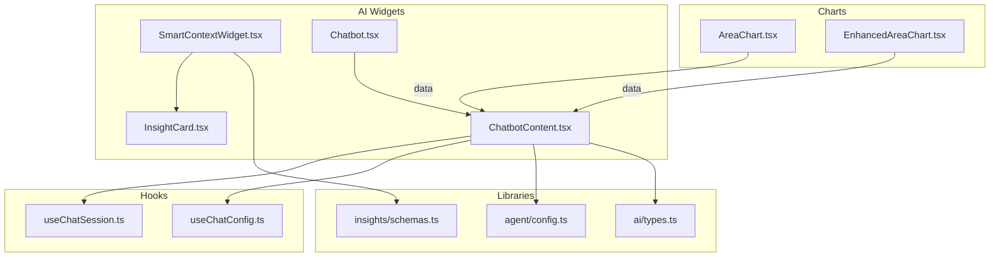
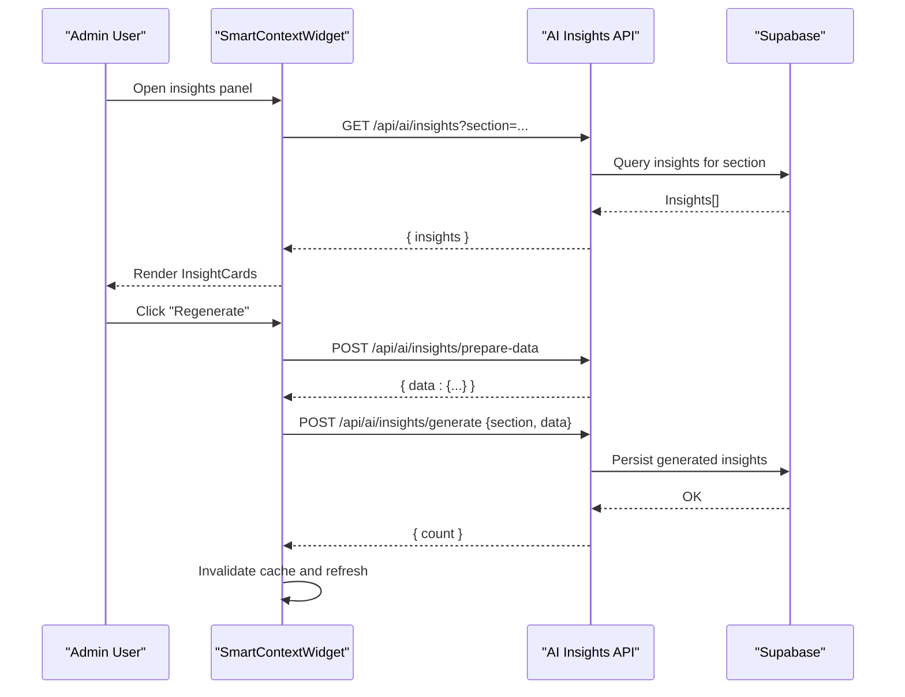
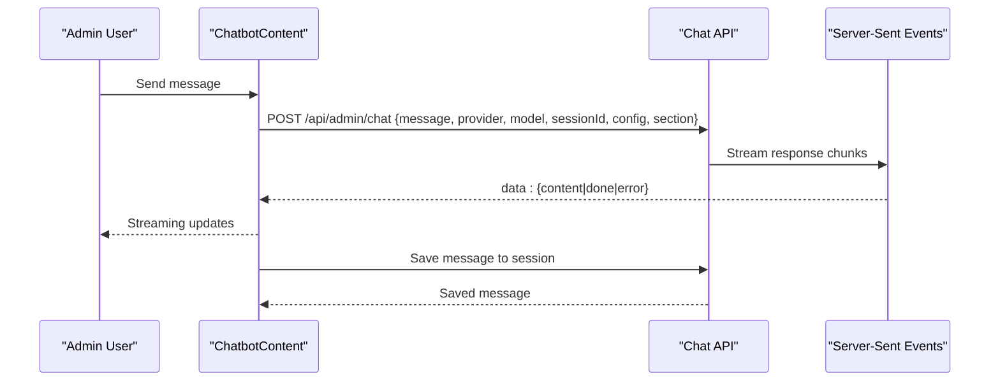
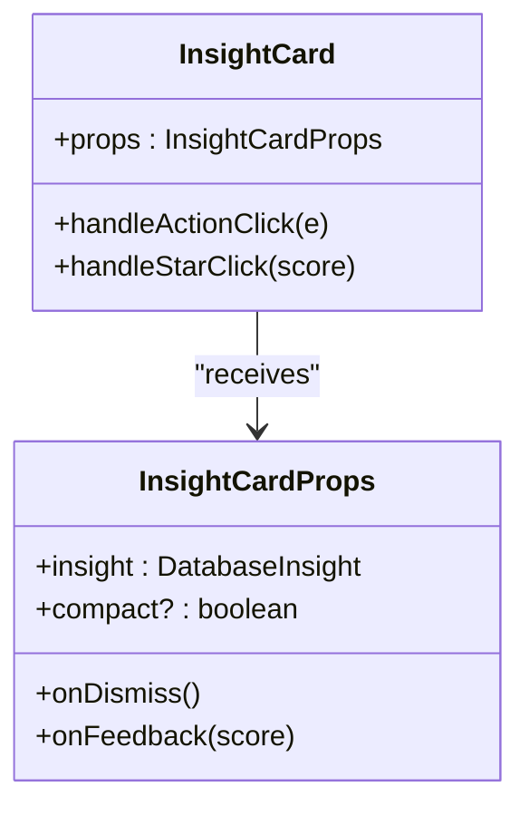
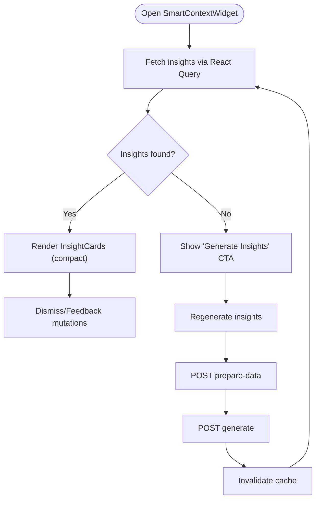
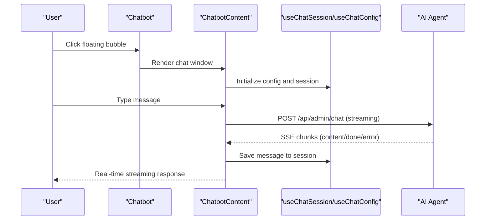
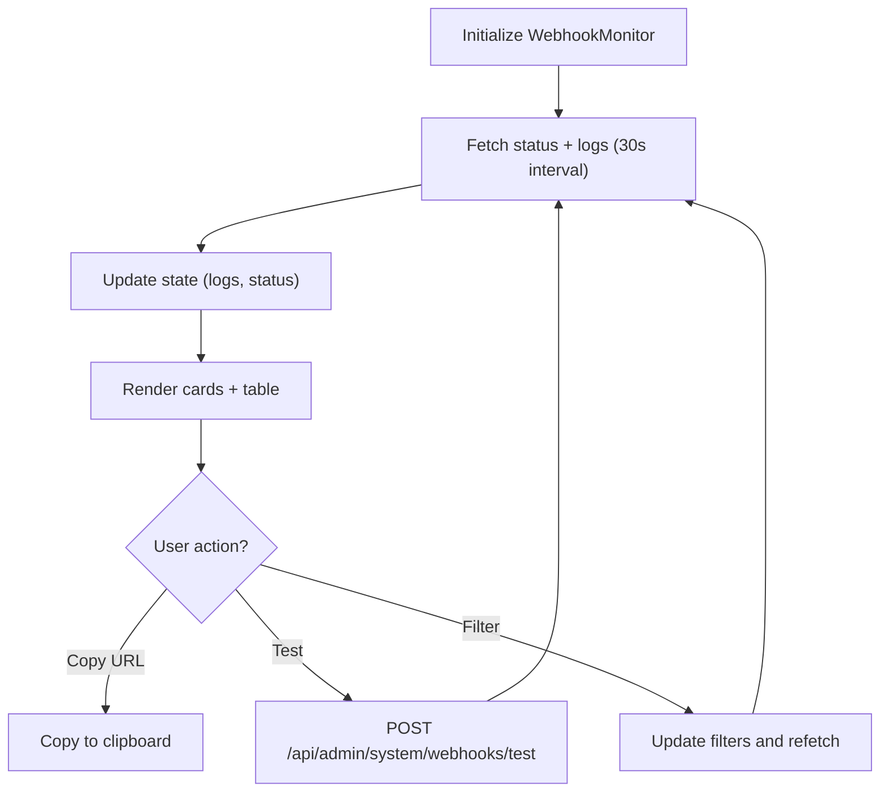
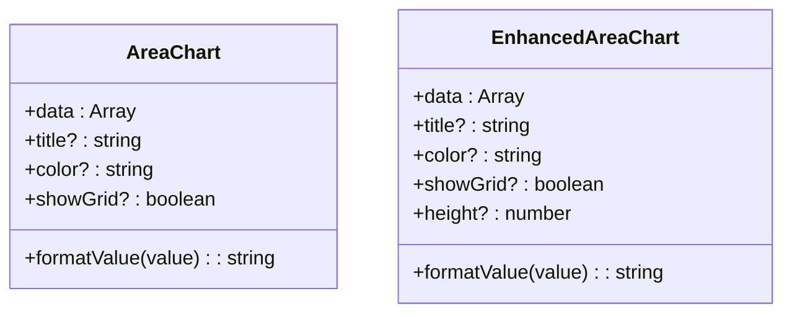
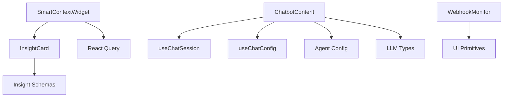

# Specialized Widgets & AI Components

<cite>
**Referenced Files in This Document**
- [InsightCard.tsx](file://src/components/ai/InsightCard.tsx)
- [SmartContextWidget.tsx](file://src/components/ai/SmartContextWidget.tsx)
- [Chatbot.tsx](file://src/components/admin/Chatbot.tsx)
- [ChatbotContent.tsx](file://src/components/admin/ChatbotContent.tsx)
- [WebhookMonitor.tsx](file://src/components/admin/WebhookMonitor.tsx)
- [AreaChart.tsx](file://src/components/admin/charts/AreaChart.tsx)
- [EnhancedAreaChart.tsx](file://src/components/admin/charts/EnhancedAreaChart.tsx)
- [schemas.ts](file://src/lib/ai/insights/schemas.ts)
- [useChatSession.ts](file://src/hooks/useChatSession.ts)
- [useChatConfig.ts](file://src/hooks/useChatConfig.ts)
- [config.ts](file://src/lib/ai/agent/config.ts)
- [types.ts](file://src/lib/ai/types.ts)
</cite>

## Table of Contents

1. [Introduction](#introduction)
2. [Project Structure](#project-structure)
3. [Core Components](#core-components)
4. [Architecture Overview](#architecture-overview)
5. [Detailed Component Analysis](#detailed-component-analysis)
6. [Dependency Analysis](#dependency-analysis)
7. [Performance Considerations](#performance-considerations)
8. [Troubleshooting Guide](#troubleshooting-guide)
9. [Conclusion](#conclusion)

## Introduction

This document explains the specialized widgets and AI-powered components that deliver intelligent insights, interactive AI assistance, and system monitoring capabilities. It focuses on:

- InsightCard: actionable, prioritized insights with feedback and actions
- SmartContextWidget: contextual AI insights panel with regeneration and persistence
- Chatbot and ChatbotContent: AI agent integration with streaming responses, tool calling, and session management
- System monitoring widgets: real-time webhooks monitor and data visualization charts
  It also documents AI agent configuration, NLP interfaces, real-time data flows, external integrations, event handling, and performance optimizations.

## Project Structure

The AI and widget ecosystem spans components, hooks, libraries, and charts:

- Components: InsightCard, SmartContextWidget, Chatbot, ChatbotContent, WebhookMonitor, and chart widgets
- Hooks: useChatSession, useChatConfig for AI sessions and configuration
- Libraries: AI agent configuration, types, and insight schemas
- Charts: SVG-based AreaChart and Recharts EnhancedAreaChart for real-time visualization

**Diagram sources**

- [SmartContextWidget.tsx](file://src/components/ai/SmartContextWidget.tsx#L35-L340)
- [InsightCard.tsx](file://src/components/ai/InsightCard.tsx#L59-L342)
- [Chatbot.tsx](file://src/components/admin/Chatbot.tsx#L26-L94)
- [ChatbotContent.tsx](file://src/components/admin/ChatbotContent.tsx#L70-L628)
- [useChatSession.ts](file://src/hooks/useChatSession.ts#L63-L252)
- [useChatConfig.ts](file://src/hooks/useChatConfig.ts#L64-L243)
- [config.ts](file://src/lib/ai/agent/config.ts#L3-L98)
- [types.ts](file://src/lib/ai/types.ts#L1-L92)
- [schemas.ts](file://src/lib/ai/insights/schemas.ts#L10-L133)
- [AreaChart.tsx](file://src/components/admin/charts/AreaChart.tsx#L13-L279)
- [EnhancedAreaChart.tsx](file://src/components/admin/charts/EnhancedAreaChart.tsx#L33-L188)

**Section sources**

- [InsightCard.tsx](file://src/components/ai/InsightCard.tsx#L1-L342)
- [SmartContextWidget.tsx](file://src/components/ai/SmartContextWidget.tsx#L1-L340)
- [Chatbot.tsx](file://src/components/admin/Chatbot.tsx#L1-L94)
- [ChatbotContent.tsx](file://src/components/admin/ChatbotContent.tsx#L1-L628)
- [WebhookMonitor.tsx](file://src/components/admin/WebhookMonitor.tsx#L75-L511)
- [AreaChart.tsx](file://src/components/admin/charts/AreaChart.tsx#L1-L279)
- [EnhancedAreaChart.tsx](file://src/components/admin/charts/EnhancedAreaChart.tsx#L1-L188)
- [schemas.ts](file://src/lib/ai/insights/schemas.ts#L1-L133)
- [useChatSession.ts](file://src/hooks/useChatSession.ts#L1-L253)
- [useChatConfig.ts](file://src/hooks/useChatConfig.ts#L1-L243)
- [config.ts](file://src/lib/ai/agent/config.ts#L1-L126)
- [types.ts](file://src/lib/ai/types.ts#L1-L92)

## Core Components

- InsightCard: renders a single AI insight with type-specific styling, action buttons, priority dots, and feedback stars. Supports compact and full-size layouts.
- SmartContextWidget: fetches, displays, and manages AI insights for a given section, with regenerating insights, dismissal, and feedback. Integrates with React Query for caching and optimistic updates.
- Chatbot and ChatbotContent: floating AI assistant with streaming responses, tool calling, session management, settings, history, and export capabilities.
- WebhookMonitor: real-time monitoring of webhook deliveries with status, filters, and payload inspection.
- Charts: AreaChart (SVG) and EnhancedAreaChart (Recharts) for real-time data visualization.

**Section sources**

- [InsightCard.tsx](file://src/components/ai/InsightCard.tsx#L59-L342)
- [SmartContextWidget.tsx](file://src/components/ai/SmartContextWidget.tsx#L35-L340)
- [Chatbot.tsx](file://src/components/admin/Chatbot.tsx#L26-L94)
- [ChatbotContent.tsx](file://src/components/admin/ChatbotContent.tsx#L70-L628)
- [WebhookMonitor.tsx](file://src/components/admin/WebhookMonitor.tsx#L75-L511)
- [AreaChart.tsx](file://src/components/admin/charts/AreaChart.tsx#L13-L279)
- [EnhancedAreaChart.tsx](file://src/components/admin/charts/EnhancedAreaChart.tsx#L33-L188)

## Architecture Overview

The AI widgets integrate with backend services via REST endpoints and streaming server-sent events. Data flows from Supabase-backed APIs to the UI, with caching and optimistic updates. AI agent configuration and tool calling are encapsulated in reusable hooks and libraries.

**Diagram sources**

- [SmartContextWidget.tsx](file://src/components/ai/SmartContextWidget.tsx#L44-L151)
- [schemas.ts](file://src/lib/ai/insights/schemas.ts#L79-L81)

**Diagram sources**

- [ChatbotContent.tsx](file://src/components/admin/ChatbotContent.tsx#L204-L430)
- [useChatSession.ts](file://src/hooks/useChatSession.ts#L202-L233)

## Detailed Component Analysis

### InsightCard

- Purpose: Display a single AI insight with type, priority, action link, and feedback.
- Key behaviors:
  - Type-based theming (warning, opportunity, info, neutral)
  - Action handling with metadata injection and router-aware navigation
  - Feedback star rating with hover preview and submission
  - Compact vs full layout variants
- Data model: validated by InsightSchema and DatabaseInsight.

**Diagram sources**

- [InsightCard.tsx](file://src/components/ai/InsightCard.tsx#L17-L64)
- [schemas.ts](file://src/lib/ai/insights/schemas.ts#L62-L74)

**Section sources**

- [InsightCard.tsx](file://src/components/ai/InsightCard.tsx#L59-L342)
- [schemas.ts](file://src/lib/ai/insights/schemas.ts#L62-L74)

### SmartContextWidget

- Purpose: Contextual AI insights panel with embedded and popover variants.
- Key behaviors:
  - Fetches insights via React Query with caching and retries
  - Dismissal and feedback mutations with cache invalidation
  - Regeneration pipeline: prepare-data endpoint followed by generate endpoint
  - Sorting by priority and badge counting
- Integration points:
  - Uses InsightCard for rendering
  - Exposes onClose callback for embedded mode

**Diagram sources**

- [SmartContextWidget.tsx](file://src/components/ai/SmartContextWidget.tsx#L44-L151)
- [InsightCard.tsx](file://src/components/ai/InsightCard.tsx#L59-L342)

**Section sources**

- [SmartContextWidget.tsx](file://src/components/ai/SmartContextWidget.tsx#L35-L340)
- [schemas.ts](file://src/lib/ai/insights/schemas.ts#L112-L133)

### Chatbot and ChatbotContent

- Purpose: AI agent assistant with streaming responses, tool calling, and session management.
- Key behaviors:
  - Pathname-to-section mapping for context
  - Floating bubble with animated transitions
  - Streaming via server-sent events with incremental content updates
  - Tool browser, settings, history sidebar, and export dialog
  - Keyboard shortcuts for settings, history, and new session
- Integration points:
  - useChatSession for session lifecycle
  - useChatConfig for provider/model and system prompt presets
  - Agent configuration and tool interfaces

**Diagram sources**

- [Chatbot.tsx](file://src/components/admin/Chatbot.tsx#L26-L94)
- [ChatbotContent.tsx](file://src/components/admin/ChatbotContent.tsx#L70-L628)
- [useChatSession.ts](file://src/hooks/useChatSession.ts#L63-L252)
- [useChatConfig.ts](file://src/hooks/useChatConfig.ts#L64-L243)
- [config.ts](file://src/lib/ai/agent/config.ts#L3-L98)
- [types.ts](file://src/lib/ai/types.ts#L1-L92)

**Section sources**

- [Chatbot.tsx](file://src/components/admin/Chatbot.tsx#L26-L94)
- [ChatbotContent.tsx](file://src/components/admin/ChatbotContent.tsx#L70-L628)
- [useChatSession.ts](file://src/hooks/useChatSession.ts#L63-L252)
- [useChatConfig.ts](file://src/hooks/useChatConfig.ts#L64-L243)
- [config.ts](file://src/lib/ai/agent/config.ts#L3-L98)
- [types.ts](file://src/lib/ai/types.ts#L1-L92)

### WebhookMonitor

- Purpose: Monitor webhook deliveries (MeradoPago, Sanity) with live status and logs.
- Key behaviors:
  - Periodic polling (every 30s) with combined fetches
  - Filter by type and status
  - Copy webhook URLs and test delivery
  - View detailed payload and error messages
- Real-time characteristics:
  - Automatic refresh loop
  - Immediate feedback via toast notifications

**Diagram sources**

- [WebhookMonitor.tsx](file://src/components/admin/WebhookMonitor.tsx#L84-L133)

**Section sources**

- [WebhookMonitor.tsx](file://src/components/admin/WebhookMonitor.tsx#L75-L511)

### Charts: AreaChart and EnhancedAreaChart

- Purpose: Visualize time-series data with area fills and summary statistics.
- Key behaviors:
  - AreaChart: SVG-based with smooth curves, gradient fills, and interactive hover points
  - EnhancedAreaChart: Recharts-based with responsive containers, tooltips, and large-number formatting
  - Both support custom color, value formatting, grid visibility, and summary stats

**Diagram sources**

- [AreaChart.tsx](file://src/components/admin/charts/AreaChart.tsx#L13-L48)
- [EnhancedAreaChart.tsx](file://src/components/admin/charts/EnhancedAreaChart.tsx#L33-L47)

**Section sources**

- [AreaChart.tsx](file://src/components/admin/charts/AreaChart.tsx#L13-L279)
- [EnhancedAreaChart.tsx](file://src/components/admin/charts/EnhancedAreaChart.tsx#L33-L188)

## Dependency Analysis

- Component coupling:
  - SmartContextWidget depends on InsightCard and React Query
  - ChatbotContent depends on useChatSession, useChatConfig, and agent configuration
  - WebhookMonitor depends on UI primitives and toast notifications
- External integrations:
  - AI insights: REST endpoints for prepare-data and generate
  - Chat streaming: SSE endpoints for incremental responses
  - Webhooks: status and logs endpoints plus test endpoint
- Data validation:
  - Insight schemas enforce type, priority, and metadata constraints
  - LLM types define provider, model, and tool interfaces

**Diagram sources**

- [SmartContextWidget.tsx](file://src/components/ai/SmartContextWidget.tsx#L35-L340)
- [InsightCard.tsx](file://src/components/ai/InsightCard.tsx#L59-L342)
- [ChatbotContent.tsx](file://src/components/admin/ChatbotContent.tsx#L70-L628)
- [useChatSession.ts](file://src/hooks/useChatSession.ts#L63-L252)
- [useChatConfig.ts](file://src/hooks/useChatConfig.ts#L64-L243)
- [config.ts](file://src/lib/ai/agent/config.ts#L3-L98)
- [types.ts](file://src/lib/ai/types.ts#L1-L92)
- [schemas.ts](file://src/lib/ai/insights/schemas.ts#L62-L74)
- [WebhookMonitor.tsx](file://src/components/admin/WebhookMonitor.tsx#L75-L511)

**Section sources**

- [schemas.ts](file://src/lib/ai/insights/schemas.ts#L10-L133)
- [types.ts](file://src/lib/ai/types.ts#L1-L92)
- [config.ts](file://src/lib/ai/agent/config.ts#L104-L126)
- [useChatSession.ts](file://src/hooks/useChatSession.ts#L63-L252)
- [useChatConfig.ts](file://src/hooks/useChatConfig.ts#L64-L243)
- [SmartContextWidget.tsx](file://src/components/ai/SmartContextWidget.tsx#L35-L340)
- [ChatbotContent.tsx](file://src/components/admin/ChatbotContent.tsx#L70-L628)
- [WebhookMonitor.tsx](file://src/components/admin/WebhookMonitor.tsx#L75-L511)

## Performance Considerations

- Caching and stale-while-revalidate:
  - SmartContextWidget caches insights for 5 minutes and disables refetch on window focus to reduce network load.
- Streaming optimizations:
  - ChatbotContent streams incremental content via SSE, minimizing DOM updates and enabling immediate perceived responsiveness.
- Memoization:
  - EnhancedAreaChart uses React.memo and Recharts for efficient rerenders.
- Debouncing and batching:
  - Consider debouncing frequent filters in WebhookMonitor to avoid excessive polling.
- Network resilience:
  - Retry logic in SmartContextWidget and error boundaries in ChatbotContent improve reliability.

[No sources needed since this section provides general guidance]

## Troubleshooting Guide

- AI insights not appearing:
  - Verify section parameter and endpoint availability; check for 404 handling and error toast.
  - Use "Regenerate" to force data preparation and generation.
- Chat streaming fails:
  - Confirm SSE endpoint is reachable and not blocked by CORS; inspect console for parse errors.
  - Validate provider/model selection and API keys via useChatConfig.
- Webhook monitor shows no logs:
  - Ensure webhook URLs are copied correctly and tested; check periodic polling status.
  - Review filter criteria and refresh button to trigger manual fetch.

**Section sources**

- [SmartContextWidget.tsx](file://src/components/ai/SmartContextWidget.tsx#L44-L151)
- [ChatbotContent.tsx](file://src/components/admin/ChatbotContent.tsx#L282-L430)
- [WebhookMonitor.tsx](file://src/components/admin/WebhookMonitor.tsx#L84-L133)

## Conclusion

The specialized widgets and AI components provide a cohesive, real-time, and extensible foundation for intelligent insights, contextual AI assistance, and system monitoring. They leverage validated schemas, robust hooks, and streaming protocols to deliver responsive experiences while maintaining clear separation of concerns and performance-conscious design.
