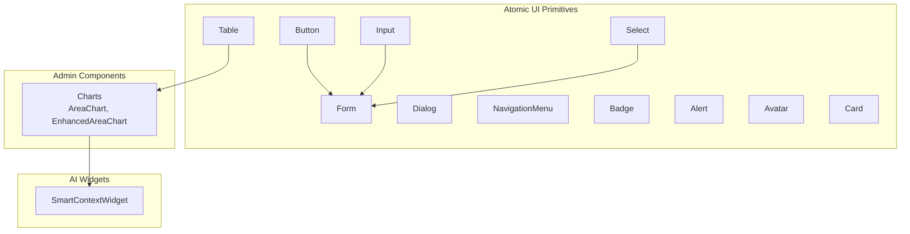
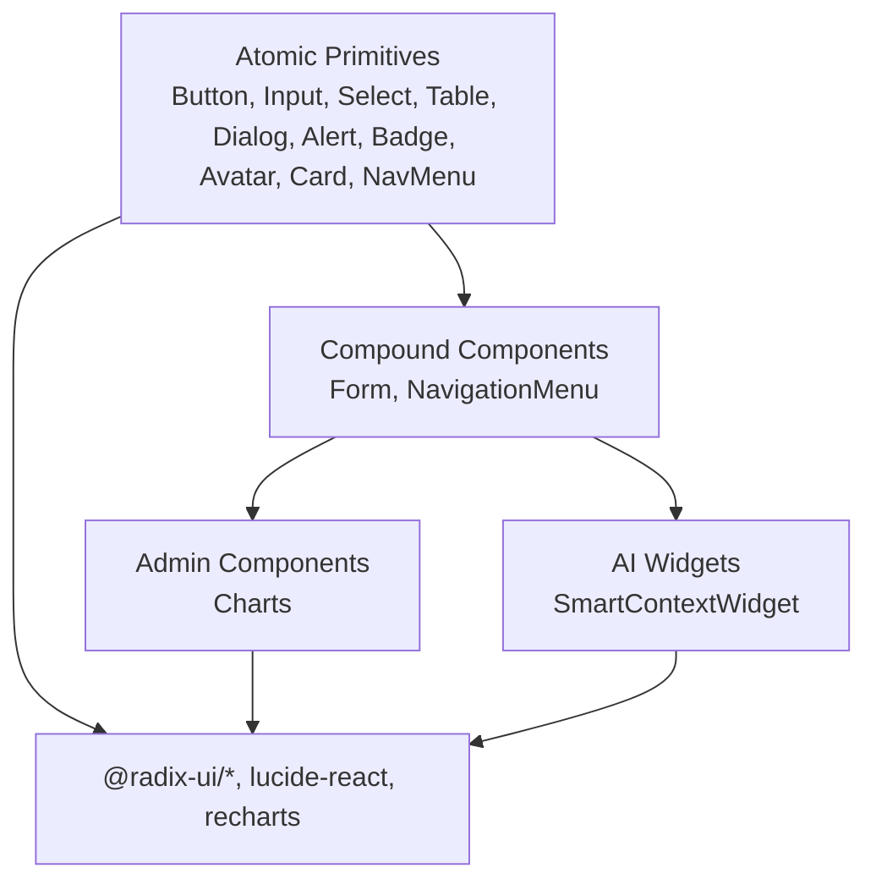
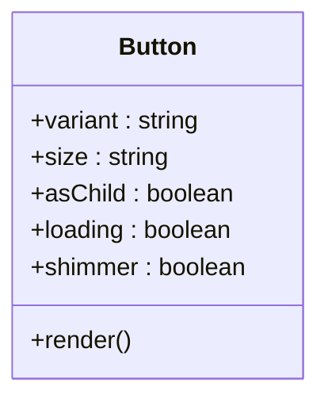
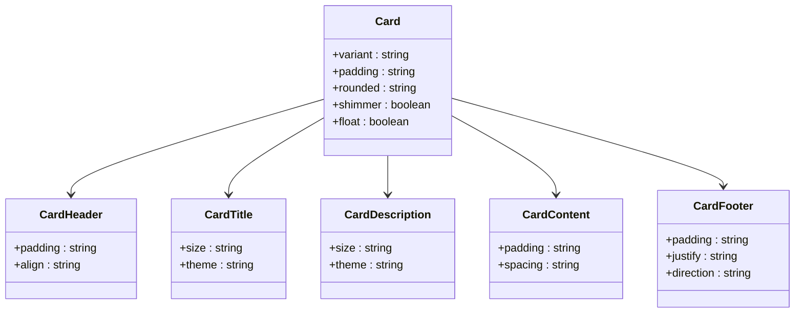
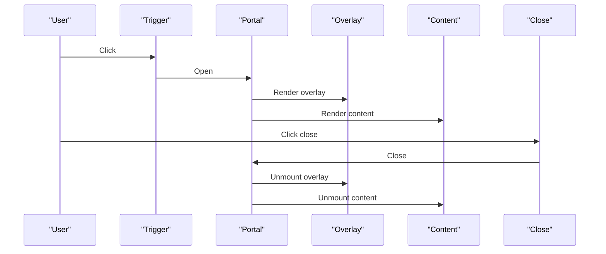
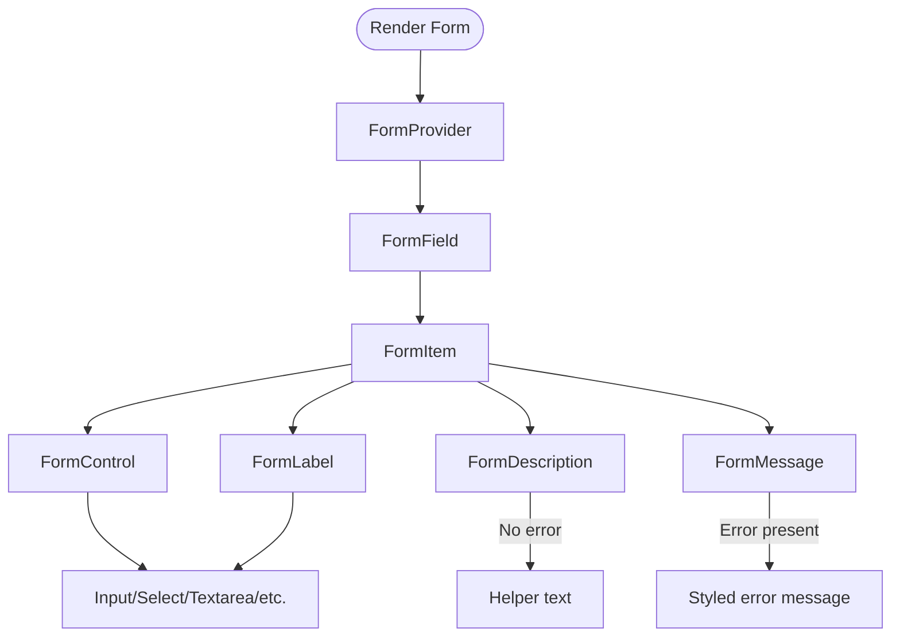
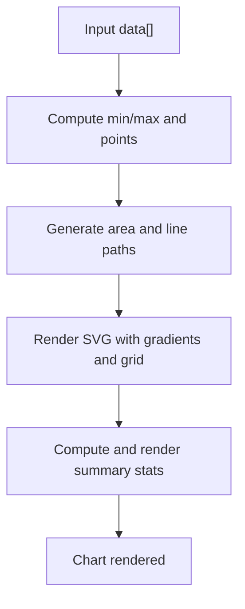
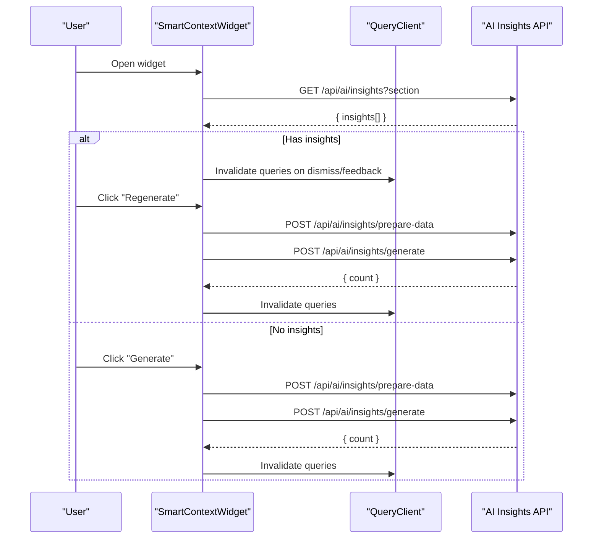
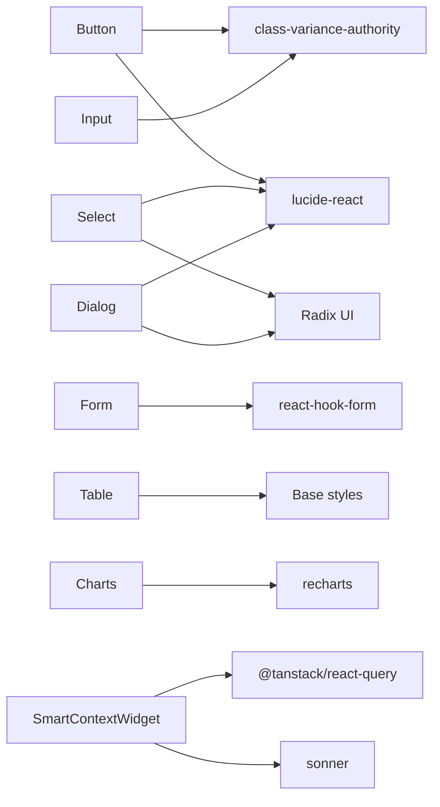

# UI Component Library

<cite>
**Referenced Files in This Document**
- [button.tsx](file://src/components/ui/button.tsx)
- [card.tsx](file://src/components/ui/card.tsx)
- [dialog.tsx](file://src/components/ui/dialog.tsx)
- [form.tsx](file://src/components/ui/form.tsx)
- [table.tsx](file://src/components/ui/table.tsx)
- [input.tsx](file://src/components/ui/input.tsx)
- [select.tsx](file://src/components/ui/select.tsx)
- [alert.tsx](file://src/components/ui/alert.tsx)
- [badge.tsx](file://src/components/ui/badge.tsx)
- [avatar.tsx](file://src/components/ui/avatar.tsx)
- [navigation-menu.tsx](file://src/components/ui/navigation-menu.tsx)
- [AreaChart.tsx](file://src/components/admin/charts/AreaChart.tsx)
- [EnhancedAreaChart.tsx](file://src/components/admin/charts/EnhancedAreaChart.tsx)
- [SmartContextWidget.tsx](file://src/components/ai/SmartContextWidget.tsx)
</cite>

## Table of Contents

1. [Introduction](#introduction)
2. [Project Structure](#project-structure)
3. [Core Components](#core-components)
4. [Architecture Overview](#architecture-overview)
5. [Detailed Component Analysis](#detailed-component-analysis)
6. [Dependency Analysis](#dependency-analysis)
7. [Performance Considerations](#performance-considerations)
8. [Troubleshooting Guide](#troubleshooting-guide)
9. [Conclusion](#conclusion)
10. [Appendices](#appendices)

## Introduction

This document describes the Opttius UI component library, focusing on the design system and reusable components. It explains the component architecture grounded in atomic design principles, compound components, and a cohesive design system. It documents visual appearance, behavior, user interaction patterns, props/attributes, events, customization, responsive design, accessibility, cross-browser compatibility, theming, composition patterns, performance, animations, and integration with other UI elements. It also outlines the relationships among admin components, landing page components, and specialized components such as AI widgets and charts.

## Project Structure

The UI library is organized by feature domains:

- Atomic UI primitives under src/components/ui (buttons, inputs, forms, tables, dialogs, navigation menus, badges, alerts, avatars)
- Admin-specific components under src/components/admin (including charts)
- AI widgets under src/components/ai
- Shared utilities and design tokens are referenced via Tailwind classes and CSS variables

**Diagram sources**

- [button.tsx](file://src/components/ui/button.tsx#L1-L149)
- [input.tsx](file://src/components/ui/input.tsx#L1-L215)
- [select.tsx](file://src/components/ui/select.tsx#L1-L160)
- [form.tsx](file://src/components/ui/form.tsx#L1-L179)
- [table.tsx](file://src/components/ui/table.tsx#L1-L121)
- [dialog.tsx](file://src/components/ui/dialog.tsx#L1-L123)
- [navigation-menu.tsx](file://src/components/ui/navigation-menu.tsx#L1-L144)
- [badge.tsx](file://src/components/ui/badge.tsx#L1-L39)
- [alert.tsx](file://src/components/ui/alert.tsx#L1-L60)
- [avatar.tsx](file://src/components/ui/avatar.tsx#L1-L51)
- [card.tsx](file://src/components/ui/card.tsx#L1-L286)
- [AreaChart.tsx](file://src/components/admin/charts/AreaChart.tsx#L1-L279)
- [EnhancedAreaChart.tsx](file://src/components/admin/charts/EnhancedAreaChart.tsx#L1-L188)
- [SmartContextWidget.tsx](file://src/components/ai/SmartContextWidget.tsx#L1-L340)

**Section sources**

- [button.tsx](file://src/components/ui/button.tsx#L1-L149)
- [input.tsx](file://src/components/ui/input.tsx#L1-L215)
- [select.tsx](file://src/components/ui/select.tsx#L1-L160)
- [form.tsx](file://src/components/ui/form.tsx#L1-L179)
- [table.tsx](file://src/components/ui/table.tsx#L1-L121)
- [dialog.tsx](file://src/components/ui/dialog.tsx#L1-L123)
- [navigation-menu.tsx](file://src/components/ui/navigation-menu.tsx#L1-L144)
- [badge.tsx](file://src/components/ui/badge.tsx#L1-L39)
- [alert.tsx](file://src/components/ui/alert.tsx#L1-L60)
- [avatar.tsx](file://src/components/ui/avatar.tsx#L1-L51)
- [card.tsx](file://src/components/ui/card.tsx#L1-L286)
- [AreaChart.tsx](file://src/components/admin/charts/AreaChart.tsx#L1-L279)
- [EnhancedAreaChart.tsx](file://src/components/admin/charts/EnhancedAreaChart.tsx#L1-L188)
- [SmartContextWidget.tsx](file://src/components/ai/SmartContextWidget.tsx#L1-L340)

## Core Components

This section summarizes the primary UI building blocks and their design system characteristics.

- Button
  - Variants: default, destructive, outline, secondary, ghost, link, pill
  - Sizes: xs, sm, default, lg, icon, icon-sm
  - Behaviors: loading spinner, shimmer effect, asChild slot, disabled state
  - Accessibility: focus-visible ring, proper disabled handling
  - Animation: hover lift and shadow transitions, shimmer gradient animation

- Card
  - Variants: default, elevated, interactive, outline, ghost, glass
  - Padding and rounded options
  - Subcomponents: CardHeader, CardTitle, CardDescription, CardContent, CardFooter
  - Effects: shimmer gradient, floating animation

- Dialog
  - Root, Trigger, Portal, Close, Overlay, Content, Header, Footer, Title, Description
  - Animations: fade and slide transitions, zoom effects
  - Accessibility: focus trapping, portal rendering, screen reader labels

- Form
  - Compound components: Form, FormField, FormItem, FormLabel, FormControl, FormDescription, FormMessage
  - Integrates with react-hook-form and Radix UI
  - Accessibility: aria-invalid, aria-describedby, generated IDs

- Table
  - Wrapper with horizontal scrolling, responsive table cells
  - Subcomponents: Table, TableHeader, TableBody, TableFooter, TableRow, TableHead, TableCell, TableCaption

- Input
  - Variants: default, elegant, outline, filled, ghost, brand families, line families, product families, state variants (error, success, warning)
  - Sizes and rounding options
  - Icons, labels, helper/error/success messaging, loading state

- Select
  - Root, Group, Value, Trigger, Content, Label, Item, Separator, ScrollUp/Down buttons
  - Popover positioning, viewport sizing, keyboard navigation

- Alert
  - Variants: default, destructive
  - Semantic roles and icons

- Badge
  - Variants: default, secondary, destructive, outline, healty

- Avatar
  - Root, Image, Fallback

- NavigationMenu
  - Root, List, Item, Trigger, Content, Link, Viewport, Indicator
  - Motion classes for open/close states

**Section sources**

- [button.tsx](file://src/components/ui/button.tsx#L7-L38)
- [card.tsx](file://src/components/ui/card.tsx#L6-L44)
- [dialog.tsx](file://src/components/ui/dialog.tsx#L9-L54)
- [form.tsx](file://src/components/ui/form.tsx#L18-L42)
- [table.tsx](file://src/components/ui/table.tsx#L5-L17)
- [input.tsx](file://src/components/ui/input.tsx#L6-L73)
- [select.tsx](file://src/components/ui/select.tsx#L9-L33)
- [alert.tsx](file://src/components/ui/alert.tsx#L6-L20)
- [badge.tsx](file://src/components/ui/badge.tsx#L6-L26)
- [avatar.tsx](file://src/components/ui/avatar.tsx#L8-L21)
- [navigation-menu.tsx](file://src/components/ui/navigation-menu.tsx#L8-L24)

## Architecture Overview

The component library follows a layered architecture:

- Atomic primitives define base styles and behaviors
- Compound components encapsulate form logic and interactions
- Specialized components (charts, AI widgets) integrate external libraries and domain logic
- Theming and design tokens are applied via Tailwind utilities and CSS variables

**Diagram sources**

- [button.tsx](file://src/components/ui/button.tsx#L1-L149)
- [input.tsx](file://src/components/ui/input.tsx#L1-L215)
- [select.tsx](file://src/components/ui/select.tsx#L1-L160)
- [form.tsx](file://src/components/ui/form.tsx#L1-L179)
- [table.tsx](file://src/components/ui/table.tsx#L1-L121)
- [dialog.tsx](file://src/components/ui/dialog.tsx#L1-L123)
- [alert.tsx](file://src/components/ui/alert.tsx#L1-L60)
- [badge.tsx](file://src/components/ui/badge.tsx#L1-L39)
- [avatar.tsx](file://src/components/ui/avatar.tsx#L1-L51)
- [card.tsx](file://src/components/ui/card.tsx#L1-L286)
- [navigation-menu.tsx](file://src/components/ui/navigation-menu.tsx#L1-L144)
- [AreaChart.tsx](file://src/components/admin/charts/AreaChart.tsx#L1-L279)
- [EnhancedAreaChart.tsx](file://src/components/admin/charts/EnhancedAreaChart.tsx#L1-L188)
- [SmartContextWidget.tsx](file://src/components/ai/SmartContextWidget.tsx#L1-L340)

## Detailed Component Analysis

### Button

- Purpose: Unified action primitive with consistent motion and states
- Props
  - variant: default | destructive | outline | secondary | ghost | link | pill
  - size: xs | sm | default | lg | icon | icon-sm
  - asChild: renders children via Slot for semantic composition
  - loading: shows spinner and disables interaction
  - shimmer: animated gradient overlay
  - Additional button attributes supported
- Behavior
  - Disabled state disables interaction and removes transforms
  - Loading toggles pointer-events and adds wait cursor
  - asChild ensures single child compatibility when loading
- Accessibility
  - Focus-visible ring, proper disabled handling
- Customization
  - Variant and size classes via class-variance-authority
  - Shimmer effect uses pseudo-elements and gradient animation

**Diagram sources**

- [button.tsx](file://src/components/ui/button.tsx#L40-L46)

**Section sources**

- [button.tsx](file://src/components/ui/button.tsx#L40-L146)

### Card

- Purpose: Container with multiple presentation modes and subcomponents
- Props
  - variant: default | elevated | interactive | outline | ghost | glass
  - padding: none | sm | default | lg | xl
  - rounded: none | sm | default | lg | full
  - shimmer, float: visual effects
- Subcomponents
  - CardHeader: padding, alignment
  - CardTitle: size, theme
  - CardDescription: size, theme
  - CardContent: padding, spacing
  - CardFooter: padding, justify, direction
- Customization
  - CSS variables for admin backgrounds
  - Floating animation via class name

**Diagram sources**

- [card.tsx](file://src/components/ui/card.tsx#L46-L51)
- [card.tsx](file://src/components/ui/card.tsx#L102-L104)
- [card.tsx](file://src/components/ui/card.tsx#L138-L140)
- [card.tsx](file://src/components/ui/card.tsx#L172-L174)
- [card.tsx](file://src/components/ui/card.tsx#L209-L211)
- [card.tsx](file://src/components/ui/card.tsx#L254-L256)

**Section sources**

- [card.tsx](file://src/components/ui/card.tsx#L46-L285)

### Dialog

- Purpose: Modal overlay with focus management and animations
- Props
  - Root: DialogPrimitive.Root
  - Trigger: DialogPrimitive.Trigger
  - Portal: DialogPrimitive.Portal
  - Close: DialogPrimitive.Close
  - Overlay: styled overlay with fade
  - Content: centered grid with slide/fade/zoom transitions
  - Header/Footer: layout helpers
  - Title/Description: semantic labeling
- Accessibility
  - Portal rendering, focus trapping, screen reader labels

**Diagram sources**

- [dialog.tsx](file://src/components/ui/dialog.tsx#L9-L54)

**Section sources**

- [dialog.tsx](file://src/components/ui/dialog.tsx#L9-L122)

### Form (Compound Component)

- Purpose: Encapsulated form state and validation with accessibility
- Composition
  - Form: Provider for react-hook-form
  - FormField: wraps Controller with name context
  - FormItem: generates IDs and manages spacing
  - FormLabel: binds label to field
  - FormControl: passes refs and ARIA attributes
  - FormDescription/FormMessage: contextual messaging
- Accessible IDs and roles are auto-generated

**Diagram sources**

- [form.tsx](file://src/components/ui/form.tsx#L18-L42)
- [form.tsx](file://src/components/ui/form.tsx#L75-L87)
- [form.tsx](file://src/components/ui/form.tsx#L89-L104)
- [form.tsx](file://src/components/ui/form.tsx#L106-L126)
- [form.tsx](file://src/components/ui/form.tsx#L128-L143)
- [form.tsx](file://src/components/ui/form.tsx#L145-L167)

**Section sources**

- [form.tsx](file://src/components/ui/form.tsx#L18-L178)

### Table

- Purpose: Responsive tabular data with accessible markup
- Features
  - Horizontal scroll wrapper
  - Hover and selection states
  - Checkbox-aligned columns
- Subcomponents mirror HTML semantics

**Section sources**

- [table.tsx](file://src/components/ui/table.tsx#L5-L120)

### Input

- Purpose: Text input with extensive variant system and state feedback
- Props
  - variant: default | elegant | outline | filled | ghost | brand families | line families | product families | error | success | warning
  - inputSize: sm | default | lg | xl
  - rounded: none | sm | default | lg | xl | full
  - label, error, success, helper, leftIcon, rightIcon, loading
- Behavior
  - Auto-selects variant based on error/success
  - Positions icons and adjusts padding
  - Supports disabled/loading states

**Section sources**

- [input.tsx](file://src/components/ui/input.tsx#L75-L214)

### Select

- Purpose: Accessible dropdown with virtualized viewport and scroll controls
- Props
  - Root, Group, Value, Trigger, Content, Label, Item, Separator, ScrollUp/Down
- Behavior
  - Popper positioning, viewport sizing, keyboard navigation, indicator rotation

**Section sources**

- [select.tsx](file://src/components/ui/select.tsx#L15-L159)

### Alert

- Purpose: Contextual notification with semantic role and icon placement
- Props
  - variant: default | destructive

**Section sources**

- [alert.tsx](file://src/components/ui/alert.tsx#L6-L59)

### Badge

- Purpose: Small status or metadata label
- Props
  - variant: default | secondary | destructive | outline | healty

**Section sources**

- [badge.tsx](file://src/components/ui/badge.tsx#L6-L38)

### Avatar

- Purpose: User identity with fallback
- Props
  - Avatar, AvatarImage, AvatarFallback

**Section sources**

- [avatar.tsx](file://src/components/ui/avatar.tsx#L8-L50)

### NavigationMenu

- Purpose: Multi-level navigation with motion states
- Props
  - Root, List, Item, Trigger/Button, Content, Link, Viewport, Indicator
- Behavior
  - Chevron rotation on open
  - Motion classes for animations

**Section sources**

- [navigation-menu.tsx](file://src/components/ui/navigation-menu.tsx#L8-L143)

### Charts (Admin)

- AreaChart
  - SVG-based area chart with dynamic gradients, optional grid, summary statistics
  - Props: data[], title, color, formatValue, showGrid
  - Behavior: computes min/max, smooth curves, hover tooltips, summary stats
- EnhancedAreaChart
  - Recharts-based chart with responsive container, tooltip, legend, grid
  - Props: data[], title, color, formatValue, showGrid, height

**Diagram sources**

- [AreaChart.tsx](file://src/components/admin/charts/AreaChart.tsx#L20-L98)
- [EnhancedAreaChart.tsx](file://src/components/admin/charts/EnhancedAreaChart.tsx#L41-L81)

**Section sources**

- [AreaChart.tsx](file://src/components/admin/charts/AreaChart.tsx#L5-L278)
- [EnhancedAreaChart.tsx](file://src/components/admin/charts/EnhancedAreaChart.tsx#L15-L187)

### AI Widget (SmartContextWidget)

- Purpose: Context-aware insights panel with popover or embedded variants
- Props
  - section: InsightSection
  - variant: "popover" | "embedded"
  - onClose: callback for embedded mode
- Features
  - Fetch insights via react-query
  - Dismiss and feedback mutations
  - Regenerate insights workflow
  - Sorting by priority, loading states, toast notifications

**Diagram sources**

- [SmartContextWidget.tsx](file://src/components/ai/SmartContextWidget.tsx#L44-L101)
- [SmartContextWidget.tsx](file://src/components/ai/SmartContextWidget.tsx#L104-L151)

**Section sources**

- [SmartContextWidget.tsx](file://src/components/ai/SmartContextWidget.tsx#L27-L339)

## Dependency Analysis

- Internal dependencies
  - UI primitives compose into compound components (Button → Form, Input → Form)
  - Admin charts depend on data structures and recharts
  - AI widget depends on react-query, TanStack Query, and Sonner for notifications
- External dependencies
  - @radix-ui/react-\* for accessible primitives
  - lucide-react for icons
  - recharts for enhanced charts
  - class-variance-authority for variant systems
  - Tailwind CSS for styling and design tokens

**Diagram sources**

- [button.tsx](file://src/components/ui/button.tsx#L1-L6)
- [input.tsx](file://src/components/ui/input.tsx#L1-L5)
- [select.tsx](file://src/components/ui/select.tsx#L1-L6)
- [dialog.tsx](file://src/components/ui/dialog.tsx#L1-L8)
- [form.tsx](file://src/components/ui/form.tsx#L1-L17)
- [table.tsx](file://src/components/ui/table.tsx#L1-L4)
- [AreaChart.tsx](file://src/components/admin/charts/AreaChart.tsx#L1-L1)
- [EnhancedAreaChart.tsx](file://src/components/admin/charts/EnhancedAreaChart.tsx#L1-L13)
- [SmartContextWidget.tsx](file://src/components/ai/SmartContextWidget.tsx#L1-L22)

**Section sources**

- [button.tsx](file://src/components/ui/button.tsx#L1-L6)
- [input.tsx](file://src/components/ui/input.tsx#L1-L5)
- [select.tsx](file://src/components/ui/select.tsx#L1-L6)
- [dialog.tsx](file://src/components/ui/dialog.tsx#L1-L8)
- [form.tsx](file://src/components/ui/form.tsx#L1-L17)
- [table.tsx](file://src/components/ui/table.tsx#L1-L4)
- [AreaChart.tsx](file://src/components/admin/charts/AreaChart.tsx#L1-L1)
- [EnhancedAreaChart.tsx](file://src/components/admin/charts/EnhancedAreaChart.tsx#L1-L13)
- [SmartContextWidget.tsx](file://src/components/ai/SmartContextWidget.tsx#L1-L22)

## Performance Considerations

- Memoization
  - AreaChart uses React.memo to avoid unnecessary re-renders
- Lazy loading and portals
  - Dialog uses portals to minimize DOM thrashing
- CSS transitions
  - Buttons and cards use short-duration transitions for smooth UX without heavy repaints
- Data visualization
  - Charts compute paths and labels efficiently; consider virtualization for very large datasets
- Queries
  - AI widget caches insights for 5 minutes and invalidates on mutations

**Section sources**

- [AreaChart.tsx](file://src/components/admin/charts/AreaChart.tsx#L277-L279)
- [dialog.tsx](file://src/components/ui/dialog.tsx#L36-L52)
- [button.tsx](file://src/components/ui/button.tsx#L127-L143)
- [card.tsx](file://src/components/ui/card.tsx#L66-L76)
- [SmartContextWidget.tsx](file://src/components/ai/SmartContextWidget.tsx#L62-L65)

## Troubleshooting Guide

- Form validation errors
  - Ensure FormField wraps Controller and FormItem provides IDs
  - Use FormMessage to surface errors; it reads from field state
- Dialog focus issues
  - Confirm Portal is rendered and Overlay/Content are present
  - Verify Close button exists and is reachable via keyboard
- Chart displays “No data”
  - Ensure data array is non-empty and contains expected keys
  - Check color/formatValue props for validity
- AI widget not updating
  - Confirm queryKey includes section and invalidateQueries is called after mutations
  - Inspect network requests to API endpoints for prepare-data and generate

**Section sources**

- [form.tsx](file://src/components/ui/form.tsx#L44-L65)
- [dialog.tsx](file://src/components/ui/dialog.tsx#L17-L54)
- [AreaChart.tsx](file://src/components/admin/charts/AreaChart.tsx#L50-L59)
- [EnhancedAreaChart.tsx](file://src/components/admin/charts/EnhancedAreaChart.tsx#L49-L58)
- [SmartContextWidget.tsx](file://src/components/ai/SmartContextWidget.tsx#L76-L101)

## Conclusion

The Opttius UI component library provides a robust, accessible, and customizable design system. Atomic primitives enable consistent behavior and styling, while compound components encapsulate complex interactions. Admin and AI components extend the system with domain-specific capabilities. The library emphasizes performance, accessibility, and composability, enabling teams to build scalable interfaces across admin dashboards, landing pages, and specialized widgets.

## Appendices

### Responsive Design Guidelines

- Prefer fluid layouts with padding and spacing scales
- Use Tailwind utilities for breakpoints and responsive typography
- Ensure charts and tables remain usable on small screens (scroll containers, compact sizes)

### Accessibility Compliance

- Buttons and inputs expose focus rings and disabled states
- Dialogs manage focus trapping and ARIA roles
- Forms use aria-invalid and aria-describedby for assistive tech
- Charts include titles and tooltips for context

### Cross-Browser Compatibility

- Use Tailwind defaults and widely supported CSS features
- Avoid experimental APIs; rely on Radix UI polyfills where applicable

### Style Customization and Theming

- Variants and sizes are defined via class-variance-authority; customize by extending variant sets
- CSS variables for admin backgrounds and brand tokens enable theme switching
- Tailwind’s dark mode and color customization support flexible theming

### Component Composition Patterns

- asChild pattern (Button) enables semantic composition
- Compound components (Form) reduce boilerplate and improve consistency
- Embedding vs popover (SmartContextWidget) supports flexible placements
