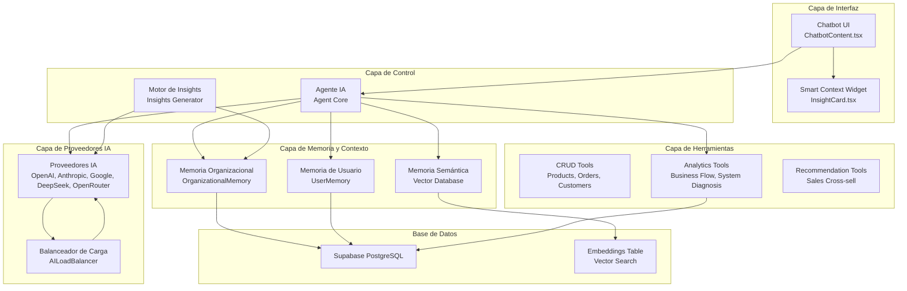
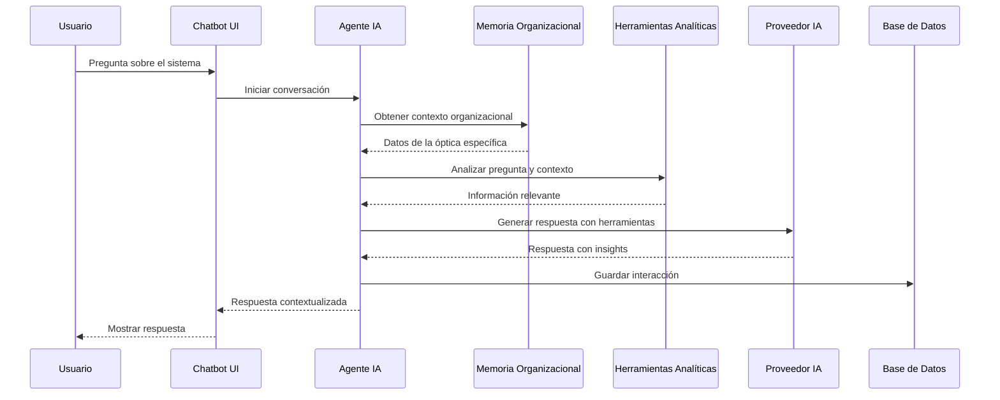
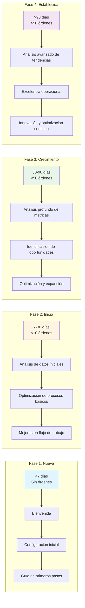
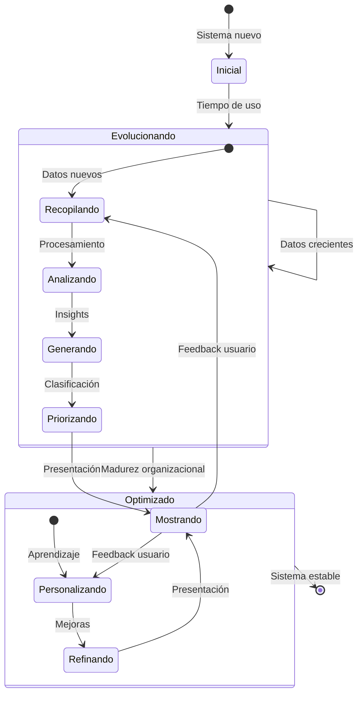
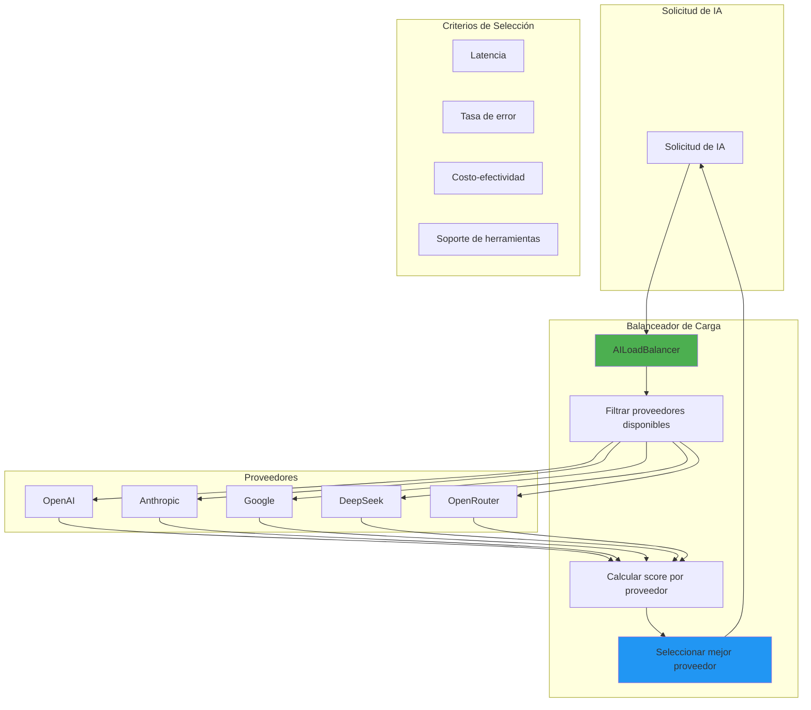
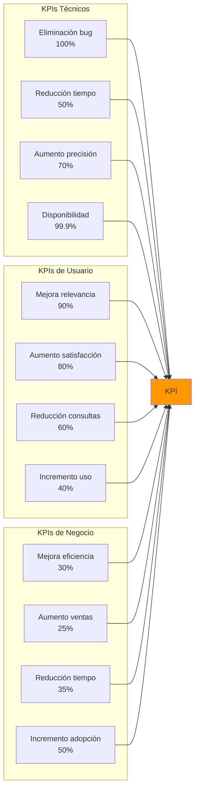
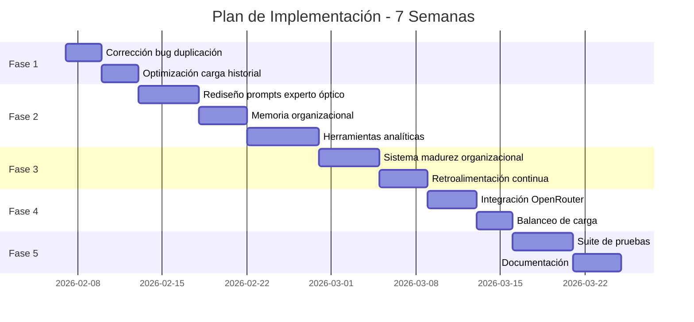

# Arquitectura del Sistema de IA Mejorado - Opttius

## 🏗️ Diagrama de Arquitectura General

---

## 🔄 Flujo de Trabajo del Agente Experto

---

## 📊 Sistema de Madurez Organizacional

---

## 🛠️ Herramientas Analíticas Avanzadas

```mermaid
graph TD
    subgraph "Herramientas CRUD Básicas"
        H1[getProducts]
        H2[getOrders]
        H3[getCustomers]
        H4[getCategories]
    end

    subgraph "Herramientas Analíticas Nuevas"
        H5[analyzeBusinessFlow]
        H6[diagnoseSystem]
        H7[analyzeMarketTrends]
        H8[optimizeInventory]
        H9[generateRecommendations]
    end

    subgraph "Herramientas de Soporte"
        H10[getDashboardStats]
        H11[getSalesAnalytics]
        H12[getTicketById]
    end

    H1 --> CRUD
    H2 --> CRUD
    H3 --> CRUD
    H4 --> CRUD
    H5 --> ANALYTICS
    H6 --> ANALYTICS
    H7 --> ANALYTICS
    H8 --> ANALYTICS
    H9 --> ANALYTICS
    H10 --> SUPPORT
    H11 --> SUPPORT
    H12 --> SUPPORT

    style H5 fill:#ffeb3b
    style H6 fill:#ffeb3b
    style H7 fill:#ffeb3b
    style H8 fill:#ffeb3b
    style H9 fill:#ffeb3b
```

---

## 🔄 Ciclo de Vida de los Insights

---

## 🔄 Sistema de Balanceo de Carga de Proveedores

---

## 📈 Métricas de Rendimiento

---

## 🔄 Flujo de Implementación

---

## 🎯 Componentes Clave del Sistema Mejorado

### 1. Agente Experto Óptico

- **Conocimiento Especializado**: Terminología óptica, materiales, tratamientos
- **Memoria Organizacional**: Contexto específico de cada óptica
- **Herramientas Analíticas**: Análisis de flujo, diagnóstico, recomendaciones
- **Aprendizaje Continuo**: Mejora basado en interacciones

### 2. Sistema de Insights Evolutivos

- **Madurez Organizacional**: 4 fases de crecimiento
- **Prompts Adaptativos**: Mensajes que evolucionan con el tiempo
- **Retroalimentación**: Aprendizaje continuo de preferencias
- **Priorización Dinámica**: Insights según importancia

### 3. Balanceo de Carga Inteligente

- **Múltiples Proveedores**: OpenAI, Anthropic, Google, DeepSeek, OpenRouter
- **Criterios de Selección**: Latencia, costo, error rate, soporte de herramientas
- **Fallback Automático**: Cambio transparente entre proveedores
- **Optimización de Costos**: Selección de proveedores más económicos

### 4. Memoria Contextual

- **Organizacional**: Datos específicos de cada óptica
- **Usuario**: Preferencias y comportamiento
- **Semántica**: Búsqueda vectorial para contexto relevante
- **Persistente**: Guardada en base de datos

---

## 🚀 Beneficios Esperados

### Para el Usuario

- ✅ Respuestas contextualizadas y especializadas
- ✅ Análisis profundo del sistema y del negocio
- ✅ Insights relevantes que evolucionan con el tiempo
- ✅ Asistente que aprende y mejora continuamente

### Para la Óptica

- ✅ Mejora en eficiencia operativa
- ✅ Aumento en ventas cruzadas
- ✅ Reducción en tiempo de resolución de problemas
- ✅ Adopción de mejores prácticas

### Para el Sistema

- ✅ Mayor precisión y relevancia
- ✅ Mejor rendimiento
- ✅ Mayor disponibilidad
- ✅ Flexibilidad de proveedores

---

## 📋 Próximos Pasos Inmediatos

1. **Corrección del Bug** (Prioridad CRÍTICA)
   - Implementar solución en `ChatbotContent.tsx`
   - Probar carga de chats antiguos
   - Verificar eliminación de duplicados

2. **Transformación del Agente** (Prioridad ALTA)
   - Rediseñar prompts de sistema
   - Implementar memoria organizacional
   - Crear herramientas analíticas

3. **Sistema de Insights** (Prioridad ALTA)
   - Implementar madurez organizacional
   - Crear prompts adaptativos
   - Implementar retroalimentación

4. **Expansión de Proveedores** (Prioridad MEDIA)
   - Integrar OpenRouter
   - Implementar balanceo de carga
   - Configurar sistema de fallback

---

**Estado**: Arquitectura completa documentada y lista para implementación
**Tiempo Estimado**: 7 semanas
**Impacto**: Transformacional para la experiencia de usuario
