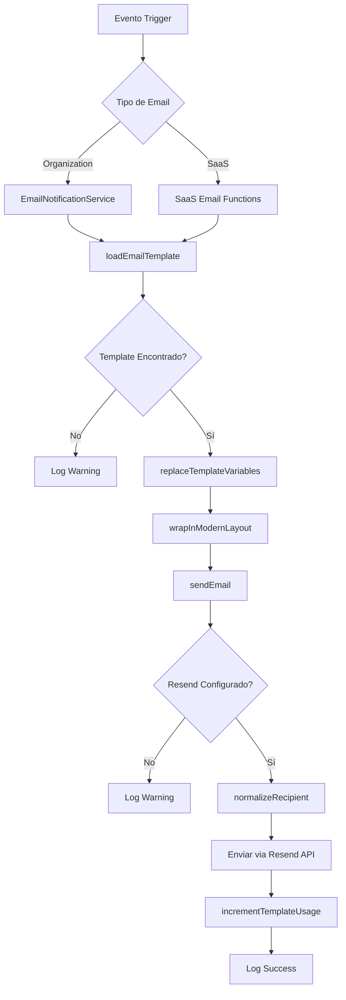

# Análisis Completo del Sistema de Emails - Opttius SaaS

## Resumen Ejecutivo

Este documento presenta un análisis detallado del sistema de emails implementado en Opttius, cubriendo tanto los emails que envían las ópticas a sus clientes como los emails que envía el SaaS a los administradores de las ópticas.

---

## 1. Configuración de Resend

### Variables de Entorno

- **`RESEND_API_KEY`**: Clave de API de Resend para autenticación
- **`RESEND_FROM_EMAIL`**: Email remitente (default: `noreply@opttius.com`)
- **`NEXT_PUBLIC_APP_URL`**: URL base de la aplicación (default: `https://opttius.com`)

### Modo de Operación

El sistema actualmente opera en **modo de desarrollo/onboarding** de Resend, lo que implica:

1. **Restricción de destinatarios**: Solo se pueden enviar emails al email registrado en Resend (el mismo que el `RESEND_FROM_EMAIL`)
2. **Normalización automática**: La función `normalizeRecipient()` en [`client.ts`](src/lib/email/client.ts:40) redirige todos los emails al inbox de prueba cuando se detecta un dominio `resend.dev`
3. **Configuración de producción**: Para producción, se debe configurar un dominio propio en Resend

### Archivos de Configuración

- [`src/lib/email/client.ts`](src/lib/email/client.ts:1) - Cliente de Resend y configuración base
- [`src/lib/email/layout.ts`](src/lib/email/layout.ts:1) - Layouts de email modernos
- [`src/lib/email/template-loader.ts`](src/lib/email/template-loader.ts:1) - Cargador de templates desde DB
- [`src/lib/email/template-utils.ts`](src/lib/email/template-utils.ts:1) - Utilidades para templates

---

## 2. Emails que Envía la Óptica a sus Clientes (Organization Level)

Estos emails son enviados por cada organización (óptica) a sus clientes finales. Utilizan la información de la organización para personalizar el branding.

### 2.1 Servicios de Email Implementados

| Función                                                             | Tipo de Email             | Template DB                | Estado          |
| ------------------------------------------------------------------- | ------------------------- | -------------------------- | --------------- |
| [`sendOrderConfirmation`](src/lib/email/notifications.ts:84)        | Confirmación de pedido    | `order_confirmation`       | ✅ Implementado |
| [`sendShippingNotification`](src/lib/email/notifications.ts:422)    | Pedido enviado            | `order_shipped`            | ✅ Implementado |
| [`sendDeliveryConfirmation`](src/lib/email/notifications.ts:514)    | Pedido entregado          | `order_delivered`          | ✅ Implementado |
| [`sendPaymentSuccess`](src/lib/email/notifications.ts:603)          | Pago exitoso              | `payment_success`          | ✅ Implementado |
| [`sendPaymentFailed`](src/lib/email/notifications.ts:689)           | Pago fallido              | `payment_failed`           | ✅ Implementado |
| [`sendAccountWelcome`](src/lib/email/notifications.ts:746)          | Bienvenida de cuenta      | `account_welcome`          | ✅ Implementado |
| [`sendAppointmentConfirmation`](src/lib/email/notifications.ts:177) | Confirmación de cita      | `appointment_confirmation` | ✅ Implementado |
| [`sendAppointmentReminder`](src/lib/email/notifications.ts:228)     | Recordatorio de cita      | `appointment_reminder`     | ✅ Implementado |
| [`sendQuoteSent`](src/lib/email/notifications.ts:277)               | Presupuesto enviado       | `quote_sent`               | ✅ Implementado |
| [`sendWorkOrderReady`](src/lib/email/notifications.ts:328)          | Orden de trabajo lista    | `work_order_ready`         | ✅ Implementado |
| [`sendPrescriptionReady`](src/lib/email/notifications.ts:375)       | Receta lista              | `prescription_ready`       | ✅ Implementado |
| [`sendLowStockAlert`](src/lib/email/notifications.ts:982)           | Alerta de stock bajo      | `low_stock_alert`          | ✅ Implementado |
| [`sendPasswordReset`](src/lib/email/notifications.ts:1062)          | Restablecer contraseña    | `password_reset`           | ✅ Implementado |
| [`sendMembershipWelcome`](src/lib/email/notifications.ts:864)       | Bienvenida de membresía   | `membership_welcome`       | ✅ Implementado |
| [`sendMembershipReminder`](src/lib/email/notifications.ts:927)      | Recordatorio de membresía | `membership_reminder`      | ✅ Implementado |
| [`sendMarketingEmail`](src/lib/email/notifications.ts:1115)         | Email de marketing        | Custom                     | ✅ Implementado |

### 2.2 Variables Disponibles para Templates de Organización

Las siguientes variables están disponibles para ser usadas en los templates de emails de organización:

| Variable                    | Descripción                 | Ejemplo                                        |
| --------------------------- | --------------------------- | ---------------------------------------------- |
| `{{customer_name}}`         | Nombre del cliente          | "María González"                               |
| `{{order_number}}`          | Número de pedido            | "ORD-12345"                                    |
| `{{order_date}}`            | Fecha del pedido            | "15 de enero de 2025"                          |
| `{{order_total}}`           | Total del pedido            | "$15.000,00"                                   |
| `{{order_items}}`           | Items del pedido (HTML)     | Lista de productos                             |
| `{{order_items_text}}`      | Items del pedido (texto)    | Lista de productos en texto                    |
| `{{payment_method}}`        | Método de pago              | "Tarjeta de Crédito"                           |
| `{{tracking_number}}`       | Número de seguimiento       | "ABC123456789"                                 |
| `{{carrier}}`               | Transportista               | "Correo Argentino"                             |
| `{{estimated_delivery}}`    | Entrega estimada            | "22 de enero de 2025"                          |
| `{{delivery_date}}`         | Fecha de entrega            | "20 de enero de 2025"                          |
| `{{transaction_id}}`        | ID de transacción           | "MP-123456789"                                 |
| `{{amount}}`                | Monto                       | "$15.000,00"                                   |
| `{{membership_tier}}`       | Tipo de membresía           | "Transformación Completa"                      |
| `{{membership_start_date}}` | Fecha inicio membresía      | "15 de enero de 2025"                          |
| `{{access_url}}`            | URL de acceso               | "https://opttius.com/mi-cuenta"                |
| `{{reset_link}}`            | Enlace de reset             | "https://opttius.com/reset-password?token=xxx" |
| `{{reset_url}}`             | URL de reset                | "https://opttius.com/reset-password?token=xxx" |
| `{{account_url}}`           | URL de cuenta               | "https://opttius.com/mi-cuenta"                |
| `{{renewal_url}}`           | URL de renovación           | "https://opttius.com/membresias"               |
| `{{days_remaining}}`        | Días restantes              | "15"                                           |
| `{{low_stock_products}}`    | Productos stock bajo (HTML) | Lista de productos                             |
| `{{company_name}}`          | Nombre de la empresa        | "Óptica Vision"                                |
| `{{organization_name}}`     | Nombre de la organización   | "Óptica Vision"                                |
| `{{support_email}}`         | Email de soporte            | "soporte@vision.com"                           |
| `{{contact_email}}`         | Email de contacto           | "contacto@vision.com"                          |
| `{{website_url}}`           | URL del sitio               | "https://vision.com"                           |

### 2.3 Personalización por Organización

Cada organización puede:

1. **Crear sus propios templates** personalizados en la tabla `system_email_templates`
2. **Sobrescribir templates del sistema** con sus propias versiones
3. **Configurar su branding** a través de `organizations.metadata`:
   - `primary_color`: Color principal para el header
   - `support_email`: Email de soporte personalizado
   - Otros metadatos personalizados

---

## 3. Emails que Envía el SaaS a los Administradores de Ópticas (SaaS Level)

Estos emails son enviados por el sistema SaaS a los administradores de las organizaciones (ópticas) para comunicaciones B2B.

### 3.1 Servicios de Email Implementados

| Función                                                                      | Tipo de Email          | Template DB            | Estado          |
| ---------------------------------------------------------------------------- | ---------------------- | ---------------------- | --------------- |
| [`sendSaasTicketCreatedEmail`](src/lib/email/templates/saas-support.ts:75)   | Ticket SaaS creado     | `saas_ticket_created`  | ✅ Implementado |
| [`sendSaasNewResponseEmail`](src/lib/email/templates/saas-support.ts:238)    | Nueva respuesta ticket | `saas_ticket_response` | ✅ Implementado |
| [`sendSaasTicketAssignedEmail`](src/lib/email/templates/saas-support.ts:365) | Ticket asignado        | `saas_ticket_assigned` | ✅ Implementado |
| [`sendSaasTicketResolvedEmail`](src/lib/email/templates/saas-support.ts:507) | Ticket resuelto        | `saas_ticket_resolved` | ✅ Implementado |
| [`sendSaaSNotification`](src/lib/email/notifications.ts:815)                 | Notificación genérica  | Custom                 | ✅ Implementado |

### 3.2 Variables Disponibles para Templates SaaS

| Variable                 | Descripción               | Ejemplo                      |
| ------------------------ | ------------------------- | ---------------------------- |
| `{{ticket_number}}`      | Número de ticket          | "SAA-12345"                  |
| `{{ticket_subject}}`     | Asunto del ticket         | "Problema con pagos"         |
| `{{ticket_description}}` | Descripción del ticket    | "No puedo procesar pagos..." |
| `{{ticket_status}}`      | Estado del ticket         | "Abierto"                    |
| `{{ticket_priority}}`    | Prioridad del ticket      | "Alta"                       |
| `{{ticket_category}}`    | Categoría del ticket      | "Técnico"                    |
| `{{requester_name}}`     | Nombre del solicitante    | "Juan Pérez"                 |
| `{{requester_email}}`    | Email del solicitante     | "juan@vision.com"            |
| `{{requester_role}}`     | Rol del solicitante       | "admin"                      |
| `{{organization_name}}`  | Nombre de la organización | "Óptica Vision"              |
| `{{organization_slug}}`  | Slug de la organización   | "vision"                     |
| `{{assigned_to_name}}`   | Nombre del asignado       | "Admin Root"                 |
| `{{assigned_to_email}}`  | Email del asignado        | "root@opttius.com"           |
| `{{message_content}}`    | Contenido del mensaje     | "Respuesta del equipo..."    |
| `{{message_sender}}`     | Remitente del mensaje     | "Soporte Opttius"            |
| `{{message_date}}`       | Fecha del mensaje         | "15 de enero de 2025"        |
| `{{company_name}}`       | Nombre de la empresa SaaS | "OPTTIUS"                    |
| `{{support_email}}`      | Email de soporte SaaS     | "soporte@opttius.com"        |
| `{{website_url}}`        | URL del sitio SaaS        | "https://opttius.com"        |

### 3.3 Branding SaaS

Los emails del SaaS utilizan:

- **Nombre**: "OPTTIUS"
- **Colores**: Gradiente azul (#1E40AF → #3B82F6)
- **Email de soporte**: "soporte@opttius.com"
- **URL base**: Configurada en `NEXT_PUBLIC_APP_URL`

---

## 4. Gestión de Templates

### 4.1 Interfaz de Administración

**Ruta**: `/admin/saas-management/emails`

La interfaz de gestión de emails incluye:

1. **Dashboard de métricas**:
   - Total de emails enviados (vía Resend)
   - Tasa de apertura
   - Estado de dominios verificados

2. **Gestión de plantillas**:
   - Lista de todas las plantillas
   - Filtros por tipo
   - Activar/desactivar plantillas
   - Editar plantillas existentes
   - Crear nuevas plantillas
   - Eliminar plantillas (solo no-sistema)
   - Enviar emails de prueba
   - Vista previa de plantillas

3. **Historial de envíos**:
   - Actualmente en desarrollo
   - Mostrará el historial de emails enviados

4. **Configuración Resend**:
   - Información de configuración global
   - Remitente SaaS
   - Región Resend

### 4.2 Componentes de Gestión

- [`EmailTemplatesManager`](src/components/admin/EmailTemplatesManager.tsx:1) - Gestor principal de templates
- [`EmailTemplateEditor`](src/components/admin/EmailTemplateEditor.tsx:1) - Editor de templates con vista previa

### 4.3 API Endpoints

| Endpoint                                      | Método | Descripción            |
| --------------------------------------------- | ------ | ---------------------- |
| `/api/admin/system/email-templates`           | GET    | Listar templates       |
| `/api/admin/system/email-templates`           | POST   | Crear template         |
| `/api/admin/system/email-templates/[id]`      | PUT    | Actualizar template    |
| `/api/admin/system/email-templates/[id]`      | DELETE | Eliminar template      |
| `/api/admin/system/email-templates/[id]/test` | POST   | Enviar email de prueba |

---

## 5. Tipos de Templates Soportados

### 5.1 Tipos de Organization

```typescript
type OrganizationEmailType =
  | "order_confirmation"
  | "order_shipped"
  | "order_delivered"
  | "password_reset"
  | "account_welcome"
  | "appointment_confirmation"
  | "appointment_reminder"
  | "prescription_ready"
  | "quote_sent"
  | "work_order_ready"
  | "low_stock_alert"
  | "payment_success"
  | "payment_failed"
  | "marketing"
  | "custom";
```

### 5.2 Tipos de SaaS

```typescript
type SaasEmailType =
  | "saas_welcome"
  | "saas_trial_ending"
  | "saas_subscription_success"
  | "saas_subscription_failed"
  | "saas_payment_reminder"
  | "saas_onboarding_step_1"
  | "saas_ticket_created"
  | "saas_ticket_response"
  | "saas_ticket_assigned"
  | "saas_ticket_resolved"
  | "custom";
```

---

## 6. Flujo de Envío de Emails

### 6.1 Diagrama de Flujo



### 6.2 Proceso de Envío

1. **Trigger**: Un evento en el sistema (pedido, cita, ticket, etc.)
2. **Selección de servicio**: Se elige el servicio apropiado (Organization o SaaS)
3. **Carga de template**: Se busca el template activo en la DB
4. **Reemplazo de variables**: Se reemplazan las variables con los datos reales
5. **Layout**: Se aplica el layout moderno de email
6. **Envío**: Se envía via Resend API
7. **Tracking**: Se incrementa el contador de uso del template

---

## 7. Estado Actual de Implementación

### 7.1 Implementación Completa ✅

- ✅ Cliente de Resend configurado
- ✅ Sistema de templates en base de datos
- ✅ Servicios de email para organizaciones (16 tipos)
- ✅ Servicios de email para SaaS (5 tipos)
- ✅ Interfaz de administración de templates
- ✅ Editor de templates con vista previa
- ✅ Envío de emails de prueba
- ✅ Personalización por organización
- ✅ Layouts modernos responsivos
- ✅ Manejo de modo dev/onboarding
- ✅ Sistema de variables dinámicas
- ✅ Contador de uso de templates

### 7.2 Funcionalidades Pendientes ⏳

- ⏳ Historial de envíos de emails
- ⏳ Métricas de apertura y clics (requiere integración con Resend webhooks)
- ⏳ Plantillas predefinidas para SaaS (bienvenida, onboarding, etc.)
- ⏳ Sistema de campañas de email marketing
- ⏳ Automatización de emails basada en eventos
- ⏳ Plantillas de email para notificaciones de suscripción
- ⏳ Plantillas de email para notificaciones de facturación

---

## 8. Recomendaciones

### 8.1 Para Producción

1. **Configurar dominio propio en Resend**:
   - Verificar dominio `opttius.com`
   - Configurar registros DNS (SPF, DKIM, DMARC)
   - Actualizar `RESEND_FROM_EMAIL` a `noreply@opttius.com`

2. **Implementar webhooks de Resend**:
   - Para tracking de apertura y clics
   - Para manejo de bounces y complaints
   - Para actualización de estado de envíos

3. **Crear plantillas predefinidas**:
   - Para onboarding de nuevas organizaciones
   - Para notificaciones de suscripción
   - Para recordatorios de pago

### 8.2 Para Mejoras

1. **Sistema de campañas**:
   - Crear campañas de email marketing
   - Segmentación de audiencia
   - A/B testing de templates

2. **Automatización avanzada**:
   - Workflows de email automatizados
   - Drip campaigns
   - Trigger-based emails

3. **Analytics**:
   - Dashboard de métricas de email
   - Reportes de rendimiento
   - Optimización de templates

---

## 9. Archivos Clave del Sistema

| Archivo                                                                                              | Descripción                            |
| ---------------------------------------------------------------------------------------------------- | -------------------------------------- |
| [`src/lib/email/client.ts`](src/lib/email/client.ts:1)                                               | Cliente de Resend y configuración      |
| [`src/lib/email/notifications.ts`](src/lib/email/notifications.ts:1)                                 | Servicios de email para organizaciones |
| [`src/lib/email/templates/saas-support.ts`](src/lib/email/templates/saas-support.ts:1)               | Servicios de email para SaaS           |
| [`src/lib/email/templates/support.ts`](src/lib/email/templates/support.ts:1)                         | Servicios de email de soporte          |
| [`src/lib/email/layout.ts`](src/lib/email/layout.ts:1)                                               | Layouts de email                       |
| [`src/lib/email/template-loader.ts`](src/lib/email/template-loader.ts:1)                             | Cargador de templates                  |
| [`src/lib/email/template-utils.ts`](src/lib/email/template-utils.ts:1)                               | Utilidades de templates                |
| [`src/components/admin/EmailTemplatesManager.tsx`](src/components/admin/EmailTemplatesManager.tsx:1) | Gestor de templates                    |
| [`src/components/admin/EmailTemplateEditor.tsx`](src/components/admin/EmailTemplateEditor.tsx:1)     | Editor de templates                    |
| [`src/app/admin/saas-management/emails/page.tsx`](src/app/admin/saas-management/emails/page.tsx:1)   | Página de gestión de emails            |

---

## 10. Conclusión

El sistema de emails de Opttius está **completamente implementado y funcional** para ambos casos de uso:

1. **Emails de organización a clientes**: 16 tipos de emails implementados con personalización por organización
2. **Emails de SaaS a administradores**: 5 tipos de emails implementados con branding SaaS

El sistema opera actualmente en modo de desarrollo de Resend, lo que limita los destinatarios al email registrado. Para producción, se debe configurar un dominio propio.

La interfaz de administración permite gestionar todos los templates de forma centralizada, con capacidades de edición, vista previa y envío de pruebas.

---

**Documento creado**: 2025-02-06
**Versión**: 1.0
**Autor**: Análisis del Sistema Opttius
