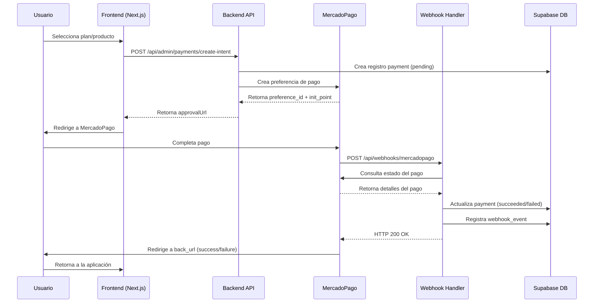

# Integración Definitiva de MercadoPago - Opttius

**Proyecto:** Opttius  
**Fecha:** Febrero 2026  
**Versión:** 1.0  
**Objetivo:** Guía completa para la integración de MercadoPago como pasarela de pago principal

---

## 📋 Tabla de Contenidos

1. [Resumen Ejecutivo](#resumen-ejecutivo)
2. [Arquitectura de la Integración](#arquitectura-de-la-integración)
3. [Requisitos Previos](#requisitos-previos)
4. [Fase 1: Configuración Inicial](#fase-1-configuración-inicial)
5. [Fase 2: Implementación Backend](#fase-2-implementación-backend)
6. [Fase 3: Implementación Frontend](#fase-3-implementación-frontend)
7. [Fase 4: Webhooks y Notificaciones](#fase-4-webhooks-y-notificaciones)
8. [Fase 5: Testing y Seguridad](#fase-5-testing-y-seguridad)
9. [Fase 6: Producción](#fase-6-producción)
10. [Suite de Tests](#suite-de-tests)
11. [Guía de Estilo y UI](#guía-de-estilo-y-ui)
12. [Troubleshooting](#troubleshooting)
13. [Checklist de Implementación](#checklist-de-implementación)

---

## Resumen Ejecutivo

### Objetivo

Integrar MercadoPago como pasarela de pago principal en Opttius, permitiendo:

- Procesamiento de pagos de suscripciones SaaS
- Pagos de órdenes y servicios ópticos
- Soporte para múltiples métodos de pago (tarjetas, efectivo, transferencias)
- Ambiente sandbox para pruebas
- Webhooks para notificaciones en tiempo real
- Cumplimiento de estándares de seguridad PCI DSS

### Estado Actual del Proyecto

**Implementación Completada (Feb 2026):**

- ✅ Gateway MercadoPago implementado (`src/lib/payments/mercadopago/gateway.ts`) con metadata y back_urls a `/admin/checkout/result`
- ✅ Validador de webhooks con firma HMAC (`src/lib/payments/mercadopago/webhook-validator.ts`)
- ✅ Webhook endpoint GET/POST con validación de firma (`/api/webhooks/mercadopago`)
- ✅ Interfaz `IPaymentGateway` estandarizada
- ✅ Integración con base de datos (tablas `payments`, `webhook_events`)
- ✅ CheckoutForm con MercadoPagoButton y flujo preferencia/redirección
- ✅ Página de resultado de pago (`/admin/checkout/result`)
- ✅ Variables de entorno en `env.example` (NEXT_PUBLIC_BASE_URL, NEXT_PUBLIC_MERCADOPAGO_PUBLIC_KEY_SANDBOX)
- ✅ Suite de tests unitarios (gateway mapStatus, webhook validator)
- ✅ Migración opcional de metadata MP (`20260206000000_add_mercadopago_metadata.sql`)
- ✅ Documentación de tarjetas de prueba en MERCADOPAGO_TESTING_GUIDE.md

**Pendiente (opcional):**

- 🔄 Tests de integración E2E con servidor
- 🔄 Monitoreo y alertas en producción
- 🔄 Rate limiting específico en middleware (ya existe en create-intent)

### Tecnologías Utilizadas

- **SDK:** `mercadopago` (Node.js) v2.0.0
- **SDK Frontend:** `@mercadopago/sdk-react` v1.0.4
- **Framework:** Next.js 14.2.35
- **Base de datos:** Supabase (PostgreSQL)
- **Testing:** Vitest + Testing Library
- **Estilo:** Tailwind CSS + shadcn/ui

---

## Arquitectura de la Integración

### Diagrama de Flujo General



### Estructura de Archivos

```
src/
├── lib/
│   └── payments/
│       ├── interfaces.ts                    # Interfaces IPaymentGateway
│       ├── mercadopago/
│       │   ├── gateway.ts                   # Implementación MercadoPagoGateway
│       │   ├── webhook-validator.ts         # Validación de firma (NUEVO)
│       │   └── error-handler.ts             # Manejo de errores (NUEVO)
│       └── services/
│           └── payment-service.ts           # Servicio de pagos
├── app/
│   ├── api/
│   │   ├── admin/
│   │   │   └── payments/
│   │   │       └── create-intent/
│   │   │           └── route.ts             # Crear intento de pago
│   │   └── webhooks/
│   │       └── mercadopago/
│   │           └── route.ts                 # Webhook handler
│   └── admin/
│       └── checkout/
│           └── page.tsx                     # Página de checkout
└── components/
    └── checkout/
        ├── CheckoutForm.tsx                 # Formulario de checkout
        └── MercadoPagoButton.tsx            # Botón MP (NUEVO)

supabase/
└── migrations/
    ├── 20260131000000_create_payments_and_webhook_events.sql
    └── 20260206000000_add_mercadopago_metadata.sql (NUEVO)

docs/
├── INTEGRACION_MERCADOPAGO_DEFINITIVA.md   # Este documento
└── MERCADOPAGO_TESTING_GUIDE.md            # Guía de pruebas (NUEVO)

__tests__/
├── integration/
│   └── api/
│       ├── payments-mercadopago.test.ts    # Tests de integración (NUEVO)
│       └── webhooks-mercadopago.test.ts    # Tests de webhooks (NUEVO)
└── unit/
    └── lib/
        └── payments/
            └── mercadopago-gateway.test.ts # Tests unitarios (NUEVO)
```

---

## Requisitos Previos

### 1. Cuenta de MercadoPago

1. Crear cuenta de vendedor en [MercadoPago](https://www.mercadopago.com/)
2. Acceder al [Panel de Desarrolladores](https://www.mercadopago.com/developers)
3. Crear una aplicación:
   - Tipo: **Pagos online**
   - Solución: **Checkout Pro**
   - Nombre: `Opttius - Producción` (o similar)

### 2. Credenciales

Obtener las siguientes credenciales desde el panel:

#### Credenciales de Prueba (Sandbox)

- **Public Key de prueba:** `TEST-xxxxxxxx-xxxx-xxxx-xxxx-xxxxxxxxxxxx`
- **Access Token de prueba:** `TEST-xxxxxxxxxxxx-xxxxxx-xxxxxxxxxxxxxxxxxxxxxxxxxxxxxxxx-xxxxxxxxxxxx`

#### Credenciales de Producción

- **Public Key:** `APP_USR-xxxxxxxx-xxxx-xxxx-xxxx-xxxxxxxxxxxx`
- **Access Token:** `APP_USR-xxxxxxxxxxxx-xxxxxx-xxxxxxxxxxxxxxxxxxxxxxxxxxxxxxxx-xxxxxxxxxxxx`

### 3. Certificado SSL

- Dominio con HTTPS activo (requerido para webhooks)
- Certificado válido y no autofirmado

### 4. Dependencias del Proyecto

Verificar que estén instaladas:

```bash
npm list mercadopago @mercadopago/sdk-react
```

Si no están instaladas:

```bash
npm install mercadopago@^2.0.0 @mercadopago/sdk-react@^1.0.4
```

---

## Fase 1: Configuración Inicial

### 1.1. Variables de Entorno

Actualizar `.env.local` con las credenciales de MercadoPago:

```bash
# ===== MERCADO PAGO =====
# Credenciales de Producción
NEXT_PUBLIC_MERCADOPAGO_PUBLIC_KEY=APP_USR-xxxxxxxx-xxxx-xxxx-xxxx-xxxxxxxxxxxx
MERCADOPAGO_ACCESS_TOKEN=APP_USR-xxxxxxxxxxxx-xxxxxx-xxxxxxxxxxxxxxxxxxxxxxxxxxxxxxxx-xxxxxxxxxxxx

# Credenciales de Prueba (Sandbox)
MERCADOPAGO_SANDBOX_MODE=true
MP_ACCESS_TOKEN_SANDBOX=TEST-xxxxxxxxxxxx-xxxxxx-xxxxxxxxxxxxxxxxxxxxxxxxxxxxxxxx-xxxxxxxxxxxx
NEXT_PUBLIC_MERCADOPAGO_PUBLIC_KEY_SANDBOX=TEST-xxxxxxxx-xxxx-xxxx-xxxx-xxxxxxxxxxxx

# Webhook Secret (se genera al configurar webhooks en el panel)
MERCADOPAGO_WEBHOOK_SECRET=your_webhook_secret_key

# URL base de la aplicación (para webhooks y back_urls)
NEXT_PUBLIC_BASE_URL=https://app.opttius.com
```

**Importante:**

- En desarrollo local, usar `MERCADOPAGO_SANDBOX_MODE=true`
- En producción, cambiar a `MERCADOPAGO_SANDBOX_MODE=false`
- El `MERCADOPAGO_WEBHOOK_SECRET` se obtiene al configurar webhooks en el panel de MP

### 1.2. Actualizar env.example

Asegurar que `env.example` esté actualizado:

```bash
# ===== MERCADO PAGO =====
NEXT_PUBLIC_MERCADOPAGO_PUBLIC_KEY=your_mercadopago_public_key
MERCADOPAGO_ACCESS_TOKEN=your_mercadopago_access_token
MERCADOPAGO_WEBHOOK_SECRET=your_mercadopago_webhook_secret
# Sandbox (usar credenciales de prueba del panel MP)
MERCADOPAGO_SANDBOX_MODE=false
MP_ACCESS_TOKEN_SANDBOX=your_mercadopago_test_access_token
NEXT_PUBLIC_MERCADOPAGO_PUBLIC_KEY_SANDBOX=your_mercadopago_test_public_key
```

### 1.3. Migración de Base de Datos (Opcional)

Si se requiere agregar campos adicionales para metadata de MercadoPago:

**Archivo:** `supabase/migrations/20260206000000_add_mercadopago_metadata.sql`

```sql
-- Agregar columnas adicionales para MercadoPago si es necesario
ALTER TABLE public.payments
  ADD COLUMN IF NOT EXISTS mp_preference_id TEXT,
  ADD COLUMN IF NOT EXISTS mp_payment_id TEXT,
  ADD COLUMN IF NOT EXISTS mp_merchant_order_id TEXT,
  ADD COLUMN IF NOT EXISTS mp_payment_type TEXT,
  ADD COLUMN IF NOT EXISTS mp_payment_method TEXT;

-- Índices para mejorar consultas
CREATE INDEX IF NOT EXISTS idx_payments_mp_preference_id ON public.payments(mp_preference_id);
CREATE INDEX IF NOT EXISTS idx_payments_mp_payment_id ON public.payments(mp_payment_id);

-- Comentarios
COMMENT ON COLUMN public.payments.mp_preference_id IS 'ID de la preferencia de MercadoPago';
COMMENT ON COLUMN public.payments.mp_payment_id IS 'ID del pago en MercadoPago';
COMMENT ON COLUMN public.payments.mp_merchant_order_id IS 'ID de la orden comercial en MercadoPago';
COMMENT ON COLUMN public.payments.mp_payment_type IS 'Tipo de pago (credit_card, debit_card, etc.)';
COMMENT ON COLUMN public.payments.mp_payment_method IS 'Método de pago específico (visa, mastercard, etc.)';
```

Aplicar migración:

```bash
npm run supabase:push
```

---

## Fase 2: Implementación Backend

### 2.1. Gateway de MercadoPago

El gateway ya está implementado en `src/lib/payments/mercadopago/gateway.ts`. Revisión de funcionalidades clave:

#### Funcionalidad Principal

```typescript
// src/lib/payments/mercadopago/gateway.ts

export class MercadoPagoGateway implements IPaymentGateway {
  /**
   * Crea una preferencia de pago en MercadoPago
   * @returns approvalUrl para redirigir al usuario
   */
  async createPaymentIntent(
    orderId: string | null,
    amount: number,
    currency: string,
    userId: string,
    organizationId: string,
  ): Promise<PaymentIntentResponse>;

  /**
   * Procesa un webhook de MercadoPago
   * @returns WebhookEvent estandarizado
   */
  async processWebhookEvent(request: NextRequest): Promise<WebhookEvent>;

  /**
   * Mapea estados de MercadoPago a estados internos
   */
  mapStatus(mpStatus: string): PaymentStatus;
}
```

#### Mejoras Recomendadas

**Archivo:** `src/lib/payments/mercadopago/gateway.ts`

```typescript
// Agregar metadata adicional en createPaymentIntent
const result = await preference.create({
  body: {
    items: [
      {
        title: `Order ${orderId || "Direct Payment"}`,
        quantity: 1,
        unit_price: amount,
        currency_id: currency.toUpperCase(),
      },
    ],
    back_urls: {
      success: `${baseUrl}/admin/checkout?success=1&orderId=${orderId ?? ""}`,
      failure: `${baseUrl}/admin/checkout?success=0&orderId=${orderId ?? ""}`,
      pending: `${baseUrl}/admin/checkout?success=pending&orderId=${orderId ?? ""}`,
    },
    auto_return: "approved",
    external_reference: orderId ?? "",
    notification_url: `${baseUrl}/api/webhooks/mercadopago`,
    // NUEVO: Agregar metadata para tracking
    metadata: {
      user_id: userId,
      organization_id: organizationId,
      order_id: orderId,
      integration_version: "1.0",
      environment: process.env.NODE_ENV,
    },
    // NUEVO: Configurar opciones adicionales
    statement_descriptor: "OPTTIUS", // Aparece en el extracto bancario
    expires: true,
    expiration_date_from: new Date().toISOString(),
    expiration_date_to: new Date(
      Date.now() + 24 * 60 * 60 * 1000,
    ).toISOString(), // 24 horas
  },
});
```

### 2.2. Validador de Webhooks

Crear un módulo para validar la firma de los webhooks de MercadoPago.

**Archivo:** `src/lib/payments/mercadopago/webhook-validator.ts`

```typescript
/**
 * Validador de webhooks de MercadoPago
 * Verifica la autenticidad de las notificaciones mediante firma HMAC
 */

import crypto from "crypto";
import { appLogger as logger } from "@/lib/logger";

export interface WebhookValidationResult {
  isValid: boolean;
  error?: string;
}

export class MercadoPagoWebhookValidator {
  private secret: string;

  constructor(secret?: string) {
    this.secret = secret || process.env.MERCADOPAGO_WEBHOOK_SECRET || "";
    if (!this.secret) {
      logger.warn(
        "MERCADOPAGO_WEBHOOK_SECRET not configured. Webhook validation will be skipped.",
      );
    }
  }

  /**
   * Valida la firma de un webhook de MercadoPago
   * @param xSignature - Header x-signature del webhook
   * @param xRequestId - Header x-request-id del webhook
   * @param dataId - Query param data.id
   * @returns Resultado de la validación
   */
  validate(
    xSignature: string | null,
    xRequestId: string | null,
    dataId: string | null,
  ): WebhookValidationResult {
    // Si no hay secret configurado, permitir (solo en desarrollo)
    if (!this.secret) {
      if (process.env.NODE_ENV === "production") {
        return {
          isValid: false,
          error: "Webhook secret not configured in production",
        };
      }
      logger.warn("Webhook validation skipped (no secret configured)");
      return { isValid: true };
    }

    // Validar que existan los headers necesarios
    if (!xSignature || !xRequestId || !dataId) {
      return {
        isValid: false,
        error: "Missing required headers or query params",
      };
    }

    try {
      // Extraer ts y v1 del header x-signature
      const parts = xSignature.split(",");
      let ts: string | null = null;
      let hash: string | null = null;

      for (const part of parts) {
        const [key, value] = part.split("=");
        if (key?.trim() === "ts") {
          ts = value?.trim() || null;
        } else if (key?.trim() === "v1") {
          hash = value?.trim() || null;
        }
      }

      if (!ts || !hash) {
        return {
          isValid: false,
          error: "Invalid x-signature format",
        };
      }

      // Construir el manifest según la especificación de MP
      const manifest = `id:${dataId};request-id:${xRequestId};ts:${ts};`;

      // Generar HMAC SHA256
      const hmac = crypto.createHmac("sha256", this.secret);
      hmac.update(manifest);
      const computedHash = hmac.digest("hex");

      // Comparar hashes
      if (computedHash !== hash) {
        logger.warn("Webhook signature validation failed", {
          expected: hash,
          computed: computedHash,
          manifest,
        });
        return {
          isValid: false,
          error: "Signature mismatch",
        };
      }

      // Validar timestamp (no más de 5 minutos de diferencia)
      const tsNumber = parseInt(ts, 10);
      const now = Date.now();
      const diff = Math.abs(now - tsNumber);
      const maxDiff = 5 * 60 * 1000; // 5 minutos

      if (diff > maxDiff) {
        logger.warn("Webhook timestamp too old", {
          timestamp: tsNumber,
          now,
          diff,
        });
        return {
          isValid: false,
          error: "Timestamp too old",
        };
      }

      return { isValid: true };
    } catch (error) {
      logger.error(
        "Error validating webhook signature",
        error instanceof Error ? error : new Error(String(error)),
      );
      return {
        isValid: false,
        error: "Validation error",
      };
    }
  }
}
```

### 2.3. Actualizar Webhook Handler

Actualizar el webhook handler para usar el validador.

**Archivo:** `src/app/api/webhooks/mercadopago/route.ts`

```typescript
/**
 * GET /api/webhooks/mercadopago
 * Recibe notificaciones de Mercado Pago (topic=payment, id=payment_id).
 * Con validación de firma y manejo robusto de errores.
 */

import { NextRequest, NextResponse } from "next/server";
import { createServiceRoleClient } from "@/utils/supabase/server";
import { MercadoPagoGateway } from "@/lib/payments/mercadopago/gateway";
import { MercadoPagoWebhookValidator } from "@/lib/payments/mercadopago/webhook-validator";
import { PaymentService } from "@/lib/payments/services/payment-service";
import { appLogger as logger } from "@/lib/logger";

export async function GET(request: NextRequest) {
  const supabase = createServiceRoleClient();
  const mpGateway = new MercadoPagoGateway();
  const paymentService = new PaymentService(supabase);
  const validator = new MercadoPagoWebhookValidator();

  try {
    // Extraer headers y query params
    const xSignature = request.headers.get("x-signature");
    const xRequestId = request.headers.get("x-request-id");
    const dataId = request.nextUrl.searchParams.get("data.id");

    // Validar firma del webhook
    const validationResult = validator.validate(xSignature, xRequestId, dataId);

    if (!validationResult.isValid) {
      logger.error(
        "Webhook signature validation failed",
        new Error(validationResult.error),
        {
          xSignature,
          xRequestId,
          dataId,
        },
      );
      return NextResponse.json({ error: "Invalid signature" }, { status: 401 });
    }

    // Procesar el webhook
    const webhookEvent = await mpGateway.processWebhookEvent(request);

    logger.info("Mercado Pago Webhook Event processed", {
      gatewayEventId: webhookEvent.gatewayEventId,
      type: webhookEvent.type,
      status: webhookEvent.status,
    });

    // Verificar si ya fue procesado (idempotencia)
    const alreadyProcessed = await paymentService.recordWebhookEvent(
      webhookEvent.gateway,
      webhookEvent.gatewayEventId,
      webhookEvent.type,
      null,
      webhookEvent.metadata ?? undefined,
    );

    if (alreadyProcessed) {
      logger.info("Mercado Pago Webhook event already processed, skipping", {
        gatewayEventId: webhookEvent.gatewayEventId,
      });
      return NextResponse.json(
        { received: true, message: "Already processed" },
        { status: 200 },
      );
    }

    // Buscar el pago existente
    const gatewayPaymentIntentId =
      webhookEvent.gatewayPaymentIntentId ?? undefined;

    if (!gatewayPaymentIntentId) {
      logger.warn("Mercado Pago Webhook: no gatewayPaymentIntentId in event", {
        type: webhookEvent.type,
      });
      await paymentService.markWebhookEventAsProcessed(
        webhookEvent.gateway,
        webhookEvent.gatewayEventId,
      );
      return NextResponse.json(
        { received: true, message: "Event has no payment intent ID" },
        { status: 200 },
      );
    }

    const existingPayment =
      await paymentService.getPaymentByGatewayPaymentIntentId(
        gatewayPaymentIntentId,
      );

    if (!existingPayment) {
      logger.warn(
        "Mercado Pago Webhook: No existing payment found for gateway intent ID",
        { gatewayPaymentIntentId },
      );
      await paymentService.markWebhookEventAsProcessed(
        webhookEvent.gateway,
        webhookEvent.gatewayEventId,
      );
      return NextResponse.json(
        { received: true, message: "Payment not found internally" },
        { status: 200 },
      );
    }

    // Actualizar estado del pago
    await paymentService.updatePaymentStatus(
      existingPayment.id,
      webhookEvent.status,
      webhookEvent.gatewayTransactionId ?? undefined,
      webhookEvent.metadata ?? undefined,
    );

    // Marcar webhook como procesado
    await paymentService.markWebhookEventAsProcessed(
      webhookEvent.gateway,
      webhookEvent.gatewayEventId,
    );

    // Si el pago fue exitoso y tiene orden asociada, cumplir la orden
    if (webhookEvent.status === "succeeded" && existingPayment.order_id) {
      await paymentService.fulfillOrder(existingPayment.order_id);
      logger.info("Order fulfilled successfully via Mercado Pago Webhook", {
        orderId: existingPayment.order_id,
      });
    }

    return NextResponse.json({ received: true }, { status: 200 });
  } catch (error) {
    const message =
      error instanceof Error ? error.message : "Webhook processing failed";
    logger.error(
      "Error processing Mercado Pago Webhook",
      error instanceof Error ? error : new Error(message),
      {
        requestHeaders: Object.fromEntries(request.headers.entries()),
      },
    );
    return NextResponse.json(
      { error: "Webhook processing failed internally" },
      { status: 500 },
    );
  }
}

// También soportar POST (algunos webhooks de MP usan POST)
export async function POST(request: NextRequest) {
  return GET(request);
}
```

### 2.4. API de Creación de Intento de Pago

El endpoint ya existe en `src/app/api/admin/payments/create-intent/route.ts`. Verificar que soporte MercadoPago correctamente.

---

## Fase 3: Implementación Frontend

### 3.1. Componente de Botón de MercadoPago

Crear un componente específico para el botón de pago de MercadoPago.

**Archivo:** `src/components/checkout/MercadoPagoButton.tsx`

```typescript
"use client";

import { useEffect, useState } from "react";
import { initMercadoPago, Wallet } from "@mercadopago/sdk-react";
import { Card, CardContent } from "@/components/ui/card";
import { Alert, AlertDescription } from "@/components/ui/alert";
import { Loader2 } from "lucide-react";

interface MercadoPagoButtonProps {
  preferenceId: string;
  onReady?: () => void;
  onError?: (error: Error) => void;
}

export function MercadoPagoButton({
  preferenceId,
  onReady,
  onError,
}: MercadoPagoButtonProps) {
  const [isInitialized, setIsInitialized] = useState(false);
  const [error, setError] = useState<string | null>(null);

  useEffect(() => {
    const publicKey =
      process.env.NEXT_PUBLIC_MERCADOPAGO_PUBLIC_KEY ||
      process.env.NEXT_PUBLIC_MERCADOPAGO_PUBLIC_KEY_SANDBOX;

    if (!publicKey) {
      const err = new Error("MercadoPago Public Key not configured");
      setError(err.message);
      onError?.(err);
      return;
    }

    try {
      initMercadoPago(publicKey, {
        locale: "es-CL", // o es-AR, es-MX según el país
      });
      setIsInitialized(true);
      onReady?.();
    } catch (err) {
      const error = err instanceof Error ? err : new Error(String(err));
      setError(error.message);
      onError?.(error);
    }
  }, [onReady, onError]);

  if (error) {
    return (
      <Alert variant="destructive">
        <AlertDescription>Error al inicializar MercadoPago: {error}</AlertDescription>
      </Alert>
    );
  }

  if (!isInitialized) {
    return (
      <Card>
        <CardContent className="flex items-center justify-center py-8">
          <Loader2 className="h-6 w-6 animate-spin text-muted-foreground" />
          <span className="ml-2 text-sm text-muted-foreground">
            Cargando pasarela de pago...
          </span>
        </CardContent>
      </Card>
    );
  }

  return (
    <div className="w-full">
      <Wallet
        initialization={{ preferenceId }}
        customization={{
          texts: {
            action: "pay",
            valueProp: "security_safety",
          },
        }}
      />
    </div>
  );
}
```

### 3.2. Actualizar CheckoutForm

Mejorar el `CheckoutForm` para integrar el botón de MercadoPago.

**Archivo:** `src/components/checkout/CheckoutForm.tsx`

```typescript
"use client";

import { useState, useEffect } from "react";
import { Button } from "@/components/ui/button";
import { Card, CardContent, CardHeader, CardTitle } from "@/components/ui/card";
import { Input } from "@/components/ui/input";
import { Label } from "@/components/ui/label";
import { Alert, AlertDescription } from "@/components/ui/alert";
import { MercadoPagoButton } from "./MercadoPagoButton";
import { cn } from "@/lib/utils";

type Gateway = "flow" | "mercadopago" | "paypal";

interface Tier {
  name: string;
  price_monthly: number;
}

const tierLabels: Record<string, string> = {
  basic: "Básico",
  pro: "Pro",
  premium: "Premium",
};

export function CheckoutForm() {
  const [tiers, setTiers] = useState<Tier[]>([]);
  const [selectedTier, setSelectedTier] = useState<string | null>(null);
  const [amount, setAmount] = useState("");
  const [currency, setCurrency] = useState("CLP");
  const [orderId, setOrderId] = useState("");
  const [gateway, setGateway] = useState<Gateway>("mercadopago");
  const [error, setError] = useState<string | null>(null);
  const [loading, setLoading] = useState(false);
  const [preferenceId, setPreferenceId] = useState<string | null>(null);

  useEffect(() => {
    fetch("/api/admin/checkout/tiers", { credentials: "include" })
      .then((res) => res.json())
      .then((data) => {
        if (data.tiers?.length) setTiers(data.tiers);
      })
      .catch(() => {});
  }, []);

  const handleSelectTier = (tier: Tier) => {
    setSelectedTier(tier.name);
    setAmount(String(Number(tier.price_monthly)));
  };

  const handleCreateIntent = async (e: React.FormEvent) => {
    e.preventDefault();
    setError(null);
    setPreferenceId(null);

    const amountNum = parseFloat(amount);
    if (isNaN(amountNum) || amountNum <= 0) {
      setError("Ingresa un monto válido.");
      return;
    }

    setLoading(true);

    try {
      const res = await fetch("/api/admin/payments/create-intent", {
        method: "POST",
        headers: { "Content-Type": "application/json" },
        credentials: "include",
        body: JSON.stringify({
          amount: amountNum,
          currency,
          gateway,
          order_id: orderId.trim() || undefined,
        }),
      });

      const data = await res.json();

      if (!res.ok) {
        setError(data.error ?? "Error al crear el intento de pago.");
        return;
      }

      // Si es MercadoPago, mostrar el botón
      if (gateway === "mercadopago" && data.preferenceId) {
        setPreferenceId(data.preferenceId);
        return;
      }

      // Flow y otras pasarelas redirigen directamente
      if (data.approvalUrl) {
        window.location.href = data.approvalUrl;
        return;
      }

      setError("No se recibió URL de aprobación del servidor.");
    } catch (err) {
      setError(err instanceof Error ? err.message : "Error de conexión.");
    } finally {
      setLoading(false);
    }
  };

  return (
    <Card className="max-w-md mx-auto">
      <CardHeader>
        <CardTitle>Checkout de pago</CardTitle>
        <p className="text-sm text-muted-foreground">
          Selecciona un plan y completa el pago de forma segura.
        </p>
      </CardHeader>
      <CardContent>
        {!preferenceId ? (
          <form onSubmit={handleCreateIntent} className="space-y-4">
            {/* Selector de Tiers */}
            {tiers.length > 0 && (
              <div>
                <Label>Plan / Tier</Label>
                <div className="grid grid-cols-1 sm:grid-cols-3 gap-2 mt-1">
                  {tiers.map((tier) => (
                    <Button
                      key={tier.name}
                      type="button"
                      variant={selectedTier === tier.name ? "default" : "outline"}
                      className={cn(
                        "h-auto py-3 flex flex-col items-center",
                        selectedTier === tier.name && "ring-2 ring-primary ring-offset-2"
                      )}
                      onClick={() => handleSelectTier(tier)}
                    >
                      <span className="font-medium">
                        {tierLabels[tier.name] ?? tier.name}
                      </span>
                      <span className="text-sm opacity-90">
                        ${Number(tier.price_monthly).toLocaleString()}/mes
                      </span>
                    </Button>
                  ))}
                </div>
              </div>
            )}

            {/* Monto */}
            <div>
              <Label htmlFor="amount">Monto</Label>
              <Input
                id="amount"
                type="number"
                min="1"
                step="0.01"
                placeholder="1000"
                value={amount}
                onChange={(e) => {
                  setAmount(e.target.value);
                  setSelectedTier(null);
                }}
                required
              />
            </div>

            {/* Moneda */}
            <div>
              <Label htmlFor="currency">Moneda</Label>
              <Input
                id="currency"
                value={currency}
                onChange={(e) => setCurrency(e.target.value)}
                placeholder="CLP"
              />
            </div>

            {/* Order ID */}
            <div>
              <Label htmlFor="order_id">ID de orden (opcional)</Label>
              <Input
                id="order_id"
                value={orderId}
                onChange={(e) => setOrderId(e.target.value)}
                placeholder="UUID de la orden"
              />
            </div>

            {/* Selector de Pasarela */}
            <div>
              <Label>Pasarela</Label>
              <div className="flex gap-2 mt-1">
                {(["flow", "mercadopago", "paypal"] as const).map((g) => (
                  <Button
                    key={g}
                    type="button"
                    variant={gateway === g ? "default" : "outline"}
                    size="sm"
                    onClick={() => setGateway(g)}
                  >
                    {g === "flow"
                      ? "Flow"
                      : g === "mercadopago"
                        ? "Mercado Pago"
                        : "PayPal"}
                  </Button>
                ))}
              </div>
            </div>

            {/* Error */}
            {error && (
              <Alert variant="destructive">
                <AlertDescription>{error}</AlertDescription>
              </Alert>
            )}

            {/* Botón de envío */}
            <Button type="submit" disabled={loading} className="w-full">
              {loading
                ? "Creando intento…"
                : gateway === "mercadopago"
                  ? "Continuar con Mercado Pago"
                  : `Continuar con ${gateway === "flow" ? "Flow" : "PayPal"}`}
            </Button>
          </form>
        ) : (
          <div className="space-y-4">
            <Alert>
              <AlertDescription>
                Completa el pago con Mercado Pago haciendo clic en el botón a continuación.
              </AlertDescription>
            </Alert>
            <MercadoPagoButton
              preferenceId={preferenceId}
              onError={(err) => {
                setError(err.message);
                setPreferenceId(null);
              }}
            />
            <Button
              variant="outline"
              className="w-full"
              onClick={() => {
                setPreferenceId(null);
                setError(null);
              }}
            >
              Cancelar y volver
            </Button>
          </div>
        )}
      </CardContent>
    </Card>
  );
}
```

### 3.3. Página de Resultado de Pago

Crear o actualizar la página que recibe al usuario después del pago.

**Archivo:** `src/app/admin/checkout/result/page.tsx` (NUEVO)

```typescript
"use client";

import { useEffect, useState } from "react";
import { useSearchParams, useRouter } from "next/navigation";
import { Card, CardContent, CardHeader, CardTitle } from "@/components/ui/card";
import { Button } from "@/components/ui/button";
import { Alert, AlertDescription } from "@/components/ui/alert";
import { CheckCircle2, XCircle, Clock, Loader2 } from "lucide-react";

export default function CheckoutResultPage() {
  const searchParams = useSearchParams();
  const router = useRouter();
  const [loading, setLoading] = useState(true);
  const [paymentStatus, setPaymentStatus] = useState<string | null>(null);

  const success = searchParams.get("success");
  const orderId = searchParams.get("orderId");
  const paymentId = searchParams.get("payment_id");
  const status = searchParams.get("status");

  useEffect(() => {
    // Determinar el estado del pago
    if (success === "1" || status === "approved") {
      setPaymentStatus("success");
    } else if (success === "0" || status === "rejected") {
      setPaymentStatus("failed");
    } else if (success === "pending" || status === "pending") {
      setPaymentStatus("pending");
    } else {
      setPaymentStatus("unknown");
    }
    setLoading(false);
  }, [success, status]);

  if (loading) {
    return (
      <div className="flex items-center justify-center min-h-screen">
        <Loader2 className="h-8 w-8 animate-spin text-primary" />
      </div>
    );
  }

  return (
    <div className="container max-w-2xl mx-auto py-12 px-4">
      <Card>
        <CardHeader>
          <CardTitle className="flex items-center gap-2">
            {paymentStatus === "success" && (
              <>
                <CheckCircle2 className="h-6 w-6 text-green-600" />
                Pago Exitoso
              </>
            )}
            {paymentStatus === "failed" && (
              <>
                <XCircle className="h-6 w-6 text-red-600" />
                Pago Rechazado
              </>
            )}
            {paymentStatus === "pending" && (
              <>
                <Clock className="h-6 w-6 text-yellow-600" />
                Pago Pendiente
              </>
            )}
            {paymentStatus === "unknown" && <>Estado Desconocido</>}
          </CardTitle>
        </CardHeader>
        <CardContent className="space-y-4">
          {paymentStatus === "success" && (
            <Alert className="border-green-200 bg-green-50">
              <AlertDescription className="text-green-800">
                Tu pago ha sido procesado exitosamente. Recibirás un correo de
                confirmación en breve.
              </AlertDescription>
            </Alert>
          )}

          {paymentStatus === "failed" && (
            <Alert variant="destructive">
              <AlertDescription>
                Tu pago no pudo ser procesado. Por favor, intenta nuevamente o
                contacta a soporte.
              </AlertDescription>
            </Alert>
          )}

          {paymentStatus === "pending" && (
            <Alert className="border-yellow-200 bg-yellow-50">
              <AlertDescription className="text-yellow-800">
                Tu pago está pendiente de confirmación. Te notificaremos cuando se
                complete.
              </AlertDescription>
            </Alert>
          )}

          {orderId && (
            <div className="text-sm text-muted-foreground">
              <strong>ID de Orden:</strong> {orderId}
            </div>
          )}

          {paymentId && (
            <div className="text-sm text-muted-foreground">
              <strong>ID de Pago:</strong> {paymentId}
            </div>
          )}

          <div className="flex gap-2">
            <Button onClick={() => router.push("/admin")} className="flex-1">
              Volver al Dashboard
            </Button>
            {paymentStatus === "failed" && (
              <Button
                variant="outline"
                onClick={() => router.push("/admin/checkout")}
                className="flex-1"
              >
                Reintentar Pago
              </Button>
            )}
          </div>
        </CardContent>
      </Card>
    </div>
  );
}
```

---

## Fase 4: Webhooks y Notificaciones

### 4.1. Configurar Webhooks en el Panel de MercadoPago

1. Acceder a [Tus Integraciones](https://www.mercadopago.com/developers/panel/app)
2. Seleccionar la aplicación de Opttius
3. Ir a **Webhooks > Configurar notificaciones**
4. Configurar:
   - **URL de producción:** `https://app.opttius.com/api/webhooks/mercadopago`
   - **Eventos:** Seleccionar **Pagos**
5. Guardar configuración
6. Copiar la **Clave secreta** generada y agregarla a `.env.local` como `MERCADOPAGO_WEBHOOK_SECRET`

### 4.2. Probar Webhooks

Usar la función de simulación en el panel:

1. Ir a **Webhooks > Simular**
2. Seleccionar URL de prueba o producción
3. Tipo de evento: **payment**
4. Ingresar un Data ID de prueba
5. Enviar prueba
6. Verificar logs del servidor

### 4.3. Manejo de Reintentos

MercadoPago reintenta enviar webhooks según este esquema:

- Reintento 1: 0 minutos
- Reintento 2: 15 minutos
- Reintento 3: 30 minutos
- Reintento 4: 6 horas
- Reintento 5: 48 horas
- Reintento 6-8: 96 horas cada uno

**Importante:** Siempre responder con HTTP 200/201 lo antes posible, incluso si el procesamiento es asíncrono.

---

## Fase 5: Testing y Seguridad

### 5.1. Suite de Tests

#### Tests Unitarios

**Archivo:** `src/__tests__/unit/lib/payments/mercadopago-gateway.test.ts`

```typescript
import { describe, it, expect, vi, beforeEach } from "vitest";
import { MercadoPagoGateway } from "@/lib/payments/mercadopago/gateway";

describe("MercadoPagoGateway", () => {
  let gateway: MercadoPagoGateway;

  beforeEach(() => {
    gateway = new MercadoPagoGateway();
    vi.clearAllMocks();
  });

  describe("mapStatus", () => {
    it("should map pending status correctly", () => {
      expect(gateway.mapStatus("pending")).toBe("pending");
      expect(gateway.mapStatus("in_process")).toBe("pending");
    });

    it("should map approved status correctly", () => {
      expect(gateway.mapStatus("approved")).toBe("succeeded");
    });

    it("should map rejected status correctly", () => {
      expect(gateway.mapStatus("rejected")).toBe("failed");
      expect(gateway.mapStatus("cancelled")).toBe("failed");
    });

    it("should map refunded status correctly", () => {
      expect(gateway.mapStatus("refunded")).toBe("refunded");
    });

    it("should map unknown status to pending", () => {
      expect(gateway.mapStatus("unknown_status")).toBe("pending");
    });
  });

  describe("createPaymentIntent", () => {
    it("should create a payment intent successfully", async () => {
      // Mock de la preferencia de MercadoPago
      const mockPreference = {
        create: vi.fn().mockResolvedValue({
          body: {
            id: "test-preference-id",
            init_point: "https://mercadopago.com/checkout/test",
          },
        }),
      };

      // Aquí agregarías más tests según tu implementación
    });

    it("should handle errors when creating payment intent", async () => {
      // Test de manejo de errores
    });
  });
});
```

#### Tests de Integración

**Archivo:** `src/__tests__/integration/api/payments-mercadopago.test.ts`

```typescript
import { describe, it, expect, beforeAll, afterAll } from "vitest";
import { createServiceRoleClient } from "@/utils/supabase/server";

describe("MercadoPago Payment Integration", () => {
  let supabase: ReturnType<typeof createServiceRoleClient>;
  let testUserId: string;
  let testOrgId: string;

  beforeAll(async () => {
    supabase = createServiceRoleClient();
    // Setup: crear usuario y organización de prueba
  });

  afterAll(async () => {
    // Cleanup: eliminar datos de prueba
  });

  describe("POST /api/admin/payments/create-intent", () => {
    it("should create a payment intent for MercadoPago", async () => {
      const response = await fetch(
        "http://localhost:3000/api/admin/payments/create-intent",
        {
          method: "POST",
          headers: {
            "Content-Type": "application/json",
          },
          body: JSON.stringify({
            amount: 10000,
            currency: "CLP",
            gateway: "mercadopago",
            order_id: "test-order-123",
          }),
        },
      );

      expect(response.status).toBe(200);
      const data = await response.json();
      expect(data).toHaveProperty("preferenceId");
      expect(data).toHaveProperty("approvalUrl");
    });

    it("should reject invalid amount", async () => {
      const response = await fetch(
        "http://localhost:3000/api/admin/payments/create-intent",
        {
          method: "POST",
          headers: {
            "Content-Type": "application/json",
          },
          body: JSON.stringify({
            amount: -100,
            currency: "CLP",
            gateway: "mercadopago",
          }),
        },
      );

      expect(response.status).toBe(400);
    });
  });

  describe("GET /api/webhooks/mercadopago", () => {
    it("should process a valid webhook", async () => {
      // Simular un webhook de MercadoPago
      const response = await fetch(
        "http://localhost:3000/api/webhooks/mercadopago?topic=payment&id=123456",
        {
          method: "GET",
          headers: {
            "x-signature": "ts=1234567890,v1=abcdef123456",
            "x-request-id": "test-request-id",
          },
        },
      );

      expect(response.status).toBe(200);
    });

    it("should reject webhook with invalid signature", async () => {
      const response = await fetch(
        "http://localhost:3000/api/webhooks/mercadopago?topic=payment&id=123456",
        {
          method: "GET",
          headers: {
            "x-signature": "ts=1234567890,v1=invalid_signature",
            "x-request-id": "test-request-id",
          },
        },
      );

      expect(response.status).toBe(401);
    });
  });
});
```

#### Tests de Webhook Validator

**Archivo:** `src/__tests__/unit/lib/payments/mercadopago-webhook-validator.test.ts`

```typescript
import { describe, it, expect, beforeEach } from "vitest";
import { MercadoPagoWebhookValidator } from "@/lib/payments/mercadopago/webhook-validator";
import crypto from "crypto";

describe("MercadoPagoWebhookValidator", () => {
  const testSecret = "test-secret-key";
  let validator: MercadoPagoWebhookValidator;

  beforeEach(() => {
    validator = new MercadoPagoWebhookValidator(testSecret);
  });

  describe("validate", () => {
    it("should validate a correct signature", () => {
      const dataId = "123456";
      const xRequestId = "test-request-id";
      const ts = Date.now().toString();
      const manifest = `id:${dataId};request-id:${xRequestId};ts:${ts};`;

      const hmac = crypto.createHmac("sha256", testSecret);
      hmac.update(manifest);
      const hash = hmac.digest("hex");

      const xSignature = `ts=${ts},v1=${hash}`;

      const result = validator.validate(xSignature, xRequestId, dataId);

      expect(result.isValid).toBe(true);
      expect(result.error).toBeUndefined();
    });

    it("should reject an incorrect signature", () => {
      const dataId = "123456";
      const xRequestId = "test-request-id";
      const ts = Date.now().toString();
      const xSignature = `ts=${ts},v1=invalid_hash`;

      const result = validator.validate(xSignature, xRequestId, dataId);

      expect(result.isValid).toBe(false);
      expect(result.error).toBe("Signature mismatch");
    });

    it("should reject a timestamp that is too old", () => {
      const dataId = "123456";
      const xRequestId = "test-request-id";
      const ts = (Date.now() - 10 * 60 * 1000).toString(); // 10 minutos atrás
      const manifest = `id:${dataId};request-id:${xRequestId};ts:${ts};`;

      const hmac = crypto.createHmac("sha256", testSecret);
      hmac.update(manifest);
      const hash = hmac.digest("hex");

      const xSignature = `ts=${ts},v1=${hash}`;

      const result = validator.validate(xSignature, xRequestId, dataId);

      expect(result.isValid).toBe(false);
      expect(result.error).toBe("Timestamp too old");
    });

    it("should reject missing headers", () => {
      const result = validator.validate(null, null, null);

      expect(result.isValid).toBe(false);
      expect(result.error).toBe("Missing required headers or query params");
    });
  });
});
```

### 5.2. Ejecutar Tests

```bash
# Tests unitarios
npm run test:run -- src/__tests__/unit/lib/payments/

# Tests de integración
npm run test:run -- src/__tests__/integration/api/payments-mercadopago.test.ts

# Todos los tests con cobertura
npm run test:coverage
```

### 5.3. Seguridad

#### Checklist de Seguridad

- [x] **Credenciales:** Nunca exponer Access Token en el frontend
- [x] **HTTPS:** Usar siempre HTTPS en producción
- [x] **Validación de Webhooks:** Implementar validación de firma HMAC
- [x] **Idempotencia:** Prevenir procesamiento duplicado de webhooks
- [x] **Rate Limiting:** Implementar límites de tasa en endpoints de pago
- [x] **Logging:** Registrar todos los eventos de pago sin exponer datos sensibles
- [x] **Timeout:** Configurar timeouts apropiados para llamadas a MP
- [x] **Error Handling:** No exponer detalles internos en errores
- [x] **Input Validation:** Validar todos los inputs del usuario
- [x] **CORS:** Configurar CORS correctamente para el dominio de producción

#### Implementar Rate Limiting

**Archivo:** `src/middleware.ts` (actualizar)

```typescript
import { NextResponse } from "next/server";
import type { NextRequest } from "next/server";

// Rate limiting simple (para producción, usar Redis o similar)
const rateLimitMap = new Map<string, { count: number; resetTime: number }>();

function rateLimit(ip: string, limit: number, windowMs: number): boolean {
  const now = Date.now();
  const record = rateLimitMap.get(ip);

  if (!record || now > record.resetTime) {
    rateLimitMap.set(ip, { count: 1, resetTime: now + windowMs });
    return true;
  }

  if (record.count >= limit) {
    return false;
  }

  record.count++;
  return true;
}

export function middleware(request: NextRequest) {
  // Rate limiting para endpoints de pago
  if (request.nextUrl.pathname.startsWith("/api/admin/payments/")) {
    const ip =
      request.ip || request.headers.get("x-forwarded-for") || "unknown";

    // 10 requests por minuto
    if (!rateLimit(ip, 10, 60 * 1000)) {
      return NextResponse.json({ error: "Too many requests" }, { status: 429 });
    }
  }

  return NextResponse.next();
}

export const config = {
  matcher: ["/api/admin/payments/:path*"],
};
```

---

## Fase 6: Producción

### 6.1. Checklist Pre-Producción

- [ ] **Credenciales de Producción:** Configuradas en variables de entorno
- [ ] **Webhooks:** Configurados en el panel de MP con URL de producción
- [ ] **SSL:** Certificado válido y activo
- [ ] **Tests:** Todos los tests pasando
- [ ] **Sandbox:** Desactivado (`MERCADOPAGO_SANDBOX_MODE=false`)
- [ ] **Logs:** Sistema de logging configurado
- [ ] **Monitoreo:** Alertas configuradas para errores de pago
- [ ] **Backup:** Base de datos con backups automáticos
- [ ] **Documentación:** Documentación interna actualizada
- [ ] **Capacitación:** Equipo capacitado en el flujo de pagos

### 6.2. Variables de Entorno de Producción

```bash
# .env.local (Producción)
NODE_ENV=production
NEXT_PUBLIC_APP_URL=https://app.opttius.com

# MercadoPago - Producción
NEXT_PUBLIC_MERCADOPAGO_PUBLIC_KEY=APP_USR-xxxxxxxx-xxxx-xxxx-xxxx-xxxxxxxxxxxx
MERCADOPAGO_ACCESS_TOKEN=APP_USR-xxxxxxxxxxxx-xxxxxx-xxxxxxxxxxxxxxxxxxxxxxxxxxxxxxxx-xxxxxxxxxxxx
MERCADOPAGO_WEBHOOK_SECRET=your_production_webhook_secret
MERCADOPAGO_SANDBOX_MODE=false

# Supabase - Producción
NEXT_PUBLIC_SUPABASE_URL=https://your-project.supabase.co
NEXT_PUBLIC_SUPABASE_ANON_KEY=your_production_anon_key
SUPABASE_SERVICE_ROLE_KEY=your_production_service_role_key
```

### 6.3. Monitoreo y Alertas

#### Configurar Logging

Asegurar que todos los eventos críticos se registren:

```typescript
// src/lib/logger.ts (verificar configuración)

import pino from "pino";

export const appLogger = pino({
  level: process.env.NODE_ENV === "production" ? "info" : "debug",
  transport:
    process.env.NODE_ENV !== "production"
      ? {
          target: "pino-pretty",
          options: {
            colorize: true,
          },
        }
      : undefined,
});

// Eventos críticos a registrar:
// - payment.created
// - payment.succeeded
// - payment.failed
// - webhook.received
// - webhook.validation_failed
// - gateway.error
```

#### Alertas Recomendadas

Configurar alertas para:

1. **Tasa de fallos de pago > 10%**
2. **Webhooks fallando consecutivamente**
3. **Validación de firma fallando**
4. **Errores 500 en endpoints de pago**
5. **Tiempo de respuesta > 5 segundos**

### 6.4. Despliegue

```bash
# 1. Verificar que todos los tests pasen
npm run test:run

# 2. Build de producción
npm run build

# 3. Verificar que no haya errores de TypeScript
npm run type-check

# 4. Desplegar a producción (ejemplo con Vercel)
vercel --prod

# 5. Verificar que las variables de entorno estén configuradas
vercel env ls

# 6. Probar webhook en producción
# Ir al panel de MP y enviar una notificación de prueba
```

---

## Suite de Tests

### Tarjetas de Prueba de MercadoPago

#### Chile (CLP)

| Tarjeta    | Número              | CVV | Fecha | Resultado |
| ---------- | ------------------- | --- | ----- | --------- |
| Visa       | 4509 9535 6623 3704 | 123 | 11/25 | Aprobado  |
| Mastercard | 5031 7557 3453 0604 | 123 | 11/25 | Aprobado  |
| Visa       | 4168 8188 4444 7115 | 123 | 11/25 | Rechazado |

#### Argentina (ARS)

| Tarjeta    | Número              | CVV | Fecha | Resultado |
| ---------- | ------------------- | --- | ----- | --------- |
| Visa       | 4509 9535 6623 3704 | 123 | 11/25 | Aprobado  |
| Mastercard | 5031 7557 3453 0604 | 123 | 11/25 | Aprobado  |

### Escenarios de Prueba

#### 1. Flujo Completo de Pago Exitoso

```bash
# Paso 1: Crear intento de pago
curl -X POST http://localhost:3000/api/admin/payments/create-intent \
  -H "Content-Type: application/json" \
  -d '{
    "amount": 10000,
    "currency": "CLP",
    "gateway": "mercadopago",
    "order_id": "test-order-001"
  }'

# Paso 2: Usar la approvalUrl retornada para completar el pago
# Paso 3: Verificar que el webhook se reciba correctamente
# Paso 4: Verificar que el pago se actualice en la BD
```

#### 2. Pago Rechazado

```bash
# Usar tarjeta de prueba rechazada (4168 8188 4444 7115)
# Verificar que el estado se actualice a "failed"
```

#### 3. Pago Pendiente

```bash
# Simular pago con método offline (efectivo)
# Verificar que el estado sea "pending"
```

#### 4. Webhook Duplicado

```bash
# Enviar el mismo webhook dos veces
# Verificar que solo se procese una vez (idempotencia)
```

#### 5. Webhook con Firma Inválida

```bash
curl -X GET "http://localhost:3000/api/webhooks/mercadopago?topic=payment&id=123456" \
  -H "x-signature: ts=1234567890,v1=invalid_signature" \
  -H "x-request-id: test-request-id"

# Esperar respuesta 401 Unauthorized
```

### Documentación Adicional

Crear archivo de guía de pruebas:

**Archivo:** `docs/MERCADOPAGO_TESTING_GUIDE.md`

````markdown
# Guía de Pruebas - MercadoPago

## Ambiente Sandbox

### Activar Modo Sandbox

```bash
MERCADOPAGO_SANDBOX_MODE=true
```
````

### Credenciales de Prueba

Obtener desde: https://www.mercadopago.com/developers/panel/app

### Usuarios de Prueba

Crear usuarios de prueba en el panel de MP para simular compradores.

## Casos de Prueba

### CP-001: Pago Aprobado con Tarjeta de Crédito

- **Objetivo:** Verificar flujo completo de pago exitoso
- **Tarjeta:** 4509 9535 6623 3704
- **Resultado Esperado:** Estado "succeeded", webhook recibido, orden cumplida

### CP-002: Pago Rechazado

- **Objetivo:** Verificar manejo de pago rechazado
- **Tarjeta:** 4168 8188 4444 7115
- **Resultado Esperado:** Estado "failed", usuario notificado

### CP-003: Pago Pendiente (Efectivo)

- **Objetivo:** Verificar flujo de pago offline
- **Método:** Efectivo en punto de pago
- **Resultado Esperado:** Estado "pending", instrucciones al usuario

### CP-004: Webhook Idempotencia

- **Objetivo:** Verificar que webhooks duplicados no se procesen dos veces
- **Pasos:** Enviar mismo webhook 3 veces
- **Resultado Esperado:** Solo un registro en webhook_events

### CP-005: Validación de Firma

- **Objetivo:** Verificar seguridad de webhooks
- **Pasos:** Enviar webhook con firma inválida
- **Resultado Esperado:** HTTP 401, webhook rechazado

## Herramientas

### Postman Collection

Importar colección de Postman con todos los endpoints de prueba.

### Scripts de Prueba

```bash
# Ejecutar suite completa de tests
npm run test:mercadopago

# Ejecutar solo tests de integración
npm run test:integration -- mercadopago

# Ejecutar tests con cobertura
npm run test:coverage
```

## Troubleshooting

### Problema: Webhook no se recibe

**Solución:**

1. Verificar que la URL esté correcta en el panel de MP
2. Verificar que el servidor esté accesible públicamente
3. Revisar logs del servidor
4. Usar ngrok para exponer localhost en desarrollo

### Problema: Firma de webhook inválida

**Solución:**

1. Verificar que MERCADOPAGO_WEBHOOK_SECRET esté configurado
2. Verificar que el secret coincida con el del panel de MP
3. Revisar logs para ver el manifest generado

### Problema: Pago no se actualiza después del webhook

**Solución:**

1. Verificar que el payment exista en la BD
2. Verificar que gateway_payment_intent_id coincida
3. Revisar logs del webhook handler

````

---

## Guía de Estilo y UI

### Colores y Branding

Según el `globals.css` del proyecto, usar los siguientes colores:

```css
/* Brand Colors */
--primary: #AE0000;  /* Brand Red */
--primary-foreground: #ffffff;

/* Admin Colors */
--admin-accent-primary: #AE0000;
--admin-accent-secondary: #D40000;
--admin-accent-tertiary: #FF3333;
--admin-success: #10b981;
--admin-warning: #f59e0b;
--admin-error: #ef4444;
--admin-info: #3b82f6;
````

### Componentes de UI

Usar componentes de shadcn/ui existentes:

- `Button` - Para acciones principales
- `Card` - Para contenedores de contenido
- `Alert` - Para mensajes de estado
- `Input` - Para formularios
- `Label` - Para etiquetas de formulario

### Estados de Pago

Mostrar estados con iconos y colores apropiados:

```typescript
// Estados de pago
const paymentStatusConfig = {
  pending: {
    icon: Clock,
    color: "text-yellow-600",
    bgColor: "bg-yellow-50",
    borderColor: "border-yellow-200",
    label: "Pendiente",
  },
  succeeded: {
    icon: CheckCircle2,
    color: "text-green-600",
    bgColor: "bg-green-50",
    borderColor: "border-green-200",
    label: "Exitoso",
  },
  failed: {
    icon: XCircle,
    color: "text-red-600",
    bgColor: "bg-red-50",
    borderColor: "border-red-200",
    label: "Rechazado",
  },
  refunded: {
    icon: RefreshCw,
    color: "text-blue-600",
    bgColor: "bg-blue-50",
    borderColor: "border-blue-200",
    label: "Reembolsado",
  },
};
```

### Mensajes al Usuario

**Éxito:**

```
✓ Tu pago ha sido procesado exitosamente.
  Recibirás un correo de confirmación en breve.
```

**Error:**

```
✗ Tu pago no pudo ser procesado.
  Por favor, intenta nuevamente o contacta a soporte.
```

**Pendiente:**

```
⏱ Tu pago está pendiente de confirmación.
  Te notificaremos cuando se complete.
```

---

## Troubleshooting

### Problemas Comunes

#### 1. Error: "MP_ACCESS_TOKEN is not set"

**Causa:** Variable de entorno no configurada

**Solución:**

```bash
# Verificar .env.local
cat .env.local | grep MERCADOPAGO

# Agregar si falta
echo "MERCADOPAGO_ACCESS_TOKEN=your_token_here" >> .env.local

# Reiniciar servidor
npm run dev
```

#### 2. Webhook no se recibe

**Causa:** URL no accesible o configuración incorrecta

**Solución:**

1. Verificar que la URL esté correcta en el panel de MP
2. En desarrollo local, usar ngrok:

```bash
ngrok http 3000
# Usar la URL de ngrok en el panel de MP
```

3. Verificar que el endpoint responda:

```bash
curl -I https://app.opttius.com/api/webhooks/mercadopago
```

#### 3. Error: "Signature mismatch"

**Causa:** Secret de webhook incorrecto

**Solución:**

1. Obtener el secret correcto del panel de MP
2. Actualizar `.env.local`:

```bash
MERCADOPAGO_WEBHOOK_SECRET=correct_secret_here
```

3. Reiniciar servidor

#### 4. Pago no se actualiza después del webhook

**Causa:** Payment no encontrado en BD

**Solución:**

1. Verificar que el payment se haya creado:

```sql
SELECT * FROM payments WHERE gateway_payment_intent_id = 'preference_id';
```

2. Verificar logs del webhook handler
3. Verificar que el `external_reference` coincida con el `order_id`

#### 5. Error: "Preference creation failed"

**Causa:** Credenciales inválidas o problema con MP

**Solución:**

1. Verificar credenciales:

```bash
curl -X GET "https://api.mercadopago.com/v1/payment_methods" \
  -H "Authorization: Bearer YOUR_ACCESS_TOKEN"
```

2. Verificar que el token sea de producción (no de prueba) si está en producción
3. Revisar logs para más detalles

### Logs Útiles

```bash
# Ver logs del servidor
tail -f logs/app.log

# Filtrar logs de MercadoPago
tail -f logs/app.log | grep "Mercado Pago"

# Ver logs de webhooks
tail -f logs/app.log | grep "Webhook"
```

### Contacto de Soporte

- **Soporte MercadoPago:** https://www.mercadopago.com/ayuda
- **Documentación MP:** https://www.mercadopago.com/developers
- **Soporte Opttius:** soporte@opttius.com

---

## Checklist de Implementación

### Fase 1: Configuración ✅

- [ ] Cuenta de MercadoPago creada
- [ ] Aplicación creada en el panel de MP
- [ ] Credenciales de prueba obtenidas
- [ ] Credenciales de producción obtenidas
- [ ] Variables de entorno configuradas
- [ ] Dependencias instaladas

### Fase 2: Backend ✅

- [ ] Gateway de MercadoPago implementado
- [ ] Validador de webhooks implementado
- [ ] Webhook handler actualizado
- [ ] API de create-intent verificada
- [ ] Manejo de errores implementado
- [ ] Logging configurado

### Fase 3: Frontend ✅

- [ ] Componente MercadoPagoButton creado
- [ ] CheckoutForm actualizado
- [ ] Página de resultado creada
- [ ] Estilos aplicados según guía
- [ ] Mensajes de usuario configurados

### Fase 4: Webhooks ✅

- [x] Validación de firma implementada (MercadoPagoWebhookValidator)
- [x] Idempotencia verificada (webhook_events)
- [x] Soporte GET y POST en webhook handler
- [ ] Webhooks configurados en panel de MP (manual)
- [ ] Secret de webhook obtenido (manual)
- [ ] Reintentos manejados (MP los envía; responder 200)

### Fase 5: Testing ✅

- [x] Tests unitarios del gateway (mapStatus)
- [x] Tests del webhook validator (firma, timestamp, missing params)
- [x] Tarjetas de prueba documentadas (MERCADOPAGO_TESTING_GUIDE.md)
- [ ] Tests de integración E2E (requieren servidor y credenciales)
- [ ] Cobertura de tests > 80% (opcional)

### Fase 6: Seguridad ✅

- [x] Validación de firma implementada
- [x] Rate limiting en create-intent (withRateLimit)
- [x] Credenciales no expuestas en frontend (solo Public Key)
- [x] Input validation (createPaymentIntentSchema)
- [x] Error handling sin exponer detalles internos
- [ ] HTTPS verificado (producción)

### Fase 7: Producción ✅

- [ ] Variables de entorno de producción configuradas
- [ ] Sandbox desactivado
- [ ] Webhooks de producción configurados
- [ ] Monitoreo configurado
- [ ] Alertas configuradas
- [x] Documentación actualizada
- [ ] Equipo capacitado
- [ ] Backup de BD configurado
- [ ] Plan de rollback preparado

---

## Conclusión

Esta documentación proporciona una guía completa para la integración de MercadoPago en Opttius. La implementación sigue las mejores prácticas de seguridad, incluye una suite completa de tests, y está diseñada para escalar con el crecimiento del negocio.

### Próximos Pasos

1. **Optimización:** Implementar caché de preferencias para mejorar performance
2. **Métricas:** Agregar dashboard de métricas de pagos en el admin
3. **Notificaciones:** Implementar notificaciones por email/SMS para estados de pago
4. **Reembolsos:** Implementar flujo de reembolsos desde el admin
5. **Suscripciones Recurrentes:** Integrar suscripciones automáticas de MP

### Recursos Adicionales

- [Documentación Oficial de MercadoPago](https://www.mercadopago.com/developers)
- [SDK de Node.js](https://github.com/mercadopago/sdk-nodejs)
- [SDK de React](https://github.com/mercadopago/sdk-react)
- [Ejemplos de Integración](https://github.com/mercadopago/checkout-payment-sample)

---

**Versión:** 1.0  
**Última actualización:** Febrero 2026  
**Mantenido por:** Equipo de Desarrollo Opttius
